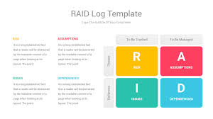

你有没有这样的经历？

明明项目开始前各种会议都开了，需求也梳理了，结果一上线就翻车。不是接口没准备好，就是别的团队还在等设计图。要么就中途来了个「高优」插队需求，把原来的排期全打乱了。

很多人会说，这是沟通不到位，项目管理不严谨。但如果你往深了看，其实核心问题是：**没有系统性地识别和管理项目中的关键不确定因素**。

## 什么是 RAID 模型？

RAID 是项目管理中一个非常经典的工具，它的名字是四个英文单词的首字母组合：

* R：Risk（风险）
* A：Assumption（假设）
* I：Issue（问题）
* D：Dependency（依赖）

别看这四个词看起来简单，但它们几乎囊括了一个项目中最容易踩坑的四大类“不可控因素”。

RAID 模型的本质，就是帮你把这些“可能出问题的点”**提前发现、分类管理、持续跟踪**，而不是出了问题才慌张扑火。

## 四个关键词

### 风险（Risk）

风险是**还没有发生**、但有可能发生、而且一旦发生就会影响项目进度或质量的事。

比如：

* 技术团队对新框架不熟悉，可能会拖慢开发进度
* 核心开发人员在假期前可能离职
* 预算还没审批下来，可能导致资源不到位

风险的关键在于：**未雨绸缪**。你要做的是提前评估这个风险的概率和影响，然后制定应对措施，比如：

> “如果小张离职，我们提前安排小王熟悉模块并做好文档交接。”

RAID log 就是你管理这些风险的地方——每个风险写清楚是什么、可能性多大、影响多严重、谁负责应对、当前进展如何。

### 假设（Assumption）

假设听起来很虚，但它其实是很多项目失败的根源。

**我们经常把计划当做100%发生，这个其实只是假设**。

比如你以为：

* 运营会准时提供文案（结果他们说没时间）
* 后端接口已经开发好了（结果接口只写了一半）
* 用户肯定会在注册流程中填写手机号（结果转化率极低）

这些“以为”，在 RAID 模型中就叫 **Assumption**。也就是说，它是项目开始时默认成立、但**未被验证**的前提条件。

你需要：

* 明确写出来有哪些假设
* 评估这些假设一旦不成立的后果
* 能验证的尽早验证，不能验证的做好 Plan B

### 问题（Issue）

问题和风险的区别在于：**风险是“可能会发生”，问题是“已经发生”**。

比如：

* 测试服务器挂了，大家无法联调
* 设计稿迟迟没到位，导致开发空转
* 领导突然说这功能要砍掉，整个产品逻辑得重来

这些问题必须第一时间记录并处理——RAID 模型里要清楚地写下：

* 问题描述
* 谁负责解决
* 截止时间
* 当前状态

为什么这很重要？

因为项目一旦推进起来，问题会像雪球一样越滚越大。没有体系地记录和处理，最后一定一地鸡毛。

### 依赖（Dependency）

很多项目最大的问题不是我们做不了，而是**别人还没做好**。

比如：

* 要等另一个系统开放接口
* 要等 UI 团队交互稿定稿
* 要等供应商先上线他们的组件

这些「前提条件」就是项目中的依赖。

依赖的问题在于：**你不掌控它，但它却影响你。**

你必须：

* 明确依赖方是谁
* 什么时候他们需要完成
* 是否已经锁定承诺时间
* 如果延迟，有没有替代方案

很多时候，项目延期并不是你团队的问题，而是「依赖方掉链子」——这时候，如果你在 RAID log 中早早记录并提醒，就能减少误解、提前应对。

## RAID 模型的价值

**1. 让项目“可视化”风险和不确定性**

项目最怕的，不是问题多，而是问题没人知道。

RAID log 就像项目的“体检报告”，把所有潜在的坑一目了然。

**2. 帮你赢得“信任感”**

领导最怕的不是你出问题，而是你“事后才说”。

你提前识别出风险和依赖，反而让人觉得你靠谱、专业、有预见性。

**3. 提升跨部门沟通效率**

RAID log 是一个极好的跨部门协同工具，你可以拿着它和运营、产品、设计对齐：

> “这个地方我们依赖你们 XX 时间完成，能不能确认一下？”

> “我们假设你们的 API 接口会在下周上线，如果有变动，麻烦及时通知。”

**4. 适用于各种规模的项目**

不管你是做 App、Web 项目、还是后台服务，RAID 都可以作为你项目 kick-off、每周例会、甚至复盘时的标准工具。

## 怎么落地 RAID 模型？

工具上你可以用：

* Excel / Google Sheet：简单好用、方便分享
* Notion / 飞书文档：可以做成多人协同、实时编辑
* Jira / Project 管理系统：高级玩法，适合大型团队

每条 RAID 项记录建议包含以下字段：

| 类别 | 描述 | 影响等级 | 应对措施 | 责任人 | 状态 |
| -- | -- | ---- | ---- | --- | -- |

你可以每周更新一次 RAID log，在周会中快速过一遍——哪些新问题出现了，哪些依赖延迟了，有没有新的假设不成立。

长期来看，它会帮你积累大量项目管理经验。

## 和 RACI、DACI 的区别（下期聊）

很多同学会把 RAID 和 RACI、DACI 混在一起，其实这几个模型也特别有用，特别是 DACI 决策模型，对于干系人沟通非常有用。

* RACI 是用来确定“谁负责、谁审批、谁协助”的角色划分工具
* DACI 是为了解决“谁拍板”的决策流程工具
* RAID 是识别“项目中容易出事的点”

## RAID Log 模版

