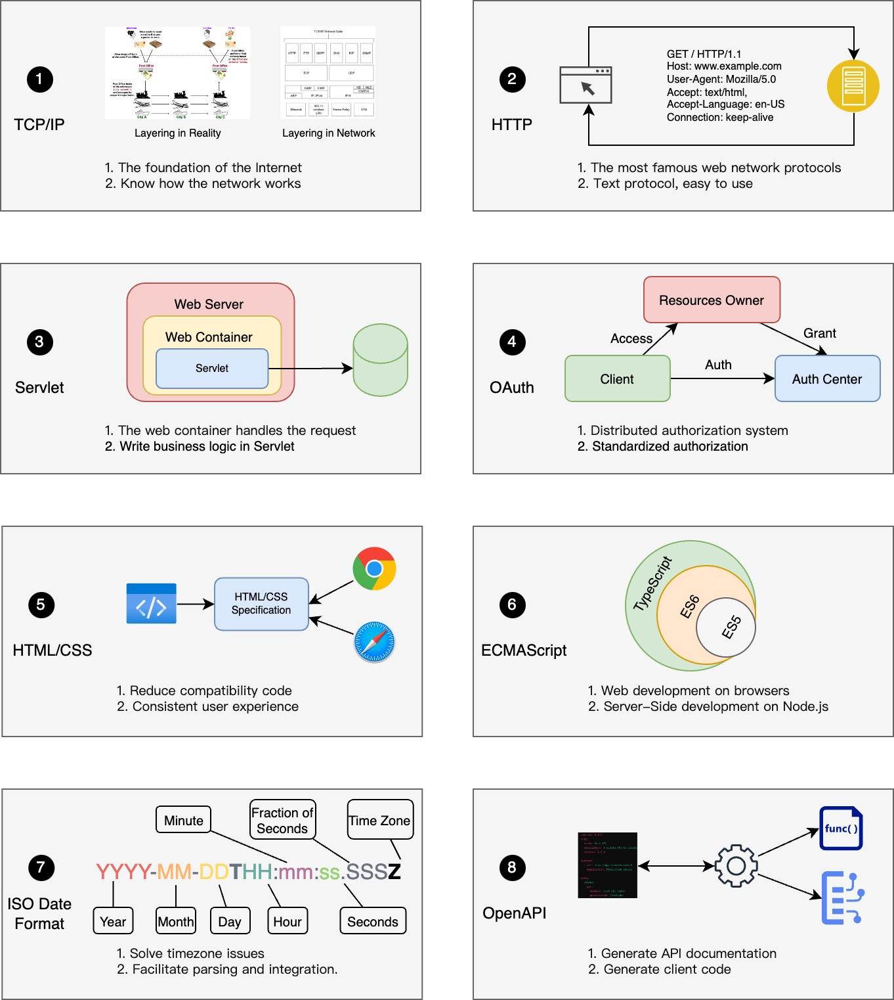

## TCP/IP

The TCP/IP protocol is the foundation of the internet and one of the most famous network standards, formulated by the IETF organization. If you want to delve into and learn the underlying protocols of computer networks, you can read the RFC 1180 document. RFC 1180 serves as an introduction to the TCP/IP protocol suite, thus its title is "A TCP/IP Tutorial."

## HTTP

The IETF has also established the widely used HTTP protocol, which is essential knowledge for all web developers. The RFC 723X documents describe the details of the HTTP protocol family. HTTP standards are divided into several versions, with the most commonly used being 1.1 (RFC 7230). Additionally, the HTTP standards are divided into core standards and extension standards, such as caching, sessions, content encoding, and more.

## Servlet

Servlets can be considered one of the most important standards in J2EE, established by the JCP organization. Well-known web containers like Tomcat adhere to the Servlet standard. This is also a common question in many company interviews, and it is crucial for Java developers to understand the Servlet standard. Servlet defines the convention between J2EE applications and server containers, allowing for easy replacement of J2EE servers when necessary.

## OAuth

OAuth (Open Authorization) is a set of open authorization system standards, especially applicable to authorization services provided for third-party resources. Similar to the OAuth standard is SAML (Security Assertion Markup Language). If you need to build an authorization system, developers would do well to understand these two standards. The OAuth standard document can be found in RFC 6749.

## HTML/CSS

HTML is one of the most familiar technical standards for engineers. The standardization of HTML ensures that web pages render uniformly across different browsers, greatly reducing the work of compatibility development. In the W3C HTML standards document, you can find many useful but uncommon HTML tags. CSS standards are often used in conjunction with HTML, and as one of the core technologies of web design, CSS standards are not only used in web development but are also widely applied in typesetting software.

Both HTML and CSS are standards established by the W3C organization, however, it's important to note that the JavaScript language related standards are not set by W3C.

## ECMAScript

ECMAScript is the standardized version of JavaScript, defining the core syntax, types, statements, keywords, reserved words, operators, objects, and their methods of this programming language. The ECMAScript standard is formulated by the ECMA (European Computer Manufacturers Association) organization, with its standard document numbered ECMA-262.

## ISO Date

In daily development, non-uniform date formats often bring many troubles. ISO 8601 is a date and time format standard, established by ISO (International Organization for Standardization), aimed at providing a universal date and time data exchange format across borders, cultures, and industries. Adhering to the ISO 8601 standard simplifies the handling of dates and times, including time formats, parsing, time zones, time ranges, etc. Adopting data structures in ISO 8601 format can perfectly solve timezone issues in front-end and back-end systems, as well as databases.

## OpenAPI

OpenAPI is used as a standard to design, build, document, and consume RESTful Web services. For developers who need to build and consume APIs, OpenAPI provides a DSL to express API designs, making it very easy to be converted into documentation and also easy to generate the necessary code.