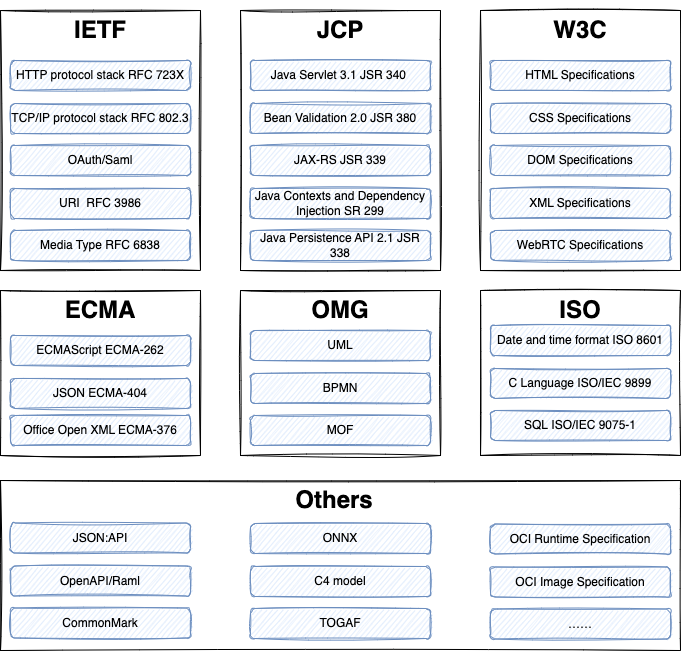

在计算机领域，有很多成熟的技术标准非常有价值，参考技术标准容易找到标准的开源实现，也可以自己参考其原理做出更可靠的方案。例如 IETF 的 RFC 文档是最权威的技术资料来源之一。查阅技术标准也是最快捷的学习方式，但是阅读门槛比较高，而且大多是英文资料。 

这篇文章整理了在技术方案设计中可以参考和使用的技术标准。

说明：通常来说 **规范（Specification）、标准（Standard）、协议（Protocol）都可以指技术标准，协议主要指网络通信标准。**

## 技术标准组织和标准一览

## IETF 组织和常见标准

IETF（The Internet Engineering Task Force） 应该是互联网标准组织中名气最大的，它的全称是国际互联网工程任务组。IETF下属有很多工作组（WG），专门负责一个领域标准的制定，例如 OAuth。IETF 工作的产出主要是 RFC 文档（Request For Comments）。IETF 最知名的规范是 TCP/IP 协议族，IETF 的 RFC 文档是软件工程师重要的参考资料之一。

### HTTP protocol stack RFC 723X

RFC 723X 描述了 HTTP 协议族。HTTP 标准分为多个版本，目前在用的一般是 1.1（RFC 7230）。同时 HTTP 标准分为核心标准和拓展标准，例如缓存、会话、内容编码等内容属于拓展部分，在选择 HTTP client 时，需要注意其实现程度可能并不完整。另外 method、状态码等枚举类型在 IANA 中心可以找到。

IANA（Internet Assigned Numbers Authority）是一个负责协调全球互联网系统中一些最重要的元素，确保其全球唯一性和一致性的组织。IP 地址分配、DNS以及文件拓展名的注册都由 IANA 负责。

### TCP/IP protocol stack RFC 802.3

如果希望深入了解和学习计算机网络底层协议，可以阅读 RFC 1180。RFC 1180 算是 TCP/IP 协议簇的导读，所以它的标题是 《A TCP/IP Tutorial》。这份 RFC 文档可以说是计算机网络书籍最权威的材料引用来源，当然它的内容也非常庞大。
 
### OAuth/Saml

OAuth（Open Authorization）和 SAML（Security Assertion Markup Language）都是在网络上进行身份验证和授权的开放标准。

对于需要构建授权的系统来说，几乎所有开发者都需要了解这两个标准。这两个标准在 IETF 组织下都有相关文档。

OAuth 和 SAML 的差异是，OAuth 更多关注第三方应用授权，SAML 则关注在主要用于企业环境中的单点登录和身份联合，因此在某些场景下 SAML 会是比 OAuth 更合适的方案。

### Uniform Resource Identifier (URI)  RFC 3986

RFC 3986 规范的标题是 Uniform Resource Identifier (URI): Generic Syntax，中文名是统一资源定位符，所以 URI 的用途并不仅仅用于网页。

在很多方面都可以使用 URI 规范。例如，可以标记 APP 的窗口资源，来实现一种叫做 Deep Link 的技术，可以从网页打开原生 APP 的某个窗口。

### Media Type Specifications RFC 6838

媒体类型是指常见文件的格式，通常被标记在文件头信息中。应用开发者可以定义自己的文件媒体格式，如果希望能被其它应用程序采纳使用，可以去 IANA 去注册管理。

## JCP 组织和常见标准

JCP（Java Community Process) 是一个开放的国际组织，主要由 Java 开发者以及被授权者组成。Java 之所以能发展成目前这个规模，离不开标准化进程，JCP 中的一些规范不仅影响了 Java 世界，对其他语言，例如 PHP、Nodejs 也造成了巨大的影响。在日常服务器开发工作中，用到 JCP 标准非常多，例如数据验证、数据库访问和服务器容器，这些标准不仅 Java 在使用，一些其它语言的框架也会参考实现，例如数据验证就被很多框架广泛采纳。

### Java Servlet 3.1 JSR 340

Servlet 可以说是 J2EE 中最重要的规范之一，Tomcat 等知名 Web 容器都遵守 Servlet 规范。这也是很多公司面试一般都会问的问题。Servlet 定义了 J2EE 应用和服务器容器之间的约定，所以在开发过程中就需要特别注意 Web 容器提供的额外的特性。

### Bean Validation 2.0 JSR 380

在 Java 中数据校验的规范化是 JCP 一个典型的实践，从最早的 JSR 349 到 JSR 303，目前已经发展到了 Bean validation 2.0。Hibernate 最新的 validator 已经开始支持 2.0 的验证规范。早期讲 Java 的书谈到使用 JSR 验证容易让人感到困惑，JSR 只是验证规范，数据验证是由其他的验证器实现的。同时一些非 Java 的验证框架也在参考实现 JCP 的标准。

### JAX-RS JSR 339

JAX-RS，即 Java API for RESTful Web Services。JAX-RS 是一套用于创建符合 REST 架构风格的 Web 服务的 API ，利用 Java 编程语言的注解功能来简化开发过程。

对于 Spring MVC 的使用者感知不到 JAX-RS 的存在，如果希望给服务添加更多 RESTful 的能力，可以参考使用 Jersey，Jersey 完整的实现了 JAX-RS 标准。

### Java Contexts and Dependency Injection JSR 299

Java Contexts and Dependency Injection 定义了 CDI（Contexts and Dependency Injection for the Java EE platform）的标准。CDI 是 Java EE 平台的一部分，提供了一种类型安全的依赖注入机制，旨在简化企业Java应用的开发。

Spring 是一个典型的 CDI 容器，但如果希望让 Spring 具备可替换能力，那么在工程中注意使用 JSR 299 定义的注解，这样就可以将 Spring 替换成其它容器框架。

### Java Persistence API 2.1 JSR 338

JSR 338 制定了 Java Persistence API (JPA) 2.1 标准。JPA 提供了一套 Java 对象的持久化模型，并和具体的数据表剥离。

JPA 包含了 JPQL 和 ORM 等特性的定义，这样就可以使用不同的 ORM 厂商，让工程变得更加灵活。

JPA 2.1 中提供了 Criteria API，可以完全避免在程序中出现 SQL，让代码的维护性大大提高。

## W3C 组织和常见标准

W3C（World Wide Web Consortium） 中文名称是万维网联盟，是 Web 技术领域最具权威和影响力的国际中立性技术标准机构，主要负责制定浏览器上一些技术细节以消除浏览器上 HTML、CSS 渲染的差异，包括 DOM、XML 和 SVG 等技术。但是需要注意 JavaScript 不是 W3C 的范围，但 W3C 需要负责浏览器中 JavaScript API 也就是 DOM 规范的制定。

### HTML Specifications

HTML 是工程师们最熟悉的技术标准之一，HTML 的标准化让网页在不同的浏览器中打开的效果一直，大大减少了兼容开发的工作。

在 W3C 的 HTML 标准文档中，可以找到非常多有用但不常见的 HTML 标签，例如在很多 HTML 教材中不会出现的 ruby 标签可以实现读音标注功能。

### CSS Specifications

CSS 标准常常和 HTML 搭配使用，CSS 作为网页设计的核心技术之一，其标准不仅被用于网页开发，还被广泛应用于排版软件中。

### DOM Specifications

DOM（文档对象模型）和 JavaScript 虽然经常在Web开发中一起使用，但它们属于不同的技术类别，有着不同的定义和用途。

DOM 是一个跨平台和语言独立的接口，允许程序和脚本动态地访问和更新文档的内容、结构以及样式。DOM 将 HTML 或 XML 文档表述为树结构，每个节点都是文档中的一个对象。

也就是说，DOM 不仅能被 JavaScript 实现，还可以由其它编程语言解析实现。

### XML Specifications

XML 被广泛应用于互联网、软件开发和企业数据交换等领域。例如，XML是SOAP（一种Web服务协议）的基础，用于配置文件、文档数据交换、以及在各种应用程序之间传递复杂的数据消息。

W3C 为 XML 定义了一系列的规范包括 XML 文档的结构、XPath、XSLT等。

### WebRTC Specifications

WebRTC 标准可以允许开发者在浏览器中实现音视频能力。通过简单的应用程序接口（API）使浏览器和移动应用能够进行实时音视频通信（RTC）。WebRTC 让网页浏览器之间可以直接进行数据流交换，无需安装额外的插件或第三方软件。

## ECMA 组织和常见标准

ECMA（European Computer Manufacturers Association） 中文名称是欧洲计算机制造联合会，主要负责计算机制造和编程相关的标准制定。ECMA 制定了许多编程语言的规范，例如 C#、C++ 等，有趣的是 Sun 公司曾经提交了 Java 相关标准给 ECMA 但是随后又撤销了。ECMA 组织下最著名的规范有：ECMAScript、JSON 和办公文档规范。

### ECMAScript ECMA-262

ECMAScript 是 JavaScript 的标准化版本，它定义了这种编程语言的核心语法、类型、语句、关键字、保留字、操作符、对象及其方法。

### JavaScript Object Notation ECMA-404

JavaScript Object Notation (JSON) 是一种轻量级的数据交换格式，其设计易于人类阅读和编写，同时也易于机器解析和生成。JSON 基于 JavaScript 编程语言的一个子集，已成为独立于语言的数据格式，被广泛应用于许多编程环境和应用中。

和 XML 相比，JSON 对机器友好解析方便，所以 JSON 格式越来越流行。

### Office Open XML ECMA-376

ECMA 为 Office 套件制定了相关标准，为文档文件在不同软件中的解析带来便利。

Office Open XML 是基于开放的 XML 标准和 ZIP 压缩技术（实际上办公文档就是一堆 XML 的 ZIP 包）。通过了解 Office Open XML 标准，可以帮助工程师方便找到相关库和实现来操作 Word、Excel、PPT 等办公软件的文件类型。

## OMG 组织和常见标准

OMG(Object Management Group) 中文名称是对象管理组织，OMG 规范了面向对象的一些概念，开始的目的是为分布式面向对象系统建立标准，现在也包含了一些流程建模的内容。UML、BPMN 等标准都是 OMG 的工作成果。

### UML

UML（Unified Modeling Language）是标准的建模语言，它被用于需求捕获、系统分析和设计、文档记录，以及在设计阶段向非技术利益相关者传达复杂的软件设计信息。UML 图形的标准化让 UML 图形和建模软件脱离，参考 UML 标准可以消除使用 UML 表达软件设计和建模上的歧义。

### BPMN

BPMN（Business Process Model and Notation） 类似于 UML，不过它的目标是定义流程相关的模型和图例。标准的 BPMN 模型可以被流程引擎等软件解析，而实现流程设计和流程执行分离。

### MOF

MOF（Meta Object Facility）定义了一种语言和结构，用于创建元模型。这些元模型以类似于UML的方式定义了数据类型、关系、约束和语义。

通过定义元模型，可以让软件具有更强的通用性，同时元模型也在 SaaS 平台、数据仓库中被广泛使用。

## ISO 组织和常见标准

ISO（International Organization for Standardization）是世界上最大的国际标准制定机构，IOS 不仅仅为计算机领域制定标准，涉及的范围很广，包括质量、食品安全等，也提供和接收了部分信息技术相关标准。

### Date and time format ISO 8601

ISO 8601 是一个日期和时间的格式标准，旨在提供一种跨国界、跨文化和跨行业通用的日期和时间数据交换格式。

遵守 ISO 8601 对日期和时间的处理会变得简单，它包括时间格式、解析、时区、时间范围等内容。采用 ISO 8601 格式的数据结构，可以完美的解决前后端、数据库中的时区问题。

### C Language ISO/IEC 9899

ISO/IEC 9899 是关于 C 语言的国际标准，被广泛认为是 C 语言的官方定义。这套标准会每隔一段时间按照年份发布对应的版本。

C 语言的国际标准促进不同的编译工具、IDE 的兼容和支持。

### SQL ISO/IEC 9075-1

ISO（Structured Query Language） 也定义了 SQL 语言的标准，不过 SQL 标准中约定的东西不够多，虽然很难避免不去使用数据库自定义的语法特性，但是尽量使用标准的 SQL 语法特性，让 SQL 代码的迁移能力强很多。

## 其它组织下常用标准

还有一些比较有用，但非著名标准组织制定的标准，可以帮助我们完成技术方案。

### JSON:API

JSON:API 提供了一套标准来约定使用 JSON 格式交换数据的 API 如何设计，使 API 的设计更加清晰和统一。

它约定了标准化的请求和响应结构、资源、错误、筛选、排序以及分页的格式。JSON:API 是一个小众社区维护的，标准简单易读。

### OpenAPI/Raml

OpenAPI 和 RAML (RESTful API Modeling Language) 被用来设计、构建、记录和消费 RESTful Web 服务的规范。这两种格式提供了工具和方法来描述 API 的结构。

了解这两个标准的好处是，可以找到一种标准的方式描述 API 设计，以及最终实现后的文档，也可以这两种标准来实现代码的生成。

### CommonMark

CommonMark 是一种开源的 Markdown 规范，旨在解决原始 Markdown 语法的歧义和不一致性。

Markdown 是一种非常有效的文档工具，但在实现上有非常多差异，在选择 Markdown 编译器时，参考 CommonMark 标准的支持情况，可以避免后期的一些问题。

### ONNX

ONNX（Open Neural Network Exchange）制定了深度学习模型的数据交换标准，这样就可以统一深度学习工具链的统一，对于 AI 应用的开发者来说非常有意义。

### C4 model

C4 model 严格来说不算标准，但在描述架构时非常有用。 C4 代表 Context、Containers、Components和Code，这四个层次逐步深入地描述了软件系统的架构。通过 C4 模型，可以让架构设计的参与者能在同一个抽象层次理解问题。

### TOGAF

TOGAF（The Open Group Architecture Framework）是一种企业架构的框架，事实上成为企业架构的标准材料。

企业架构是系统架构的超集，涵盖技术、业务和人员等内容，了解企业架构的规范可以更加清晰的描述架构和架构层次。

### OCI Runtime Specification

OCI (Open Container Initiative) Runtime Specification 是由 Open Container Initiative 组织定义的一套标准。

这套标准描述了容器的运行时环境应如何配置和操作，通过这套标准容器技术变得更加开放。由于 Docker 的商业授权问题，很多公司开始寻找支持 OCI Runtime Specification 的开源实现。

### OCI Image Specification

OCI Image Specification 同 OCI Runtime Specification 类似，容器本身的数据格式和结构也被规范化，这样就可以使用不同的工具实现对容器的封装。这套标准包括了镜像格式、镜像清单、配置对象等内容。

## 附录：本文中提到的标准访问地址

- Saml http://docs.oasis-open.org/security/saml/Post2.0/sstc-saml-tech-overview-2.0.html
- OAuth https://datatracker.ietf.org/doc/html/rfc6749
- URI RFC 3986 https://datatracker.ietf.org/doc/html/rfc3986
- Media Type Specifications https://datatracker.ietf.org/doc/html/rfc6838
- Java Servlet 3.1 JSR 340 https://www.jcp.org/en/jsr/detail?id=340
- Bean Validation 2.0 JSR 380 https://beanvalidation.org/2.0-jsr380/
- JAX-RS JSR 339 https://jcp.org/en/jsr/detail?id=339
- Java Contexts and Dependency Injection JSR 299 https://jcp.org/en/jsr/detail?id=299
- Java Persistence API 2.1 JSR 338 https://jcp.org/en/jsr/detail?id=338
- HTML Specifications https://html.spec.whatwg.org/
- CSS Specifications https://www.w3.org/Style/CSS/specs.en.html
- DOM Specifications https://dom.spec.whatwg.org/
- XML Specifications https://www.w3.org/TR/xml/
- WebRTC Specifications https://www.w3.org/TR/webrtc/
- ECMAScript ECMA-262 https://tc39.es/ecma262/
- JavaScript Object Notation ECMA-404https://ecma-international.org/publications-and-standards/standards/ecma-404
- Office Open XML ECMA-376 https://ecma-international.org/publications-and-standards/standards/ecma-376/
- UML https://www.omg.org/spec/UML/2.5.1
- BPMN https://www.omg.org/spec/BPMN/2.0/
- MOF https://www.omg.org/mof/
- Date and time format ISO 8601 https://www.iso.org/iso-8601-date-and-time-format.html
- C Language ISO/IEC 9899 https://www.iso.org/standard/74528.html
- SQL ISO/IEC 9075-1 https://www.iso.org/standard/53681.html
- JSON:API https://jsonapi.org/
- OpenAPI https://spec.openapis.org/oas/v3.1.0
- Raml https://github.com/raml-org/raml-spec/blob/master/versions/raml-10/raml-10.md/
- CommonMark https://spec.commonmark.org/
- ONNX https://onnx.ai/onnx/intro/concepts.html
- C4 model https://c4model.com/
- TOGAF https://pubs.opengroup.org/architecture/togaf9-doc/arch/
- OCI Runtime Specification https://opencontainers.org/posts/blog/2024-02-18-oci-runtime-spec-v1-2/
- OCI Image Specification https://specs.opencontainers.org/image-spec/