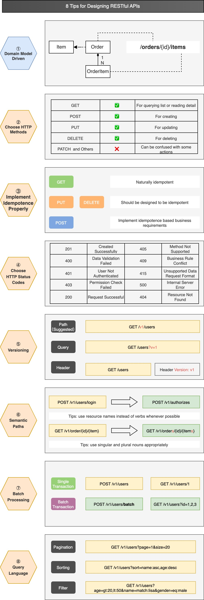

## Domain Model Driven

When designing the path structure of RESTful APIs, it is beneficial to refer to the domain model. In Domain-Driven Design (DDD), the domain model forms the logical structure of the software.

This approach offers several advantages:

- Domain models are usually nouns, aligning well with API paths.
- Domain models often have a hierarchical structure, which can be effectively translated into API paths.
- It helps team members maintain a consistent style in API design.

## Choose HTTP Methods

The HTTP protocol provides a variety of methods, but using too many HTTP methods can confuse developers in application systems.

Therefore, defining a few basic HTTP methods can simplify API design, depending on the team's style. For example, the use of PATCH often causes confusion within teams, as developers may not clearly discern when to use PATCH versus PUT. Hence, based on team agreement, it might be simpler to uniformly use PUT.

## Implement Idempotence Properly

Designing for idempotence in advance can enhance the robustness of APIs.

- GET APIs are naturally idempotent, so avoid implementing data modification operations in GET APIs.
- PUT and DELETE should be idempotent as much as possible, ensuring that API call retries do not produce unexpected results.
- POST represents a creation operation, which theoretically should not be idempotent, but it can be designed as idempotent when necessary through input parameter design.

## Choose HTTP Status Codes

Similar to HTTP Methods, there are many HTTP status codes. Developers often make mistakes when choosing which status code to use, and it can be difficult to reach a consensus within a team.

A better approach is to define a limited set of HTTP status codes for use to simplify application development. For example, uniformly return 400 for validation errors and 419 for business errors.

## Versioning

Designing version numbers for APIs in advance can simplify later modifications and upgrades. There are generally three ways to include version information:

- Use a path prefix, placing the version number at the beginning of the API path.
- Use query parameters.
- Use header parameters.

The recommended method is to use a path prefix, which is easily understandable for both providers and consumers and does not intrude on other business parameters.

## Semantic Paths

Keeping API paths semantic can increase the recognizability of the API, making it easier for consumers to find the appropriate API in documentation.

Ways to enhance semantics include:

- Distinguishing between singular and plural nouns, avoiding incorrect word spelling.
- Preferably using resource names instead of actions.
- If verbs cannot be avoided, try to place them at the end of the path and use the POST method.

## Batch Processing

Setting rules for batch APIs in advance can make batch APIs more semantic. We can agree:

- Use 'batch' or 'bulk' as keywords, placed at the end of the path.
- When needing to query data in bulk, use query parameters instead of path parameters.

## Query Language

Designing a scalable set of query rules in advance can make APIs more flexible.

- Pagination: Reserve pagination parameter keywords.
- Sorting: Reserve sorting parameter keywords and the direction of sorting. For example, "sort=name:asc,age:desc" indicates sorting by name in ascending order and age in descending order.
- Filtering: Set flexible filtering condition syntax, defining commands for more flexible filtering methods. For example, in "GET /v1/users?age=gt:20,lt:50&name=match:lisa&gender=eq:male", 'gt' stands for greater than, 'lt' for less than, 'match' for approximate search, and 'eq' for exact match.