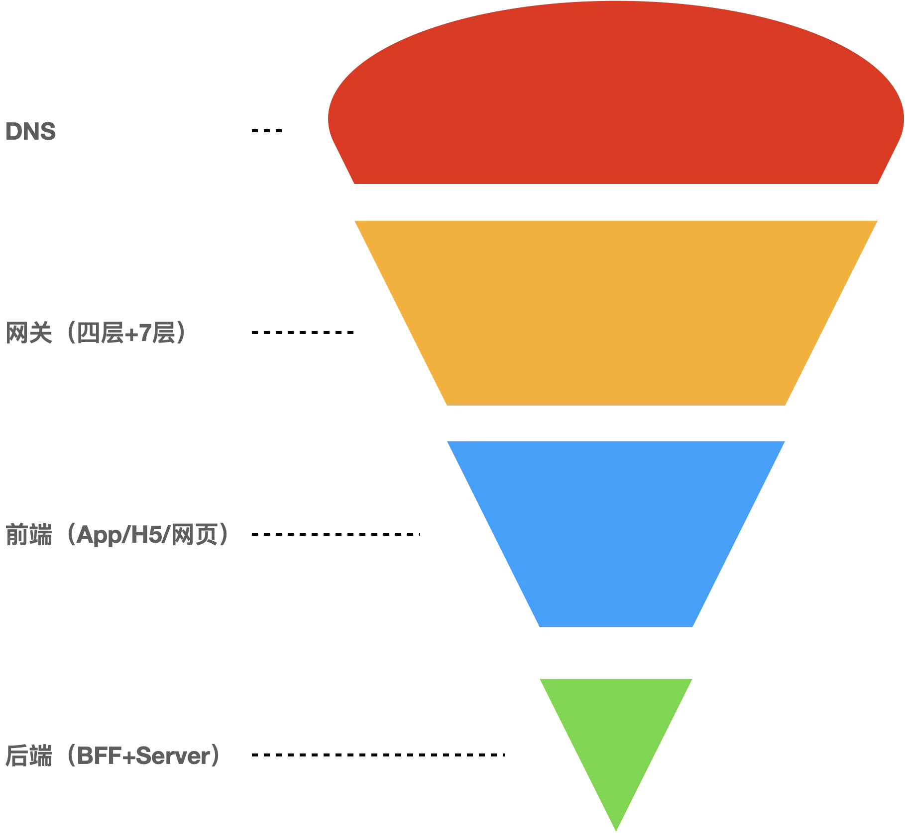
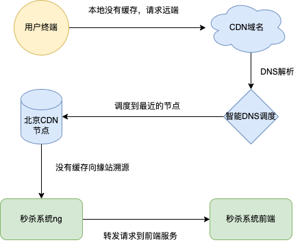
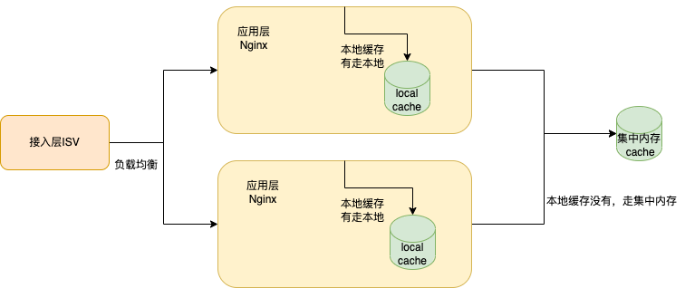
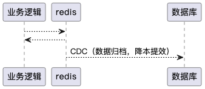

秒杀活动是大家都熟悉的购物方式。通常的流程是这样的：商家设定活动开始和结束时间，以及投入的库存量。在活动即将开始之际，买家会不断刷新商品详情页，一旦看到购买按钮变为可点击状态，便立即点击购买、下单并结算，完成商品的购买过程。当商品库存被抢空或者活动结束时，商品变为不可售状态，买家无法继续购买。

一些耳熟能详的秒杀活动案例包括小米手机的早期抢购、整点低价苹果手机、以1499元抢购茅台酒，以及疫情期间的口罩销售。这些活动各有不同的目的：小米手机抢购是为了营造热点，整点低价苹果手机旨在吸引用户到店，1499元抢购茅台则是为了加速用户对茅台线上销售的接受程度，而口罩销售则是平台的社会责任担当，希望能够用有限的库存帮助更多需要的家庭。然而，它们都面临着一个共同的挑战：**极度的商品供不应求的情况**。这里面既有真实迫切需求的用户，也必然引来从中赚差价的黄牛。反应到系统应对的挑战上，就是相较于以往**千倍万倍的用户规模，可能是真人可能是机器人，在同一瞬间对系统发起冲击，需要海量的计算资源才能支撑**。

对于各大电商平台而言，爆款运营和促销活动的日常化已成为常态，而支撑这些的秒杀系统自然是不可或缺的一环。同时，秒杀活动的巨大流量就像一头洪荒之兽，若控制不当，可能会冲击整个交易体系。因此，秒杀系统在交易体系中便扮演着至关重要的角色。从个人角度来看，**秒杀系统的设计套路往往适用于其他高并发场景，具有较高的借鉴价值**。同时，其特殊的挑战和需求，**需要架构师在设计中的权衡考量，这也有助于培养个人在权衡取舍方面的能力**。

## 无损的技术方案

应对高并发就好比应对水患。

* 通过分流让支流分摊压力，隔离风险。对应到软件设计就是**系统隔离**，分割流量；
* 通过建造水库存储洪水，再缓慢排出，削峰填谷。对应到软件设计就是**无损消峰**；
* 通过拓宽河道，清除淤沙提高水流流速。对应到软件设计就是常说的性能优化，比如通用的**多级缓存**，特定场景的高性能**库存扣减**。

因为后续方案会围绕请求经过的多个层级展开，所以在介绍方案之前，我们需要先了解一个基本情况：一个请求打到服务器的基本链路为：DNS→网关→前端→后端，其中流量峰值也应该逐层减少。如图：



### 系统隔离

分布式系统，系统由一个个发布单元共同组成。独立的发布单元可以按需做伸缩扩容，也可以在发生故障时及时做故障隔离，以保证不会出现个别服务故障导致整个系统不可用的情况。秒杀活动因为其高峰值的特性，所以一般我们会把它隔离出来，成一个独立的秒杀系统（常规服务我们都是按领域特性做纵切，但这里我们**按品类做横切**，带有秒杀活动标的商品将会分流到独立的秒杀系统集群）。但交易系统体量是很大的，如果为秒杀品类把整个交易系统都复制一份，那成本就太大了。所以**我们把隔离区分为物理隔离和逻辑隔离，把需要定制化逻辑的能力和有特殊非功能性要求的能力剥离出来做物理隔离**，标准化且没有特殊非功能要求的能力就采用逻辑隔离。画成部署架构如下：


首先，我们采用**独立的秒杀域名和nginx集群（物理隔离）**。这样可以**隔离流量大头**，防止峰值冲击交易系统；**能够灵活扩展**，针对不同时段的流量预估扩展nginx及后边服务的规模；能够**灵活增减私有的防控逻辑**，而不影响原交易系统。

接着，我们将**商详页和下单页独立部署（前端+BFF）（物理隔离）**。因为秒杀活动的特点，海量用户在活动快开始时会反复刷新商详页，在活动开始时又会瞬时并发的访问下单页，所以这两个页面都是承受**流量冲击的大头**，需要隔离开。同时因为秒杀活动的特性，商品属于极端供不应求的场景，所以可以做**服务降级，以降低计算资源消耗、提高性能**。比如：商详页可以把履约时效拿掉，不再计算预计多久能到货。还可以拿掉评价信息，不再展示评价；下单页可以不再计算优惠金额分摊，秒杀商品不参与任何叠加的优惠活动。仅保留必要的信息，比如商品信息，商品主图，购买按钮，金额计算，下单按钮等等。至于结算页、收银台看情况，如果流量压力不大是不用做物理隔离的。

最后，商品购买成功还需要依赖，订单系统创建订单，库存系统扣减商品库存，结算系统确认支付等等步骤。到达这里流量相对已经比较平稳，并且逻辑上没有什么定制性能优化的机会，所以就采用**逻辑隔离复用原交易系统的集群**。逻辑隔离有两种实现思路，第一种是依赖**限流框架**，比如在订单系统设置来源是秒杀系统BFF的创建订单请求，TPS不能超过100，并发连接数不能超过20；第二种是依赖**RPC框架**，RPC框架可以设置分组，只要把订单系统集群里面部分服务节点设置成"秒杀组"，再把秒杀服务BFF的客户端也设置为"秒杀组"，那么秒杀系统的流量就只会打到订单系统集群里面属于"秒杀组"的节点上。这种隔离方式分割了集群，集群节点少了，出现故障发生过载的可能就提高了，可能会导致秒杀系统不可用。

为什么集群节点少了，出现故障发生过载的可能就提高了？就好比公里原本4条道能并行4辆车，现在给按车辆类型分成了机动车和公交车专用，机动车道2条。如果其中1条机动车道发生车祸，原本分散在2条道上的车流就要汇聚在1条道，原本顺畅的通行可能立马就开始堵车了。
### 多级缓存

多级缓存，无非就是在系统的多个层级进行数据缓存，以提高响应效率，这是高并发架构最广泛的方案之一。

#### DNS层

一般我们会将静态资源挂到CDN上，借助CDN来分流和提高响应效率。以秒杀系统为例，就是将秒杀前端系统的商详页和下单页缓存到CDN网络上。一个借助CDN的用户请求链路如下：



如果用户终端有页面缓存就走终端本地缓存，没有就请求远端CDN的域名（静态资源走CDN域名），请求来到DNS调度的节点，调度一个最近的CDN节点，如果该CDN节点有页面缓存则返回，没有则向缘站发起溯源，请求就会走普通链路过秒杀系统ng到秒杀系统前端。

#### 网关层

网关这个有多种组合情况，最简单的就是一个接入层网关加一个应用层网关，比如：ISV（四层）→
Nginx（七层）。以这个为例，这里的缓存优化主要看接入层的负载均衡算法和应用层的本地缓存和集中内存缓存。

之所以说缓存还要提负载均衡算法，是因为**节点的本地缓存的有效性和负载均衡算法是强绑定的**。常用的负载均衡算法有轮询(也叫取模)和一致性哈希。**轮询可以让请求分发更均衡**，但同个缓存key的请求不一定会路由到同个应用层Nginx上，**Nginx的本地缓存命中率低**。一致性哈希可以让同个缓存key路由到同个应用层Nginx上，**Nginx的本地缓存命中率高**，但其请求**分发不均衡容易出现单机热点问题**。有一种做法是设置一个阈值，当单节点请求超过阈值时改为轮询，可以算是自适应性负载均衡的变种。但这种做法在应对真正的高并发时效果并不理想。

所以想要运用本地缓存强依赖业务运营，需要对每个热点商品key有较为准确的流量预估，并人为的组合这些商品key，控制流量均匀的落到每个应用层Nginx上(其实就是数据分片，然后每片数据流量一致)。这非常困难，所以笔者认为，**大部分时候还是采用轮询加集中内存缓存比较简单有效**。

一个从接入层开始带有本地缓存和集中内存缓存的请求链路如下：



#### 服务层

应用层ngnix→秒杀系统BFF→订单服务，其实两两组合和网关层是一样的场景。应用层ngnix基于ngnix的负载均衡转发请求到秒杀系统BFF，秒杀系统BFF基于RPC框架的负载均衡转发请求到订单服务。都面临着负载均衡策略选择和是否启用本地缓存的问题。不一样的点只是缓存的粒度和启用缓存的技术栈选择。

#### 多级缓存失效

多级缓存因为缓存分散到多个层级，所以很难用单一的技术栈来应对缓存失效的问题，但都等到缓存过期，这种更新时延较长又不一定能被业务接受。所以这里就再展开下这个话题。有一个做法是基于DB的binlog监听，各层监听自己相关的binlog信息，在发生缓存被变更的情况时，及时让集成内存的缓存失效。本地缓存在这里还有个缺陷，就是缓存失效时需要广播到所有节点，让每个节点都失效，对于频繁变更的热key就可能产生消息风暴。

### 无损消峰

秒杀活动的特点是瞬时高峰的流量，就像一座高耸的尖塔，短时间内涌入大量请求。为这个峰值准备对应的服务集群，首先成本太高，接着单纯的水平扩展也不一定能做到（分布式架构经常会碰到量变引起质变的问题，资源扩展到一定量级，原先的技术方案整个就不适用了。比如，当集群节点太多，服务注册发现可能会有消息风暴；出入口的带宽出现瓶颈，需要在部署上分流）。更别说这个峰值也不受控制，想要高枕无忧就会有很高的冗余浪费。
所以一般我们会采用消峰的方式，一种是直接断头，**把超出负荷的流量直接都丢弃掉**，也就是我们常见的**限流**，也称为有损消峰（如果这是大促的订单，砍掉的可能都是钱，这个有损是真的资损）；另一种就是分流，也叫**消峰填谷**，通过技术或者业务手段将请求错开，铺到更长的时间线上，从而降低峰值，常见的有**MQ异步消费和验证码问答题**。这里我们着重聊下无损消峰，有损放后边谈。

#### MQ异步消费

MQ依赖三个特性可以做到平滑的最终一致，分别是，**消息堆积，匀速消费和至少成功一次**。有消息堆积才能起到蓄水池的效果，在出水口流速恒定的情况下能接住入水口瞬时的大流量；有匀速消费才能让下游集群的流量压力恒定，不会被冲击；有至少成功一次，才能保证事物最终一致。
以创建订单为例。如果没有消息队列（MQ），同时有100W个创建请求，订单系统就必须承担100W个并行连接的压力。但是，如果使用了MQ，那么100W个创建请求的压力将全部转移到MQ服务端，订单系统只需要维持64个并行连接，以稳定地消费MQ服务端的消息。这样一来，**订单系统的集群规模就可以大大减小**，而且更重要的是，**系统的稳定性得到了保障**。由于并行连接数的减少，资源竞争也会降低，整体响应效率也会提高，就像在食堂排队打饭一样，有序排队比乱抢效率更高。但是，**用户体验可能会受到影响**，因为点击抢购后可能会收到排队提示，需要延迟几十秒甚至几分钟才能收到抢购结果。

#### 验证码问答题

引入验证码问答题其实有两层好处，一层是消峰，用户0.5秒内并发的下单事件，因为个人的手速差异，被平滑的分散到几秒甚至几十秒中；另外一层是防刷，提高机器作弊的成本。

#### 验证码

基本实现步骤如下：

- 请求到来时生成1串6位随机字符串 verification_code
- 用特定前缀拼接用户ID作为key，verification_code做为value存redis，超时5s
- 生成一个图片，将 verification_code 写到图片上，返回给用户
- 用户输入图片中字符串
- 从redis里面取出 verification_code 做比对，如果一致，执行下单操作

但这样其实是可以用暴力破解的，比如，用机器仿照一个用户发起10W个请求携带不同的6位随机字符。所以校验验证码时可以使用
GETDEL ，让验证码校验无论对错都让验证码失效。

#### 问答题

基本实现思路和验证码几乎一样。差别在于，问答题的题库要提前生成，请求到来时从题库中拿到一组问题和答案。然后把答案存redis，问题塞到图片里返回给用户。
验证码和问答题具有很好的消峰效果。特别是问答题，想要提高消峰效果只要提高问题难度就行，例如，笔者曾经在12306上连续错了十几次问答题。但是这也是用户体验有损的，例如，虽然笔者当初未能成功抢到票而感到沮丧，但这不当人的题库依然把我逗笑了。

无损消峰，无损了流量，但损失了用户体验。现如今技术水平在不断进步，解决方法在增多，这些有损用户体验的技术方案可能都会慢慢退出历史舞台，就像淘宝取消618预售。

### 库存扣减

我们知道，用户购买商品需要扣减库存，扣减库存需要查询库存是否足够，足够就占用库存，不够则返回库存不足。在并发场景，如果**查询库存和扣减库存不具备原子性**，就有可能出现**超卖**，而高并发场景超卖的出现概率会增高，超卖的数额也会增高高。处理超卖问题是件麻烦事，一方面，系统全链路刷数会很麻烦(多团队协作)，客服外呼也会有额外成本。另一方面，也是最主要的原因，客户抢到了订单又被取消，会严重影响客户体验，甚至引发客诉产生公关危机。

#### 实现逻辑

业内常用的方案就是使用redis+lua，借助redis单线程执行+lua脚本中的逻辑可以在一次执行中顺序完成的特性达到原子性（原子性其实不大准确，叫排它性可能更准确些，因为这里不具备回滚动作，异常情况需要自己回滚）。
lua脚本基本实现大致如下：

```lua
-- 获取库存缓存key KYES[1] = hot_{itemCode-skuCode}_stock
local hot_item_stock = KYES[1]
-- 获取剩余库存数量
local stock = tonumber(redis.call('get', hot_item_stock))
-- 购买数量
local buy_qty = tonumber(ARGV[1])
-- 如果库存小于购买数量 则返回 1, 表达库存不足
if stock < buy_qty then return 1 end
-- 库存足够
-- 更新库存数量
stock = stock - buy_qty
redis.call('set', hot_item_stock, tostring(stock))
-- 扣减成功 则返回 2, 表达库存扣减成功
return 2 end
```

但这个脚本具备一些问题：

- 不具备幂等性，同个订单多次执行会出现重复扣减的问题，手动回滚也没办法判断是否会回滚过，会出现重复增加的问题。
- 不具备可追溯性，库存被谁被哪个订单扣减了不知道。

结合以上问题，我们对方案做些增强。 增强后的lua脚本如下：

```lua
-- 获取库存扣减记录缓存key KYES[2] = hot_{itemCode-skuCode}_deduction_history
-- 使用 Redis Cluster hash tag 保证 stock 和 history 在同个槽
local hot_deduction_history = KYES[2]
-- 请求幂等判断,存在返回0, 表达已扣减过库存
local exist = redis.call('hexists', hot_deduction_history, ARGV[2])
if exist = 1 then return 0 end

-- 获取库存缓存key KYES[1] = hot_{itemCode-skuCode}_stock
local hot_item_stock = KYES[1]
-- 获取剩余库存数量
local stock = tonumber(redis.call('get', hot_item_stock))
-- 购买数量
local buy_qty = tonumber(ARGV[1])
-- 如果库存小于购买数量 则返回 1, 表达库存不足
if stock < buy_qty then return 1 end
-- 库存足够
-- 1.更新库存数量
-- 2.插入扣减记录 ARGV[2] = ${扣减请求唯一key}-${扣减类型} 值为 buy_qty
stock = stock - buy_qty
redis.call('set', hot_item_stock, tostring(stock))
redis.call('hset', hot_deduction_history, ARGV[2], buy_qty)
-- 如果剩余库存等于0 则返回 2, 表达库存已为0
if stock = 0 then return 2 end
-- 剩余库存不为0 返回 3 表达还有剩余库存
return 3 end
```

利用Redis Cluster hash
tag保证stock和history在同个槽，这样lua脚本才能正常执行。

利用hot_deduction_history，判断扣减请求是否执行过，以实现幂等性。

借助hot_deduction_history的value值判断追溯扣减来源，比如：用户A的交易订单A的扣减请求，或者用户B的借出单B的扣减请求。

回滚逻辑会先判断hot_deduction_history里面有没有 \${扣减请求唯一key}
，有则执行回补逻辑，没有则认定回补成功。

但是以上逻辑依旧有漏洞，比如，订单扣减库存超时成功触发了重新扣减库存，但同时订单取消触发了库存扣减回滚，回滚逻辑先成功，超时成功的重新扣减库存就会成为脏数据留在redis里。处理方案有两种，一种是**追加对账**，定期校验hot_deduction_history中数据对应单据的状态，对于已经取消的单据追加一次回滚请求，**存在时延（业务不一定接受）以及额外计算资源开销**。另一种，是使用**有序消息**，让扣减库存和回滚库存都走同一个MQ
topic的有序队列，借助MQ消息的有序性保证回滚动作一定在扣减动作后面执行，但**有序串行必然带来性能下降**。

#### 高可用

存在redis终究是内存，一旦服务中断，数据就消失的干干净净。所以需要追加保护数据不丢失的方案。

运用redis部署的高可用方案来实现，方案如下：

- 采用 Redis Cluster（数据分片 + 同步多写 + 主从自动选举）。
- 多写节点分（同城）多中心防止意外灾害。

定期归档冷数据。定期触发redis数据往DB同步，流程如下：



CDC分发数据时，秒杀商品，hot_deduction_history的数据量不高，可以一次全量同步。但如果是普通大促商品，就需要再追加一个map动作分批处理，以保证每次执行CDC的数据量恒定，不至于一次性数据量太大出现OOM。具体代码如下：

```java
/**
 * 对任务做分发
 * @param stockKey 目标库存的key值
 */
public void distribute(String stockKey){
    final String historyKey = StrUtil.format("hot_{}_deduction_history", stockKey);
    // 获取指定库存key 所有扣减记录的key(一般会采用分页获取，防止数据量太多,内存波动,这里偷懒下)
    final List<String> keys  = RedisUtil.hkeys(historyKey, stockKey);
    // 以 100 为大小，分片所有记录 key
    final List<List<String>> splitKeys = CollUtil.split(keys, 100);
    // 将 集合分发给各个节点执行
    map(historyKey, splitKeys);
}
/**
 * 对单页任务做执行
 * @param historyKey 目标库存的key值
 * @param stockKeys  要执行的页面大小
 */
public void mapExec(String historyKey, List<String> stockKeys){
    // 获取指定库存key 指定扣减记录  的map
    final Map<String, String> keys = RedisUtil.HmgetToMap(historyKey, stockKeys);
    keys.entrySet()
        .stream()
        .map(stockRecordFactory::of)
        .forEach(stockRecord -> {
            // (幂等 + 去重) 扣减 + 保存记录
            stockConsumer.exec(stockRecord);
            // 删除redis中的 key 释放空间
            RedisUtil.hdel(historyKey, stockRecord.getRecordRedisKey());
        });
}
```
#### 为什么不走DB
商品库存数据在DB最终会落到单库单表的一行数据上。无法通过分库分表提高请求的并行度。而在单节点的场景，数据库的吞吐远不如redis。最基础的原因：IO效率不是一个量级，DB是磁盘操作，而且还可能要多次读盘，redis是一步到位的内存操作。

同时，一般DB都是提交读隔离级别，为了保证原子性，执行库存扣减，得加锁，无论悲观还是乐观。这不仅性能差（抢不到锁要等待），而且因为非公平竞争，容易出现线程饥饿的问题。而redis是单线程操作，不存在共享变量竞争的问题。

有一些优化思路，比如，合并扣减，走批降低请求的并行连接数。但伴随而来的是集单的时延，以及按库分批的诉求；还有拆库存行，商品A100个库存拆成2行商品A50库存，然后扣减时分发请求，以此提高并行连接数（多行可落在不同库来提高并行连接数）。但伴随而来的是复杂的库存行拆分管理（把什么库存行在什么时候拆分到哪些库），以及部分库存行超卖的问题（加锁优化就又串行了，不加总量还有库存，个别库存行不足是允许一定系数超卖还是返回库存不足就是一个要决策的问题）。

当然部分头部电商还是采用弱缓存抗读（非库存不足，不实时更新），DB抗写的方案。这个的前提在于，通过一系列技术方案，流量落到库存已经相对低且平滑了（扛得住，不用再自己实现操作原子性）。


## 有损的技术方案

秒杀活动有极高的瞬时流量，但仅有**极少数流量可以请求成功**。这为我们绕开海量计算资源采用一些特定方案达到同样的活动效果提供了空间。因为绝大部分流量都是要请求失败的，是真实抢购库存失败还是被规则过滤掉失败，都一样是失败，对于参与者来说是一样的活动体验。所以我们不用耿直的去承接所有流量，变成用一系列过滤手段，公平公正的过滤掉绝大部分流量，仅保留有限的优质流量可以请求到服务群即可。
基本思路就是，**通过业务干预过滤无效流量，通过有损消峰丢弃多余流量，通过防刷风控过滤刷子流量，最终留给下游优质且少量的流量**。如图：


### 业务干预

#### 提报

借助提报系统，提早知道商品、价格、活动开始时间、面向什么地域、预计参与人数、会员要求等等信息。可以预估出大致流量，支撑编排活动调整活动组合分散压力（也能不断保持热点），调整计算机资源应对高并发。设置参与门槛，阻挡非目标人群参与。

#### 预约

借助预约系统，对活动做预热、预估大致参与活动的人数帮助评估计算资源容量。引入风控规则，提早过滤刷子人群。采用发放参与证书（类似游戏预约测试资格和发放测试资格），控制参与人数大小。结合提报系统的参数，过滤非目标人群，并尽量提高参与人员离散度（比如参与证书1W，华南华北华东华西各2500）（假设中奖的人影响范围是一个圆，人群集中这个圆就有交集，影响范围就会减少，所以会希望离散些。但也不排除有故意集中发放创造热点的运营手段）。

#### 会员

借助会员系统，筛选出优质用户。愿意购买会员的用户相对粘性就比较高（可以借助会员体系做一些提高用户粘性的举措，比如信用分，积分，会员等级，优惠卷等等）。同时会员用户的规模也能帮助预估活动参与流量。

#### 限购

借助限购系统，排除非目标人群，比如从地区限制，仅华东可以参与购买；从用户限制，自家员工禁止购买（主要是担心舆情公关危机，不能既做裁判也下场踢球）。提高离散度，比如从商品限制，一次只能购买一件，一人一个月只能购买一次。

### 有损消峰

前边讲了分流的无损消峰，这里我面讲直接去头的有损消峰。常规方案就是采用限流降级手段。这也是应对高并发必用的手段。

限流是系统自我保护的最底层手段。再厉害的系统，总有其流量承载的上限，一旦流量突破这个上限，就会引起实例宕机，进而发生系统雪崩，带来灾难性后果。所以达到这个流量上限后，横竖都无法再响应请求，于是直接抛弃这部分请求，保正有限的流量能够正常交互便成了最优解。

#### 分层限流

我们知道一个请求会走过多个层级，最终才能到达响应请求的服务节点。假设一个请求会走过网关→单服务集群→单服务节点→单接口这几个层级，每个层级考虑承载上限的维度和容量都不一样，所以一般都会有独立的限流规则。

**网关一般是以一个路由配置或者一组api的吞吐指标进行限流**，具体配置大致如下：


**单服务集群一般是以整个集群所有API和所有服务节点为吞吐指标进行限流（不常用）**，具体配置大致如下：


**单服务节点一般是以服务节点的负载情况来进行限流**，比如
Load（综合计算值）、CPU、内存等等。

**单接口一般是以整个集群的一个API的吞吐指标来进行限流**。

#### 热点参数限流

除开分层的限流，还有参数维度的限流。

比如，基于IP地址的吞吐量指标做限流。这个维度，对公司用户很不友好。因为一般公司就几个IP出口，大家都连着wify，很容易就触发限流。所以，一般参与秒杀活动时还是切换回自己的4G网，wify再快也架不住被限流。

比如，基于热点商品的吞吐量指标做限流。在没有商品维度限流的情况下，假设秒杀下单接口的集群并发限流为100，同一时间参与秒杀活动的商品有10个，商品A在一瞬间就抢占了80并发连接数，剩下的9商品就只能分摊20并发连接数，这会严重影响其活动体验。

限流的口径有很多，幸运的是它们可以组合使用。这样就能够确保服务在各种场景下都有一个可靠的底层防护。

### 防刷风控

秒杀活动中的供需失衡，也会吸引黑产用户借助非常规手段抢购。比如，通过物理或软件的按键精灵，用比正常用户**更快的速度**抢购；通过分析接口模仿下单请求，同时发起千万个请求，用比正常用户**更高的频次**抢购。这些行为不仅破坏了活动公平性，威胁到普惠和离散诉求，还对系统的高并发峰值带来了新的量级的挑战，严重影响活动的健康发展。

#### 防刷

从更快的速度抢购的角度很难区分是正常用户还是黑产用户，但更高频次是很好被捕捉的，毕竟正常人总不能1秒钟千万次的点击吧。所以我们可以针对高频次这个场景构建一些防刷手段。

##### 基于userID限流

我们可以采用热点参数限流的方式，基于用户ID的吞吐量指标做限流。例如，规定每个用户ID每秒仅能发起两次请求。并且，我们应将此限流措施尽可能地置于请求链路的上游，如应用网关上，以便在最外层就隔离掉主要流量，从而减少计算资源的浪费。这样的限流目的与常规的有损消峰略有所不同，它不仅旨在保护服务的稳定性，也在防止黑产用户的攻击，以此维护活动的公平性。

##### 基于黑名单限流

依旧是采用热点参数限流的方式。但不再是看吞吐量指标，而是看是否命中黑名单来实现限流。黑名单里面的名单，一方面靠一些内部行为分析，比如发现某个用户每秒可以请求千万次来识别（就像游戏里面发现外挂封号）。另一方面就是靠外部风控数据的导入了。

风控在系统防护中占据重要地位，然而其建立却颇为艰难。健全的风控体系需要依赖大量数据，并通过实际业务场景的严苛考验，通过不断的智能修正，以提升风险识别的准确性。简单来说，风控就像绘制用户画像，需要收集用户的基本信息，如身份证、IP、设备号（如同一设备或同一IP的多账户并行抢购）、信贷记录、社保信息、工作信息等多维度信息。同时，还要关注用户的行为信息，如是否存在每秒发起千万次请求的情况，或者用户是否只在特定活动中才呈现活跃等。

提到用户画像，其实好的用户画像可能还能做到用户分级。例如，将用户划分为1至8级，如果筛选出的流量大部分为8级也符合优质的目的。毕竟，高级用户在推广范围、推广质量以及自身消费能力上都表现出色。毕竟，这仍时代的舞台总是“氪佬“玩家和“欧皇“的。

## 写在最后

高并发的主要挑战在于**瞬时激增的大量用户请求需要同时使用大量的计算资源**。为了解决这一挑战，互联网应用选用了水平伸缩的发展路线，即分布式架构，通过不断横向扩展集群节点来增加计算能力。而我们列举的方案大部分都直接或间接依赖于分布式架构设计，所以**掌握分布式架构其实就等同于掌握高并发系统设计的核心**。

**优秀的架构更注重权衡，而不是追求极端**。应该从业务场景和公司实际情况出发，寻找合适且投资回报率高的方案，而非过度设计或追求最极致的解决方案。更不应出于恐惧落后或投机取巧的心态，盲目追求所谓的“最佳实践“。

## 参考资料

- https://drpress.org/ojs/index.php/fcis/article/view/3746/3606
