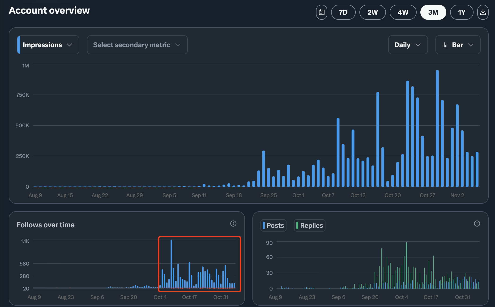

# X 运营增长经验分享

本次分享将基于实战经验，深入解析 X 平台的运营增长策略。我们将从文案创作、视觉设计到平台算法，全方位探讨如何在 X 上实现内容的有效传播和用户增长。通过真实案例和数据分析，帮助参与者掌握实用的运营技巧，提升内容影响力和传播效果。

## 分享内容大纲

1. 核心逻辑
2. 展示面设计
3. 可重复制造爆款
4. 冷启动
5. 平台规则
6. 流量密码

## 成果展示

- 一个月左右一万粉
- 最高一天一千粉
- 最高一天 1M 曝光量
- 完全冷启动
- 完全合规

## 参与分享

加群后关注群公告的会议信息

## 活动时间

待定，满 200 人开始系统性分享，群内不定期交流经验。