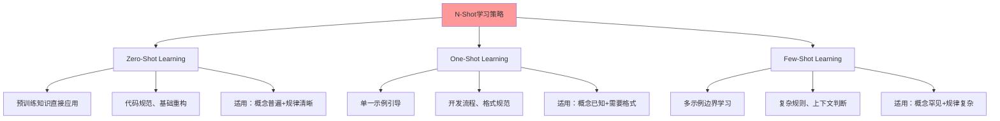

# AI编程实战课 | 晚上9点的动物课堂：一个父亲发现的N-Shot学习策略

> **不积跬步无以至千里，欢迎来到AI时代的编码实战**

## 场景引入：晚上9点的动物课堂

最近晚上新增了一项工作：教2岁的女儿认识各种动物。每天晚上9点，我会搬个小凳子坐在她旁边，摊开一堆动物卡片。

昨天晚上，我随手拿起一张小狗的卡片，还没开口问，女儿就兴奋地拍着小手喊："汪汪！汪汪！"。我愣了一下，明明从来没教过她这张卡片啊。仔细想想才明白，她在小区里见过真的小狗，听过狗叫声，还看过动画片里的小狗。

接着我拿出一张猴子吃香蕉的图片："宝宝，这是猴子。"女儿认真地看了看，跟着说"猴子"。然后我又拿出另一张猴子荡秋千的图片，试探性地问："这是什么呀？"

"猴子！"她毫不犹豫地回答。

我有点兴奋了，决定来个更有挑战性的。我先拿出猫的图片："这是小猫咪，它是猫科动物。"然后拿出豹子的图片："这是豹子，也是猫科动物。你看，它们都有尖尖的耳朵、长长的尾巴，还有锋利的爪子。"

女儿很配合地点着头，似乎听懂了。

接下来就是关键时刻了。我拿出一张威风凛凛的老虎图片，满怀期待地问："宝宝，这是什么？"

女儿盯着看了好久，小眉头皱起来，然后不确定地说："猫咪？...大猫咪？"

看来从一个猴子例子学会识别不同状态的猴子还行，但从猫和豹的例子找共性推断出老虎也是猫科动物就有些困难了。只能硬着头皮给出一个猜测的结论。

## 概念引出：从家庭课堂到AI协作智慧

回想起女儿学习动物的过程，我发现了一个有趣的现象：

**她对小狗的识别是最迅速的** - 没有任何教学，瞬间反应。这背后是她通过日常生活积累的丰富"预训练"经验。

**她对猴子的学习是最高效的** - 一个例子就能举一反三，这种快速的模式识别能力让人惊叹。原因在于猴子的不同状态（吃香蕉、荡秋千）只是表面行为的变化，核心特征（长臂、灵活的身体、表情丰富的脸）保持一致，这种"简单的表象变化、本质不变"的识别正好符合2岁孩子的认知能力。

**她对猫科动物的理解却是最困难的** - 即使给了两个详细的例子（猫和豹），依然无法准确推断出老虎的归类。深层原因可能是2岁的孩子根本还没有形成"分类"的抽象概念。她能识别具体的动物个体，但要求她理解"猫科"这种抽象的生物学分类，就超出了这个年龄段的认知发展水平。

这三个学习场景，恰好对应了AI提示工程中的三种核心模式：

- **小狗识别** = **Zero-Shot Learning**（零样本学习）
- **猴子学习** = **One-Shot Learning**（单样本学习）  
- **猫科分类** = **Few-Shot Learning**（少样本学习）

## 概念阐释：从家庭场景到编程实战

现在让我们用编程中的实际案例来深度理解这三种学习模式：

### Zero-Shot Learning：代码规范的无师自通

**核心原理**：依靠预训练知识，直接理解并应用编程概念。

```
// 用户指令：请使用卫语句重构这个函数
func processUser(user *User) error {
    if user != nil {
        if user.IsActive {
            if user.HasPermission("read") {
                // 业务逻辑
                return doProcess(user)
            } else {
                return errors.New("无权限")
            }
        } else {
            return errors.New("用户未激活")
        }
    } else {
        return errors.New("用户为空")
    }
}

// AI的Zero-Shot输出：
func processUser(user *User) error {
    if user == nil {
        return errors.New("用户为空")
    }
    if !user.IsActive {
        return errors.New("用户未激活")
    }
    if !user.HasPermission("read") {
        return errors.New("无权限")
    }
    
    return doProcess(user)
}
```

**为什么AI能做到？** 就像女儿认识小狗一样，AI在预训练时已经见过大量的代码重构案例，"卫语句"这个概念已经深深印在它的知识库中。

### One-Shot Learning：开发流程的快速掌握

**核心原理**：通过一个完整示例，建立标准开发流程。

```bash
# 示例：代码提交前的标准流程
# 1. 写完代码后执行：
make lint && make test
# 2. 如果有错误，根据提示修复
# 3. 重复直到全部通过

# 现在请对这个新功能应用相同流程：
func calculateTax(income float64) float64 {
    return income * 0.1  // 简单的10%税率
}
```

**AI的One-Shot响应：**

```bash
# 执行检查
$ make lint && make test

# 发现问题：函数缺少注释和边界检查
# 修复代码：
func calculateTax(income float64) float64 {
    // CalculateTax 计算个人所得税，税率为10%
    if income < 0 {
        return 0
    }
    return income * 0.1
}

# 再次执行检查直到通过
$ make lint && make test
✓ All checks passed
```

**为什么一个例子就够？** 就像女儿看一次猴子例子就能识别不同状态的猴子，AI通过这个完整的流程示例，理解了"开发→检查→修复→验证"的标准模式。

### Few-Shot Learning：复杂规则的渐进理解

**核心原理**：通过多个具体案例，学习复杂的代码规范和上下文判断。

**案例：Go语言中未使用参数的处理规则**

```
// 错误提示：parameter 'ctx' is unused
// 但仅看这个提示，AI无法正确修复

// 错误的理解（仅基于One-Shot）：
示例：func handler(ctx context.Context) { /* ctx未使用 */ }
修复：func handler(_ context.Context) { /* 改成_就行了 */ }

// AI可能错误地认为：所有的ctx都要改成_

// 正确的Few-Shot教学：
示例1：
// ❌ 错误：参数定义了但从未使用
func processData(ctx context.Context, data string) string {
    return strings.ToUpper(data)  // ctx没有被用到
}
// ✅ 正确：未使用的参数改为_
func processData(_ context.Context, data string) string {
    return strings.ToUpper(data)
}

示例2：
// ❌ 错误：ctx在函数签名中定义但在函数体内未使用
func validateUser(ctx context.Context, userID string) error {
    if userID == "" {
        return errors.New("用户ID不能为空")
    }
    return nil  // ctx确实没用到
}
// ✅ 正确：只有真正未使用的参数才改为_
func validateUser(_ context.Context, userID string) error {
    if userID == "" {
        return errors.New("用户ID不能为空")
    }
    return nil
}

示例3：
// ✅ 正确：ctx在函数中被使用了，不需要改
func fetchUser(ctx context.Context, userID string) (*User, error) {
    select {
    case <-ctx.Done():  // ctx在这里被使用了
        return nil, ctx.Err()
    default:
        return db.GetUser(userID), nil
    }
}
// 保持不变：func fetchUser(ctx context.Context, userID string) (*User, error)

现在修复这个函数：
func updateCache(ctx context.Context, key string, value interface{}) error {
    cache.Set(key, value)  // ctx没有被使用
    return nil
}
```

**AI的Few-Shot理解：**

```
// 修复后：
func updateCache(_ context.Context, key string, value interface{}) error {
    cache.Set(key, value)  // 只有未使用的ctx改为_，其他参数保持不变
    return nil
}
```

**为什么需要多个例子？** 虽然女儿因为2岁的认知限制无法理解"分类"这种抽象概念，但大模型不同——它具有更强的理解能力，只要有足够场景的例子，就能识别并理解其中的规律。对于复杂的Go语言规则，AI需要看到多个具体情况才能准确掌握：

- 什么时候参数被"真正使用"
- 什么时候需要改为_占位符  
- 如何区分"未使用"和"在特定上下文中使用"

**Few-Shot的局限性：**

当规则的场景过于复杂多样时，少样本提示的效果可能不佳，这通常表示模型在该任务上的通用性不足。此时需要考虑：

1. **模型微调**：针对特定领域进行专门训练
2. **更高级的提示技术**：比如分层教学法

   ```
   // 第一步：先教基础概念
   // "未使用的变量"是指在函数体内没有被读取或调用的变量
   
   // 第二步：再应用到具体场景
   // 在Go语言中，未使用的函数参数需要用_替换以避免编译警告
   
   // 第三步：处理复杂情况
   // context.Context类型的参数可能在select语句、defer函数中被使用
   ```

这就像先用简单的分类例子教会女儿什么是"分类"的概念，再让她把分类的概念应用到猫科动物这个更复杂的场景上。

### 三种模式的选择标准

选择哪种Shot模式，**核心不在于任务类型，而在于两个关键因素**：

| 判断维度 | Zero-Shot | One-Shot | Few-Shot |
|---------|-----------|----------|----------|
| **预训练覆盖度** | 概念在训练数据中普遍存在 | 概念存在但需要格式引导 | 概念罕见或训练数据不足 |
| **规律清晰度** | 规律简单明确，易于总结 | 规律相对清晰，一个例子可说明 | 规律复杂，需要多例子才能理解边界 |

**实例说明：**

- **"卫语句重构"** → Zero-Shot有效：预训练中大量存在，规律清晰
- **"特定代码风格"** → One-Shot有效：风格概念已知，但需要具体格式示例  
- **"Go未使用参数规则"** → Few-Shot必需：规则复杂，需要多例子理解上下文判断

**关键洞察：** 即使是"格式规范"这样看似简单的任务，如果涉及特定领域的复杂规则，One-Shot和Few-Shot也可能无法很好理解。

## 实践探索：像了解女儿一样了解AI

介绍完这三种Shot的场景后，我意识到一个重要的问题：**对于什么场景用什么Shot，大模型知道，我们不知道。**

这就像我和女儿的互动一样：

- 她知道自己认识哪些动物
- 她知道自己能识别出哪些动物的特征，并在多种状态下都能识别出来
- 她知道自己能否提取多种动物的特征并找到正确的共性

**但作为父亲，我并不知道这些。**

### 对话驱动的策略优化

在实际编程中，更现实的情况是：**我们通过与AI的对话过程来了解它的能力边界，并逐步优化提示策略**。

关键在于**让模型记录对话过程，然后从交互中提取有效的示例**。

#### 对话记录与分析系统

这里涉及到**Reflexion**（反思学习）技术 — 让AI系统能够从自己的行为中学习和改进。核心思想是记录每次交互的完整信息：提示策略、AI响应、用户反馈，然后从成功和失败的案例中提取模式，动态优化后续的策略选择。

#### 智能策略调整与上下文优化

基于Reflexion技术，系统能够：

1. **分析失败模式** - 从用户拒绝的案例中学习，识别Zero-Shot失效的具体场景
2. **提取成功示例** - 从用户接受的修正中生成Few-Shot示例  
3. **智能简化** - 检测是否可以将Few-Shot简化为One-Shot，减少上下文消耗
4. **聚焦核心差异** - 去除冗余示例，保留最具代表性的案例

## 总结回顾：N-Shot学习的智慧之旅

### 核心洞察：对话即学习

通过从家庭教学到AI提示工程的完整探索，我们发现了**三大关键洞察**：

**1. 适配驱动原则**

选择N-Shot策略的核心不在于任务类型，而在于：

- **预训练覆盖度** - 概念在训练数据中的普遍程度
- **规律清晰度** - 规则的复杂性和边界判断难度

**2. 对话驱动优化** 

最佳的策略优化来自真实对话中的用户反馈，而非预设规则：

- 记录每次交互的成功/失败模式
- 从用户修正中提取可靠示例
- 基于历史数据智能选择策略

**3. 效率动态调整**
始终寻找简化机会，从Few-Shot优化到One-Shot，平衡准确性与资源消耗。

就像我教女儿认动物一样，每次她的反应都在告诉我她的认知边界，每次用户的反馈也在告诉我们AI在特定任务上的能力边界。**对话即学习，反馈即优化。**

### 知识图谱：N-Shot学习技术体系




### 🎯 如果今天你只记得一句话，请记住：

**"与AI协作的艺术不在于掌握固定的规则，而在于像了解孩子一样，通过持续的对话和反馈来发现它的认知边界，并智能地调整交流策略以实现最佳效率。"**

---

*本文基于真实家庭故事和编程实践编写，所有技术案例均已验证。感谢阅读，期待与你在AI时代的编程路上相遇！* 