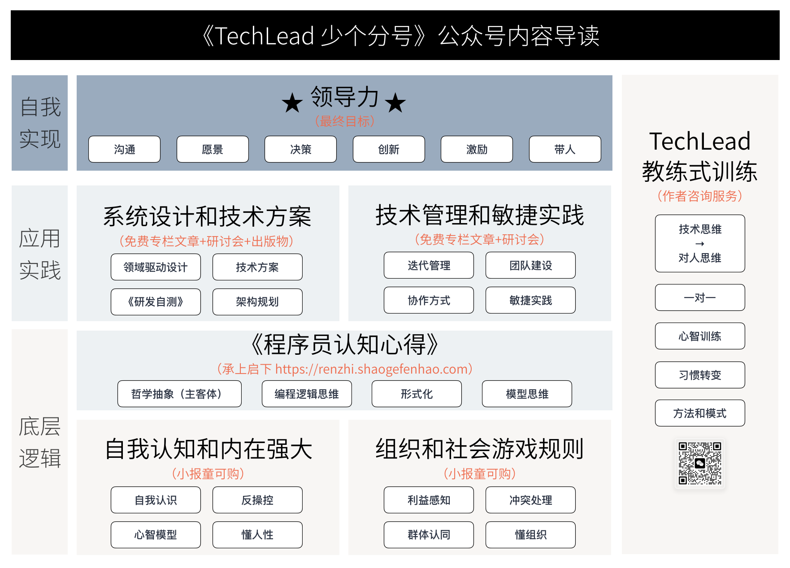

为什么想开启这样一个咨询服务？

这几年把写作公众号当做了一种业余的习惯和爱好，虽然没有成为大 V，但是处于整理自己的知识体系的目标也基本达到了。

同时，也有非常多的朋友在公众号后台留言，找我咨询相关的问题。

过往的咨询咨询并没有做得非常正式，一般都是电话或者微信上随便聊聊，没有严肃的咨询过程，也没有整理书面的咨询记录。

所以，想开启这样一个咨询服务，帮助大家解决一些问题，也可以持续不断拓展案例库(接受公开的许可下)。

所以我把我个人的咨询服务比较正式的加入 TechLead 服务体系中。

主要咨询的形式为【一对一】【线上（腾讯会议）】【白板可视化教练式咨询】【单次一小时左右】。

接受咨询的内容有互联网软件【系统设计】【领域建模】【技术管理】【敏捷团队】【职业发展(求职面试)】等。

## 01 为什么我能帮你？

我目前在一家外企咨询公司在职，主要角色为一线的 Tech Lead，也会做一些技术方案咨询工作，之前也参与过大量培训工作，作为技术面试官面过大量的候选人。

在网络上依然保持匿名状态（很多话讲起来方便一些），虽然可以很多方式找到我真实信息。

我为什么能帮助你？

### 大量的系统设计实践

我最早写公众号的文章主要是集中在DDD和微服务方便，后期拓展为系统设计、技术管理等内容。

所以我们有大量系统设计的实践经验和话题总结。

我运营过领域驱动设计（DDD）社群，进行了大量的 DDD 实践和分享。

同时，关注我的朋友可以知道，我们举办了大量的技术研讨活动，就各个公司真实的项目、最佳实践进行了研讨并总结（可以关注网站上的活动和录频）。

总结了很多实践案例，例如领域建模、微服务、权限设计、分布式事务、研发自测等问题。

相关文章可以在公众号上找到，我也整理成了免费电子书《程序员的认知心得》，出版了纸质书《Java 研发自测》，目前正在整理中的电子书《IT 系统规划笔记》。

### 长期咨询工作经历

正如我在文章中提到过的一样，我参与过很多咨询工作。

咨询工作需要具备结构化思维，以及一些分析问题的方法论。例如，我分享过如何通过矛盾分析，来帮助客户完成决策——通过找到那些可以容忍，那些是主要矛盾。

咨询工作也需要学会找到问题背后的问题，特别是在技术管理领域，相关内容我也整理了大量文章，可以应用到工作实践中，如果达成助推的目的。

另外咨询和培训工作需要讲究如何通过 NLP、教练技术共情和影响他人，这是咨询成功的必要因素。

在我的一个咨询案例中，通过白板帮助来访者找到他为何害怕公开演讲的根源（参考案例部分），并一起制定了目标可达路径和行动。

### 一线 Tech Leader 经验

很多问题你需要一个长期在一线的人来咨询，所以我不做战略咨询等无法落地和一线验证的服务。

在互联网和软件行业，不一定名头和职位越高就真的能解决问题，往往是平台决定的。

一线的问题还是需要一线的人来解决，所以如果找脱离一线的专业咨询师或者培训师，不一定能解决问题。

### 对人的行为模式有深入研究

我认为系统设计的背后是程序员对真实世界的认识是否足够深刻，这需要一定的逻辑学和哲学基础；技术管理的背后需要对人性有深刻认识，从而理解组织，推动团队执行。

我把系统设计的哲学原理和方法论整理到了《程序员的认知心得》中，而技术管理的底层逻辑整理到了《人生十问：自我认知的困难问题》《人生十问：社会的游戏规则》。

在这两个专栏中，我深入讨论了人脑的认知模式，以及组织的形成和运作机制。

通过对人的神经反射、趋利避害、情绪、动机、认知、行为、习惯等进行深入研究，可以帮助你应用到技术管理中。

## 02 咨询的服务流程和费用

1️⃣ 需提前一天预约，将问题简述发到微信，我需要时间提前判断是否适合咨询或者能提供帮助。

2️⃣ 如果适合，我会及时反馈并约时间（预定会议）。我会提前考虑使用什么结构化分析的模型来访谈。

3️⃣ 进行咨询，通过白板可视化，进行教练式咨询。

4️⃣ 咨询结束后，我会整理咨询记录，并提供咨询报告。

服务费用为 199/小时，不满意可以退款。

赠送：

1️⃣ 电子书：《人生十问：自我认知的困难问题》

2️⃣ 电子书：《人生十问：社会的游戏规则》

3️⃣ 纸书：《程序员的认知心得》

## 03 咨询案例（部分，持续更新）

### 建模问题

### 系统设计问题

### 技术管理问题

### 习惯改变（提高公开演讲自信）

### 习惯改变（焦虑，没有自信）