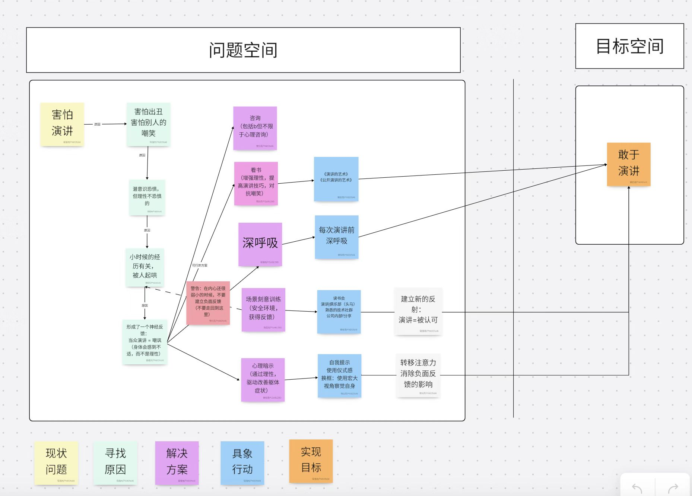
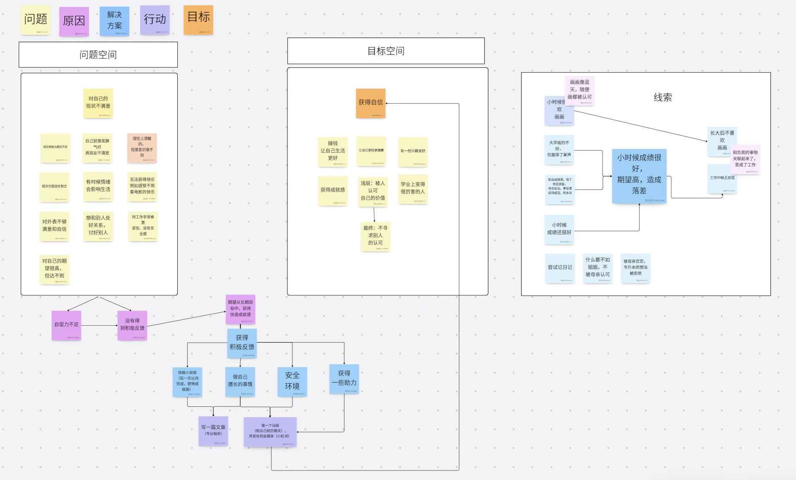

为什么想开启这样一个咨询服务？

这几年把写作公众号当做了一种业余的习惯和爱好，虽然没有成为大 V，但是处于整理自己的知识体系的目标也基本达到了。

同时，也有非常多的朋友在公众号后台留言，找我咨询相关的问题。

过往的咨询并没有做得非常正式，一般都是电话或者微信上随便聊聊，没有严肃的咨询过程，也没有整理书面的咨询记录，事后有些朋友觉得有用也会发个红包什么的。

总的来说，专业性不够强，很多有价值的案例也没有被整理下来。

所以，想开启这样一个咨询服务，帮助大家解决一些问题，也可以持续不断拓展案例库(接受公开的许可下)。

所以我把我个人的咨询服务比较正式的加入 TechLead 服务体系中。

主要咨询的形式为【一对一】【线上（腾讯会议）】【白板可视化教练式咨询】【单次一小时左右】。

接受咨询的内容有互联网软件【系统设计】【领域建模】【技术管理】【敏捷团队】【职业发展(求职面试)】等。

## 01 为什么我能帮你？

我目前在一家外企咨询公司在职，主要角色为一线的 Tech Lead，也会做一些技术方案咨询工作，之前也参与过大量培训工作，作为技术面试官面过大量的候选人。

在网络上依然保持匿名状态（很多话讲起来方便一些），虽然可以很多方式找到我真实信息。

我为什么能帮助你？

### 大量的系统设计实践

我最早写公众号的文章主要是集中在DDD和微服务方便，后期拓展为系统设计、技术管理等内容。

所以我们有大量系统设计的实践经验和话题总结。

我运营过领域驱动设计（DDD）社群，进行了大量的 DDD 实践和分享。

同时，关注我的朋友可以知道，我们举办了大量的技术研讨活动，就各个公司真实的项目、最佳实践进行了研讨并总结（可以关注网站上的活动和录频）。

总结了很多实践案例，例如领域建模、微服务、权限设计、分布式事务、研发自测等问题。

相关文章可以在公众号上找到，我也整理成了免费电子书《程序员的认知心得》，出版了纸质书《Java 研发自测》，目前正在整理中的电子书《IT 系统规划笔记》。

### 长期咨询工作经历

正如我在文章中提到过的一样，我参与过很多咨询工作。

咨询工作需要具备结构化思维，以及一些分析问题的方法论。例如，我分享过如何通过矛盾分析，来帮助客户完成决策——通过找到那些可以容忍，那些是主要矛盾。

咨询工作也需要学会找到问题背后的问题，特别是在技术管理领域，相关内容我也整理了大量文章，可以应用到工作实践中，如果达成助推的目的。

另外咨询和培训工作需要讲究如何通过 NLP、教练技术共情和影响他人，这是咨询成功的必要因素。

在我的一个咨询案例中，通过白板帮助来访者找到他为何害怕公开演讲的根源（参考案例部分），并一起制定了目标可达路径和行动。

### 一线 Tech Leader 经验

很多问题你需要一个长期在一线的人来咨询，所以我不做战略咨询等无法落地和一线验证的服务。

在互联网和软件行业，不一定名头和职位越高就真的能解决问题，很多人往往是因为在平台上，为其带来的影响力。

一线的问题还是需要一线的人来解决，所以如果找脱离一线的专业咨询师或者培训师，不一定能解决问题。

### 对人的行为模式有深入研究

我认为系统设计的背后是程序员对真实世界的认识是否足够深刻，这需要一定的逻辑学和哲学基础；技术管理的背后需要对人性有深刻认识，从而理解组织，推动团队执行。

我把系统设计的哲学原理和方法论整理到了《程序员的认知心得》中，而技术管理的底层逻辑整理到了《人生十问：自我认知的困难问题》《人生十问：社会的游戏规则》。

在这两个专栏中，我深入讨论了人脑的认知模式，以及组织的形成和运作机制。

通过对人的神经反射、趋利避害、情绪、动机、认知、行为、习惯等进行深入研究，可以帮助你应用到技术管理中。

## 02 咨询的服务流程和费用

1️⃣ 需至少提前一天预约，将问题简述发到微信，我需要时间提前判断是否适合咨询或者能提供帮助。

2️⃣ 如果适合，我会及时反馈并约时间（预定会议）。我会提前考虑使用什么结构化分析的模型（谈话结构或者解决问题的模式）来访谈。

3️⃣ 进行咨询，通过白板可视化，进行教练式咨询。

4️⃣ 咨询结束后，我会整理咨询记录，并提供咨询报告。

服务费用为 **199/小时**，不满意可以退款。

赠送：

1️⃣ 电子书：《人生十问：自我认知的困难问题》

2️⃣ 电子书：《人生十问：社会的游戏规则》

3️⃣ 纸书：《程序员的认知心得》

## 03 咨询案例（部分，持续更新）

下面是一些整理的咨询案例，有些例子被我写到了文章中，持续更新中。

### 领域建模问题（通过定义来帮助领域建模）

领域建模其实核心的模型是：如何下定义？

对一个业务概念理解不够，导致领域建模不准确，后续的系统设计不准确。

例如有这样一个问题，一个特殊的 CRM 系统：有一个维修配件调配的单据，单据中有多个产品，每个产品的发货时间不一样，所以一个单据中的产品可能被拆分发货，也有可能多个单据中的部分产品，被组合发货。

如何设计这类业务的领域模型？

我们可以通过事件风暴、用例流等多种方法论来分析，这次案例因为我们都有丰富的经验，所以通过直接下定义来领域建模。

比如，通过提问：

1️⃣ 什么是单据？我们定义为：配件调拨单，描述了配件被调用和维修网点归属转移的业务凭证，关注归属双方和产品价值金额等信息，叫做TransferOrder。

2️⃣ 什么是产品？我们定义为：配件调拨单中的项目，关注调拨内容，叫做 TransferOrderItem。

3️⃣ 什么是发货？我们定义为：配件调拨单的货运执行，关注发货收货双方和货运信息，叫做 Shipment。

4️⃣ 什么是组合发货？我们定义为：配件调拨单的执行，关注货物的内容，叫做 ShipmentItems。

通过关注点分离，实现了模型的职责单一，便于后续模型的拓展，例如 Shipment 可以被其它单据使用。

TODO 补充一个图。

### 系统设计问题（找容忍点）

这个案例使用了我一个自己的一个模型：矛盾和容忍。

主要分析方法是，找主要矛盾，然后分析哪些是能被容忍的问题。

这个分析方法讲究一个原则：**想要得到之前，想想哪些能失去**

这个案例在 《系统设计 | 解决困难问题的思路》写过。

库存和价格存在于不同的服务，但需要同时在一个列表中查询出来，并有搜索、排序等功能要求。

> 库存、价格存在于不同的服务同关联查询之间的矛盾。

为了解决这个矛盾，我们可以很容易找到一些可选方案：

1️⃣ 合并库存和价格服务。

2️⃣ 将库存数据同步到价格服务。

3️⃣ 将价格数据同步到库存服务。

4️⃣ 将价格和库存同步到搜索引擎（ElasticSearch）。

通过寻找可以业务和技术上可以容忍的点，来选择这四个方案。

#1 方案在微服务下不可以容忍，不予考虑；#2 库存数据需要实时查询，对延迟敏感，不予考虑；#3 价格的变化在列表查询时，业务没有上没有那么敏感，价格更新不像库存那么频繁，用户在下单时确认最终价格也能接受；#4 同 #2 库存服务对延迟敏感。

那么解决这个问题的方式就是 #3，将价格同步到库存服务。

### 技术管理问题（处理矛盾，如何拒绝一个完不成的任务）

来访者作为技术经理，总是被老板安排一些明显无法做到的工作，他作为新手经理，找到问如何解决这类问题。

这是一个典型的管理中的矛盾问题。

矛盾问题分析的模型：领会真正意图-找到矛盾-分析矛盾-找到容忍点-制定方案。

领会真正意图：1. 老板觉得能完成 2. 其实按时完不成也没事，可以接受延期 3. 这事儿很重要，但可以让优先级低的事情放一放。

如果真实意图是 3， 那么根据矛盾分析：工作量和团队容量之间的矛盾。

找到容忍点：能容忍优先级低的事情放一放，不能容忍延期。

制定方案：找出优先级低的工作，往后排期。

我们发现，如果意图理解不一样，矛盾也不一样，解决方案也不一样，老板的满意程度也会不一样。

通过教练式咨询，我们可以通过一起找到问题背后的问题，并制定解决方案。

TODO 补充一个图。

### 习惯改变（提高公开演讲自信）

这个案例属于认知模式管理咨询。

来访者害怕公开演讲，通过白板可视化访谈，找到了他害怕的原因，来自于童年时期，公开演讲和被嘲讽之间的神经反射关系。

我们一起获得的解决方案是，在安全环境下，通过演讲 + 鼓励认可构建新的神经反射，实现公开演讲的自信。

### 习惯改变（焦虑，没有自信）

下面这个有点接近心理咨询了，解决的是如何提高自信的问题，获得因为缺乏成就感（这个原因是我分析出来的）而导致的焦虑。

来访者的感受不到成就感，对所有事情都感到无趣和焦虑。

本来她在童年时期喜欢画画，非常自信，但是后来因为一些原因，被父母打击，导致成年后画画和不良感受建立了关联，无法获得自信和成就感。

通过白板可视化访谈，找到了她焦虑的根源，我们一起分析问题，并制定了一些解决方案。

据来访者反馈，在产出这个白板前，她对自己的问题感知非常模糊，有了这个白板，她能感受到自己的方向，并找到重新振作的勇气。