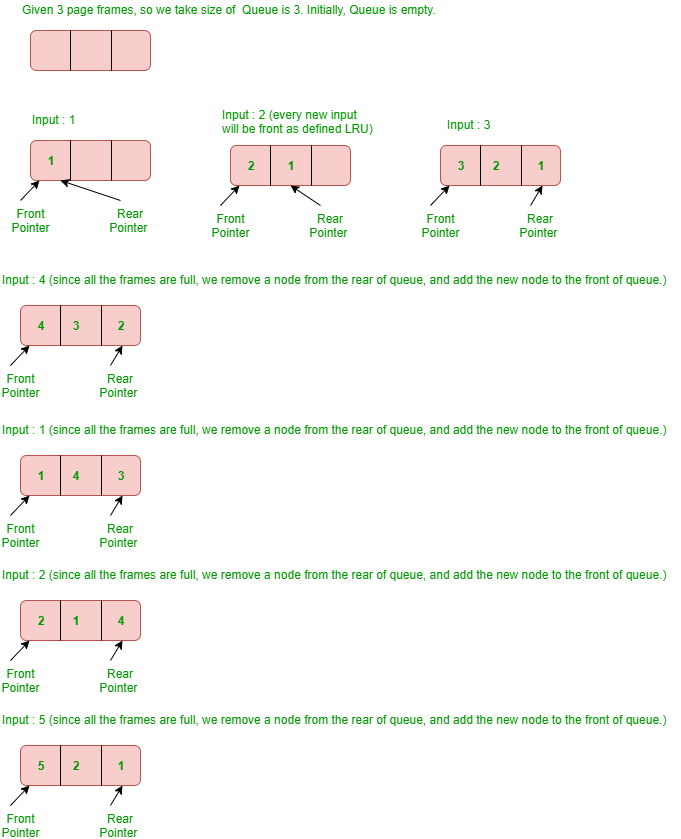

## 问题

实现一个缓存淘汰算法

## 分析





## 实现

```java
// Java program to implement LRU cache
// using LinkedHashSet
import java.util.*;
 
class LRUCache {
 
    Set<Integer> cache;
    int capacity;
 
    public LRUCache(int capacity)
    {
        this.cache = new LinkedHashSet<Integer>(capacity);
        this.capacity = capacity;
    }
 
    // This function returns false if key is not
    // present in cache. Else it moves the key to
    // front by first removing it and then adding
    // it, and returns true.
    public boolean get(int key)
    {
        if (!cache.contains(key))
            return false;
        cache.remove(key);
        cache.add(key);
        return true;
    }
 
    /* Refers key x with in the LRU cache */
    public void refer(int key)
    {       
        if (get(key) == false)
           put(key);
    }
 
    // displays contents of cache in Reverse Order
    public void display()
    {
      LinkedList<Integer> list = new LinkedList<>(cache);
       
      // The descendingIterator() method of java.util.LinkedList
      // class is used to return an iterator over the elements
      // in this LinkedList in reverse sequential order
      Iterator<Integer> itr = list.descendingIterator();
       
      while (itr.hasNext())
            System.out.print(itr.next() + " ");
    }
     
    public void put(int key)
    {
         
      if (cache.size() == capacity) {
            int firstKey = cache.iterator().next();
            cache.remove(firstKey);
        }
 
        cache.add(key);
    }
     
    public static void main(String[] args)
    {
        LRUCache ca = new LRUCache(4);
        ca.refer(1);
        ca.refer(2);
        ca.refer(3);
        ca.refer(1);
        ca.refer(4);
        ca.refer(5);
        ca.display();
    }
}
```


## 参考资料

- LRU Cache Implementation https://www.geeksforgeeks.org/lru-cache-implementation/

