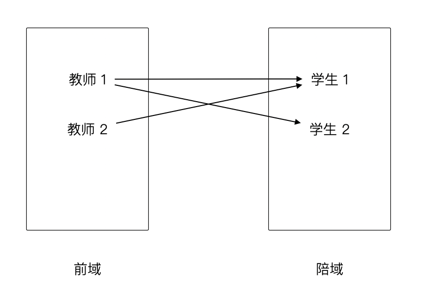
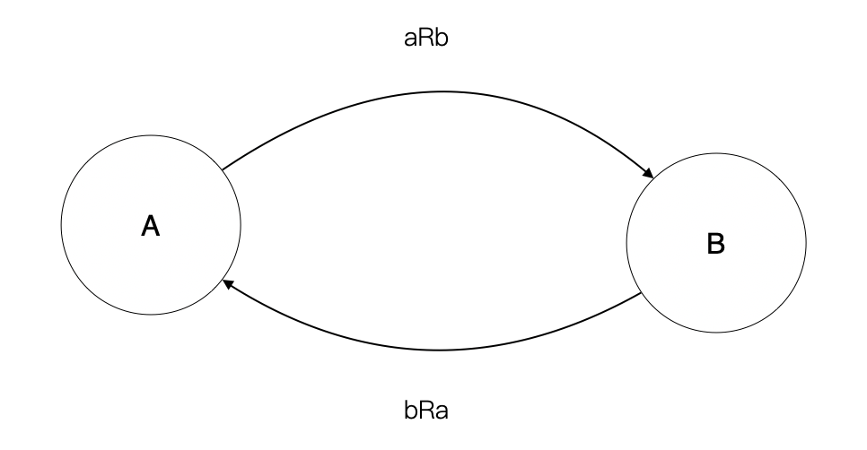
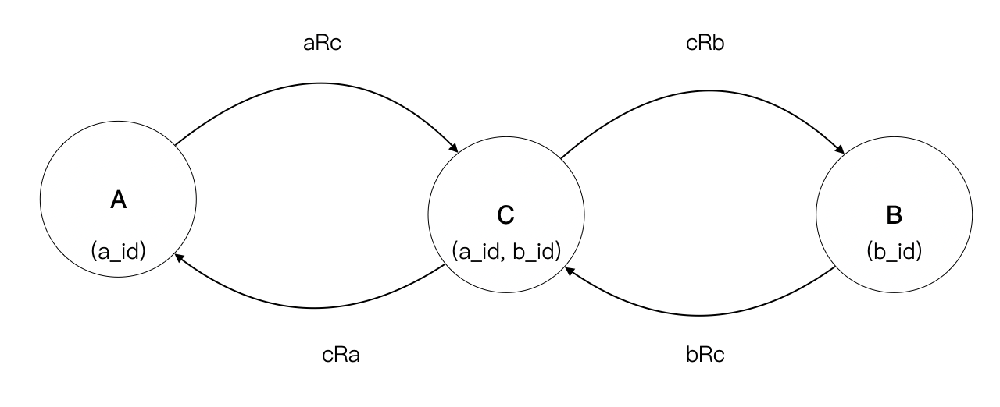
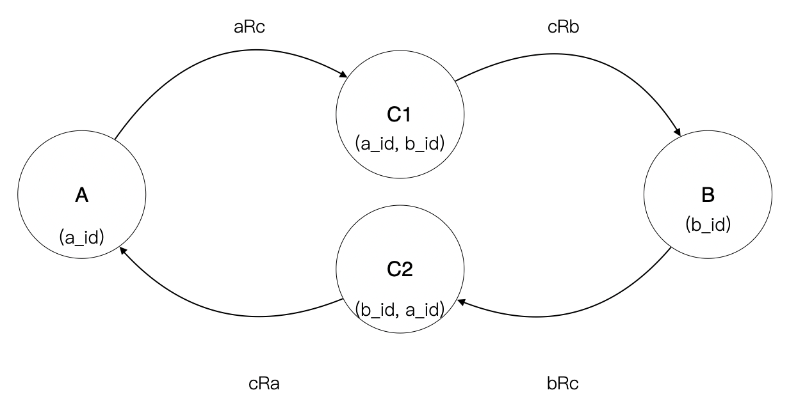
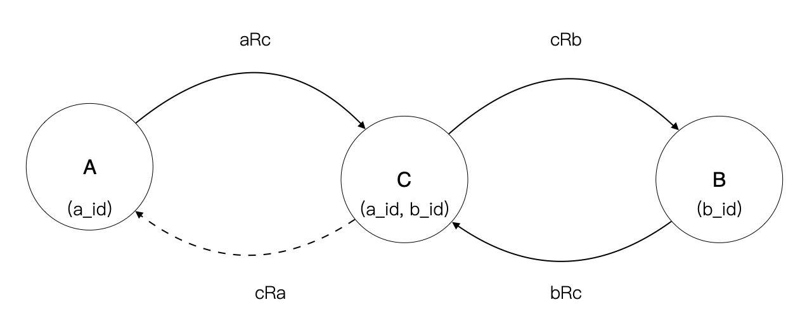

**注：由于作者的数学水平有限，欢迎就文章中的问题留言交流**

在面向对象设计中，多对多关系都是非常麻烦的问题。在现实中，我一般会根据经验让团队避免使用多对多关系。对于一些培训，我会通过认识论的思想表达多对多问题是因为没有找出中间模型，这也是为什么我们通过数据库实现多对多关系的时候需要一张中间表的原因。

例如，订单和商品是一对典型的多对多关系。但是当我们对业务认识足够深刻时，订单中的商品应该叫做订单项，这样就会拆分多对多关系为订单-订单项的一对多关系，以及订单项和商品的一对一关系。

从直观的上来说，“任何多对多关系都可以拆分成两个一对多关系”，但是这些都是通过经验和主观认识在分析。直到最近，我和同事从集合论的角度出发，尝试证明命题 “任何多对多关系都可以拆分成两个一对多关系” 是成立的，甚至能从更为深刻的层次来解决系统耦合的问题。接下来，我会使用数学的语言来描述分析过程，对于有计算机科学教育的朋友来说，其实比较容易理解。

首先，我们需要用数学形式化 “多对多关系” 这个表述。

## 01. 集合论和数据库

 我们可以使用集合论的思想来理解关系数据库模型中的 “对多对关系”，事实上数据库就是建立在集合论之上的。集合论是研究集合的结构、运算及性质的一个数学分支，最早由康托尔建立。我们需要先了解一点集合、关系和数据库理论的基本知识。

> 集合是指具有某种特定性质的具体的或抽象的对象汇总而成的集体。其中，构成集合的这些对象则称为该集合的元素。 注意，集合的元素是无序的。例如自然数集合 N {0,1,2,3,4,5...}
>
> **关系**是各个对象之间的联系和对应，最常见的是两组对象之间的联系和对应。采用**二元组**或**多元组**的**集合**来表示关系。注意，关系是有序，二元关系是由有序对构成的集合，例如老师-学生关系 R {<教师1,学生1>，<教师1,学生 2>}。有序对的第一个元素构成的集合叫做**前域**，第二个元素构成的集合叫做**陪域**。

我们可以使用图表来表示关系：

数据库中的数据由**记录**构成，这些记录的模式（schema）由**域**（字段）构成，这些域可以看做 n 元组的数据项。当我们在说**表结构**时，表就是一种 n 元组的模式，记录就是遵守这些模式的数据。

无论我们说模式还是记录，都可以用集合的方式来表达。例如，模式 S 为表达商品的模式，可以形式化为

> S = {商品 ID,商品名称,创建时间}。

而一个模式的实例，是由这些遵守这种模式的数据构成集合

>  A = {s1,s2,s3}

简单来理解就是，一张表就是一个由特定格式的数据的集合构成，其中可以使用某个字段来标识这组数据，这个字段就是**主键**。

>  在数据库理论中，`表是由每个域的构成的集合组成的 n 元关系`，所以实际上表是由 n 元关系构成的集合，也就是字段与字段之间存在关系。当我们说表之间的关系时，其实说的是关系的关系。
>
>  表：字段构成的关系。
>
>  通常说的关系：表之间构成的关系。
>
>  连接：可以看成表作为集合的乘积运算，也可以看成关系的合成运算。

## 02. 证明

通过集合再来理解多对多关系。对于学生管理系统，一名教师教多名学生，一名学生也可以有多个老师。在这个例子中，通过直观的方式很难理解怎么拆分出有意义的一对多关系。那么下面我们先用数学的方式描述它：

> 令全体老师为集合 A {a1,a2,a3...}
>
> 令全体学生为集合 B {b1,b2,b3...}
>
> 多对多关系则为：a,b 分别表示集合 A，B 中的元素。构成关系 aRb，满足 A 中的任意元素，在 B 中具有 0 个或者多个元素对应；且构成关系 bRa，满足 B 中的任意元素，在 A 中具有 0 个或者多个元素对应。（**注意：这段表述不是严格形式化的，严格形式化需要使用谓词逻辑**）

通过分析我们发现，多对多关系的内在意义就是同时存在两个方向相反的关系。

但是这种关系在实际应用中，没有实用价值。因为 aRb 的关系在陪域 B 不唯一，而关系 bRa 中，陪域 A 却不唯一。于是人们意识到需要消除这种多对多关系，在使用数据库中，我们一般会通过中间表来消除多对多关系，来实现 A、B 中元素的唯一性。重复的问题，由中间表承担。

中间集合由 A、B 主键构成的元组构成，这样可以使用关系的合成原理得到 A -> B 的一对多关系。
$$
aRb = aRc \circ cRb
$$
反之，也可以用关系的合成原理得到 B -> A 的一对多关系。
$$
bRa = bRc \circ cRa
$$

那么问题是，但这两个等式需要同时满足的时候还成立吗？换句话说 {aRb, bRa} 和 {aRc $\circ$​ cRb, bRc $\circ$​​ cRa} 是等价的吗？

**证明  {aRb, bRa}  逻辑等价于  {aRc $\circ$ cRb, bRc $\circ$ cRa} 。**

>  根据关系的合成运算的逆运算，令集合 C1，使得 aRb = aRc1 $\circ$ c1Rb；令集合 C2，使得 bRa = bRc $\circ$ cRa。只需要证明，C1 等价于 C2 即可证明上述逻辑。
>
> 又，C1 由元组 (a_id,b_id) 构成，C2 由元组（b_id,a_id） 构成，在元组中域的顺序不敏感的情况下，可以认为 C1 等价于 C2。

实际上在数据库理论中，元组就是域构成的关系，严格上 C1 不会等价于 C2，另外当它们作为关联条件的键不相同或者元组中的域有区别时，也不能认为等价。

C1 和 C2 不等价的情况在现实中非常常见。学生和教师的关系不是简单地多对多关系，需要按照场景来看。例如，教师-学生关系中，学生可以选多个老师的课程，这里的中间表 C1 为学生选课表，C2 为教师的授课表。当一门课只能被一名老师授课的情况下，C1 和 C2 等价，但是当一门课可以由多个教师授课的情况下，C1 和 C2 就不再等价了。

C1 和 C2 不等价是一个重要的发现，因为我们之前认为多对多关系就可以使用一个中间表解决问题，实际上某些业务场景中，一个中间表无法解决问题，需要构建不同的关系才能解决问题。换个更形象的例子，老师会给学生打分，学生需要给老师做出评价，这时候如果使用一个中间表就可能不能满足需求。

## 03. 应用

这个模型可以用来揭示耦合的本质，并为解除耦合提供理论基础。

假设，我们将计算机中的依赖定义为：

> 组件 A 需要依靠组件 B 中的数据或者能力才能完成特定的逻辑，则认为组件 A 依赖组件 B。依赖和通信方式无关，在数据方面通常表现为知道（known）的关系。

例如，电商应用需要调用支付平台完成支付，支付平台会通过通知回调调用电商应用，但由于支付平台不需要依靠电商应用，因此它们的依赖关系为电商应用依赖支付平台。

在基于关系数据库的编程模型中，数据库的表连接（join）需要有相应的关系存在才能完成。所以我们设定，数据库中被连接的一方，就是被依赖的一方。在分布式系统中，由于主要表被拆分到不同的库中，我们需要分析清楚多对多问题才能实现系统解耦。

因此，我们容易得出以下结论。

**结论 1：存在多对多关系时，我们总是需要中间表解决主键重复和信息冗余的问题。**

大多情况下，我们容易承认需要一张中间表，但是我们往往不合适的理解中间表是一个 “关系表”。实际上它就是一个和其他表同样地位的表。教师-学生关系中，这里的中间表 C 可以认为是学生选课表，而非简单的老师-学生关系表。

同样的例子很多：

- 一个班级有多名学生，一个学生也可能在多个班级就读，C 可能代表的是班级成员表。
- 一个订单有多个商品，一个商品可以生成多个订单时，C 代表的就是订单项。
- 一个用户有多个群组，每个群组可以加入多个用户，C 代表的就是群组成员。

**结论 2：存在双向的关联关系时，即使有中间表，也会造成环的形成，造成数据库耦合**

有意思的是，大多数情况，两个方向的关系不一定都有业务意义。比如，一个订单有多个商品，代表订单项，但是一个商品有多个订单则没有此类业务意义。

因此我们可以选择一段关系剪断它们，就可以实现解耦，这就是解耦的数学意义。

实践是检验真理的有力标准，我们使用现实中的例子来说明。

如果文章分类和文章是多对多关系，则 A 是文章分类，B 是文章，C 是分类文章关系表。这个例子比较难设计出好的聚合模型。

在业务上文章分类（A）关联到文章（B）的意义不大，一个特殊场景是为文章分类批量添加文章，其实可以认为是对文章的批量操作。于是我们可以剪断 aRc 这个关系，设计出聚合（文章分类）、（文章-文章类目）

