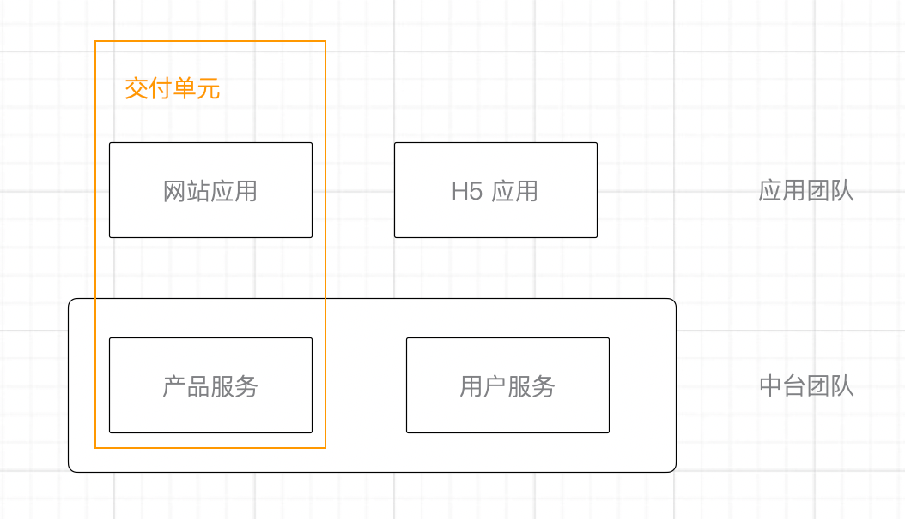
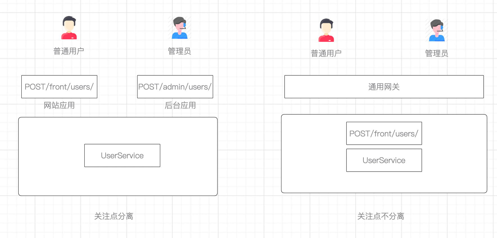

一个周末时间参加了架构大师的 Neal 的架构培训，由于时差的原因在周末的两个早晨。课程围绕着微服务和大型系统，在他的培训中反复提到一个词 “tradeoff” 引起了我的兴趣。

因为我们在讨论架构的过程中，总会陷入一些矛盾，这些经典的矛盾成了关于架构无尽争论的源头。这些矛盾往往是我们分析架构方法的关键所在。

在现实中，企业采用微服务架构的主要动机往往是因为团队过大，以至于无法让数十个、百个人同时在一个项目上工作。这个时候会带来另外问题，如何让这些分布式的系统合适的集成起来成了另外一个问题。

这时候，使用微服务架构是为了解决一个矛盾：**大型团队超过管理容量和并行开发之间的矛盾。**当我们在讨论是否需要微服务时，需要关注时候当前有类似的矛盾存在。

例如对于创业公司而言，在 “两个披萨” 就能吃饱的团队规模，则还没有这样的矛盾，因此使用微服务不一定是一件好事。

## 架构中的矛盾

架构设计中，有各种各样的矛盾。

**用户故事的独立交付和可复用平台建设之间的矛盾。** 在一些大规模的应用中，需要建设一些基础的业务能力，现在流行叫做 “中台”。但一个基础业务会被多个场景用到的时候，使用中台集成这些能力，会给用户获得一致的体验。不过，这种实践会带来另外一个矛盾，中台必须和接入的应用不断集成。

这会给敏捷团队带了一个困扰，因为敏捷团队会使用用户故事（User Story）作为需求划分的方法。为了保证敏捷交付，用户故事需要遵守 INVEST 原则：

> - **I**ndependent 独立的
>
> - **N**egotiable 可讨论的
>
> - **V**aluable to Purchasers or Users 对客户或用户有价值的
>
> - **E**stimable 可估计的
>
> - **S**mall 小的
>
> - **T**estable 可测试的

使用中台后，某些业务能力需要贯穿中台团队和应用团队，就无法由一个团队独立完成，也做不到独立发布和交付。在某种程度上，这种矛盾难以调和，因此就需要对中台的团队修改其协作模式。比如中台团队使用看板（Kanban）模式，通过响应应用团队的业务诉求来提供相应的能力，这就是架构设计中的一种权衡。

另外的典型矛盾还有**数据耦合和一致性的矛盾。**

在微服务中，数据库会和服务一起被分离，这种分离会造成一个典型的问题 —— 数据一致性问题。这种问题几乎无处不在，例如用户服务和不同的微服务解耦，那么用户信息会出现在各个服务的快照或者缓存中，以避免对用户服务的频繁访问。

这就会产生一个矛盾，但用户数据变更时，其他相关的服务可能得不到实时更新。一般来说，用户的信息不能同步更新是可以容忍的，以避免用户服务不可用时，其他服务也能相对健康。

如果架构师过分追求实时更新而忽略了系统的可用性这得不偿失。在理论上可以用 CAP 定理说明：

>  分布式系统只能在一致性、可用性、分区容忍性之间三选二做出保证：
>
> - Consistency: 一致性
> - Availability: 可用性
> - Partition tolerance: 分区容忍性

微服务系统天然的选择了分区容忍性，于是只能在一致性、可用性之间做出保证。这并不是意味只能选择一致性、可用性，而是说在发生故障时，只能二选一。

在编码实践中另外一个矛盾就是，**面向对象中，关注点分离和复用逻辑的之间的矛盾。**

大量的遗留系统告诉我们，错误的复用是让系统过分耦合的原因之一，这似乎违反面向对象中尽可能的追求复用的原则。这背后的逻辑是：**面对大量的应用场景时候，如果没有足够的关注点分离，会在 “可以复用”的代码中写出更多的 if 语句。**

举个例子来说，系统可以允许用户自己注册，也可以让管理员来添加，如果他们复用同一个接口，就必须判断来源，从而进行不同的逻辑处理。反之，通过关注点分离，提供给两个用例不同的接口，把差异处理后再进行复用，可以大大简化逻辑。

## 权衡的原则

权衡的原则之一就是抓住主要矛盾。

主要矛盾是指在架构决策中的诸多要素中最关键的、占据支配地位的矛盾。抓大放小往往是解决架构矛盾的关键所在，但是认识到什么是主要矛盾比较困难，也是做技术决策的挑战之处。

对于创业公司来说，他们的主要矛盾是快速的迭代和功能演进，可维护性和系统容量并不是其主要考虑内容。因此，微服务一般不是其选择的主要方向，应该使用一些敏捷快速开发框架，通过模型来驱动快速功能完成。

对于业务已经基本定型，快速成长性的公司来说，他们的主要矛盾是业务的快速扩张和大量人员共同开发的矛盾。在做好微服务的准备和条件下，可以通过服务的拆分，让加人变得可能。

对于业务已经稳定的公司来说，他们的主要矛盾是如何让业务持续运行和架构不断腐化的矛盾。因此他们的技术方案会更加保守，使用成熟可用的方案，并不追求新技术和方案。

## 拆分微服务的权衡

微服务已经是比较主流的技术方案，对于微服务拆分的权衡来说，可以参考以下几个方面。

**服务的功能。** 首先，任何技术方案和决策，都需要有他的适用范围，微服务也是。对于一些天然可以被拆分的业务来说，可以优先考虑拆分。比如邮件、通知等系统，这些系统本就可以作为独立的能力运行。

**代码波动情况。**但业务架构不稳定的时候，分布式系统的调整成本远远大于单体系统，这个时候需要考虑单体优先的架构策略。业务架构不稳定的会反应在代码的波动上，如果软件模型频繁调整，不适合拆分微服务。

**弹性需求。** 不同的业务有不同的访问频次，对于弹性需求不同步的业务来说，如果将热点业务拆分出去可以提高整体的性能和可维护性。

**容错。**  如果对系统有特别的容错需求，也可以考虑拆分微服务，并使用降级和容错的特性来保障服务之间的相对隔离。

**数据安全。**  另外一些特殊的需求是来自于安全方面，用户信息、信用卡信息、账户信息和其他业务对于数据安全敏感性不同，也可以考虑使用微服务来保护数据安全。数据安全的保护不仅是系统运营过程中的安全，也有开发过程中的安全。一些专业的公司，会根据数据的敏感性不同，将办公区域划分为不同的区域。

## 架构验证方法

架构权衡是一个具有挑战的工作，因此需要一些架构验证的方法。

**POC测试（ Proof of Concept）。** POC 越来越被重视，其含义是：当我们在设计一个大的系统前，先设计一个原型系统，在原型系统之上进行验证架构是否合理。

原型方法是软件开发中比较重要的方法，但我们做一些重要的软件设计时，先设计原型，通过对原型的检验一步一步毕竟真实的系统。甚至会有公司进行多个团队开发原型，使其具有竞争关系，再选择一个团队来开发商用系统。

原型设计分为多个层次：

1. 商业原型。商业原型一般就是 PTT 演示文档或其他模型，可以做一些用户测试，验证系统在商业上是否可行。
2. 业务原型。业务原型一般是指用户的交互和界面，通过借助 Axure 的界面原型设计软件设计出软件应该有的样子，用于软件工程师和架构师进一步设计软件架构和领域模型。
3. 技术原型。通过实现一个 demo 来验证技术的可行性，可以通过这个原型来分析技术的各项指标，比如潜在性能问题、安全问题等。

原型法可以用低成本的方式验证软件设计过程中的问题，提高软件开发的成功率。

**ATAM 架构权衡分析方法**。架构和方案被设计出来之后，需要对架构进行评审。通过架构权衡分析方法 (Architecture Tradeoff Analysis Method，ATAM) 总结了架构评审中的关键几个条件：：

1. 架构的可行性。架构是否可行，能否靠现有的团队完成实施工作。
2. 架构的业务支撑性。架构是否能支持现有的业务，尤其是未来一段时间的业务。能在一定程度上响应业务变化的架构才是合理和实用的架构。
3. 架构的成本。大的公司的架构不适合小的公司，往往是其成本决定的。比如 Hybrid App 作为低成本的开发方案可以让创业公司的产品快速成型，但是对于大的公司来说需要更好的用户体验，因此在有足够投入的情况下会开发 Native APP。

架构权衡分析方法作为一种专业的架构权衡的方法还提供了一整工具可以选用。
