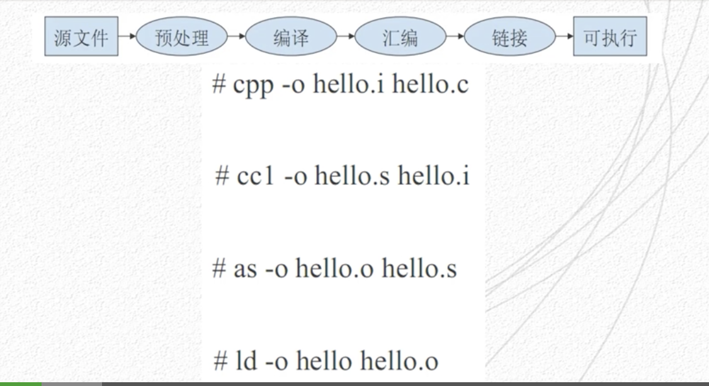
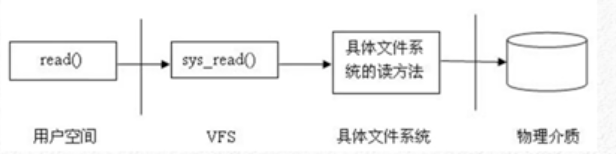
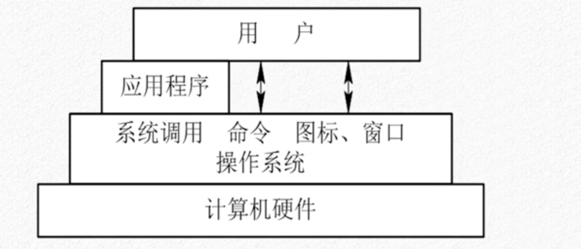

## linux 架构介绍

## GCC 介绍

### GCC 介绍

GCC 是 GUN 下的一个项目，是一个多语言自由编译器，可以支持 C、C++、Ada 等语言。

包括：

- CPP 预处理器
- GCC 编译器
- binutils
  - as 汇编器
  - Id 链接器

GCC 的编译过程

1. 源文件
2. 预处理
3. 编译
4. 汇编
5. 链接
6. 可执行文件

GCC 的使用方法

> gcc [选项] <文件名>

GCC 默认包含了预处理、编译、汇编、链接四个阶段。

生成应用程序有两种编译方法：

- 静态编译
- 动态编译，动态库必须按照 lib*.so 命名规则

### GDB 

GDB 是 GUN 计划中程序调试工具。

有如下功能：

1. 启动程序，按照不同的方式启动程序
2. 在符合条件的位置进行断点
3. 当程序被停住时，可以检查程序中发生的问题
4. 动态改变程序的执行环境

使用方法

- 使用 shell 运行，进入 gdb 界面后，用 file program 装载
- 在 shell 中直接使用 gdb 启动
- 使用 gdb 调试 core 文件
- 调试正在运行中的进程
  - gdb program <processid>

## linux 文件系统

在linux中一切都是文件，简化系统的读写操作。

允许多种不同的文件系统。

- ext2
- ext3
- ext4
- xfs
- btrfs

### VFS 

虚拟文件系统，用于给用户层提供统一的文件访问系统。

用户层不需要关心文件系统的类型和细节。

文件系统的基本数据类型：

- 超级块（super block）用于存储文件系统的控制信息，包括文件系统的状态、类型、大小、索引节点数
- 索引节点（inode）。用于存储文件的元数据，包括文件的大小、拥有者、创建时间。
- 目录项（dentry）。目录用来容纳文件，目录可以包含子目录。
- 文件对象（file）。一组在逻辑上具有完整意义的信息项的序列。

### 系统调用

系操作系统提供给用户程序调用的一组特殊的接口，用户程序通过这组特殊的接口直接访问内核空间。

linux 的内核和用户空间是相互隔离的。可以通过标准 C 函数调用可以调用 linux 中 libc 的函数库。

###  读写文件

函数 read() 用于读取文件。write() 用于写入文件。

定位文件是通过文件描述符来完成的，除了通过路径读写文件外有几个特殊的文件描述符：

- STDIN_FILENO 标准输入
- STDOUT_FILENO 标准输出
- errno 错误代码

标准输入、输出可以用于从键盘读入数据，并从屏幕打印出来。

### 设备 I/O 通道控制

函数 ioctl 可以控制一些设备文件来操作设备。

### linux 标准 IO 库

使用 C 函数，操作比较繁琐，标准 IO 库更加简单。

- fopen 打开文件
- setbuf setvbuf 设置标准库缓冲区大小
- fdopen 使用描述符打开打开文件，比如一些网络描述符
- lseek 移动文件位置
- pread 读取偏移量的文件数据，是lseek 和 read 的原子操作

### 父子进程

当一个进程调用 fork 函数后，会创建一个完整的新的进程，系统会将原来的数据复制到新的进程中，新的进程为该进程的子进程。

### 线程和进程

- 进程为系统资源隔离较大的级别（文件资源、内存、CPU 隔离）
- 线程，轻量级进程，共享文件资源、内存，CPU 隔离

进程之间需要共享数据需要使用 sendmsg、receiveMsg 城传送数据和内存交换。

也可以使用 socket 的方式进行共享。

