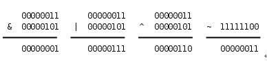

```
按位与    &                        两边全为1  结果是1           都为真才位真
按位或    |                         两个有一个是1  结果是1　　　　有真则为真
按位异或   ^                    两边必须一个是0一个是1  结果才是1  是或运算的一个特例可以解释位绝对的或。
按位取反  ~               0变1   1变0           取反
```



