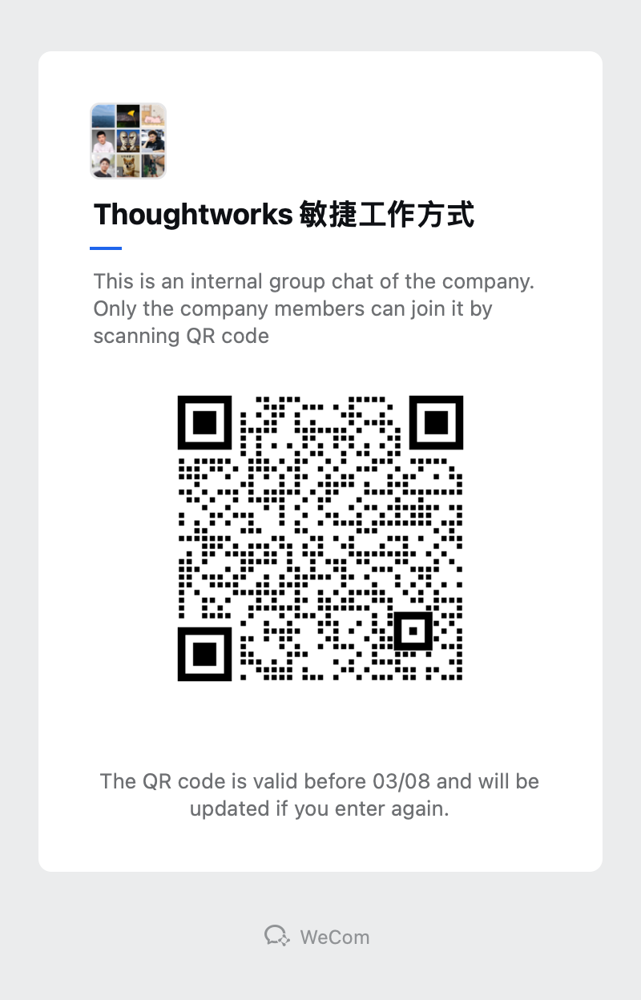

抱歉又来水 China 邮件组！

去年发布过一份文档，是关于 Thoughtworks 敏捷工作方式的框架，我们简称 TAWF。

TAWF 目前是一份工作方式的文档草稿，编写目的是解决在新项目上团队成员就工作方式达成共识。在这份文档中，我们将工作方式分为了：

- 职业框架：职业框架包含工作者行为要求，这部分直接引用 Thoughtworks CoC；也包括团队成员在团队中如何表现职业性，这部分内容在海外一般被称为 Social Contract。团队的职业性主要体现在工作纪律、邮件发送和参与会议的注意事项等内容。
- 过程框架：过程框架描述了作为 Thoughtworker 如何更好地参与交付项目的两个常见阶段：规划启动和交付。规划启动过程部分描述了如何对项目进行计划、有哪些交付件和如何进行最终汇报等内容；交付迭代过程描述了在进入迭代后如何设计迭代日历、角色职责和日常活动。
- 专业实践：挑选一些有价值的实践进一步解释，叙述每个角色在专业上如何更好地实现过程框架的活动，包含产品和需求分析、视觉设计、研发、质量保证、项目管理五个部分。

在上一次更新中，我们分享了 "职业框架" 和 "专业实践"，由于编写本文档的小伙伴都是"为爱发电"，因为项目繁忙，此项工作中断了很久。最近在一些新的小伙伴加入的情况下，补充了专业实践部分。

希望该份文档能起到沉淀 Thoughtworks 优秀工作方式的作用，帮助新的团队更快建立自己的工作方式，提高团队工作效率和工作体验！

文档链接：

[0 文档 Drive](https://drive.google.com/drive/u/1/folders/18I5F_qxTHHU_eiGaLhpq3VxIaQgPgn1P)

[1 引言](https://docs.google.com/document/d/1TAtKp11ktJBfFYaDPhZ0dwLYIsIBE9wd7mmYuNCdFUo/edit?usp=drive_link)

[2 职业框架 - Social Contract 团队契约](https://docs.google.com/document/d/11zSWSxxqAfRT8_elEWccvQtZGGOrnnGhFda97_CH_8w/edit?usp=drive_link)

[3.1 过程框架 - 规划和启动过程](https://docs.google.com/document/d/1NmTEA1Nwcq8DkBsUBZm1iW8_xqSkwN9Uly4kJOQwLKA/edit?usp=drive_link)

[3.2 过程框架 - 交付迭代过程](https://docs.google.com/document/d/18uRDHCuWsnJnmjlw0ILrIhBWisH2WJL6TdXA3jIQj64/edit?usp=drive_link)

[4.1 专业实践 - 需求分析和管理](https://docs.google.com/document/d/1RCpgNxZo_sNg6kAMU_d4WV70RHCEZUd4BkxlMbDd9Xs/edit?usp=drive_link)

[4.2 专业实践 - 交互设计](https://docs.google.com/document/d/1_wRM6PXUlU8EwATZq9T7BZGOWES0gFeJqWjL6U5VRq4/edit?usp=drive_link)

[4.3 专业实践 - 研发](https://docs.google.com/document/d/1t6EPoiivmVzkhzz5g-kA4zHFeuigARMphvShNt7d6Ew/edit?usp=drive_link)

[4.4 专业实践 - 质量保证](https://docs.google.com/document/d/1U9ikaeXzBkzY3EWLw0BHb235659S4GYu1oeMDvp5s0A/edit?usp=drive_link)

[4.5 专业实践 - 项目管理](https://docs.google.com/document/d/1eBfyTP6GDUjHaAT73v050Fq2RO4HbQKeaY-MTVJCEyA/edit?usp=drive_link)

欢迎有兴趣的同事加入这份文档中来，您可以：

- 对文档的内容进行检查和审阅，找出不合适的地方或者 Typo。（所有 Thoughtworks 同事都有评论权限）
- 结合团队优秀实践，编写和贡献内容，或者作为志愿者进行排版+Google Sites制作。（邮件或者企业微信我获取编辑权限）
- 就某些实践和工作方式组织会议讨论，以 TAWF 为基础，持续性、有积累性的改进 Thoughtworks 工作方式。
- 采纳本文档，并将客户和团队信息登记到采纳者清单。
- 加入企业微信群交流。

企业微信群二维码：

