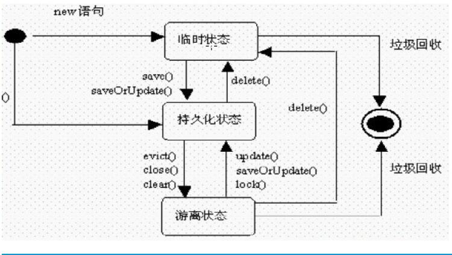

## Hibernate 和 JPA 以及 Spring data 

- JPA的是 Java Persistence API 的简写，是Sun官方提出的一种ORM规范
- Hibernate 是 JPA 的一种实现
- Spring data 对 Hibernate 进行了一些包装，提供了一些便利的接口和方法，本质还是使用 JPA 实现。Hibernate 为其默认实现。

Hibernate  适用于富域模型的程序，如果模型比较简单 Hibernate 无法发挥其最大的优势。

使用实体时候，需要注意关注点分离，确保业务方便的关注点之外，其他关注点不要渗入模型中来。例如视图相关，不应直接使用领域对象到视图层。

## Hibernate 的三种状态

- 瞬时状态 (Transient) ,不和 Session 实例关联，例如 new 出来的一个实体
- 持久状态 (Persistent),持久化对象就是已经被保存进数据库的实体对象，并且这个实体对象现在还处于Hibernate的缓存管理之中。 例如从数据库中查询出来的实体。
- 脱管状态 (Detached)，在数据库中存在一条对应的记录，但是当前没有与 session 关联

三种状态对应操作的转换图:

## 使用 Hibernate 的一些注意事项

- 实体最好实现 Serializable 接口
- Hibernate 会使用 getter 方法进行对比，因此 getter 方法不应该对数据进行修改和转换，否则 Hibernate 会进行一次额外的 SQL 执行
- 在绘制 UML 图的时候，可以加入原型类图（标注是实体还是值对象）
- 如果有可能不要公开 ID 的set方法（使用了lombok 就没办法了）
- 推荐使用 long 作为 ID，足够支撑系统运行时间，映射到数据库中为 bigint
- 如果不想每次都给特定字段编写 @Column 可以定义一个 PhysicalNammingStrategy

## Hibernate 对 Java 和 MySQL 的映射关系

