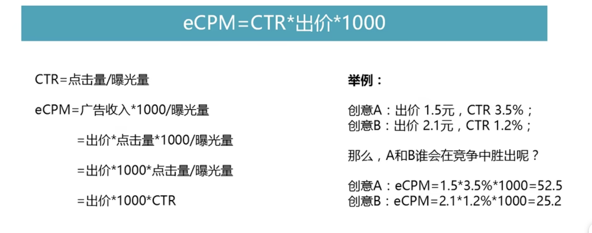
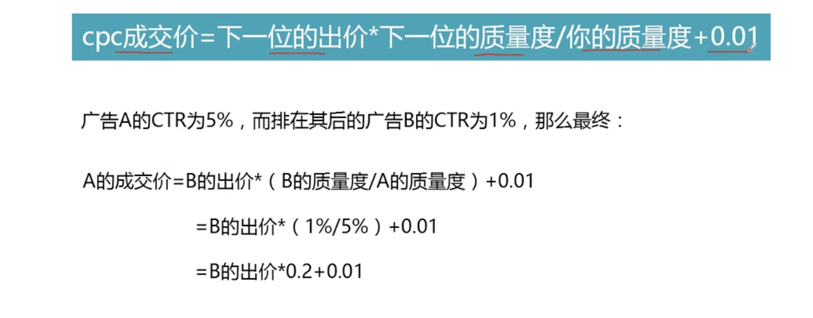

## 广告类型

- 效果广告：按照转化计费，例如根据点击转化
- 品牌广告：关注曝光时间

## 计费模式

- CPC: 点击
- CPM: 展现
- CPA：行为，转进
- CPS：销售，销售转化
- CPT：时长
- CPD：按天
- CPR：反馈，填写了问卷
- CPL：潜在，推荐了潜在的客户
- OCPC：优化点击
- OCPX：优化各类转化

## 竞价机制

eCPM: 预估曝光几率

CTR: 点击量/曝光量
eCPM  = CTR*出价*1000

也就是说，出价高，或者创意好更多人点击，那么就更容易竞争，平台更容易投放给 CRT 高或者价格高的广告。

eCMP： 是广告平台千次曝光收入
CMP: 是广告主千次曝光的投入

## OCPX 

根据传回的转化信息，程序自动出价，如果转化效果好，说明人群精准匹配。好处是接近转化，坏处是拉新客户较少，这两个是相互矛盾的。

OCPX 可以根据成交价格增加一个百分比。如果过高的出价，系统会匹配更多的人群和广告位，用更高的成本获取更大范围的曝光；如果过低的出价，系统会匹配更差的广告位，导致转化率下降。

所以 OCPX 优化的关键在于回传转化率信息，并给出一个相对合理的出价，让 ROI 更高。

这就是 OCPX 的投放逻辑。这也是为什么 OCPX 需要回传数据，而 CPC 不需要。
