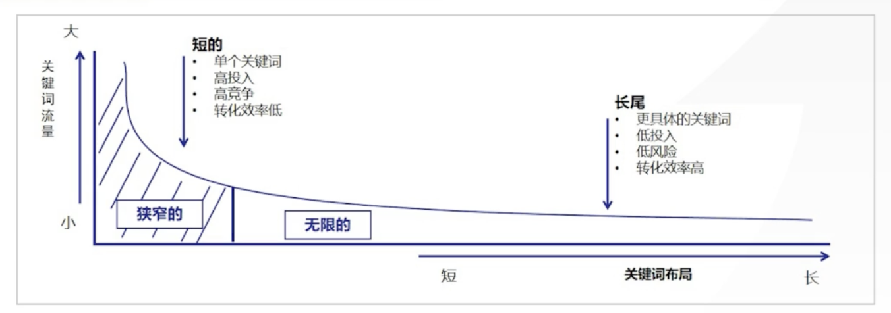

课程地址:

https://study.sanjieke.cn/course/0/34003244/34971569

## 小红书流量分发机制

- 阶梯式推荐：笔记发布后获得一个初始曝光量，然后根据后续的交互（点赞、收藏、评论、转发、关注、完播）打一个内部分数，然后推荐给更多的用户，进入下一个流量池
- 评分体系：点赞*1+收藏*1+评论*4+转发*4+关注*8
- 匹配分发
    - 内容标签匹
    - 用户主动搜索
    - 粉丝关注流量

## 小红书笔记收录

- 影响因素
    - 标题、正文、关键词、封面首图
    - 标签要精确、不要经常修改，使用账号相关的固定标签体系
    - 图片和文案不要出现违规或者直接广告推销的形式
    - 账号是否有违规
- 查询方法
    - 在首页搜索关键词或者笔记标题，如果搜索结果能看到笔记说明被收录
    - 首页输入账号 ID，首页上会显示所有收录的笔记，没有就没有被收录
- 掉收录的场景
    - 违规，比如赚钱这种词就不能出现
    - 被举报了
    - 被取消了再次发布就行

## 小红书关键词布局

- 高价值关键词三大特征
    - 相关性：自己搜一下，和自己的目标是否一致
    - 搜索量：搜索结果越多，说明越热，流量多但是竞争也大；对于启动过程中尽量做有一定搜索量，但是不太多的程度（和百度搜索指数差不多）
    - 商业价值：
        - 关键词是否具有口碑
        - 关键词有没有上热门
        - 关键词是否包含产品
        - 关键词是否有后续提升空间
- 关键词的洞察是对行业的洞察
- 关键词挖掘
    - 站内：
        - 搜索发现中有平台推荐的热点话题
        - 猜你想搜
        - 搜索下拉框的关联搜索
    - 站外
        - 电商平台拓词
        - 百度指数拓词
        - 搜索引擎：搜索下拉框、大家还在搜
    - 工具挖掘
        - 5118 平台
        - 小红书聚光工具，关键词规划工具，需要投放流量后
- 什么是长尾关键词：长尾关键词（Long-Tail Keywords）是指那些搜索量较低、但更具体、更具转化率的关键词，通常由三个或更多单词组成。
- 有可能是别人刷的词，比如比较拗口
- 关键词筛选方法及分类
    - MECE 原则：把关键词进行拆解组合，根据不同的维度拆解，然后一一组合
- 常见关键词的类型
    - 品牌关键词
    - 竞品关键词：拦截流量
    - 热搜词：用户主动搜索频率高的词，其实就是蹭流量
    - 需求关键词：根据现实需求制定的，比如通勤包包
    - 场景/长尾关键词：核心关键词组合出来的关键词，比如礼物拓展为圣诞节男友礼物
- 用户层级和搜索行为
    - 高潜力的消费者：功效/痛点/场景词
    - 查询勒消费者： 品牌词
    - 对比型消费者：竞品词
    - 核心人群：品牌词，用户已经知道你的品牌

## 小红书获客精准度

- 小红书搜索占位6要素
    - 封面高清吸引人
    - 标题击中需求
    - 内容真实体验
    - 配图风格统一
    - 互动营造氛围获得打分
    - 助推广告投放流量
- 小红书笔记规范
    - 内容软性不被觉察为商业合作笔记，内容有种草力
    - 图片真实
    - 风格：语言生活化不官方
    - 标题吸引人足够打动人心
    - 排版：排版干净，文案简洁
    - 内容有吸引点，有个人风格，以感受性的内容为主
- 关键词围绕整个笔记
    - 标题要有关键词，核心关键词放到前面，次要关键词放到后面
    - 正文用第一人称表达，亲切自然，也要包含关键词
    - 文章正文围绕关键词展开
    - 文章结尾要包含关键词

## 如何做出好的内容

- 找对标账号
- 拆解低粉爆款内容
- 通过后异采集器采集爆款内容获得网感
- 不要原创，先创建大量内容，大力出奇迹

## 怎么融合关键词和内容

- 笔记融合关键词
    - 标题：抓人眼球
        - 悬疑式
            - 无心之过 + 后果
            - 负面行为 + 结果
            - 真实情况 + 疑惑
        - 结果式
            - 问题 + 方案：例如陪孩子写作业，7步法
        - 情绪式
            - 人群 + 结果 + 数字：宝妈后悔总结，月子中忽略的7件事
            - 人群 + 情绪 + 建议： 气炸了，新装修业主害怕遇到的装修陷阱
            - 人群 + 情绪 + 技巧：终于搞定了，这样选择跑步鞋才能不伤脚
            - 人群 + 事件 + 建议：30天搜身计划，健身小白也能做到
        - 热点式
            - 傍大款蹭热点：蹭明星
            - 热门活动 + 参与感想
            - 热门节日 + 特殊事件
            - 热点事件 + 专业视角：长津湖热播，背后的历史知多少
    - 内容库
        - 无 SEO 感，满足用户内容的需求、考虑情绪价值，避免堆砌关键词
        - 内容定位：解决了用户什么痛点和问题？
        - 精准内容：围绕账号风格和关键词
        - 内容子弹：和用户转化有关联
        - 内容排版：字数不能多于 1000 字，标题适当添加标签包，内容要有主次
    - 封面
        - 拼图封面：生活化
        - 标题封面：从封面上就能获得信息
        - 对比封面：前后对比封面
        - 文字封面：文字风格图片，PPT 高桥柳的风格，备忘录的风格
    - 标签
        - 和上面一致

## AI 高校创作小红书内容

- ChatGPT 挖掘搜索关键词
    - 参考提示词：你是一名小红书 SEO 专家，帮忙挖掘xx 关键词相关的关键词，要求这些关键词是最近30天，网上搜索量排名前20
- 可以根据自己的内容整理成小红书风格和标题

## 内容创作的 SOP

- 先判断自己想做的关键词
- 根据自己的关键词搜索，采集其它平台的内容，比如知乎
- 使用 AI 洗稿成小红书的风格

## 自然搜索排名实战拆解框架

- 

## 其它技巧

- 其实广告平台对优质广告的评分和推荐系统对内容打分是一回事，根据曝光和点击比率计算