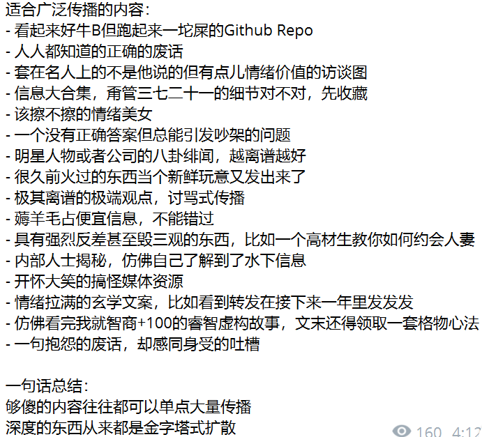

## 经验

- 自己发的内容，是让别人看到你值得关注；别人评论下，是为了引起别人注意
- 不要有知识诅咒，不要觉得自己知道，别人就知道
- 流量和你知识的深度毫无关系，和人们感兴趣、热点有关系，流量的本质是看热闹，不是来搞学术
- 在大 V 下面评论，让人有机会看到你；构建有吸引力的首页，是为了让人关注你
- 不要怕重复，发过的也能发
- 不要怕搬运，有条件搬运说明这个话题已经有热度了
- 重复搬运名人名言，可以利用权威背书。没出名之前，不要搞深度创作，没人在乎。
- 向下找到受众，否则都是你同认知、或者认知比你高的人。关注向下的人，和平级和上级互动，但他们不是你的客户。你挣不到比你认知高的人的钱
- “搞学术”是绝对没有流量的，越是你觉得创新，前无古人的东西，越说明受众不懂；“搞热闹”才有流量，整活儿，制造冲突激发交流欲望、讲故事共情。
- 自媒体真的是把人性利用到了极致，这玩意儿看书根本不会。就和投资一样，完全是反认知的。比如几乎没有书让你去追热点、蹭流量、标题党、骗点击，但就 TM 有用，而且越无耻越有用。
- 脱下长衫，不要清高，搞流量无关道德，有效的方法就用上。
- 一定要脸皮厚，不要怕被骂，被人嘲笑，如果从数据上看方法有效，他人的声音并不重要。
- 自媒体已经要找到稳定、持续增长（即使开始很慢）的方法，如果靠天吃饭，不稳定的流量会造成很大的心理落差。
- 文案编写：一定要通俗的关键词 + 故事性 + 生活场景（和受众相关），用客户的语言和关键词就能匹配客户的需求，而用解决方案的关键词就只能匹配到同行。比如你是一个建筑包工头，讲建筑结构设计，这些关键词不会推给目标客户；反而是那种什么“2层农村小院”这样修，这样的关键词才会匹配到客户。
- 要抓住流量红利期，提前占据搜索的关键词，把搜索流量吃掉，动作要快。要有网感，什么下一步会火，那么提前占据关键词。
- 不要清高，看到别人做了的内容自己就不做了，不好意思吃点边角流量；不要看不起任何人，即使别人的内容可能没自己好，没自己有深度，只要有效果，就可以拆解学习。
- 什么东西夺人眼球，什么就容易被传播
- 自媒体的第一性原理就是媒体，所以到处采集是更好的策略
- 粉丝低于 1W 几乎不要考虑变现，没什么意义
- 要多出现在别人的视野里，外加你内容写得好
- 可以利用关注后发送文件的方法，吸粉
- 一定要和热点构建关键词连接，至少从词向量的角度来说是这样。如果是一个完全原创的内容，没有粉丝基础取得赞藏量的情况下，算法会认为你这条信息是孤岛信息，不会推荐。
- 不要担心黑粉，黑粉和真爱粉吵起来，才会有热点关注
- 点燃用户的情绪，用户喜欢听自己想听的话
- 另外就是加引号也会提高流量，因为小号自己写的很卑微没人信，加了引号别人以为是名人名言。
- 被大 V 关注和推荐可以带来非常多的流量，和大 V 互动夸他们，多和他们留言，让他们帮转发。
- 发一些资料，关注后领取，作为钩子
- 很多大 V 的刷推强度真的大，几乎很多人粉丝量约等于发推量，也就是一个 post 换一个粉丝
- 在冷启动阶段几乎没人回来看你的帖子，可以把自己的一些作品免费发出去，然后让大 V 帮转发一下
- 找合适的地方评论 + 引用转发，这样评论有流量，引用转发也会有一些流量，但不要发重复主题的内容，会因为新鲜度降低权重
- 保持活跃比学术精品重要
- 激发用户共情，使用问号，激发受众回应，可以获得流量
- 分析别人的帖子，然后看别人发的风格，进行主题、内容模仿
- 要有故事性，人们喜欢听故事，而不是道理
- 要有场景，合理化，不要让人看出来是广告
- 制造稀缺，免费的东西反而没人要，一定要加条件
- 讲你的成功事迹，记住，网络上的人非常功利，不要搞情怀
- 发新的帖子会影响已有热度的帖子流量,但是在回复中互动又会加热
- 有个美女做饭视频非常成功，原因是击中了男性心中原始欲望
- 共鸣非常重要，在推的时候需要带有情绪，情绪会激发互动的欲望，人们会认为这是一个真人
- AI 整理图书精华摘要也是一个获得流量非常好的方式
- 人们感知世界一定是通过上下文来构建合理性的，你在自己分享一个东西是无上下文的，但是通过评论大 V 的帖子，就能有上下文，产生故事感
- 争议性的话题非常有流量，比如新手学编程什么语言最合适
- X 有一个漏洞，如果我 quote 别人的帖子，然后给别人帖子带来流量，然后又在对方留言区贴上我的帖子，那么我的帖子也会被推荐，从而增加我的流量。
- 越土越俗的东西才有流量，人的底层是生存和繁衍，这两个越近越有流量
- 一定要去有热闹的地方，可以去别的平台搬运又热闹的东西
- 通过问题调动人的互动，例如：“30岁以上的男人，请给20多岁的男人一些建议，主题可以是任何方面”

## 流量话题

- 自学编程
- AI
- 提示词
- 改命
- 英语
- 35岁
- 中年男女
- 失业、欠债、创业失败
- 彩礼、结婚、离婚
- 生娃 VS 丁克
- 恋爱 VS 单身
- 996
- 独立开发者
- MACOS VS WINDOWS VS LINUX
- 苹果笔记本 VS PC
- iPhone VS Android
- 大厂 VS 小厂
- 赚钱
- 擦边
- 一线城市 VS 二线城市
- 奋斗 VS 躺平

## 常用文案模式

### 故事类

爆火原理：击中读者情绪，引发共鸣，增加互动。

文案特点：吸引点+冲突+反转+价值观。文案关键词包括：分享、经验、知识、技能、技巧、工具、资源、项目、案例、成功故事、失败案例、失败经验、失败教训、失败总结、失败反思、失败避免、失败克服、失败总结、失败反思、失败避免、失败克服。

### 干货总结类

爆火原理：触发读者的收集欲望，害怕丢失错过。

文案特点：把一本书或者一个领域的知识，用子弹列表总结成列表，触发用户收藏、转发和点赞。

### 擦边类

爆火原理：利用读者的原始欲望，通过性或者猎奇的击中读者的欲望，或者配性感美女图。

文案特点：欲望描写，性、权力、搞钱、撩妹、涨粉。

