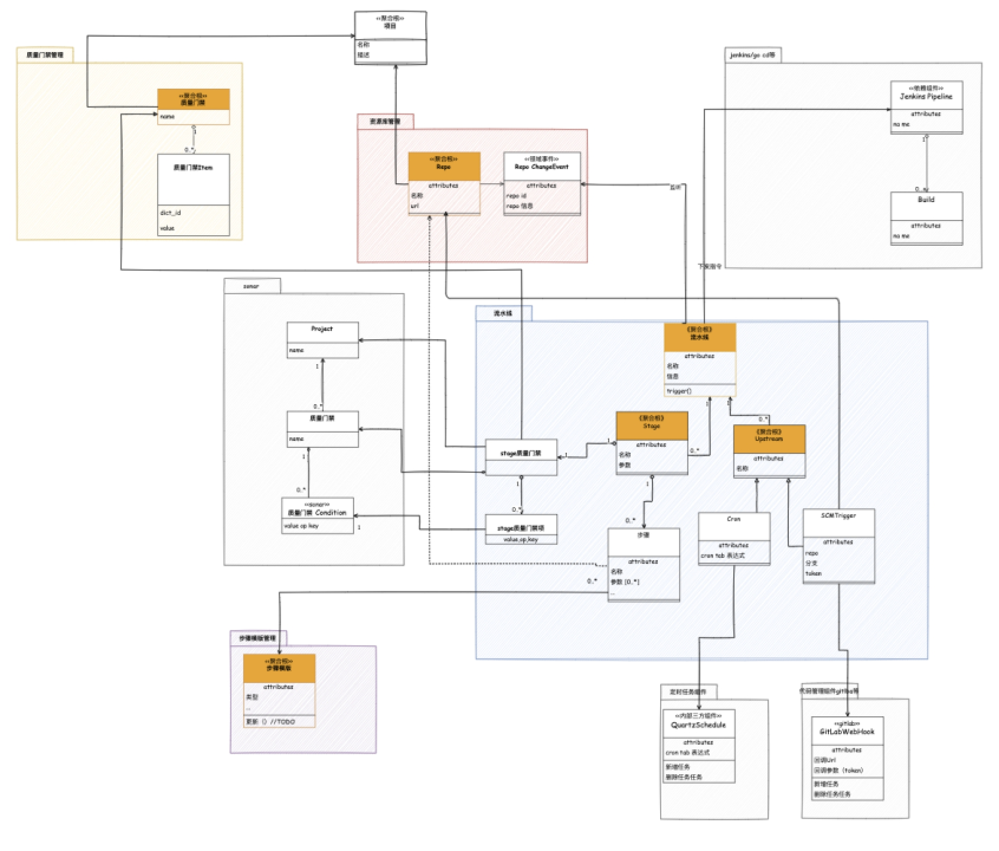

*“DDD的战术建模没啥用，也就战略建模划分下微服务……”*

*“DDD的的战略建模没啥逻辑性，咋说都有理，难点都在落地上，不如我们搭建一个工具，让大家可以低成本写出符合DDD的代码……”*

DDD是个很有意思的话题，很多人听说过DDD，甚至跟人讲过DDD，但是很少有人以Team Leader的身份实践过DDD，甚至让人怀疑：DDD这个概念是不是只在理论上，没有人真正实践过。作为一个Team Leader ，如何让自己落地的DDD 不是 Deadline Driven Developer 而是Domain Driven Design 呢？

## 还用得着 DDD？

作为Team Leader，为软件开发成功负责的人，想要实践DDD，首先要问的问题是：“我们的团队需要DDD么？”如果答案是需要，那么进一步的问题是：“为什么需要？”如果答案是“我要用DDD显得我们技术卓越”，那请关闭这篇文章，去搜搜Devops、AI、BIZDevops、大数据、中台之类的更新潮的热词，可能对你更有用。我的故事，是在微服务化的大潮中，参与到一个将传统单体应用改造成微服务的项目中。

### 声称在做 DDD

我曾经在一家小型互联网创业企业工作，为了多快好省使用了单体架构。随着业务量的增加以及对业务创新的适配，慢慢地这套架构显得力不从心了。首先业务量的增长对弹性扩容能力提出了要求，并且开发人员的增多到需求光扯应该谁负责就半天。

刚好微服务开始流行，当时的大家觉得微服务可能是解药（银弹），于是开始着手微服务改造，但遇到的问题是如何切分服务呢？于是了解到微服务划分的“最佳实践”——DDD。那个时候的认知是DDD战略部分可以指导微服务划分，战术部分看上去落地太难了所以放弃。所谓的微服务实践只是拍脑袋了一堆限界上下文和所谓的依赖关系。

现在回过头来看，当时只是声称自己在用DDD做开发，事实上没有任何效果。我那时候可以给自己拍脑袋划出来的服务边界冠以任何方法论，当然也包括DDD、微服务，甚至可以是“轩辕反熵运行体系3.0”，这可能就是所谓的“名字魔法”吧。不可否认DDD是微服务划分的重要方法论，但是期待把DDD裁剪到只有相对务虚的限界上下文划分，多少有点不接地气，做个样子骗骗老板可以，别入戏太深，把自己也骗了。

### 对 DDD的再认识

留下一地鸡毛的分布式单体后，我从那家企业离职了。在面试Thoughtworks的时候，在技术面阶段，我只提了自己做过微服务、试过TDD。DDD这个词提都不敢提，显然我不是一个合格的骗子，我只是骗骗老板而已，没成功把自己骗了，我知道自己不是真的懂DDD。

后面再接触DDD已经是一年半年以后了。那时我在某项目做资深开发，了解相关的业务知识，而且随着从业的时间的增加积累了一些实践的经验，所以自己可以写出自认为比较好的技术实现。

本着“码而优则管”的原则，我被作为Tech Lead 或者Team Leader来培养。大量的时间被事务性工作占用导致没法去亲力亲为地完成所有代码开发。需要负责的范围大了，而实际亲手操刀的东西少了，这是很多新手技术管理会遇到的问题吧。

这些业务交给其他团队成员后，有时候会出现比较大的偏差，比如实现的功能不够全面，比如虽然功能是完好的但技术方案不够好，再比如没有通盘考虑近期的其他相关功能，再比如实现出来的软件跟业务方描述的不太一样。毕竟不能给团队配一堆资深开发，成本也遭不住啊。

处在菜鸟期的我，使用传统的流程图试图将自己的想法表达出来，在一些细节的设计上的确很有效，但是非常有限，流程的局限性也很明显：

• 缺乏细节：流程图主要关注步骤和流程的顺序和关系，而对于复杂的系统设计来说，可能无法提供足够的细节。它可能无法捕捉到系统中的细微差异、决策点和特殊情况。

• 限制了非线性流程：流程图通常以线性的方式展示步骤的流动，但在现实世界中，许多系统设计包含非线性的流程，例如并行处理、条件分支、循环等。在流程图中表示这些非线性流程可能会变得复杂和混乱。

• 不适用于大规模系统：对于庞大而复杂的系统设计，流程图可能会变得非常庞大和难以理解。当系统涉及多个模块、子系统和相互关联的流程时，流程图的可读性和可维护性可能受到限制。

总的来说，流程图适合做技术细节的展示，系统的复杂度让流程图失效了。业务解决方案一般都是聚焦用户某个场景的业务解决方案，是流程性的。甚至有的时候业务能给出流程图。当业务复杂时，比如传统行业的数字化转型项目，本身传统行业自身这么多年的业务知识积累在那里，不同业务场景往往是交织在一起的。一个个流程图像一只名为复杂度的蜘蛛编织成的巨网，复杂度爆炸了。

幸运的是我在Thoughtworks ，这里有活跃的社区，恰巧我还在为那次失败的自我欺骗耿耿于怀，于是我参加了不少Thoughtworks的DDD社区的不少活动，这时候我发现，DDD的确是我那时候问题的解决方案。

认识一个蜘蛛网不是按照一条线缕下去，应该从不同的线交织的节点开始，就像古代先人用星座认识繁星一般。而这一个个的星星，就是业务口中的一个个名词。筛选出用于定位的北斗七星，就是领域模型，而其他暗点的星星可能就是领域模型的属性。

## 所以，开始建模吧

所以，我认为真正的DDD之路是什么时候开始的呢？可能是第一次作为技术教练带“事件风暴”工作坊？或者说更早地作为学员参加了一次“事件风暴”工作坊？或者开始按DDD的方式编写代码？我认为，都不是，实际的时间要晚得多。

如果非要给我的DDD之路定义一个开端，应该是尝试去用领域模型的方式去描述当前开发系统开始。我通过观摩社区里大家分享的建模过程，尤其是钟敬老师分享的保险场景的建模过程。于是，为了解决我的问题我开始尝试用模型来描述我们的业务。

开始，我的模型只能帮我消化业务，通过建模的过程，有效地把业务从流程抽象成了领域，对模块的切分有了深刻的认知。不过当我向我项目上的同事展示的时候遇到了很多问题。

## 学习建模之后

Martin Fowler 以及一些其他大佬在给出如何使用领域模型的时候，他们说不推荐标准的UML，只要能表达意思即可，我觉得他们可能是在这方面犯了知识诅咒。当我把我的模型分享给其他人的时候，就察觉到不对劲了，服务内的和服务间的都是实心箭头，咋实线？空心菱形是不是传统意义上的聚合，聚合的代码咋写？大概大佬们的意思是不需要严格地遵守那些标准，不必须画得那么全，但不能是错的。

### 提升建模的规范性

所以我意识到要提升建模的规范性了，在前辈的指点下，我了解到《领域驱动设计：复杂软件的应对之道》是提升建模手法的重要参考资料。当时我是不信的，因为这本书我也详细地翻过很多遍，虽然都没看懂。后面才知道，这本书可能就要从《附录》开始读，这本书是本典型的模式类书籍，遵循“模式名称-背景-问题-解决方案-示例”的典型结构，只不过Eric Evens没有按照严格的《面向模式的软件架构》所定义的模式的标准格式来编写，他更追求可读性，不过他追求可读性的后果就是新手读的时候很难抓住要点。

*模式名称应该作为团队语言中的术语来使用，我在本书中就是这样使用它们的。当在讨论中出现模式名时，一律采用了英文小体大写格式，以便于区分。*

*以下是本书讨论模式时所采用的格式。有的模式与这个基本格式略有不同，因为我喜欢具体问题具体对待，而且我认为可读性比严格的结构更为重要……*

*— 《领域驱动设计：软件核心复杂度的应对之道》附录 2*

带着如何更好地表达自己设计想法的思路去看“聚合”、“服务”、“值对象”的时候，显然会有些不一样的感受，之前读的时候的想法是“原来这叫聚合啊”，现在的想法是“原来聚合是干这个用的啊”。结合书中的案例，模型越画越像模像样了。

### 尝试打通代码与模型

随着建模能力的提升，逐渐做到对着模型可以把自己的解决方案构想描述清楚了，但这个时候，代码成为拦路虎了，传统的代码很难内聚业务，哪怕是模型画清楚了，代码中业务也是散落在各处的。恰巧有个崭新的项目，我决定尝试代码上的落地。于是开始参考市面上常见的四层架构开始构建新项目的代码。这里我遵循了“守破离”的原则。先“守”，按照“业界先进经验”组织自己的代码。也许你们也会和我一样遇到市面上常见的纠结，Domain Service 和Application Service的分界、到底哪些东西要放到基础设施层等等。严格按照这种分界去执行，运作上个把月，再进行回顾。避免直接下结论：“虽然我不懂，但是我觉得这样不对”。再就是“破”，带着业务与技术打通和DDD各种模式的Why What How去看，这种模式是否帮到最终的目的，如果没有，就把这种手段阉割掉。最后是“离”，最后综合一下，找到一套适合当前业务复杂度的合适代码模式，比如不要那些O（VO 、PO之类的）。

### 用DDD指导微服务设计

新项目的MVP做完了之后，我们开始对整个项目进行规划。这个时候会聊到服务划分的事情，我对这个事情比较慎重。因为之前吃过亏，那是之前的一个项目，一个订单的提交能力被放在了两个服务里，先提交A再提交B，或者先提交B，再同步给A，两个订单又各自演化了不同的职责。后面是在架构师的指导下，进行服务职责调整才解决的，架构的问题只能由架构解决。

DDD仍然是微服务划分的重要方法论，没有之一。我本来还想找大佬们帮忙划分一下，不过当看到那堆已经画好的模型图以后，好像这个已经不太是问题了，模型的疏密程度、实体间的依赖关系很直白地告诉你把哪些东西划到两个上下文下会成本很高。

显然微服务的划分不仅仅是个逻辑问题，还要考虑组织结构、还要考虑资源的分配，但DDD的模型图会自然告诉你哪些东西拆开了以后，你就要处理分布式事务了。

在我看来DDD对微服务划分的指导意义在于，通过领域建模对解决方案的各种细节有细致地把握，从而是在一个信息尽量完备的情况下进行决策，而不是像玄学一样琢磨着订单和库存相性不合，必须拆分。

## 总结

每一个人在学习 DDD时所经历的过程以及对 DDD的理解都是不一样的。对我来说， DDD就是一套建立模型的工具，这个过程就是围绕着这个模型来进行的。DDD的想法也集中在如何为开发和商业提供更好的模型上。对于一款软件的“DDD”与否，并没有太大的意义，但是它能够更好地为企业服务，并且能够更容易地进行修改与维护，这就是 DDD对我的作用。
