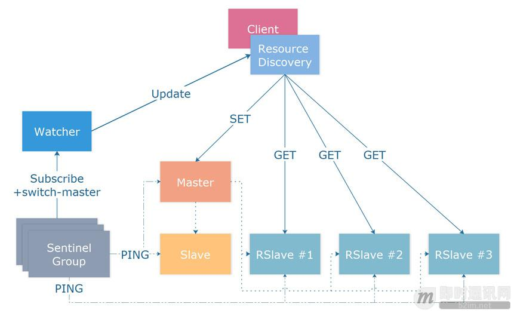
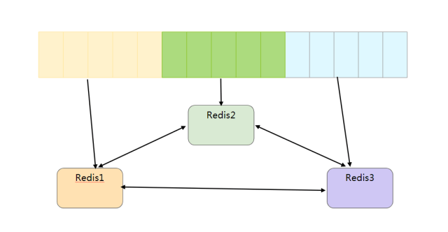
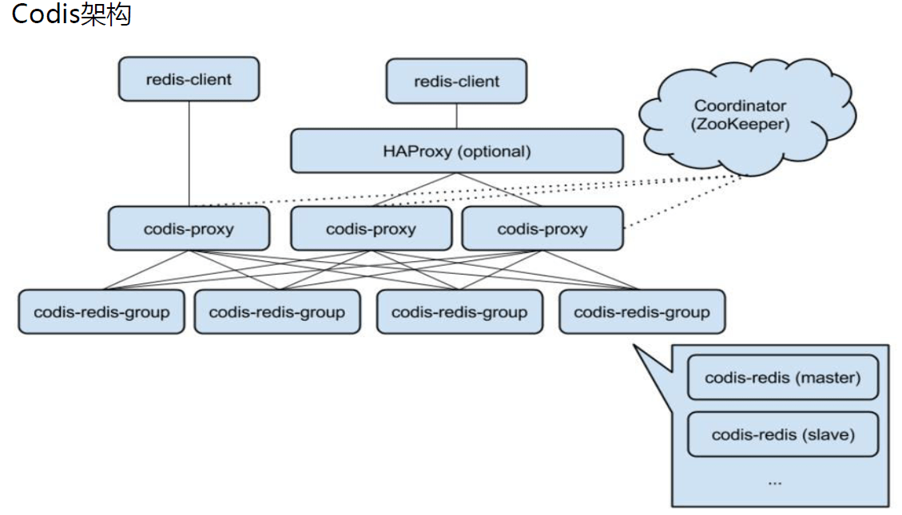
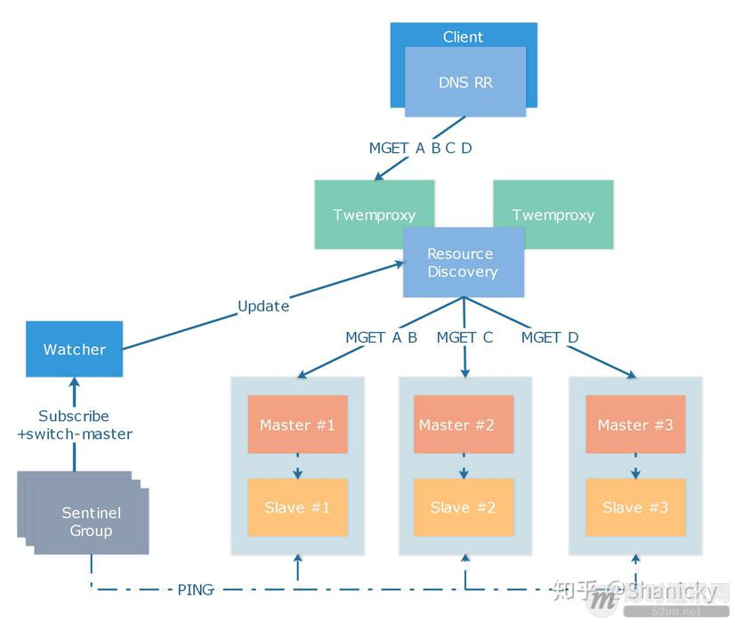

## Redis 集群原理

redis 扩容三个阶段：

-  单机: redis支撑万级
- 一主多从： 一主多从，开启读写分离，例如1主2从3哨兵模式 一般能到10万级，其实本质上还是属于单实例
- 多主集群：多主多从，客户端分片 可以达到千万级别

### 一主多从模式

使用 Redis 自带的哨兵（Sentinel）集群对实例进行状态监控与 Failover。Sentinel 是 Redis 自带的高可用组件，将 Redis 注册到由多个 Sentinel 组成的 Sentinel 集群后，Sentinel 会对 Redis 实例进行健康检查，当 Redis 发生故障后，Sentinel 会通过 Gossip 协议进行故障检测，确认宕机后会通过一个简化的 Raft 协议来提升 Slave 成为新的 Master。




仅使用 1 个 Slave 节点进行冷备，如果有读写分离请求，可以建立多个 Read only slave 来进行读写分离。

如上图所示，通过向 Sentinel 集群注册 Master 节点实现实例的高可用，当提交 Master 实例的连接信息后，Sentinel 会主动探测所有的 Slave 实例并建立连接，定期检查健康状态。客户端通过多种资源发现策略如简单的 DNS 发现 Master 节点，将来有计划迁移到如 Consul 或 etcd 等资源发现组件 。


注意事项：

- 只读 Slave 节点可以按照需求设置 slave-priority 参数为 0，防止故障切换时选择了只读节点而不是热备 Slave 节点；
- Sentinel 进行故障切换后会执行 CONFIG REWRITE 命令将 SLAVEOF 配置落地，如果 Redis 配置中禁用了 CONFIG 命令，切换时会发生错误，可以通过修改 Sentinel 代码来替换 CONFIG 命令；
- Sentinel Group 监控的节点不宜过多，实测超过 500 个切换过程偶尔会进入 TILT 模式，导致 Sentinel 工作不正常，推荐部署多个 Sentinel 集群并保证每个集群监控的实例数量小于 300 个；
- Master 节点应与 Slave 节点跨机器部署，有能力的使用方可以跨机架部署，不推荐跨机房部署 Redis 主从实例；
- Sentinel 切换功能主要依赖 down-after-milliseconds 和 failover-timeout 两个参数，down-after-milliseconds 决定了 Sentinel 判断 Redis 节点宕机的超时，使用 30000 作为阈值。而 failover-timeout 则决定了两次切换之间的最短等待时间，如果对于切换成功率要求较高，可以适当缩短 failover-timeout 到秒级保证切换成功，具体详见 Redis 官方文档；
- 单机网络故障等同于机器宕机，但如果机房全网发生大规模故障会造成主从多次切换，此时资源发现服务可能更新不够及时，需要人工介入。


### 多主集群模式

redis 目前主流有三个集群方案可以选择：

- redis cluster  官方的集群方案
- Twemproxy 推特、知乎在用
- codis 豌豆荚团队开发


#### redis cluster 官方集群

一组Redis Cluster是由多个Redis实例组成，官方推荐我们使用6实例，其中3个为主节点，3个为从结点。

一旦有主节点发生故障的时候，Redis Cluster可以选举出对应的从结点成为新的主节点，继续对外服务，从而保证服务的高可用性。那么对于客户端来说，知道知道对应的key是要路由到哪一个节点呢？原来，Redis Cluster 把所有的数据划分为16384个不同的槽位，可以根据机器的性能把不同的槽位分配给不同的Redis实例，对于Redis实例来说，他们只会存储部门的Redis数据，当然，槽的数据是可以迁移的，不同的实例之间，可以通过一定的协议，进行数据迁移。




客户端是如何访问Redis Cluster里面的数据呢？首先客户端需要保存一份Redis Cluster槽相关的信息，也就是路由表，然后对即将访问的key进行哈希计算，计算出对应的槽位，然后向对应的Redis实例发起查询请求。如果访问的Redis实例中，的确保存着对应槽的数据信息，就会进行返回，否则向客户端返回一个Moved指令，让客户端到正确的地址进行获取。

##### 槽位算法

槽位的信息是通过 CRC16 实现的，如果给 key 增加 tag 还可以强制 key 所挂的操作等于 tag 所在的槽位。


```shell 
> CLUSTER KEYSLOT somekey
11058
> CLUSTER KEYSLOT foo{hash_tag}
(integer) 2515
> CLUSTER KEYSLOT bar{hash_tag}
(integer) 2515
```

参考文档：https://redis.io/commands/cluster-keyslot

##### 跳转

当客户端向一个错误的节点发出指令后，该节点就会发现该指令的 key 所在的槽位并不归自己管理，这时服务器会发送一个特殊的跳转指令，告诉客户端去连接新的节点获取数据。

```shell
GET X
-MOVED 3333 127.0.0.1:6381
```

##### 迁移

如果需要对集群中的 keys 迁移到另外一个服务器，可以使用 redis-trib 工具，该工具是由 ruby 编写，可以方便的完成迁移工作。


##### 容错

Redis 集群可以为每个主节点设置多个从节点，当主节点发生故障，集群可以将其中一个节点提升为主节点。

##### 网络抖动设置

现实的网络会发生抖动，也就是偶尔不可达，但随后能通信，因此需要一个阈值决定是否真的发生了宕机。

这个值可以设置:

> Cluster-slave-validity-factor

如果这个值为 0  集群不会抗拒网络抖动，会发生主从切换，如果这个值大于0，集群会通过重试确认主从。


#### codis

Codis是一个分布式Redis解决方案,对于上层的应用来说,连接到Codis Proxy和连接原生的RedisServer没有明显的区别,有部分命令不支持。Codis底层会处理请求的转发,不停机的数据迁移等工作,所有后边的一切事情,对于前面的客户端来说是透明的,可以简单的认为后边连接的是一个内存无限大的Redis服务.




codis 组成部分：

- Codis-proxy: 实现redis协议,由于本身是无状态的,因此可以部署很多个节点
- Codis-config :是codis的管理工具,包括添加/删除redis节点添加删除proxy节点,发起数据迁移等操作,自带httpserver,支持管理后台方式管理配置
- Codis-server :是codis维护的redis分支,基于2.8.21分支,加入了slot的支持和原子的数据迁移指令; codis-proxy和codis-config只能和这个版本的redis交互才能正常运行
- Coordination：支持 Zookeeper 或者 etcd

使用 codis 的优势：

- 对客户端透明,与codis交互方式和redis本身交互一样
- 支持在线数据迁移,迁移过程对客户端透明有简单的管理和监控界面
- 支持高可用,无论是redis数据存储还是代理节点
- 自动进行数据的均衡分配
- 最大支持1024个redis实例,存储容量海量
- 高性能

使用了 codis 带来的限制：

- 最大支持1024个redis实例 （redis cluster支持的槽位更多）
- 采用自有的redis分支,不能与原版的redis保持同步
- 某些命令不支持,比如事务命令、muti
-  redis 实例和单机相比下降 20% 
- 国内开源产品,活跃度相对弱一些

#### 数据指标

官方数据表示Redis读的速度是110000次/s,写的速度是81000次/s 。


### 大厂案例

#### 知乎 redis 优化情况

目前，Redis 在知乎的应用规模如下：

1）机器内存总量约 70TB，实际使用内存约 40TB；

2）平均每秒处理约 1500 万次请求，峰值每秒约 2000 万次请求；

3）每天处理约 1 万亿余次请求；

4）单集群每秒处理最高每秒约 400 万次请求；

5）集群实例与单机实例总共约 800 个；

6）实际运行约 16000 个 Redis 实例；

7）Redis 使用官方 3.0.7 版本，少部分实例采用 4.0.11 版本。

采用的是 Twemproxy 集群方案。



### redis 常用工具


#### redis 测试性能测试

用于性能测试

> ./redis-benchmark -h 127.0.0.1 -p 6379 -d 1000 -c 100 -n 100000


#### redis monitor

用于redis 运行情况的监控

> redis 127.0.0.1:6379> MONITOR 

## 参考资料

- https://www.cnblogs.com/imstudy/p/9668257.html


