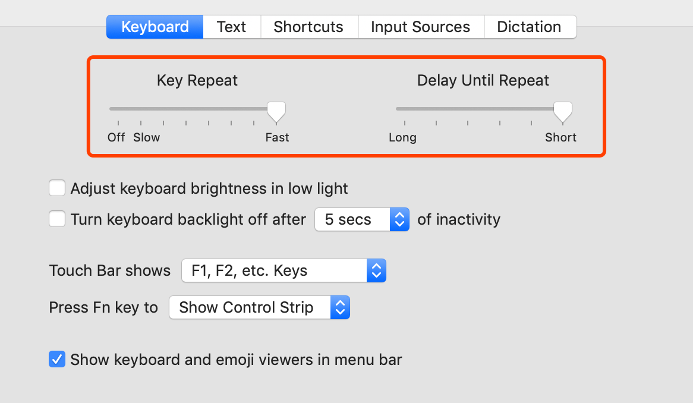

## 调整 Mac 键盘响应速度

通过调整这几个设置，让删除、移动的速度大大提高，编程手速快速提升。

## 自动补全左侧代码

例如 userRepository.save() 补全返回的结果

使用 alt + 两次 enter 即可实现自动补全。

## 清除控制台

command + K

## 可以提高效率的 IntelliJ 的快捷键

显示最近的文件

command E

选中当前文本
command W

返回代码上一处
Command+ Alt + 左右键

查看类图

option+command+U
