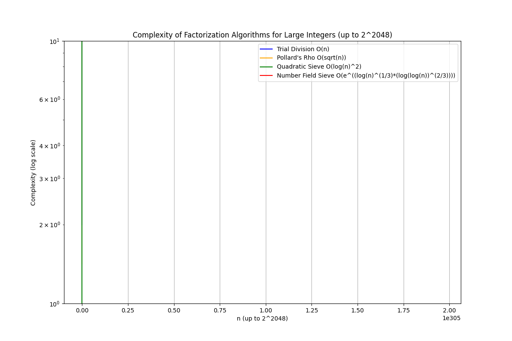

如何通俗理解 RSA 的数学意义。

## 非对称算法抽象本质

- 条件1: 可以通过两个不同的数进行可逆的运算
- 条件2: 在生成这对数的过程信息丢失的情况下，数学原理上很难通过一个数算出另外一个数。

意味着，私钥一旦生成别人无法通过公钥推算出私钥，而又可以用公钥私钥做相互可逆的运算。

只要能找到这两个方案，就能实现非对称加密算法。

## 01 数学基本知识

### 同余符号 ≡

表示两个数在模运算下是同余的，意味着它们在给定的模数下的余数相同。

特别用于模运算的上下文中，比如： 3×7 ≡ 1 mod 20

表示 3×7 除以 20 的余数是 1。也就是说， 3×7 和 1 在模 20 意义下是“相等”的，但它们的数值可能并不相等。

## 02 找到两个数字，这两个数字实现加解密函数的可逆运算

即某些数学性质允许加密后的结果通过解密函数还原回原始消息

消息 M 经过加密得到密文 𝐶 ，然后通过解密密文 C 还原消息 M。

加密函数：C = M^e mod n

解密函数：C = M^d mod n

例如，令 e = 3, d = 7, n = 33 （等下讲如何找出合适的 e,d,n）

公钥：(e,n)=(3,33)

私钥：(d,n)=(7,33)

加密过程: 

C = M^e mod n = 4^3 mod 33 = 64 mod 33 = 31

解密过程:

C = M^d mod n = 31^7 mod 33 = 4

在这个过程中： 

- e 是公钥指数
- n 是模数
- d 是私钥指数

为什么能做到上面这个可逆运算呢？ e,d,n 的关系是什么？

### 寻找一个模反值

实现这个过程 e 和 d 需要满足下面性质:

> e*d = 1 mod ϕ(n) 

- n = p*q （p,q 需要为互为质数）
- ϕ(n)=(p−1)(q−1)

这个方程叫做同余方程，满足同余方程，就能实现可逆运算。

### 为什么满足这个公式就能实现可逆运算？

证明和推导过程比较复杂，是数论中的概念，可以参考欧拉定理、中国剩余定理、扩展欧几里得算法。

理解欧拉定理、中国剩余定理等 RSA 背后原理。

## 03 为什么它安全？

到目前为止，这套东西还不能拿来作为加密算法，如果我通过 e,n 很容易就能推出 d，那就没有加密意义了。

核心在于：**如果知道了 p,q 或者 ϕ(n) 那么通过 e 求 d 就很容易，如果不知道 p,q 或者 ϕ(n)，就求不出来 d。**

所以需要满足条件2，密钥生成过程中的过程信息保密的情况下，攻击者无法通过 e 和 n 求出d， p,q 生成完密钥甚至可以扔掉，只保留 e 就行了。

特殊场景下，如果需要恢复私钥就需要保存 p,q。其实保留 ϕ(n) 也很很快根据 n 一起求出 p,q，所以为了安全密钥生成完成后，需要销毁 p,q, ϕ(n)，私密保留 d，公开保存 e,n。

### 通过 p,q 求 d 的过程 (生成密钥过程)

我们选择: p = 3, q = 11

计算 `n = p×q = 3*11 = 33`

计算 `ϕ(n) = (p−1)×(q−1) = 2*10 = 20`

选择一个 e, e 需要 满足 1 < e < ϕ(n)，同时需要和 ϕ(n) 互质。假设这里选择 e = 3，3 和 20 互质。

我们可以解出这个方程（注意下面的 ≡ 是同余符号）：

> 3×d ≡ 1 mod 20

解出这个方程可以通过穷举，也可以通过扩展欧几里得算法。

穷举法：

- 3×1=3mod20=3
- 3×2=6mod20=6
- 3×3=9mod20=9
- 3×4=12mod20=12
- 3×5=15mod20=15
- 3×6=18mod20=18
- 3×7=21mod20=1

得到 d = 7。

### 不通过 p,q 穷举 d 的过程 (尝试破解过程)

根据同余方程 e×d≡1modϕ(n)，只能在知道 ϕ(n) 通过 e 找出 d，如果不知道 ϕ(n)，只知道 n，只能通过枚举。

例如 n = 33, 先求出 ϕ(n), 那么需要知道 p,q。n=33 是一个合数，意味着它可以被分解为两个质数的乘积，求 p×q = 33。

通过二分穷举: 假设 p < q,  对 p*q 开根，那么一定大于 p, 小于 q。

于是找根号 33 以下的质数，一个一个测试，例如 [2，3，5], 3 符合要求，就能得到 p = 3, q = 7，就能算出私钥指数 d。

比较小的 n， 穷举很简单，但是 n 比较大就比较困难了。

下面是时间复杂性函数图表：



绘图工具： https://www.tutorialspoint.com/execute_matplotlib_online.php

绘图代码：

```python
import numpy as np
import matplotlib.pyplot as plt

# 定义 k 的范围，从 1 到 2048
k_values = np.linspace(1, 2048, 100)  # 1 到 2048 的线性空间
n_values = 2 ** k_values  # n = 2^k

# 模拟不同算法的复杂性（对数尺度）
trial_division_complexity = n_values  # O(n) 复杂性
pollards_rho_complexity = np.sqrt(n_values)  # O(sqrt(n)) 复杂性
quadratic_sieve_complexity = (np.log(n_values)) ** 2  # O(log(n)^2) 复杂性
number_field_sieve_complexity = np.exp((np.log(n_values) ** (1/3)) * (np.log(np.log(n_values)) ** (2/3)))  # NFS 复杂性

# 绘图
plt.figure(figsize=(12, 8))
plt.yscale('log')
plt.plot(n_values, trial_division_complexity, label='Trial Division O(n)', color='blue')
plt.plot(n_values, pollards_rho_complexity, label="Pollard's Rho O(sqrt(n))", color='orange')
plt.plot(n_values, quadratic_sieve_complexity, label='Quadratic Sieve O(log(n)^2)', color='green')
plt.plot(n_values, number_field_sieve_complexity, label='Number Field Sieve O(e^((log(n)^(1/3)*(log(log(n))^(2/3))))', color='red')

# 添加标题和标签
plt.title('Complexity of Factorization Algorithms for Large Integers (up to 2^2048)')
plt.xlabel('n (up to 2^2048)')
plt.ylabel('Complexity (log scale)')
plt.legend()
plt.grid(True)

# 显示图形
plt.show()
```

## 其它数学模型

- 椭圆曲线离散对数问题 （ECC 算法，国密采用）
- 离散对数
- 格密码
- 同态加密
- 哈希碰撞问题
- 多变量公钥密码
- 学习同余关系