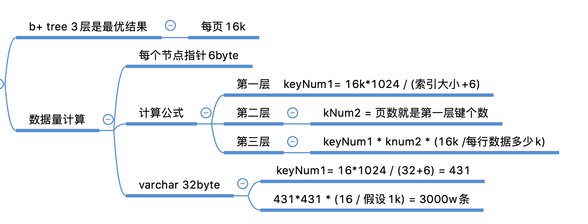

mysql的数据其实是存储在b+tree上的.一般业内的认知是 索引深度不超过4层.3层的索引. 能存储的数据行数其实是能计算出来的.所以为了要保证查询高效. 算一下每张表大概多少量级数据.. 拆分的时候根据总量计算出拆多少个分区.

然后用mycat中间件. 拆分就行,基本上 三层索引. 主键是32位uuid. 每行数据1k.  单表500w -1000w就是最大量级了.mycat拆分时的策略 就是对一个拆分键去取模.. 取模的方式常见的就是hash.

不过现在很多技术都用的另外一个hash算法. 叫一致性hash.

有时间把mycat. 一致性hash. jumpstringhash 这几个知识点看看就够了.

单表500w-1000w这个都没啥说的了. 业内共识. 如果你想知道算法.有时间可以交流
