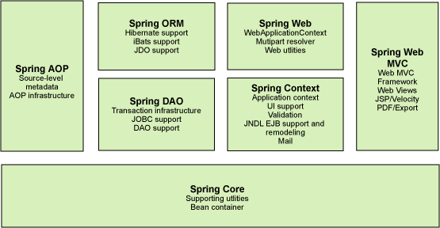

## Spring 项目组成

Spring 是一个开源框架，是为了解决企业应用程序开发复杂性而创建的（替代更加重量级的企业级Java技术， 尤其是EJB），它完成了大量开发中的通用步骤，留给开发者的仅仅是与特定应用相关的部分，从而大大提高了企业应用的开发效率。

Spring 框架是一个分层架构，由 7 个定义良好的模块组成。Spring 模块构建在核心容器之上，核心容器定义了创建、配置和管理 bean 的方式如下图：

每个模块的功能: 

- Spring 核心容器：核心容器提供 Spring 框架的基本功能，管理着Spring应用中bean的创建、配置和管理。核心容器的主要组件是 BeanFactory，它是工厂模式的实现。BeanFactory 使用DI将应用程序的配置和依赖性规范与实际的应用程序代码分开。
- Spring 上下文：Spring 上下文是一个配置文件，向 Spring 框架提供上下文信息。提供了一种框架式的对象访问方法，有些象JNDI注册器。Context封装包的特性得自于Beans封装包，并添加了对国际化（I18N）的支持（例如资源绑定），事件传播，资源装载的方式和Context的透明创建，比如说通过Servlet容器。Spring 上下文和Bean工厂都是 bean 容器 的实现。
- Spring AOP：通过配置管理特性，Spring AOP 模块直接将面向方面的编程功能集成到了 Spring 框架中。所以，可以很容易地使 Spring 框架管理的任何对象支持 AOP。Spring AOP 模块为基于 Spring 的应用程序中的对象提供了事务管理服务。
- Spring DAO：JDBC DAO 抽象层提供了有意义的异常层次结构，可用该结构来管理异常处理和不同数据库供应商抛出的错误消息。异常层次结构简化了错误处理，并且极大地降低了需要编写的异常代码数量（例如打开和关闭连接）。Spring DAO 的面向 JDBC 的异常遵从通用的 DAO 异常层次结构。
- Spring ORM：Spring 框架插入了若干个 ORM 框架，从而提供了 ORM 的对象关系工具，其中包括 JDO、Hibernate 和 iBatis SQL Map。所有这些都遵从 Spring 的通用事务和 DAO 异常层次结构。
- Spring Web 模块：Web 上下文模块建立在应用程序上下文模块之上，为基于 Web 的应用程序提供了上下文。
- Spring MVC 框架：MVC 框架是一个全功能的构建 Web 应用程序的 MVC 实现。通过策略接口，MVC 框架变成为高度可配置的，MVC 容纳了大量视图技术，其中包括 JSP、Velocity、Tiles、iText 和 POI。

## Spring 常用注解

### 声明 bean  注解类

- @Component 组件，没有明确的角色

- @Service 在业务逻辑层使用（service层）

- @Repository 在数据访问层使用（dao层）

- @Controller 在展现层使用，控制器的声明（C）

### 注入bean的注解

- @Autowired：由Spring提供，推荐使用，一般来说很难把 Spring 换掉

- @Inject：由JSR-330提供

- @Resource：由JSR-250提供

### 配置相关

- @Configuration 声明当前类为配置类，相当于xml形式的Spring配置（类上）,在 Spring 内部为 full configuration 加载，会继续加载声明在内部的 @Bean 注解
- @Bean 注解在方法上，声明当前方法的返回值为一个bean，Spring 内部只会加载这个注解的类本身，内部不会继续加载
- @ComponentScan 包扫描，扫描指定路径下的 bean
- @WishlyConfiguration 为@Configuration与@ComponentScan的组合注解

### @Bean 相关

- @Scope 设置Spring容器如何新建Bean实例
- @PostConstruct Bean的初始话方法
- @PreDestory 销毁

scope 列表：

- Singleton （单例,一个Spring容器中只有一个bean实例，默认模式）
- Protetype （每次调用新建一个bean）
- Request （web项目中，给每个http request新建一个bean）
- Session （web项目中，给每个http session新建一个bean）
- GlobalSession（给每一个 global http session新建一个Bean实例）
  

### @Value注解

支持 EL 表达式的属性注入

@Value("${server.port}")
private long port;

### 加载配置类 

- @PropertySource

### 上下文切换

- @Profile 通过设定Environment的ActiveProfiles来设定当前context需要使用的配置环境。（类或方法上）,Profile 支持多个
- @Conditional Spring4中可以使用此注解定义条件话的bean，通过实现Condition接口，并重写matches方法，从而决定该bean是否被实例化。（方法上）

### 异步相关

- @EnableAsync 配置类中，通过此注解开启对异步任务的支持
- @Async 在实际执行的bean方法使用该注解来申明其是一个异步任务

### 定时任务相关

- @EnableScheduling 在配置类上使用，开启计划任务的支持
- @Scheduled 来申明这是一个任务，包括cron,fixDelay,fixRate等类型（方法上，需先开启计划任务的支持）

### @Enable 相关

- @EnableAspectJAutoProxy 开启对AspectJ自动代理的支持
- @EnableAsync 开启异步方法的支持
- @EnableScheduling 开启计划任务的支持
- @EnableWebMvc 开启Web MVC的配置支持
- @EnableConfigurationProperties 开启对@ConfigurationProperties注解配置Bean的支持
- @EnableJpaRepositories 开启对SpringData JPA Repository的支持
- @EnableTransactionManagement 开启注解式事务的支持
- @EnableCaching 开启注解式的缓存支持

### Spring mvc

- @EnableWebMvc 在配置类中开启Web MVC的配置支持，如一些ViewResolver或者MessageConverter等，若无此句，重写WebMvcConfigurerAdapter方法（用于对SpringMVC的配置
- @Controller 声明该类为SpringMVC中的Controller
- @RequestMapping 用于映射Web请求，包括访问路径和参数（类或方法上）
- @ResponseBody 支持将返回值放在response内，而不是一个页面，通常用户返回json数据（返回值旁或方法上）
- @PathVariable 用于接收路径参数
- @RestController 该注解为一个组合注解，相当于@Controller和@ResponseBody的组合
- @ControllerAdvice 通过该注解，我们可以将对于控制器的全局配置放置在同一个位置
- @Controller的类的方法可使用@ExceptionHandler、@InitBinder、@ModelAttribute注解到方法上
- @ExceptionHandler 用于全局处理控制器里的异常
- @InitBinder 用来设置WebDataBinder，WebDataBinder用来自动绑定前台请求参数到Model中，使用 RESTful API 用不到这些
- @ModelAttribute 本来的作用是绑定键值对到Model里，在@ControllerAdvice中是让全局的

### 单元测试相关

- @RunWith 运行器，Spring中通常用于对JUnit的支持
- @ContextConfiguration 用来加载配置ApplicationContext，其中classes属性用来加载配置类

## 参考学习资料

- 超哥源码解析 https://study.163.com/course/courseLearn.htm?courseId=1209427892#/learn/video?lessonId=1279668587&courseId=1209427892
