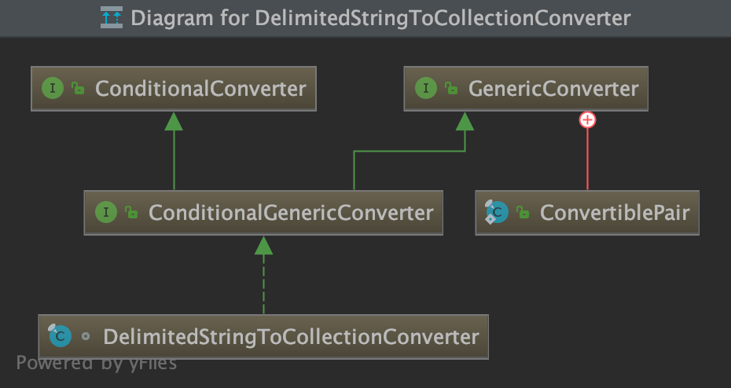
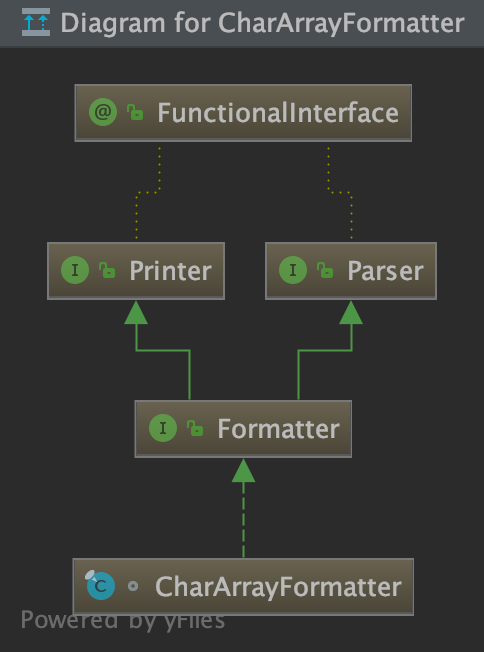
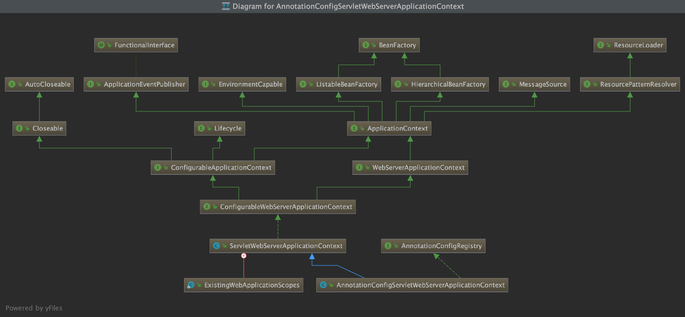
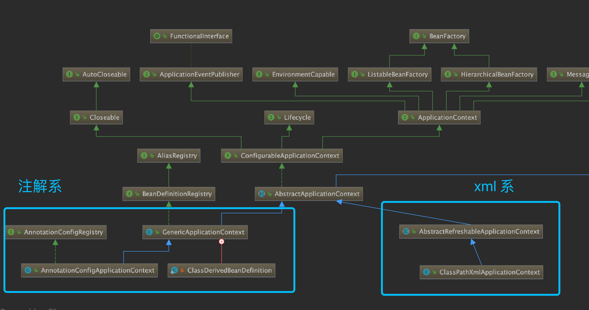
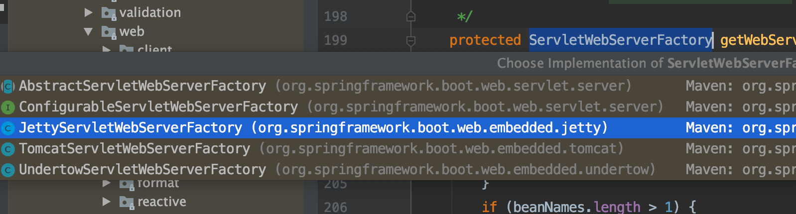

# 前置知识 

- 要求对 Spring 有一定了解知道 Spring 和 spring boot 之间的关系
- 对 Servlet 有一定了解
- 对类加载器有一定了解

### spring 预习

spring 本质上就是一个帮你加载类，管理类的库，所以被称作 IOC 容器。

- spring-core spring 核心基础能力：
  - 动态代理 cglib
  - 类解析 asm
  - 类实例化 objenesis
  - 基础注解  core.annotation
  - 编解码 core.codec
  - 类型转换器 core.convert
  - 配置文件解析 core.env
  - 资源读取 core.io
  - 日志 core.log
  - 序列化 core.serializer
  - 格式化输出 core.style
  - 多线程任务 core.task
  - 注解处理 core.type
  - 工具包
    - 退避算法 util.backoff
    - 比较器 util.comparator
    - 并发工具 util.concurrent
    - 单位 util.unit
    - 函数式工具 util.function
    - xml 处理工具 util.xml
  - 其他常用的工具类
    - TODO 
- spring-beans 对 bean 各种操作
  - bean 工厂 factory
  - bean 的属性编辑器
  - bean 工具
- spring-aop 实现切片编程的逻辑
- spring-expression  EL 表达式，基本实现了一个 DSL
- spring-context 整合上面的组件，提供给应用程序一个上下文容器
  - cache 缓存相关
  - context  应用上下文相关
    - annotation
    - config
    - event
    - expression
    - i18n
    - index
    - support
    - weaving
  - format
  - scheduling 计划任务
  - scripting
  - stereotype  模板类型，例如 Controller 
  - validation 数据验证

### spring boot、 spring、spring mvc 的关系

spring 是一个 IOC 容器，负责初始化对象，以及管理对象。可以看做一个库，无法作为一个应用启动。spring 实际上与 web 应用无关，但是也提供了很多 web 应用的支持。

spring boot 是一个整合了 spring 等其他技术的应用框架，开发者需要根据 spring boot 的逻辑来进行开发，spring boot 帮忙做了很多默认配置。

spring mvc  是一个响应 servlet 请求并完成请求路由映射、模型加载、视图渲染等经典 MVC 框架。


# Spring boot 启动过程

## 1 执行入口方法

```java
@SpringBootApplication
public class SpringBootBestPracticeApplication {
    public static void main(String[] args) {
        SpringApplication.run(SpringBootBestPracticeApplication.class, args);
    }
}
```

## 2 构造应用实例 new SpringApplication() 

实例化 SpringApplication 对象

```java
public static ConfigurableApplicationContext run(Class<?>[] primarySources,
      String[] args) {
   // 2. 构建应用实例
   SpringApplication app = new SpringApplication(primarySources);
   // 3. 运行应用实例
   return app.run(args);
}
```

```java
public SpringApplication(ResourceLoader resourceLoader, Class<?>... primarySources) {
   // 2.1 资源初始化资源加载器为 null
   this.resourceLoader = resourceLoader;
   Assert.notNull(primarySources, "PrimarySources must not be null");
   this.primarySources = new LinkedHashSet<>(Arrays.asList(primarySources));
   // 2.2 推断当前 WEB 应用类型,判断是一个 webflux 还是普通 servlet 项目，或者不是 web 项目
   this.webApplicationType = WebApplicationType.deduceFromClasspath();
   // 2.3 设置应用上下文初始化器 ,ApplicationContextInitializer 接口负责在项目启动时候初始话各种资源，这里支持不同的初始化器，例如加载配置文件、注册属性资源、激活 Profiles 
  setInitializers((Collection) getSpringFactoriesInstances(
         ApplicationContextInitializer.class));
   // 2.4 设置监听器
   setListeners((Collection) getSpringFactoriesInstances(ApplicationListener.class));
   // 2.5 推断主入口应用类
   this.mainApplicationClass = deduceMainApplicationClass();
}
```


### 2.1 资源初始化资源加载器为 null

### 2.2 推断应用类型

```java
static WebApplicationType deduceFromClasspath() {
   if (ClassUtils.isPresent(WEBFLUX_INDICATOR_CLASS, null)
         && !ClassUtils.isPresent(WEBMVC_INDICATOR_CLASS, null)
         && !ClassUtils.isPresent(JERSEY_INDICATOR_CLASS, null)) {
      return WebApplicationType.REACTIVE;
   }
   for (String className : SERVLET_INDICATOR_CLASSES) {
      if (!ClassUtils.isPresent(className, null)) {
         return WebApplicationType.NONE;
      }
   }
   return WebApplicationType.SERVLET;
}
```

ClassUtils.isPresent 检测 org.springframework.web.reactive.DispatcherHandler 这个类是否存在，并且没有加载 Spring mvc 以及 Jersey 可以判定为 REACTIVE 模式。

如果没有加载任何 ConfigurableWebApplicationContext 相关的类，判定为非 web 项目。


### 2.3 构造 SpringApplication  的上下文初始化器

获取初始化器的实例

```java
private <T> Collection<T> getSpringFactoriesInstances(Class<T> type,
      Class<?>[] parameterTypes, Object... args) {
   // 2.3.1 通过 SpringFactoriesLoader.loadFactoryNames 加载该接口的所有实现
   ClassLoader classLoader = getClassLoader();
   // 2.3.2 通过 SpringFactoriesLoader.loadFactoryNames 加载该接口的所有实现
   Set<String> names = new LinkedHashSet<>(
         SpringFactoriesLoader.loadFactoryNames(type, classLoader));
   // 2.3.3 使用 BeanUtils.instantiateClass 实例化所有的类
   List<T> instances = createSpringFactoriesInstances(type, parameterTypes,
         classLoader, args, names);
   // 2.3.4 使用 BeanUtils.instantiateClass 使用注解比较器进行排序
   AnnotationAwareOrderComparator.sort(instances);
   return instances;
}
```


#### 2.3.1 获取 class loader 

```java
if (this.resourceLoader != null) {
   return this.resourceLoader.getClassLoader();
}
return ClassUtils.getDefaultClassLoader();
```


ClassUtils 的实现原理为 Thread.currentThread().getContextClassLoader();  并做了回退处理

- Thread.currentThread().getContextClassLoader(); 
- ClassUtils.class.getClassLoader();
- ClassLoader.getSystemClassLoader();


#### 2.3.2 加载初始化类名

```java
		public static List<String> loadFactoryNames(Class<?> factoryClass, @Nullable ClassLoader classLoader) {
		String factoryClassName = factoryClass.getName();
		return loadSpringFactories(classLoader).getOrDefault(factoryClassName, Collections.emptyList());
	}
```

```java
private static Map<String, List<String>> loadSpringFactories(@Nullable ClassLoader classLoader) {
   MultiValueMap<String, String> result = cache.get(classLoader);
   if (result != null) {
      return result;
   }

   try {
      Enumeration<URL> urls = (classLoader != null ?
            classLoader.getResources(FACTORIES_RESOURCE_LOCATION) :
            ClassLoader.getSystemResources(FACTORIES_RESOURCE_LOCATION));
      result = new LinkedMultiValueMap<>();
      while (urls.hasMoreElements()) {
         URL url = urls.nextElement();
         UrlResource resource = new UrlResource(url);
         Properties properties = PropertiesLoaderUtils.loadProperties(resource);
         for (Map.Entry<?, ?> entry : properties.entrySet()) {
            String factoryClassName = ((String) entry.getKey()).trim();
            for (String factoryName : StringUtils.commaDelimitedListToStringArray((String) entry.getValue())) {
               result.add(factoryClassName, factoryName.trim());
            }
         }
      }
      cache.put(classLoader, result);
      return result;
   }
   catch (IOException ex) {
      throw new IllegalArgumentException("Unable to load factories from location [" +
            FACTORIES_RESOURCE_LOCATION + "]", ex);
   }
}
```

基本原理是通过 class loader 找到 META-INF/spring.factories 文件解析并获取 `ApplicationContextInitializer` 接口的所有配置的类路径名称。

这里非常关键，spring boot 通过加载不同的 ApplicationContextInitializer 对上下文进行初始化，这是 spring boot 应用具有大量特性的同时也能保持灵活性的重要手段。

urls 是类加载器以及双亲委派模式下的类加载器加载出来的所有资源，然后遍历获取需要的类。

ApplicationContextInitializer 的类定义有几个潜在来源：

- spring boot 本身提供了4 个类
- devtools 提供了1个用于热加载后刷新上下文的类
- autoconfigure 提供了2个用于自动配置的类

我加载了 devtools 因此加载了7个上下文初始化类。

```
0 = "org.springframework.boot.devtools.restart.RestartScopeInitializer"
1 = "org.springframework.boot.autoconfigure.SharedMetadataReaderFactoryContextInitializer"
2 = "org.springframework.boot.autoconfigure.logging.ConditionEvaluationReportLoggingListener"
3 = "org.springframework.boot.context.ConfigurationWarningsApplicationContextInitializer"
4 = "org.springframework.boot.context.ContextIdApplicationContextInitializer"
5 = "org.springframework.boot.context.config.DelegatingApplicationContextInitializer"
6 = "org.springframework.boot.web.context.ServerPortInfoApplicationContextInitializer"
```

这里使用了一个 LinkedMultiValueMap 数据结构，可以为一个 key 存储多个值，构建出一个树类似的结构，便于解析 properties 文件。

可以把从不同的 spring.factories 中的代码块汇集到一个对象中，一个 spring.factories 数据结构如下

```
# Error Reporters
org.springframework.boot.SpringBootExceptionReporter=\
org.springframework.boot.diagnostics.FailureAnalyzers

# Application Context Initializers
org.springframework.context.ApplicationContextInitializer=\
org.springframework.boot.context.ConfigurationWarningsApplicationContextInitializer,\
org.springframework.boot.context.ContextIdApplicationContextInitializer,\
org.springframework.boot.context.config.DelegatingApplicationContextInitializer,\
org.springframework.boot.web.context.ServerPortInfoApplicationContextInitializer
```

如果有多个 jar 包中都有 ApplicationContextInitializer配置块，通过LinkedMultiValueMap 可以很方便的合并同样key的集合。

#### 2.3.3 实例化初始化器类

```java
@SuppressWarnings("unchecked")
private <T> List<T> createSpringFactoriesInstances(Class<T> type,
      Class<?>[] parameterTypes, ClassLoader classLoader, Object[] args,
      Set<String> names) {
   List<T> instances = new ArrayList<>(names.size());
   for (String name : names) {
      try {
         Class<?> instanceClass = ClassUtils.forName(name, classLoader);
         Assert.isAssignable(type, instanceClass);
         Constructor<?> constructor = instanceClass
               .getDeclaredConstructor(parameterTypes);
         T instance = (T) BeanUtils.instantiateClass(constructor, args);
         instances.add(instance);
      }
      catch (Throwable ex) {
         throw new IllegalArgumentException(
               "Cannot instantiate " + type + " : " + name, ex);
      }
   }
   return instances;
}
```


#### 2.3.4 使用注解比较器进行排序


```java
public static void sort(List<?> list) {
   if (list.size() > 1) {
      list.sort(INSTANCE);
   }
}
```

INSTANCE 是 AnnotationAwareOrderComparator 的一个单例，继承 OrderComparator 实现通过顺序进行比较。AnnotationAwareOrderComparator 的职责是通过找到 Order 注解进行排序。


### 2.4 设置监听器

获取监听器的原理和上下文初始化器一样，不过类型换成了 ApplicationListener。

```properties
# Application Listeners
org.springframework.context.ApplicationListener=\
org.springframework.boot.ClearCachesApplicationListener,\
org.springframework.boot.builder.ParentContextCloserApplicationListener,\
org.springframework.boot.context.FileEncodingApplicationListener,\
org.springframework.boot.context.config.AnsiOutputApplicationListener,\
org.springframework.boot.context.config.ConfigFileApplicationListener,\
org.springframework.boot.context.config.DelegatingApplicationListener,\
org.springframework.boot.context.logging.ClasspathLoggingApplicationListener,\
org.springframework.boot.context.logging.LoggingApplicationListener,\
org.springframework.boot.liquibase.LiquibaseServiceLocatorApplicationListener
```

### 2.5 推断主入口应用类

```java
private Class<?> deduceMainApplicationClass() {
   try {
      StackTraceElement[] stackTrace = new RuntimeException().getStackTrace();
      for (StackTraceElement stackTraceElement : stackTrace) {
         if ("main".equals(stackTraceElement.getMethodName())) {
            return Class.forName(stackTraceElement.getClassName());
         }
      }
   }
   catch (ClassNotFoundException ex) {
      // Swallow and continue
   }
   return null;
}
```

通过构造一个运行时异常，再遍历异常栈中的方法名，获取方法名为 main 的栈帧，从来得到入口类的名字再返回该类。


应用程序的主入口 Spring boot 并不知道，通过模拟一个异常栈，根据异常栈中的元素找出 main 方法，通过这种方式获取入口应用类。


## 3 运行应用实例

上面分析了创建 SpringApplication 实例的过程，下面分析实例创建后是如何被启动的。


```java
public ConfigurableApplicationContext run(String... args) {
   // 3.1 创建并启动计时监控类
   StopWatch stopWatch = new StopWatch();
   stopWatch.start();
   // 初始化应用上下文和异常报告集合
   ConfigurableApplicationContext context = null;
   Collection<SpringBootExceptionReporter> exceptionReporters = new ArrayList<>();
   // 3.2 设置系统属性 `java.awt.headless` 的值，默认值为：true
   configureHeadlessProperty();
   // 3.3 创建所有 Spring 运行监听器并发布应用启动事件
   SpringApplicationRunListeners listeners = getRunListeners(args);
   listeners.starting();
  
   try {
      // 3.4 初始化默认应用参数类
      ApplicationArguments applicationArguments = new DefaultApplicationArguments(
            args);
      // 3.5 根据运行监听器和应用参数来准备 Spring 环境
      ConfigurableEnvironment environment = prepareEnvironment(listeners,
            applicationArguments);
      // 根据 spring.beaninfo.ignore 配置忽略 bean
      configureIgnoreBeanInfo(environment);
      // 3.6 创建 Banner 打印类 
      Banner printedBanner = printBanner(environment);
      
      // 3.7 创建应用上下文
      context = createApplicationContext();
      
      // 准备异常报告器
      exceptionReporters = getSpringFactoriesInstances(
            SpringBootExceptionReporter.class,
            new Class[] { ConfigurableApplicationContext.class }, context);
     
      // 3.8 准备应用上下文
      prepareContext(context, environment, listeners, applicationArguments,
            printedBanner);
      // 3.9 刷新应用上下文
      refreshContext(context);
      
      // 3.10 应用上下文刷新后置处理
      afterRefresh(context, applicationArguments);

     	// 3.11 停止计时监控类
      stopWatch.stop();
      // 3.12 输出日志记录执行主类名、时间信息
      if (this.logStartupInfo) {
         new StartupInfoLogger(this.mainApplicationClass)
               .logStarted(getApplicationLog(), stopWatch);
      }
     
      // 3.13 发布应用上下文启动完成事件
      listeners.started(context);
     
      // 3.14 执行所有 Runner 运行器
      callRunners(context, applicationArguments);
   }
   catch (Throwable ex) {
      handleRunFailure(context, ex, exceptionReporters, listeners);
      throw new IllegalStateException(ex);
   }

   try {
      // 3.15 发布应用上下文就绪事件
      listeners.running(context);
   }
   catch (Throwable ex) {
      // 3.16 处理运行异常
      handleRunFailure(context, ex, exceptionReporters, null);
      throw new IllegalStateException(ex);
   }
   return context;
}
```


### 3.1 创建并启动计时监控类

```java
StopWatch stopWatch = new StopWatch();
stopWatch.start();
```

StopWatch 的源码

```java
public void start() throws IllegalStateException {
    start("");
}

public void start(String taskName) throws IllegalStateException {
    if (this.currentTaskName != null) {
        throw new IllegalStateException("Can't start StopWatch: it's already running");
    }
    this.currentTaskName = taskName;
    this.startTimeMillis = System.currentTimeMillis();
}
```

首先记录了当前任务的名称，默认为空字符串，然后记录当前 Spring Boot 应用启动的开始时间。

### 3.2 设置系统属性 `java.awt.headless` 

```java
private void configureHeadlessProperty() {
   System.setProperty(SYSTEM_PROPERTY_JAVA_AWT_HEADLESS, System.getProperty(
         SYSTEM_PROPERTY_JAVA_AWT_HEADLESS, Boolean.toString(this.headless)));
}
```


设置变量 `Java.awt.headless = true` 

>Java包含很多类，这些类假设有某种显示和一个附加的键盘。有时，你写的代码运行在一个没有这些的服务器上，这被称为无头模式。有时，你写的代码运行在一个没有这些的服务器上，这被称为无头模式。从Java 1.4开始，您就可以明确地告诉Java以Headless模式运行。
>
>https://stackoverflow.com/questions/2552371/setting-java-awt-headless-true-programmatically


### 3.3 创建所有 Spring 运行监听器并发布应用启动事件


```java
private SpringApplicationRunListeners getRunListeners(String[] args) {
   Class<?>[] types = new Class<?>[] { SpringApplication.class, String[].class };
   return new SpringApplicationRunListeners(logger, getSpringFactoriesInstances(
         SpringApplicationRunListener.class, types, this, args));
}
```

创建逻辑和之前实例化初始化器和监听器的一样，一样调用的是 `getSpringFactoriesInstances` 方法来获取配置的监听器名称并实例化所有的类。

```properties
# Run Listeners
org.springframework.boot.SpringApplicationRunListener=\
org.springframework.boot.context.event.EventPublishingRunListener
```


### 3.4 初始化默认应用参数类

```java
ApplicationArguments applicationArguments = new DefaultApplicationArguments(
      args);
```

只是用一个类 DefaultApplicationArguments  包装了一下参数输入。

### 3.5 根据应用参数来准备环境

```java
ConfigurableEnvironment environment = prepareEnvironment(listeners,
      applicationArguments);
```

```java
private ConfigurableEnvironment prepareEnvironment(
      SpringApplicationRunListeners listeners,
      ApplicationArguments applicationArguments) {
   // Create and configure the environment
   // 3.5.1 获取或者创建应用环境
   ConfigurableEnvironment environment = getOrCreateEnvironment();
   // 3.5.2 配置应用环境
   configureEnvironment(environment, applicationArguments.getSourceArgs());
   // 发布事件
   listeners.environmentPrepared(environment);
   // 3.5.3 绑定环境
   bindToSpringApplication(environment);
   if (!this.isCustomEnvironment) {
     // 3.5.4 自定义环境转换
      environment = new EnvironmentConverter(getClassLoader())
            .convertEnvironmentIfNecessary(environment, deduceEnvironmentClass());
   }
   // 3.5.5 附加配置属性
   ConfigurationPropertySources.attach(environment);
   return environment;
}
```


#### 3.5.1 获取或者创建应用环境


```java
private ConfigurableEnvironment getOrCreateEnvironment() {
   if (this.environment != null) {
      return this.environment;
   }
   switch (this.webApplicationType) {
   case SERVLET:
      return new StandardServletEnvironment();
   case REACTIVE:
      return new StandardReactiveWebEnvironment();
   default:
      return new StandardEnvironment();
   }
}
```


根据应用类型的不同，存在3种实现:

- StandardServletEnvironment
- StandardReactiveWebEnvironment 
- StandardEnvironment 

StandardServletEnvironment、StandardReactiveWebEnvironment 都是继承于 StandardEnvironment，用于管理系统环境变量以及配置文件。


Environment 对象就是存放我们设置的 profile 信息，默认为 default。


#### 3.5.2 配置应用环境

```java
configureEnvironment(environment, applicationArguments.getSourceArgs());
```

使用刚刚创建的环境对象管理环境参数。

```java
protected void configureEnvironment(ConfigurableEnvironment environment,
      String[] args) {
   // 3.5.2.1 配置转换服务
   if (this.addConversionService) {
      ConversionService conversionService = ApplicationConversionService
            .getSharedInstance();
      environment.setConversionService(
            (ConfigurableConversionService) conversionService);
   }
   // 3.5.2.2 配置属性资源
   configurePropertySources(environment, args);
   // 3.5.2.3 配置 profiles
   configureProfiles(environment, args);
}
```

##### 3.5.2.1 配置转换服务

addConversionService 默认为 true，提供一个数据类型转换服务。在配置文件中大多是使用字符串，帮我们转换成容易使用的数据类型，例如 duration 这类的配置可以被转换成数值。

getSharedInstance() 是一个单例实现，用于组合各种数据类型的转换器、文本解析器，可以学习一下。

```java
public static ConversionService getSharedInstance() {
   ApplicationConversionService sharedInstance = ApplicationConversionService.sharedInstance;
   if (sharedInstance == null) {
      synchronized (ApplicationConversionService.class) {
         sharedInstance = ApplicationConversionService.sharedInstance;
         if (sharedInstance == null) {
            sharedInstance = new ApplicationConversionService();
            ApplicationConversionService.sharedInstance = sharedInstance;
         }
      }
   }
   return sharedInstance;
}
```

ApplicationConversionService 注册了大量的转换器，确保配置被合理的转换成特定的数据类型。

```java
public static void addApplicationConverters(ConverterRegistry registry) {
   addDelimitedStringConverters(registry);
   registry.addConverter(new StringToDurationConverter());
   registry.addConverter(new DurationToStringConverter());
   registry.addConverter(new NumberToDurationConverter());
   registry.addConverter(new DurationToNumberConverter());
   registry.addConverter(new StringToDataSizeConverter());
   registry.addConverter(new NumberToDataSizeConverter());
   registry.addConverterFactory(new StringToEnumIgnoringCaseConverterFactory());
}
```

addDelimitedStringConverters 中包含了大量逗号分隔符的转换器，用于将逗号分隔的字符串转换成集合。

```java
public static void addDelimitedStringConverters(ConverterRegistry registry) {
   ConversionService service = (ConversionService) registry;
   registry.addConverter(new ArrayToDelimitedStringConverter(service));
   registry.addConverter(new CollectionToDelimitedStringConverter(service));
   registry.addConverter(new DelimitedStringToArrayConverter(service));
   registry.addConverter(new DelimitedStringToCollectionConverter(service));
}

```

有一些专门的解析和生成字符串类的格式化器，具有格式化成字符串、解析字符串的能力。

```java
public static void addApplicationFormatters(FormatterRegistry registry) {
   registry.addFormatter(new CharArrayFormatter());
   registry.addFormatter(new InetAddressFormatter());
   registry.addFormatter(new IsoOffsetFormatter());
}
```

转换器和格式化器继承的父类和实现的接口不太一样。





##### 3.5.2.2 配置属性资源

```java
protected void configurePropertySources(ConfigurableEnvironment environment,
      String[] args) {
   MutablePropertySources sources = environment.getPropertySources();
   if (this.defaultProperties != null && !this.defaultProperties.isEmpty()) {
      sources.addLast(
            new MapPropertySource("defaultProperties", this.defaultProperties));
   }
   if (this.addCommandLineProperties && args.length > 0) {
      String name = CommandLinePropertySource.COMMAND_LINE_PROPERTY_SOURCE_NAME;
      if (sources.contains(name)) {
         PropertySource<?> source = sources.get(name);
         CompositePropertySource composite = new CompositePropertySource(name);
         composite.addPropertySource(new SimpleCommandLinePropertySource(
               "springApplicationCommandLineArgs", args));
         composite.addPropertySource(source);
         sources.replace(name, composite);
      }
      else {
         sources.addFirst(new SimpleCommandLinePropertySource(args));
      }
   }
}
```


这里将命令行中的配置添加到，配置列表中，因为 spring boot 支持各种各样的配置来源，因此需要做大量类似的工作。这里根据命令行参数添加了 `SimpleCommandLinePropertySource`配置来源。

参考 https://docs.spring.io/spring-boot/docs/2.2.6.RELEASE/reference/htmlsingle/#boot-features-external-config

##### 3.5.2.3 配置 profiles

```java
protected void configureProfiles(ConfigurableEnvironment environment, String[] args) {
   environment.getActiveProfiles(); // ensure they are initialized
   // But these ones should go first (last wins in a property key clash)
   Set<String> profiles = new LinkedHashSet<>(this.additionalProfiles);
   profiles.addAll(Arrays.asList(environment.getActiveProfiles()));
   environment.setActiveProfiles(StringUtils.toStringArray(profiles));
}
```

通过获取到的 profiles 信息，设置当前激活的 profiles。

#### 3.5.3 绑定配置信息到对象上

```java
protected void bindToSpringApplication(ConfigurableEnvironment environment) {
   try {
      Binder.get(environment).bind("spring.main", Bindable.ofInstance(this));
   }
   catch (Exception ex) {
      throw new IllegalStateException("Cannot bind to SpringApplication", ex);
   }
}
```

pringboot 2.x新引入的类，负责处理对象与多个 ConfigurationPropertySource（属性）之间的绑定，可以将多个配置属性绑定到类的属性上，这里面的内容比较复杂，不再过深入展开。

#### 3.5.4 自定义环境转换

```java
if (!this.isCustomEnvironment) {
   environment = new EnvironmentConverter(getClassLoader())
         .convertEnvironmentIfNecessary(environment, deduceEnvironmentClass());
}
```

如果在最开始传入的 environment 对象不是 deduceEnvironmentClass() 中的三种之一，那么需要转换，默认为关闭状态。

```java
private Class<? extends StandardEnvironment> deduceEnvironmentClass() {
   switch (this.webApplicationType) {
   case SERVLET:
      return StandardServletEnvironment.class;
   case REACTIVE:
      return StandardReactiveWebEnvironment.class;
   default:
      return StandardEnvironment.class;
   }
}
```

#### 3.5.5 附加配置属性

```java
public static void attach(Environment environment) {
   Assert.isInstanceOf(ConfigurableEnvironment.class, environment);
   MutablePropertySources sources = ((ConfigurableEnvironment) environment)
         .getPropertySources();
   PropertySource<?> attached = sources.get(ATTACHED_PROPERTY_SOURCE_NAME);
   if (attached != null && attached.getSource() != sources) {
      sources.remove(ATTACHED_PROPERTY_SOURCE_NAME);
      attached = null;
   }
   if (attached == null) {
      sources.addFirst(new ConfigurationPropertySourcesPropertySource(
            ATTACHED_PROPERTY_SOURCE_NAME,
            new SpringConfigurationPropertySources(sources)));
   }
}
```

TODO 这段代码还不知道干嘛用的，尤其是 SpringConfigurationPropertySources 这个类

### 3.6 创建 Banner 打印类 

```java
private Banner printBanner(ConfigurableEnvironment environment) {
   if (this.bannerMode == Banner.Mode.OFF) {
      return null;
   }
   ResourceLoader resourceLoader = (this.resourceLoader != null)
         ? this.resourceLoader : new DefaultResourceLoader(getClassLoader());
   SpringApplicationBannerPrinter bannerPrinter = new SpringApplicationBannerPrinter(
         resourceLoader, this.banner);
   if (this.bannerMode == Mode.LOG) {
      return bannerPrinter.print(environment, this.mainApplicationClass, logger);
   }
   return bannerPrinter.print(environment, this.mainApplicationClass, System.out);
}
```

打印一个 banner 信息，基本的逻辑就是 SpringApplicationBannerPrinter 类根据配置文件在指定的位置打印出 banner，根据 banner 输出的模式分为日志、控制台、不打印。

### 3.7 创建应用上下文 [核心点]

```java
protected ConfigurableApplicationContext createApplicationContext() {
   Class<?> contextClass = this.applicationContextClass;
   if (contextClass == null) {
      try {
         switch (this.webApplicationType) {
         case SERVLET:
            contextClass = Class.forName(DEFAULT_SERVLET_WEB_CONTEXT_CLASS);
            break;
         case REACTIVE:
            contextClass = Class.forName(DEFAULT_REACTIVE_WEB_CONTEXT_CLASS);
            break;
         default:
            contextClass = Class.forName(DEFAULT_CONTEXT_CLASS);
         }
      }
      catch (ClassNotFoundException ex) {
         throw new IllegalStateException(
               "Unable create a default ApplicationContext, "
                     + "please specify an ApplicationContextClass",
               ex);
      }
   }
   return (ConfigurableApplicationContext) BeanUtils.instantiateClass(contextClass);
}
```

非常关键的一个环节，初始化一个 Spring boot 上下文，在这个上下文中会启动 Spring 上下文，实际上在这之前还没有启动 Spring 。根据不同的应用类型初始不同的上下文，如果是一个普通 web 应用，默认初始化的是  `AnnotationConfigServletWebServerApplicationContext` 。

使用 BeanUtils.instantiateClass 来初始化一个类，这种初始化方法能使用 Spring 类的生命周期注解。这里默认构造了一个上下文，通过这个上下文在后面利用 spring 初始化 bean 的时候非常重要。

基本上这个类是 Spring boot 继承于 Spring 中的 ServletWebServerApplicationContext，ServletWebServerApplicationContext 有继承于 GenericApplicationContext。GenericApplicationContext 是一个抽象程度非常高的上下文。实现了大量与应用类型无关的 bean 操作，后面的 bean 初始化会靠它，另外一个很重要的是 这里默认初始花了一个 DefaultListableBeanFactory 作为 bean 工厂。





### 3.8 准备应用上下文

```java
private void prepareContext(ConfigurableApplicationContext context,
      ConfigurableEnvironment environment, SpringApplicationRunListeners listeners,
      ApplicationArguments applicationArguments, Banner printedBanner) {
   // 设置环境信息
   context.setEnvironment(environment);
   // 3.8.1 配置 bean 生成器和资源加载器
   postProcessApplicationContext(context);
   // 3.8.2 应用所有的初始化器 
   applyInitializers(context);
   // 上下文准备完成通知
   listeners.contextPrepared(context);
   // 3.8.3 记录启动日志
   if (this.logStartupInfo) {
      logStartupInfo(context.getParent() == null);
      logStartupProfileInfo(context);
   }
   // 3.8.4 注册两个特殊的 bean 
   ConfigurableListableBeanFactory beanFactory = context.getBeanFactory();
   beanFactory.registerSingleton("springApplicationArguments", applicationArguments);
   if (printedBanner != null) {
      beanFactory.registerSingleton("springBootBanner", printedBanner);
   }
   if (beanFactory instanceof DefaultListableBeanFactory) {
      ((DefaultListableBeanFactory) beanFactory)
            .setAllowBeanDefinitionOverriding(this.allowBeanDefinitionOverriding);
   }
   // 3.8.5 加载所有的资源 
   Set<Object> sources = getAllSources();
   Assert.notEmpty(sources, "Sources must not be empty");
   load(context, sources.toArray(new Object[0]));
   // 通知上下文加载完成
   listeners.contextLoaded(context);
}
```

#### 3.8.1 配置 bean 生成器和资源加载器

```java
protected void postProcessApplicationContext(ConfigurableApplicationContext context) {
   if (this.beanNameGenerator != null) {
      context.getBeanFactory().registerSingleton(
            AnnotationConfigUtils.CONFIGURATION_BEAN_NAME_GENERATOR,
            this.beanNameGenerator);
   }
   if (this.resourceLoader != null) {
      if (context instanceof GenericApplicationContext) {
         ((GenericApplicationContext) context)
               .setResourceLoader(this.resourceLoader);
      }
      if (context instanceof DefaultResourceLoader) {
         ((DefaultResourceLoader) context)
               .setClassLoader(this.resourceLoader.getClassLoader());
      }
   }
   if (this.addConversionService) {
      context.getBeanFactory().setConversionService(
            ApplicationConversionService.getSharedInstance());
   }
}
```

#### 3.8.2 应用所有的初始化器 

```java
protected void applyInitializers(ConfigurableApplicationContext context) {
   for (ApplicationContextInitializer initializer : getInitializers()) {
      Class<?> requiredType = GenericTypeResolver.resolveTypeArgument(
            initializer.getClass(), ApplicationContextInitializer.class);
      Assert.isInstanceOf(requiredType, context, "Unable to call initializer.");
      initializer.initialize(context);
   }
}
```


这一步会把所有符合条件的 ApplicationContextInitializer 应用一遍，实际上 spring boot 的主要启动过程都在这几个 ApplicationContextInitializer 中。

前面讲过，spring boot 是如何将需要的类加载进来，这里需要说明下几个主要的初始化器的功能。

我在调试时主要有这几个：

```
org.springframework.boot.devtools.restart.RestartScopeInitializer
org.springframework.boot.autoconfigure.SharedMetadataReaderFactoryContextInitializer
org.springframework.boot.autoconfigure.logging.ConditionEvaluationReportLoggingListener
org.springframework.boot.context.ConfigurationWarningsApplicationContextInitializer
org.springframework.boot.context.ContextIdApplicationContextInitializer
org.springframework.boot.context.config.DelegatingApplicationContextInitializer
org.springframework.boot.web.context.ServerPortInfoApplicationContextInitializer
```

**RestartScopeInitializer**

主要是注册了一个 restart 的 bean scope 用热重载。

```java
public void initialize(ConfigurableApplicationContext applicationContext) {
   applicationContext.getBeanFactory().registerScope("restart", new RestartScope());
}
```

在 RestartScope 中使用了 Restarter 来刷新应用。

TODO 

#### 3.8.3 记录启动日志


创建了一个日志类，将日志打出

```java
new StartupInfoLogger(this.mainApplicationClass)
      .logStarting(getApplicationLog());
```

```java
public void logStarting(Log log) {
   Assert.notNull(log, "Log must not be null");
   if (log.isInfoEnabled()) {
      log.info(getStartupMessage());
   }
   if (log.isDebugEnabled()) {
      log.debug(getRunningMessage());
   }
}
```

 先判断日志是否开启 `log.isInfoEnabled`() 是为了提高性能，如果开启 info 会打出启动信息。只有开启 debug 级别的日志，才会打出运行时信息。

```
logStartupProfileInfo(context);
```

接下来打印 profile 的日志信息，如果没有设置 profile，也就是会显示我们平时看到的 

> No active profile set, falling back to default profiles: default


#### 3.8.4 注册两个特殊的 bean 

 

```java
ConfigurableListableBeanFactory beanFactory = context.getBeanFactory();
beanFactory.registerSingleton("springApplicationArguments", applicationArguments);
if (printedBanner != null) {
   beanFactory.registerSingleton("springBootBanner", printedBanner);
}
if (beanFactory instanceof DefaultListableBeanFactory) {
   ((DefaultListableBeanFactory) beanFactory)
         .setAllowBeanDefinitionOverriding(this.allowBeanDefinitionOverriding);
}
```


这里将当前使用到的  `applicationArguments` 和 `springBootBanner`  注册成单例，用于后面需要的时候获取。通过这种方式附加到上下文中。

#### 3.8.5 加载所有的资源 (包扫描) [补充点]

```java
		// 3.8.5.1 加载包扫描资源类
    Set<Object> sources = getAllSources();
		Assert.notEmpty(sources, "Sources must not be empty");
    // 3.8.5.2 包扫描
		load(context, sources.toArray(new Object[0]));
		listeners.contextLoaded(context);
```

##### 3.8.5.1 加载包扫描资源类

```java
public Set<Object> getAllSources() {
   Set<Object> allSources = new LinkedHashSet<>();
   if (!CollectionUtils.isEmpty(this.primarySources)) {
      allSources.addAll(this.primarySources);
   }
   if (!CollectionUtils.isEmpty(this.sources)) {
      allSources.addAll(this.sources);
   }
   return Collections.unmodifiableSet(allSources);
}
```

˙这里的 primarySources 就是指的 run 方法传入的类，spring boot 会根据资源类所在的包进行扫描。加载各种业务对象。因此可以在入口类中，可以做一些拓展，主动加载其他资源，甚至远程资源。

##### 3.8.5.2 包扫描

```java 
protected void load(ApplicationContext context, Object[] sources) {
   if (logger.isDebugEnabled()) {
      logger.debug(
            "Loading source " + StringUtils.arrayToCommaDelimitedString(sources));
   }
   // 初始化 bean 加载器
   BeanDefinitionLoader loader = createBeanDefinitionLoader(
         getBeanDefinitionRegistry(context), sources);
   if (this.beanNameGenerator != null) {
      loader.setBeanNameGenerator(this.beanNameGenerator);
   }
   if (this.resourceLoader != null) {
      loader.setResourceLoader(this.resourceLoader);
   }
   if (this.environment != null) {
      loader.setEnvironment(this.environment);
   }
   // 最终的初始化类的地方
   loader.load();
}

// 下面调用了 BeanDefinitionLoader 的构造方法
protected BeanDefinitionLoader createBeanDefinitionLoader(
      BeanDefinitionRegistry registry, Object[] sources) {
   return new BeanDefinitionLoader(registry, sources);
}
```

```java
 // BeanDefinitionLoader 实际上是一个简单的外观模式，包装了 Spring 中初始化 bean 的常用方法
 BeanDefinitionLoader(BeanDefinitionRegistry registry, Object... sources) {
		Assert.notNull(registry, "Registry must not be null");
		Assert.notEmpty(sources, "Sources must not be empty");
		this.sources = sources;
    // 基于注解的 bean 阅读器
		this.annotatedReader = new AnnotatedBeanDefinitionReader(registry);
		this.xmlReader = new XmlBeanDefinitionReader(registry);
		if (isGroovyPresent()) {
			this.groovyReader = new GroovyBeanDefinitionReader(registry);
		}
    // 类扫描器
		this.scanner = new ClassPathBeanDefinitionScanner(registry);
		this.scanner.addExcludeFilter(new ClassExcludeFilter(sources));
	}
```

这里就是 spring boot 利用 spring 初始化各种类的核心了。通过 BeanDefinitionLoader 包装 spring 中的 bean 实例化工具，初始化各种对象。

当所有的准备工作做完后，通过调用 loader.load(); 初始化各种 bean 。


```java
// 多资源加载
public int load() {
   int count = 0;
   for (Object source : this.sources) {
      count += load(source);
   }
   return count;
}

// 某个资源，一般这个资源是根目录下的一个类，例如 Application.class 但是 Spring 也是支持各种加载方式。
private int load(Object source) {
   Assert.notNull(source, "Source must not be null");
   // 一般都会走这里
   if (source instanceof Class<?>) {
      return load((Class<?>) source);
   }
   if (source instanceof Resource) {
      return load((Resource) source);
   }
   if (source instanceof Package) {
      return load((Package) source);
   }
   if (source instanceof CharSequence) {
      return load((CharSequence) source);
   }
   throw new IllegalArgumentException("Invalid source type " + source.getClass());
}


private int load(Class<?> source) {
		if (isGroovyPresent()
				&& GroovyBeanDefinitionSource.class.isAssignableFrom(source)) {
			// Any GroovyLoaders added in beans{} DSL can contribute beans here
			GroovyBeanDefinitionSource loader = BeanUtils.instantiateClass(source,
					GroovyBeanDefinitionSource.class);
			load(loader);
		}
		if (isComponent(source)) {
			this.annotatedReader.register(source);
			return 1;
		}
		return 0;
}
```

isComponent 是用来排除匿名类等特殊情况，一般来说都会为 true，然后进入 

```java
this.annotatedReader.register(source);
```

到了这里就已经是 Spring 的地盘了，spring boot 的工作完成了，交给 spring 去初始化各种对象了。

### 3.9 刷新(初始化)应用上下文 [spring 核心]

```java
protected void refresh(ApplicationContext applicationContext) {
   Assert.isInstanceOf(AbstractApplicationContext.class, applicationContext);
   ((AbstractApplicationContext) applicationContext).refresh();
}
```

spring boot 把 context 作为 applicationContext 传入，然后转换成 AbstractApplicationContext 调用 spring 的refresh() 开启 bean 初始化的流程。

spring 的 refresh 实际上就是初始化 bean，为什么是 refresh()，而不是 init()，这个名字非常奇怪。实际上，spring 的 refresh 不仅仅对新的 context 有用，对旧的 context 会销毁重建，因此 refresh 这个词更适中。

```java
@Override
public void refresh() throws BeansException, IllegalStateException {
   // 加锁，防止多次启动或者销毁操作造成混乱
   synchronized (this.startupShutdownMonitor) {
      // 3.9.1 准备刷新，记录启动时间、状态
      prepareRefresh();

      // 3.9.2 提取 bean 的配置
      ConfigurableListableBeanFactory beanFactory = obtainFreshBeanFactory();

      // 3.9.3 准备 Bean 容器
      prepareBeanFactory(beanFactory);

      try {
         // 3.9.4 后置处理 bean 工厂
         postProcessBeanFactory(beanFactory);

         // 3.9.5 调用工厂后置处理器
         invokeBeanFactoryPostProcessors(beanFactory);

         // 3.9.6 注册 bean 后置处理器
         registerBeanPostProcessors(beanFactory);

         // 3.9.7 初始化国际化消息
         initMessageSource();

         // 3.9.8 初始化事件广播器
         initApplicationEventMulticaster();

         // 3.9.9 onRefresh 钩子
         onRefresh();

         // 注册监听器
         registerListeners();

         // 3.9.10 初始化所有的 singleton beans
         finishBeanFactoryInitialization(beanFactory);

         // 广播事件，启动 web 服务器
         finishRefresh();
      }

      catch (BeansException ex) {
         if (logger.isWarnEnabled()) {
            logger.warn("Exception encountered during context initialization - " +
                  "cancelling refresh attempt: " + ex);
         }

         // 3.9.11 销毁已经初始化的 singleton 的 Beans 
         destroyBeans();

         // 设置初始话状态
         cancelRefresh(ex);

         // 往外丢异常
         throw ex;
      }

      finally {
         // 3.9.12 清理构建过程中的对象缓存
         resetCommonCaches();
      }
   }
}
```

这部分就是 spring 容器初始化的核心逻辑了，spring 更多细节可以查看其他材料。

推荐材料：https://www.javadoop.com/post/spring-ioc


##### 3.9.1 准备刷新，记录启动时间、状态

```java
protected void prepareRefresh() {
   // 设置状态和时间
   this.startupDate = System.currentTimeMillis();
   this.closed.set(false);
   this.active.set(true);

   if (logger.isDebugEnabled()) {
      if (logger.isTraceEnabled()) {
         logger.trace("Refreshing " + this);
      }
      else {
         logger.debug("Refreshing " + getDisplayName());
      }
   }

   // 空方法，留给子类初始化配置
   initPropertySources();

   // 验证必要的属性
   getEnvironment().validateRequiredProperties();

   // 将 applicationListeners 用 earlyApplicationListeners 包裹起来
   if (this.earlyApplicationListeners == null) {
      this.earlyApplicationListeners = new LinkedHashSet<>(this.applicationListeners);
   }
   else {
      this.applicationListeners.clear();
      this.applicationListeners.addAll(this.earlyApplicationListeners);
   }
   this.earlyApplicationEvents = new LinkedHashSet<>();
```

##### 3.9.2 提取 bean 的配置

```java
protected ConfigurableListableBeanFactory obtainFreshBeanFactory() {
   // 关闭旧的 BeanFactory 重新加载 bean 信息。
   refreshBeanFactory();

   // 返回刚刚创建的 BeanFactory
   ConfigurableListableBeanFactory beanFactory = getBeanFactory();
   if (logger.isDebugEnabled()) {
      logger.debug("Bean factory for " + getDisplayName() + ": " + beanFactory);
   }
   return beanFactory;
}


```

需要特别注意这句代码，refreshBeanFactory 是 ConfigurableApplicationContext 的接口，最终实现主要是两个类： GenericApplicationContext、AbstractRefreshableApplicationContext。

我们使用 Spring boot 走注解方式配置，使用的是 GenericApplicationContext ，而 xml 相关使用的是 AbstractRefreshableApplicationContext。他们在 refreshBeanFactory 方法实现上差异较大。

需要注意，我们现在通过 spring boot 分析，走的是注解这边。




##### 3.9.3 准备 Bean 容器

这里为 bean 工厂准备一些必要的组件，例如加载后置处理器、类加载器、依赖处理器（spring 支持双向依赖）等。 这里的 bean 工厂一般是 DefaultListableBeanFactory，DefaultListableBeanFactory 是在前面创建应用上下文就创建好了的。基本上在 Spring 中最牛的就是 DefaultListableBeanFactory 了。

```java
protected void prepareBeanFactory(ConfigurableListableBeanFactory beanFactory) {
		// Tell the internal bean factory to use the context's class loader etc.
    // 设置 BeanFactory 的类加载器
		beanFactory.setBeanClassLoader(getClassLoader());
    // 设置 EL 表达式处理器
		beanFactory.setBeanExpressionResolver(new StandardBeanExpressionResolver(beanFactory.getBeanClassLoader()));
    // 设置属性编辑器
		beanFactory.addPropertyEditorRegistrar(new ResourceEditorRegistrar(this, getEnvironment()));

		// 设置后置处理器, ApplicationContextAwareProcessor 可以自定定义，也可以使用注解，又属于 spring 拓展点之一。我们可以通过 ApplicationContextAware 获取 ApplicationContext。
		beanFactory.addBeanPostProcessor(new ApplicationContextAwareProcessor(th	is));
    
    // 自动装配的时候忽略,这几个类比较特殊
		beanFactory.ignoreDependencyInterface(EnvironmentAware.class);
		beanFactory.ignoreDependencyInterface(EmbeddedValueResolverAware.class);
		beanFactory.ignoreDependencyInterface(ResourceLoaderAware.class);
		beanFactory.ignoreDependencyInterface(ApplicationEventPublisherAware.class);
		beanFactory.ignoreDependencyInterface(MessageSourceAware.class);
		beanFactory.ignoreDependencyInterface(ApplicationContextAware.class);

		// 特殊的依赖注入，因为这几个 bean 是作为 spring 关键组件，就是容器本身。用 registerResolvableDependency 这种方式注入。MessageSource 作为普通的 bean 被注入到容器中。
		// MessageSource registered (and found for autowiring) as a bean.
		beanFactory.registerResolvableDependency(BeanFactory.class, beanFactory);
		beanFactory.registerResolvableDependency(ResourceLoader.class, this);
		beanFactory.registerResolvableDependency(ApplicationEventPublisher.class, this);
		beanFactory.registerResolvableDependency(ApplicationContext.class, this);

		// 在 bean 实例化后，如果是 ApplicationListener 的子类，会被注册到监听器中。细节有 ApplicationListenerDetector 处理。
		beanFactory.addBeanPostProcessor(new ApplicationListenerDetector(this));

		// 如果存在 AOP 的bean，在运行期织入。任务由 LoadTimeWeaverAwareProcessor 完成。
		if (beanFactory.containsBean(LOAD_TIME_WEAVER_BEAN_NAME)) {
			beanFactory.addBeanPostProcessor(new LoadTimeWeaverAwareProcessor(beanFactory));
			// Set a temporary ClassLoader for type matching.
			beanFactory.setTempClassLoader(new ContextTypeMatchClassLoader(beanFactory.getBeanClassLoader()));
		}

		// 注册默认的环境相关的 bean，的 bean 被直接注入到容器中。
    // environment 
		if (!beanFactory.containsLocalBean(ENVIRONMENT_BEAN_NAME)) {
			beanFactory.registerSingleton(ENVIRONMENT_BEAN_NAME, getEnvironment());
		}
    // systemProperties
		if (!beanFactory.containsLocalBean(SYSTEM_PROPERTIES_BEAN_NAME)) {
			beanFactory.registerSingleton(SYSTEM_PROPERTIES_BEAN_NAME, getEnvironment().getSystemProperties());
		}
    // systemEnvironment
		if (!beanFactory.containsLocalBean(SYSTEM_ENVIRONMENT_BEAN_NAME)) {
			beanFactory.registerSingleton(SYSTEM_ENVIRONMENT_BEAN_NAME, getEnvironment().getSystemEnvironment());
		}
	}
```

##### 3.9.4 后置处理 bean 工厂

对我们的 bean 工厂后置处理，也就是 AnnotationConfigServletWebServerApplicationContext 中的 postProcessBeanFactory 方法。这个是前面检测应用类型决定的。

```java
@Override
protected void postProcessBeanFactory(ConfigurableListableBeanFactory beanFactory) {
   super.postProcessBeanFactory(beanFactory);
   if (this.basePackages != null && this.basePackages.length > 0) {
      this.scanner.scan(this.basePackages);
   }
   if (!this.annotatedClasses.isEmpty()) {
      this.reader.register(ClassUtils.toClassArray(this.annotatedClasses));
   }
}
```

如果没有包扫描，会再去进行包扫描。从批判的眼光来看，spring 有很多重复代码，前面实际上完成了 包扫描的任务的。

##### 3.9.5 调用工厂后置处理器 [补充点]

这里是真正的调用后置处理器，也就是业务中自定义的处理器，在这里完成。注意，这里实在最终 bean 实例化完成之前调用的，另外需要注意后置处理器会按照顺序调用 。

```java
protected void invokeBeanFactoryPostProcessors(ConfigurableListableBeanFactory beanFactory) {
   PostProcessorRegistrationDelegate.invokeBeanFactoryPostProcessors(beanFactory, getBeanFactoryPostProcessors());

   // Detect a LoadTimeWeaver and prepare for weaving, if found in the meantime
   // (e.g. through an @Bean method registered by ConfigurationClassPostProcessor)
   if (beanFactory.getTempClassLoader() == null && beanFactory.containsBean(LOAD_TIME_WEAVER_BEAN_NAME)) {
      beanFactory.addBeanPostProcessor(new LoadTimeWeaverAwareProcessor(beanFactory));
      beanFactory.setTempClassLoader(new ContextTypeMatchClassLoader(beanFactory.getBeanClassLoader()));
   }
}
```

最为关键的方法是 PostProcessorRegistrationDelegate.invokeBeanFactoryPostProcessors ，基本原理就是拿到所有的后置处理器，然后在这里循环执行。

为了不打乱主线思路，这里在 Spring IOC 的地方拆开讨论。

##### 3.9.6 注册 Bean 后置处理器

这里有一连串的后置处理，实际上都不一样：

```java
			// 后置处理 bean 工厂，这里是子类钩子方法
			postProcessBeanFactory(beanFactory);

			// 调用 bean 工厂后置处理器,这里是一个工厂处理器的责任链循环调用
			invokeBeanFactoryPostProcessors(beanFactory);
 
			// 调用 bean 自身的后置处理器,这里是一个 bean 后置处理器的责任链循环调用
			registerBeanPostProcessors(beanFactory);
```
```java
protected void registerBeanPostProcessors(ConfigurableListableBeanFactory beanFactory) {
   PostProcessorRegistrationDelegate.registerBeanPostProcessors(beanFactory, this);
}
```

这里又到了复杂的 IOC 逻辑，这里只是注册，后面才会调用。registerBeanPostProcessors 的主要职责就是

1. 获取 bean name 
2. 排序
3. 添加到一个数组中

##### 3.9.7 初始化国际化消息

​	

```java
protected void initMessageSource() {
   ConfigurableListableBeanFactory beanFactory = getBeanFactory();
   if (beanFactory.containsLocalBean(MESSAGE_SOURCE_BEAN_NAME)) {
      this.messageSource = beanFactory.getBean(MESSAGE_SOURCE_BEAN_NAME, MessageSource.class);
      // Make MessageSource aware of parent MessageSource.
      if (this.parent != null && this.messageSource instanceof HierarchicalMessageSource) {
         HierarchicalMessageSource hms = (HierarchicalMessageSource) this.messageSource;
         if (hms.getParentMessageSource() == null) {
            // Only set parent context as parent MessageSource if no parent MessageSource
            // registered already.
            hms.setParentMessageSource(getInternalParentMessageSource());
         }
      }
      if (logger.isTraceEnabled()) {
         logger.trace("Using MessageSource [" + this.messageSource + "]");
      }
   }
   else {
      // Use empty MessageSource to be able to accept getMessage calls.
      DelegatingMessageSource dms = new DelegatingMessageSource();
      dms.setParentMessageSource(getInternalParentMessageSource());
      this.messageSource = dms;
      beanFactory.registerSingleton(MESSAGE_SOURCE_BEAN_NAME, this.messageSource);
      if (logger.isTraceEnabled()) {
         logger.trace("No '" + MESSAGE_SOURCE_BEAN_NAME + "' bean, using [" + this.messageSource + "]");
      }
   }
}
```

这部分逻辑比较简单，如果有注册 messageSource 就设置 messageSource ，没有就设置一个空的，防止方法调用失败，以及打出日志。

##### 3.9.8 onRefresh 钩子,启动 web 服务 [补充点]

这个方法对于非 web 项目无所谓，但是对于 web 项目非常重要，因为在 ServletWebServerApplicationContext 中，会在这个时候启动 web 服务器，默认是内置的 Tomecat。

```java 
@Override
protected void onRefresh() {
   // 父类会初始话一个 themeSource 
   super.onRefresh();
   try {
      createWebServer();
   }
   catch (Throwable ex) {
      throw new ApplicationContextException("Unable to start web server", ex);
   }
}
```

```java
private void createWebServer() {
   WebServer webServer = this.webServer;
   // 获取 servlet 上下文
   ServletContext servletContext = getServletContext();
   if (webServer == null && servletContext == null) {
      // 根据注册的 bean 获取 web server 工厂，实际上这里偷偷提前初始化了一个 bean 就是factory。因为 getWebServerFactory 是通过 beanFactory.getBean 和 名字获取的。beanFactory.getBean 实际上就是在初始化 bean。
      ServletWebServerFactory factory = getWebServerFactory();
      this.webServer = factory.getWebServer(getSelfInitializer());
   }
   else if (servletContext != null) {
      try {
         // 启动 web server，只是针对 servletContext 存在的情况，新建的 context不需要监听
         getSelfInitializer().onStartup(servletContext);
      }
      catch (ServletException ex) {
         throw new ApplicationContextException("Cannot initialize servlet context", ex);
      }
   }
   // 初始化 servletContext 中的配置信息 
   initPropertySources();
}
```

这里面涉及内置 web 服务器如果被创建出来，非常有趣，但是范围太大了，在后面展开。基本的逻辑就是根据工厂调用 Tomcat 的入口方法然后写入一些配置。

```java
public WebServer getWebServer(ServletContextInitializer... initializers) {
   if (this.disableMBeanRegistry) {
      Registry.disableRegistry();
   }
   // 构造 Tomecat 实例
   Tomcat tomcat = new Tomcat();
   File baseDir = (this.baseDirectory != null) ? this.baseDirectory : createTempDir("tomcat");
   tomcat.setBaseDir(baseDir.getAbsolutePath());
   Connector connector = new Connector(this.protocol);
   connector.setThrowOnFailure(true);
   tomcat.getService().addConnector(connector);
   customizeConnector(connector);
   tomcat.setConnector(connector);
   tomcat.getHost().setAutoDeploy(false);
   configureEngine(tomcat.getEngine());
   for (Connector additionalConnector : this.additionalTomcatConnectors) {
      tomcat.getService().addConnector(additionalConnector);
   }
   prepareContext(tomcat.getHost(), initializers);
   return getTomcatWebServer(tomcat);
}
```

到目前为止，web 服务已经启动成功了从日志中能看到端口、服务器等信息。

留一个问题，Tomcat 是怎么知道 Spring mvc 的 Servlet 入口点的呢？

##### 3.9.9 初始化事件广播器 [补充点]

```java
protected void registerListeners() {
   // 获取事件通道并添加监听器，这里只是注册静态监听器，不需要 bean 初始化
   for (ApplicationListener<?> listener : getApplicationListeners()) {
      getApplicationEventMulticaster().addApplicationListener(listener);
   }

   // 将对象监听器添加到列表中，但是不初始化，留给后面的 post-processors 处理
   String[] listenerBeanNames = getBeanNamesForType(ApplicationListener.class, true, false);
   for (String listenerBeanName : listenerBeanNames) {
      getApplicationEventMulticaster().addApplicationListenerBean(listenerBeanName);
   }

   // 现在有事件通道了，将早期的应用事件发送出去
   Set<ApplicationEvent> earlyEventsToProcess = this.earlyApplicationEvents;
   this.earlyApplicationEvents = null;
   if (earlyEventsToProcess != null) {
      for (ApplicationEvent earlyEvent : earlyEventsToProcess) {
         getApplicationEventMulticaster().multicastEvent(earlyEvent);
      }
   }
}
```

这个方法的主要作用是讲上下文中的监听器，添加到 applicationEventMulticaster 上，applicationEventMulticaster 是一个消息通道，用于实现监听者模式的关键角色。

##### 3.9.10 初始化所有的 singleton beans [核心点]

这一步就是初始化所有的单例 bean 了，懒加载的 bean 和其他 scope 的初始化过程并不在这里。

到目前为止：

- bean 信息已经注册完成
- postProcessBeanFactory 已经完成
- environment、systemProperties 已经被手动初始话
- 服务器已经启动 ，同时初始化了一个 servletFactory 的bean
- 主题已经加载
- 国际化已经初始话
- 事件通道已经就绪

接下来就是完成最终的 bean 初始化。

```java
protected void finishBeanFactoryInitialization(ConfigurableListableBeanFactory beanFactory) {
   // beanFactory.getBean 就是在初始化，这里优先初始化 ConversionService 前面提到了，这个是用来做类型转换的。
   if (beanFactory.containsBean(CONVERSION_SERVICE_BEAN_NAME) &&
         beanFactory.isTypeMatch(CONVERSION_SERVICE_BEAN_NAME, ConversionService.class)) {
      beanFactory.setConversionService(
            beanFactory.getBean(CONVERSION_SERVICE_BEAN_NAME, ConversionService.class));
   }

   // 如果没有 EmbeddedValueResolver 就配置一个默认的 EmbeddedValueResolver，这个 resolver 的目的是处理 ${}这样的属性，通过内置的 EL 上下文处理完成。
   if (!beanFactory.hasEmbeddedValueResolver()) {
      beanFactory.addEmbeddedValueResolver(strVal -> getEnvironment().resolvePlaceholders(strVal));
   }

   // 初始化切面相关的 bean，LoadTimeWeaverAware  类型
   String[] weaverAwareNames = beanFactory.getBeanNamesForType(LoadTimeWeaverAware.class, false, false);
   for (String weaverAwareName : weaverAwareNames) {
      getBean(weaverAwareName);
   }

   // 停用 TempClassLoader，这个时候类已经全部加载完成了
   beanFactory.setTempClassLoader(null);

   // 冻结掉所有的读取配置行为，不希望在这个过程中发生变化
   beanFactory.freezeConfiguration();

   // 初始化所有的剩下的非懒加载的 bean，根据 bean 定义数组中的类名，循环调用 getBean 初始化
   beanFactory.preInstantiateSingletons();
}
```

**TempClassLoader 说明**

TempClassLoader 的用处是 匹配类型，默认是空，简单的使用标准的类加载器。临时类加载器只是检查是不是一个运行时切面被应用了，然后尽可能的延迟初始化。临时类加载器在启动过程完成后，会被移除。

```java
/**
 * Specify a temporary ClassLoader to use for type matching purposes.
 * Default is none, simply using the standard bean ClassLoader.
 * <p>A temporary ClassLoader is usually just specified if
 * <i>load-time weaving</i> is involved, to make sure that actual bean
 * classes are loaded as lazily as possible. The temporary loader is
 * then removed once the BeanFactory completes its bootstrap phase.
 * @since 2.5
 */
```


然后就是 spring 中最难的 preInstantiateSingletons  方法了。

```java 
//代码位于 DefaultListableBeanFactory.java 

@Override
public void preInstantiateSingletons() throws BeansException {
   if (logger.isTraceEnabled()) {
      logger.trace("Pre-instantiating singletons in " + this);
   }

   // 遍历一遍 beanDefinitionNames，在这个过程中还会向 beanDefinitionNames 中添加新的内容
   List<String> beanNames = new ArrayList<>(this.beanDefinitionNames);

   // 触发非懒加载的 bean 创建
   for (String beanName : beanNames) {
      // 合并父 Bean 中的配置，父 bean 的配置并不像 java 的继承那样，而是给一个公共的配置参数而已，这一步相当于将公共的配置参数内联到当前的 bean 定义上。
      RootBeanDefinition bd = getMergedLocalBeanDefinition(beanName);
      // 只有非抽象类、单例、非懒加载才需要在这个时候初始化
      if (!bd.isAbstract() && bd.isSingleton() && !bd.isLazyInit()) {
         // factoryBean 就是通过工厂方法声明的 bean，例如我们在配置数据库连接的时候 通过 @Bean 加上方法实现。factoryBean 会带上一个 '&' 符号标明。注意 factoryBean 和 beanFactory 完全是两回事，不要搞乱了。
         // 2.9.10.1 factorybean
         if (isFactoryBean(beanName)) {
            // 2.9.10.2 bean 初始化 getBean
            Object bean = getBean(FACTORY_BEAN_PREFIX + beanName);
            if (bean instanceof FactoryBean) {
               final FactoryBean<?> factory = (FactoryBean<?>) bean;
               boolean isEagerInit;
               // 2.9.10.3 java 安全管理器
               if (System.getSecurityManager() != null && factory instanceof SmartFactoryBean) {
                  isEagerInit = AccessController.doPrivileged((PrivilegedAction<Boolean>)
                              ((SmartFactoryBean<?>) factory)::isEagerInit,
                        getAccessControlContext());
               }
               else {
                  isEagerInit = (factory instanceof SmartFactoryBean &&
                        ((SmartFactoryBean<?>) factory).isEagerInit());
               }
               if (isEagerInit) {
                  getBean(beanName);
               }
            }
         }
         else {
            getBean(beanName);
         }
      }
   }

   // 2.9.10.4 smartSingleton
   for (String beanName : beanNames) {
      Object singletonInstance = getSingleton(beanName);
      if (singletonInstance instanceof SmartInitializingSingleton) {
         final SmartInitializingSingleton smartSingleton = (SmartInitializingSingleton) singletonInstance;
         if (System.getSecurityManager() != null) {
            AccessController.doPrivileged((PrivilegedAction<Object>) () -> {
               smartSingleton.afterSingletonsInstantiated();
               return null;
            }, getAccessControlContext());
         }
         else {
            smartSingleton.afterSingletonsInstantiated();
         }
      }
   }
}
```

###### 2.9.10.1 factorybean [补充点]

工厂就是为复杂的对象构造准备的，简单的构造通过构造函数完成，复杂的构造通过工厂完成，工厂提供一个构造方法。

在  Spring 中也可以提供一个构造方法，然后 spring 构造 bean 时调用方法而不是构造函数。

```java
public interface FactoryBean<T> {
    T getObject() throws Exception;
    Class<T> getObjectType();
    boolean isSingleton();
}

@Component
public class PersonFactoryBean implements FactoryBean<Person>{
    private String agender; 
    private int age ;

    public Person getObject(){ 
      // 执行 bean 的构造,例如 new Person 等复
    }

    public Class<Person> getObjectType() { return Person.class ; } 

    public boolean isSingleton() { return false; }
}
```


这样可以提供更好地灵活性，可以获取 isSingleton、getObjectType 等额外信息。

```java
@Configuration 
public class DBConfiguration { 

    @Bean
    public DataSource dataBea(){ 
      // 构造 DataSource
    } 
}
```

实际上这种也是 factoryBean。isFactoryBean 的逻辑比较复杂，在后面 spring 中可以单独处理。

###### 2.9.10.2 bean 初始化 getBean [补充点]

getBean 是 Spring 中最重要的一个方法，承担了初始化 bean 的职责。 getBean 最终调用的是 doGetBean，这个方法非常长，包含了 Spring 核心逻辑，需要一定 IOC 理论知识，这里不展开。

说下初始化的 bean 的过程主要有：

1. 根据别名获取 beanName transformedBeanName
2. 尝试获取实例 getSingleton
3. 如果存在
   1. 返回存在的 bean
4. 如果不存在
   1.  检查 BeanDefinition
   2. 获取依赖项
   3. 注册依赖项
   4. 递归调用 getBean 创建被依赖项
   5. 创建 bean createBean
      1. 创建 bean 实例 createBeanInstance
         1. 使用依赖注入构造
         2. 使用无参构造
         3. 最终使用 BeanUtils 或者 instantiateWithMethodInjection 初始化
      2. 应用 PostProcessor，回调方法
      3. 为 bean 赋值 populateBean 给一些简单参数赋值
      4. 初始化创建的 bean initializeBean ，各种回调
      5. 处理循环依赖
   6. 获取创建完成的 bean
   7. 如果不是单例，需要根据对应的 scope 处理
   8. 检查类型

这部分可以参考 https://www.javadoop.com/post/spring-ioc#toc_7

###### 2.9.10.3 java 安全管理器

```java
           if (System.getSecurityManager() != null && factory instanceof SmartFactoryBean) {
              isEagerInit = AccessController.doPrivileged((PrivilegedAction<Boolean>)
                          ((SmartFactoryBean<?>) factory)::isEagerInit,
                    getAccessControlContext());
           }
```


安全管理器在Java语言中的作用就是检查操作是否有权限执行。`-Djava.security.manager` 开启后，可以配置一个 policy 给予应用一些权限。例如 jstatd 远程内存调试就需要配置 *java*.policy 然后开启网络访问。

SecurityManager 提供如下访问权限检查，包括文件的读写删除和执行、网络的连接和监听、线程的访问、以及其他包括打印机剪贴板等系统功能。

```
checkAccept(String, int)
checkAccess(Thread)
checkAccess(ThreadGroup)
checkAwtEventQueueAccess()
checkConnect(String, int)
checkConnect(String, int, Object)
checkCreateClassLoader()
checkDelete(String)
checkExec(String)
checkExit(int)
checkLink(String)
checkListen(int)
checkMemberAccess(Class<?>, int)
checkMulticast(InetAddress)
checkMulticast(InetAddress, byte)
checkPackageAccess(String)
checkPackageDefinition(String)
checkPermission(Permission)
checkPermission(Permission, Object)
checkPrintJobAccess()
checkPropertiesAccess()
checkPropertyAccess(String)
checkRead(FileDescriptor)
checkRead(String)
checkRead(String, Object)
checkSecurityAccess(String)
checkSetFactory()
checkSystemClipboardAccess()
checkTopLevelWindow(Object)
checkWrite(FileDescriptor)
checkWrite(String)
```

SecurityManager 中的几个关键概念

**AccessController**

其实就是暴露给应用的一个 API  checkPermission，提供权限检查使用。

**CodeSource**

用来声明从哪里加载类，其实就是包装了 URL。

**Permission**

权限的抽象，用来表示那些资源可以被访问。

**策略Policy**

一组权限规则，在JVM中，任何情况下只能安装一个策略类的实例。可以通过  Policy.setPolicy() 动态设置，也可以使用 policy.provider=sun.security.provider.PolicyFile 指定。

**ProtectionDomain**

保护域是一个代码源的一组权限，每一个类都属于一个保护域，这个是 ClassLoader 决定了的。

**ClassLoader**

权限与类对象之间的映射，提供权限来源，类加载器根据双亲委派模型。最基础的是系统类加载器，有很多子类比如 URLClassLoader。

加载一个类时，以委托的形式逐层询问，父亲优先。一旦为一个域的类定义类加载器，其他类加载器不能再定义，防止冲突。另外也是类加载器来进行检查安全。

##### 3.9.11 销毁已经初始化的 singleton 的 Beans 

如果构造过程中出错，需要把已经成功构建的 bean是销毁。

```java
protected void destroyBeans() {
   getBeanFactory().destroySingletons();
}
```

```java
// 位于 DefaultListableBeanFactory.java 

@Override
public void destroySingletons() {
   super.destroySingletons();
   updateManualSingletonNames(Set::clear, set -> !set.isEmpty());
   clearByTypeCache();
}
```

```java
@Override
public void destroySingletons() {
   super.destroySingletons();
   updateManualSingletonNames(Set::clear, set -> !set.isEmpty());
   clearByTypeCache();
}

// 父类的销毁方法
public void destroySingletons() {
		if (logger.isTraceEnabled()) {
			logger.trace("Destroying singletons in " + this);
		}
		synchronized (this.singletonObjects) {
			this.singletonsCurrentlyInDestruction = true;
		}

		String[] disposableBeanNames;
		synchronized (this.disposableBeans) {
			disposableBeanNames = StringUtils.toStringArray(this.disposableBeans.keySet());
		}
		for (int i = disposableBeanNames.length - 1; i >= 0; i--) {
			destroySingleton(disposableBeanNames[i]);
		}

		this.containedBeanMap.clear();
		this.dependentBeanMap.clear();
		this.dependenciesForBeanMap.clear();

		clearSingletonCache();
	}
```

销毁掉列表中所有的记录，然后递归销毁

```java
// 位于 DefaultSingletonBeanRegistry
	public void destroySingleton(String beanName) {
		// Remove a registered singleton of the given name, if any.
		removeSingleton(beanName);

		// Destroy the corresponding DisposableBean instance.
		DisposableBean disposableBean;
		synchronized (this.disposableBeans) {
			disposableBean = (DisposableBean) this.disposableBeans.remove(beanName);
		}
		destroyBean(beanName, disposableBean);
	}
  protected void destroyBean(String beanName, @Nullable DisposableBean bean) {
		// Trigger destruction of dependent beans first...
		Set<String> dependencies;
		synchronized (this.dependentBeanMap) {
			// Within full synchronization in order to guarantee a disconnected Set
			dependencies = this.dependentBeanMap.remove(beanName);
		}
		if (dependencies != null) {
			if (logger.isTraceEnabled()) {
				logger.trace("Retrieved dependent beans for bean '" + beanName + "': " + dependencies);
			}
			for (String dependentBeanName : dependencies) {
				destroySingleton(dependentBeanName);
			}
		}

		// Actually destroy the bean now...
		if (bean != null) {
			try {
				bean.destroy();
			}
			catch (Throwable ex) {
				if (logger.isWarnEnabled()) {
					logger.warn("Destruction of bean with name '" + beanName + "' threw an exception", ex);
				}
			}
		}

		// Trigger destruction of contained beans...
		Set<String> containedBeans;
		synchronized (this.containedBeanMap) {
			// Within full synchronization in order to guarantee a disconnected Set
			containedBeans = this.containedBeanMap.remove(beanName);
		}
		if (containedBeans != null) {
			for (String containedBeanName : containedBeans) {
				destroySingleton(containedBeanName);
			}
		}

		// Remove destroyed bean from other beans' dependencies.
		synchronized (this.dependentBeanMap) {
			for (Iterator<Map.Entry<String, Set<String>>> it = this.dependentBeanMap.entrySet().iterator(); it.hasNext();) {
				Map.Entry<String, Set<String>> entry = it.next();
				Set<String> dependenciesToClean = entry.getValue();
				dependenciesToClean.remove(beanName);
				if (dependenciesToClean.isEmpty()) {
					it.remove();
				}
			}
		}

		// Remove destroyed bean's prepared dependency information.
		this.dependenciesForBeanMap.remove(beanName);
	}
```

因为存在循环引用，Spring 不得不手动的清理掉所有的依赖关系，否则 GC 无法释放资源。

##### 3.9.12 清理构建过程中的对象缓存

```java
protected void resetCommonCaches() {
   // 反射缓存
   ReflectionUtils.clearCache();
   // 注解缓存
   AnnotationUtils.clearCache();
   // IOC 缓存
   ResolvableType.clearCache();
  // 清理类加载器
   CachedIntrospectionResults.clearClassLoader(getClassLoader());
}
```

### 3.10 应用上下文刷新后置处理

回调钩子函数，没有内容

### 3.11 停止计时监控类

```java
if (this.currentTaskName == null) {
   throw new IllegalStateException("Can't stop StopWatch: it's not running");
}
long lastTime = System.nanoTime() - this.startTimeNanos;
this.totalTimeNanos += lastTime;
this.lastTaskInfo = new TaskInfo(this.currentTaskName, lastTime);
if (this.keepTaskList) {
   this.taskList.add(this.lastTaskInfo);
}
++this.taskCount;
this.currentTaskName = null;

```

停止计时，计算启动花费的时间。

### 3.12 输出日志记录执行主类名、时间信息

```java
if (this.logStartupInfo) {
   new StartupInfoLogger(this.mainApplicationClass).logStarted(getApplicationLog(), stopWatch);
}
```

### 3.13 发布应用上下文启动完成事件

```java
void started(ConfigurableApplicationContext context) {
   for (SpringApplicationRunListener listener : this.listeners) {
      listener.started(context);
   }
}

```

给所有的监听器，发布启动完成的事件。

### 3.14 执行所有 Runner 运行器

SpringBoot 的 ApplicationRunner 接口可以让项目在启动时候初始化一些信息 ，比如数据库连接等。

```java
private void callRunners(ApplicationContext context, ApplicationArguments args) {
   List<Object> runners = new ArrayList<>();
   runners.addAll(context.getBeansOfType(ApplicationRunner.class).values());
   runners.addAll(context.getBeansOfType(CommandLineRunner.class).values());
   AnnotationAwareOrderComparator.sort(runners);
   for (Object runner : new LinkedHashSet<>(runners)) {
      if (runner instanceof ApplicationRunner) {
         callRunner((ApplicationRunner) runner, args);
      }
      if (runner instanceof CommandLineRunner) {
         callRunner((CommandLineRunner) runner, args);
      }
   }
}
```

Spring boot 官方例子中，定义了一个 CommandRunder，可以打出定义的所有的 bean，这个方法会在这个时机被运行。

```java
@Bean
public CommandLineRunner commandLineRunner(ApplicationContext ctx) {
    return args -> {

        System.out.println("Let's inspect the beans provided by Spring Boot:");

        String[] beanNames = ctx.getBeanDefinitionNames();
        Arrays.sort(beanNames);
        for (String beanName : beanNames) {
            System.out.println(beanName);
        }
    };
}
```

### 3.15 发布应用上下文就绪事件

```
void running(ConfigurableApplicationContext context) {
   for (SpringApplicationRunListener listener : this.listeners) {
      listener.running(context);
   }
}
```

### 3.16 处理运行异常

```java
private void handleRunFailure(ConfigurableApplicationContext context, Throwable exception,
      Collection<SpringBootExceptionReporter> exceptionReporters, SpringApplicationRunListeners listeners) {
   try {
      try {
         handleExitCode(context, exception);
         if (listeners != null) {
            listeners.failed(context, exception);
         }
      }
      finally {
         reportFailure(exceptionReporters, exception);
         if (context != null) {
            context.close();
         }
      }
   }
   catch (Exception ex) {
      logger.warn("Unable to close ApplicationContext", ex);
   }
   ReflectionUtils.rethrowRuntimeException(exception);
}
```

启动过程中出现异常，会丢出异常。然后关闭上下文，context.close() 会做一些清理工作，和 bean 创建失败的操作差不太多。


## 4 补充点

### 1 自动配置的那些类是什么时候被加载的呢，包扫描的细节是什么？

### 2 Tomcat 是怎么知道 Spring mvc 的 Servlet 入口点的呢？

这个过程是异步的，也就是在另外一个线程被处理了，因此源码分析比较困难。关键点在 onRefresh 方法，这个方法中启动了一个  web server，同时注册了 Servlet。


我们 在 SpringApplication 中有一句 refreshContext，然后交给 Spring 的上下文去初始化应用，然后调用了 onRefresh。

我们回忆一下这个过程：

1. SpringApplication.run
2. SpringApplication.refresh
3. ServletWebServerApplicationContext.onRefresh
4. ServletWebServerApplicationContext.createWebServer

现在我们从 ServletWebServerApplicationContext.createWebServer 开始分析。


```java
private void createWebServer() {
   WebServer webServer = this.webServer;
   ServletContext servletContext = getServletContext();
   if (webServer == null && servletContext == null) {
      // 根据加载进来的类，决定使用哪种 web 服务器，默认是 TomcatReactiveWebServerFactory
      // 4.2.1 获取 ServletWebServerFactory
      ServletWebServerFactory factory = getWebServerFactory();
      //  TomcatReactiveWebServerFactory 帮忙获取 web 服务器实例，以及在启动时候注册 servlet
      // 4.2.2 获取获取初始化器
      // 4.2.3 获取 web server
      this.webServer = factory.getWebServer(getSelfInitializer());
   }
   else if (servletContext != null) {
      try {
         // 这一句代码非常误导，实际上 servletContext 都会为空，除非热加载，因此初始化的关键在 factory.getWebServer(getSelfInitializer());
         getSelfInitializer().onStartup(servletContext);
      }
      catch (ServletException ex) {
         throw new ApplicationContextException("Cannot initialize servlet context", ex);
      }
   }
   initPropertySources();
}
```

#### 4.2.1 获取 ServletWebServerFactory

```java
protected ServletWebServerFactory getWebServerFactory() {
   // Use bean names so that we don't consider the hierarchy
   String[] beanNames = getBeanFactory().getBeanNamesForType(ServletWebServerFactory.class);
   if (beanNames.length == 0) {
      throw new ApplicationContextException("Unable to start ServletWebServerApplicationContext due to missing "
            + "ServletWebServerFactory bean.");
   }
   if (beanNames.length > 1) {
      throw new ApplicationContextException("Unable to start ServletWebServerApplicationContext due to multiple "
            + "ServletWebServerFactory beans : " + StringUtils.arrayToCommaDelimitedString(beanNames));
   }
   return getBeanFactory().getBean(beanNames[0], ServletWebServerFactory.class);
}
```

ServletWebServerFactory 用于初始化各种服务器，bean 工厂从根据类型找到它的实现类。这里默认得到的是 TomcatServletWebServerFactory。 

```java
String[] beanNames = getBeanFactory().getBeanNamesForType(ServletWebServerFactory.class);
```

它的实现类有好几个



为什么这里就能得到 TomcatServletWebServerFactory  而不是其他的呢？

奥秘就是自动化配置 ServletWebServerFactoryConfiguration 这类中，根据 ConditionalOnClass  进行定义了一个 Bean。

```java
@Configuration(proxyBeanMethods = false)
@ConditionalOnClass({ Servlet.class, Tomcat.class, UpgradeProtocol.class })
@ConditionalOnMissingBean(value = ServletWebServerFactory.class, search = SearchStrategy.CURRENT)
static class EmbeddedTomcat {

   @Bean
   TomcatServletWebServerFactory tomcatServletWebServerFactory(
         ObjectProvider<TomcatConnectorCustomizer> connectorCustomizers,
         ObjectProvider<TomcatContextCustomizer> contextCustomizers,
         ObjectProvider<TomcatProtocolHandlerCustomizer<?>> protocolHandlerCustomizers) {
      TomcatServletWebServerFactory factory = new TomcatServletWebServerFactory();
      factory.getTomcatConnectorCustomizers()
            .addAll(connectorCustomizers.orderedStream().collect(Collectors.toList()));
      factory.getTomcatContextCustomizers()
            .addAll(contextCustomizers.orderedStream().collect(Collectors.toList()));
      factory.getTomcatProtocolHandlerCustomizers()
            .addAll(protocolHandlerCustomizers.orderedStream().collect(Collectors.toList()));
      return factory;
   }
}
```


#### 4.2.2 获取获取初始化器

```java
private org.springframework.boot.web.servlet.ServletContextInitializer getSelfInitializer() {
   return this::selfInitialize;
}

private void selfInitialize(ServletContext servletContext) throws ServletException {
   prepareWebApplicationContext(servletContext);
   registerApplicationScope(servletContext);
   WebApplicationContextUtils.registerEnvironmentBeans(getBeanFactory(), servletContext);
   for (ServletContextInitializer beans : getServletContextInitializerBeans()) {
      beans.onStartup(servletContext);
   }
}
```


#### 4.2.3 获取 web server

```java
@Override
public WebServer getWebServer(ServletContextInitializer... initializers) {
   if (this.disableMBeanRegistry) {
      Registry.disableRegistry();
   }
   // Tomcat 的主类
   Tomcat tomcat = new Tomcat();
   File baseDir = (this.baseDirectory != null) ? this.baseDirectory : createTempDir("tomcat");
   tomcat.setBaseDir(baseDir.getAbsolutePath());
   // Connector 和协议有关，HTTP、HTTPS等
   Connector connector = new Connector(this.protocol);
   connector.setThrowOnFailure(true);
   tomcat.getService().addConnector(connector);
   customizeConnector(connector);
   tomcat.setConnector(connector);
   tomcat.getHost().setAutoDeploy(false);
   configureEngine(tomcat.getEngine());
   for (Connector additionalConnector : this.additionalTomcatConnectors) {
      tomcat.getService().addConnector(additionalConnector);
   }
   
   // 很多自定义的逻辑都是在这个方法中，做了一些初始化，根据配置设置服务器（又利用到了自动配置中的东西）
   // 4.2.4 自定义配置服务器 
   prepareContext(tomcat.getHost(), initializers);
   
   // 4.2.5 创建和启动抽象的服务，并触发 initializers
   return getTomcatWebServer(tomcat);
}
```


#### 4.2.4 自定义配置服务器 

```java
protected void prepareContext(Host host, ServletContextInitializer[] initializers) {
   File documentRoot = getValidDocumentRoot();
   // 创建服务器的上下文
   TomcatEmbeddedContext context = new TomcatEmbeddedContext();
   if (documentRoot != null) {
      context.setResources(new LoaderHidingResourceRoot(context));
   }
   context.setName(getContextPath());
   context.setDisplayName(getDisplayName());
   context.setPath(getContextPath());
   File docBase = (documentRoot != null) ? documentRoot : createTempDir("tomcat-docbase");
   context.setDocBase(docBase.getAbsolutePath());
   context.addLifecycleListener(new FixContextListener());
   context.setParentClassLoader((this.resourceLoader != null) ? this.resourceLoader.getClassLoader()
         : ClassUtils.getDefaultClassLoader());
   resetDefaultLocaleMapping(context);
   addLocaleMappings(context);
   context.setUseRelativeRedirects(false);
   try {
      context.setCreateUploadTargets(true);
   }
   catch (NoSuchMethodError ex) {
      // Tomcat is < 8.5.39. Continue.
   }
   configureTldSkipPatterns(context);
   WebappLoader loader = new WebappLoader(context.getParentClassLoader());
   loader.setLoaderClass(TomcatEmbeddedWebappClassLoader.class.getName());
   loader.setDelegate(true);
   context.setLoader(loader);
   // 添加了一个默认 Servlet 实际上后面会被覆盖掉，配置到根目录的。
   if (isRegisterDefaultServlet()) {
      addDefaultServlet(context);
   }
   if (shouldRegisterJspServlet()) {
      addJspServlet(context);
      addJasperInitializer(context);
   }
   context.addLifecycleListener(new StaticResourceConfigurer(context));
   ServletContextInitializer[] initializersToUse = mergeInitializers(initializers);
   host.addChild(context);
   // 这里非常关键，根据项目配置文件配置
   configureContext(context, initializersToUse);
   // 钩子函数，这里面没什么东西
   postProcessContext(context);
}
```

```java 
protected void configureContext(Context context, ServletContextInitializer[] initializers) {
   // 创建了一个 starter 
   TomcatStarter starter = new TomcatStarter(initializers);
   if (context instanceof TomcatEmbeddedContext) {
      TomcatEmbeddedContext embeddedContext = (TomcatEmbeddedContext) context;
      embeddedContext.setStarter(starter);
      embeddedContext.setFailCtxIfServletStartFails(true);
   }
   context.addServletContainerInitializer(starter, NO_CLASSES);
   for (LifecycleListener lifecycleListener : this.contextLifecycleListeners) {
      context.addLifecycleListener(lifecycleListener);
   }
   for (Valve valve : this.contextValves) {
      context.getPipeline().addValve(valve);
   }
   // 配置一些默认的错误页面
   for (ErrorPage errorPage : getErrorPages()) {
      org.apache.tomcat.util.descriptor.web.ErrorPage tomcatErrorPage = new org.apache.tomcat.util.descriptor.web.ErrorPage();
      tomcatErrorPage.setLocation(errorPage.getPath());
      tomcatErrorPage.setErrorCode(errorPage.getStatusCode());
      tomcatErrorPage.setExceptionType(errorPage.getExceptionName());
      context.addErrorPage(tomcatErrorPage);
   }
   // 配置一些 MIME mapping 也就是文件头
   for (MimeMappings.Mapping mapping : getMimeMappings()) {
      context.addMimeMapping(mapping.getExtension(), mapping.getMimeType());
   }
   // 配置 session，主要是配置一个 Manager，如果引入了 spring-session 会提供额外的 Manager 例如存储到 redis
   configureSession(context);
   new DisableReferenceClearingContextCustomizer().customize(context);
   // 这个比较重要，用于配置，TomcatContextCustomizer 就是在自动配置包中的一个类，在 EmbeddedWebServerFactoryCustomizerAutoConfiguration 中被定义，根据配置文件配置服务器。
   for (TomcatContextCustomizer customizer : this.tomcatContextCustomizers) {
      customizer.customize(context);
   }
}
```

```java
@Configuration(proxyBeanMethods = false)
@ConditionalOnWebApplication
@EnableConfigurationProperties(ServerProperties.class)
public class EmbeddedWebServerFactoryCustomizerAutoConfiguration {

   /**
    * Nested configuration if Tomcat is being used.
    */
   @Configuration(proxyBeanMethods = false)
   @ConditionalOnClass({ Tomcat.class, UpgradeProtocol.class })
   public static class TomcatWebServerFactoryCustomizerConfiguration {

      @Bean
      public TomcatWebServerFactoryCustomizer tomcatWebServerFactoryCustomizer(Environment environment,
            ServerProperties serverProperties) {
         return new TomcatWebServerFactoryCustomizer(environment, serverProperties);
      }

   }
```

#### 4.2.5 创建和启动抽象的服务，并触发 initializers

```java
protected TomcatWebServer getTomcatWebServer(Tomcat tomcat) {
   return new TomcatWebServer(tomcat, getPort() >= 0);
}
```

在构造函数中初始话

```java
// 这个类还在 Spring boot 中
public TomcatWebServer(Tomcat tomcat, boolean autoStart) {
   Assert.notNull(tomcat, "Tomcat Server must not be null");
   this.tomcat = tomcat;
   this.autoStart = autoStart;
   initialize();
}
```

```java
// 位于 TomecatWebServer,启停服都在这里
private void initialize() throws WebServerException {
   logger.info("Tomcat initialized with port(s): " + getPortsDescription(false));
   synchronized (this.monitor) {
      try {
         // 设置容器id，这个是为多容器设计的，实际上用不到
         addInstanceIdToEngineName();
	       // 找到对应上下文
         Context context = findContext();
         context.addLifecycleListener((event) -> {
            if (context.equals(event.getSource()) && Lifecycle.START_EVENT.equals(event.getType())) {
               // Remove service connectors so that protocol binding doesn't
               // happen when the service is started.
               removeServiceConnectors();
            }
         });

         // Start the server to trigger initialization 
         // 启动服务，终于交出控制权到 Tomcat 了
         this.tomcat.start();
         ...
   }
}
```

```java
public void start() throws LifecycleException {
    getServer();
    // StandardServer ,TomCat中的概念
    server.start();
}
```

这里的启动源码看起来比较头疼，需要对 Tomcat 内部机制有一些了解主要逻辑：

1. Spring boot 的 TomcatWebServer.start
2. Tomcat.start
3. StandardServer.start
4. NamingResources.start JEE 中的概念，命名上下文和 JNDI 上下文
5. StandardService.start 有多个 Service 
6. StandardEngine.start 
7. Container.start
8. StandardHost.start
9. StandardContext.start
10. StandardRoo.start 
11. DirResourceSet.start
12. WebappLoader.start 

这里面具体的流程可以参考 Tomcat的源码分析, tomcat组成：SERVER（服务器）、service（服务）、connector（连接器）、engine（引擎）、host（主机）、context（应用服务）。

最终 StandardContext.start 启动完成后，会触发初始化器,实际上 spring mvc 工作在 context这层。

```java
// Call ServletContainerInitializers
for (Map.Entry<ServletContainerInitializer, Set<Class<?>>> entry :
    initializers.entrySet()) {
    try {
       // onStartup 非常重要
        entry.getKey().onStartup(entry.getValue(),
                getServletContext());
    } catch (ServletException e) {
        log.error(sm.getString("standardContext.sciFail"), e);
        ok = false;
        break;
    }
}
```

```java
public void onStartup(Set<Class<?>> classes, ServletContext servletContext) throws ServletException {
   try {
      for (ServletContextInitializer initializer : this.initializers) {
         initializer.onStartup(servletContext);
      }
   }
```

这个数组中有三个初始化器，其中两个是 TomCat 自己的，主要看 AnnotationConfigServletWebServerApplicationContext 这个。

回调 AnnotationConfigServletWebServerApplicationContext.onStartup() 进入 selfInitialize方法。这里 spring boot 又自己循环了一次。

```java 
private void selfInitialize(ServletContext servletContext) throws ServletException {
   prepareWebApplicationContext(servletContext);
   registerApplicationScope(servletContext);
   WebApplicationContextUtils.registerEnvironmentBeans(getBeanFactory(), servletContext);
   // getServletContextInitializerBeans() 获取核心 Servlet 以及一些 filter
   for (ServletContextInitializer beans : getServletContextInitializerBeans()) {
      beans.onStartup(servletContext);
   }
}
```

```
DispatcherServletRegistrationBean
FilterRegistrationBean
FilterRegistrationBean
FilterRegistrationBean
```


回到  Spring boot 的地盘，DispatcherServlet 这个类非常重要，就是 Spring MVC 的入口，通过它初始化 MVC 相关的映射。

主要看 DispatcherServletRegistrationBean 类，也是自动配置完成的。

```java 
protected final void register(String description, ServletContext servletContext) {
   // 注册 Servlet 到 servletContext，servletContext 是 Tomcat 提供的。
   D registration = addRegistration(description, servletContext);
   if (registration == null) {
      logger.info(StringUtils.capitalize(description) + " was not registered (possibly already registered?)");
      return;
   }
   configure(registration);
}
```

```java 
@Override
protected ServletRegistration.Dynamic addRegistration(String description, ServletContext servletContext) {
   String name = getServletName();
   return servletContext.addServlet(name, this.servlet);
}
```

```java 
@Override
public ServletRegistration.Dynamic addServlet(String servletName,
        Servlet servlet) {
    if (SecurityUtil.isPackageProtectionEnabled()) {
        return (ServletRegistration.Dynamic) doPrivileged("addServlet",
                new Class[]{String.class, Servlet.class},
                new Object[]{servletName, servlet});
    } else {
        return context.addServlet(servletName, servlet);
    }
}
```

context 是 TomCat 提供的，然后添加 dispatcherServlet。其他几个初始化器都是给 filter 使用的，不再展开了。

### 3 大量的 Filter 是怎么注册给 Tomcat 的呢？

### 4 API 请求的 Mapping 关系什么时候映射的呢？

```java
/**
 * Initialize the strategy objects that this servlet uses.
 * <p>May be overridden in subclasses in order to initialize further strategy objects.
 */
protected void initStrategies(ApplicationContext context) {
   initMultipartResolver(context);
   initLocaleResolver(context);
   initThemeResolver(context);
   initHandlerMappings(context);
   initHandlerAdapters(context);
   initHandlerExceptionResolvers(context);
   initRequestToViewNameTranslator(context);
   initViewResolvers(context);
   initFlashMapManager(context);
}
```

### 5  Bean 是怎么被初始化的呢？ getBean 细节

###  6 数据库连接是在什么时候建立的呢？

### 7 各种注解是在哪里被处理的？


# Spring mvc 响应请求过程


# Spring boot 打包流程
