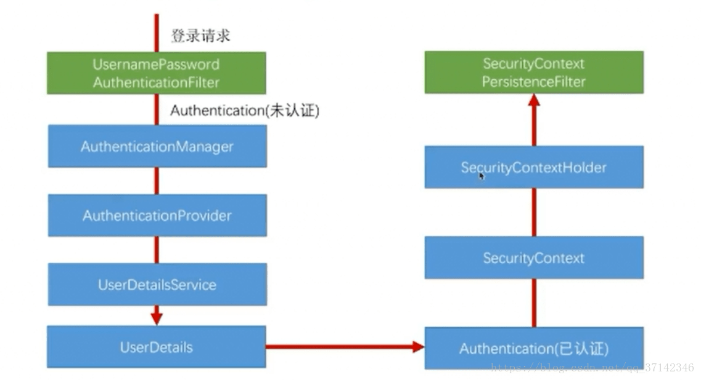
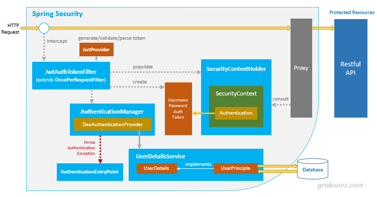

## 基本概念

Spring Security 主要解决用户的认证和授权问题，以及一些技术防护设施，例如 XSS、CSRF问题。

Spring Security 不仅仅解决权限和认证问题，还解决一些安全过滤，以及增加 HTTP 头部等能力。

基本概念

– SecurityContextHolder 存放认证上上下文信息 SecurityContext
– SecurityContext 存放 Authentication 以及一些请求信息，用于全局跨上下文访问
– Authentication  存放用户认证后的信息，用户名和权限列表
– UserDetails 用户信息，例如用户名、密码、是否过期
– UserDetailsService AuthenticationProvider 进行验证时，调用该服务获取用户信息
– UsernamePasswordAuthenticationToken 存放用户名和密码，用于后面的验证
– AuthenticationManager 支持多种验证方式进行验证，只要有一个验证通过即可，默认会加载 DaoAuthenticationProvider 进行验证
– AuthenticationEntryPoint 处理验证过程中的异常信息

### 主要验证流程




### 认证原理


- 用户认证阶段
  - 用户名密码认证过滤器
  - 初始化 AuthenticationManager
  - 循环验证  AuthenticationProvider
    - AnonymousAuthenticationProvider
    - DaoProvider
    - RememberMeAuthenticationProvider
- 凭证验证阶段
  - 获取 session 管理器
  - AccessDecisionManager 决定是否放行


#### 表单认证


- spring security 会注册 filter 然后提供 login page
- 用户提交后命中 userpassword 过滤器
- AuthenticationProvider 检查注册的 Provider

#### Token 无状态认证


- 设置 session 认证方式为无状态
- 每一次请求都拿从 redis、jwt 中取出的用户信息重新 auth 一次
- 无状态认证会带来一些性能的开销


## security 注册的 filter 

在 FilterComparator 中可以找到

```
	FilterComparator() {
		Step order = new Step(INITIAL_ORDER, ORDER_STEP);
		put(ChannelProcessingFilter.class, order.next());
		put(ConcurrentSessionFilter.class, order.next());
		put(WebAsyncManagerIntegrationFilter.class, order.next());
		put(SecurityContextPersistenceFilter.class, order.next());
		put(HeaderWriterFilter.class, order.next());
		put(CorsFilter.class, order.next());
		put(CsrfFilter.class, order.next());
		put(LogoutFilter.class, order.next());
		filterToOrder.put(
			"org.springframework.security.oauth2.client.web.OAuth2AuthorizationRequestRedirectFilter",
				order.next());
		put(X509AuthenticationFilter.class, order.next());
		put(AbstractPreAuthenticatedProcessingFilter.class, order.next());
		filterToOrder.put("org.springframework.security.cas.web.CasAuthenticationFilter",
				order.next());
		filterToOrder.put(
			"org.springframework.security.oauth2.client.web.OAuth2LoginAuthenticationFilter",
				order.next());
		put(UsernamePasswordAuthenticationFilter.class, order.next());
		put(ConcurrentSessionFilter.class, order.next());
		filterToOrder.put(
				"org.springframework.security.openid.OpenIDAuthenticationFilter", order.next());
		put(DefaultLoginPageGeneratingFilter.class, order.next());
		put(DefaultLogoutPageGeneratingFilter.class, order.next());
		put(ConcurrentSessionFilter.class, order.next());
		put(DigestAuthenticationFilter.class, order.next());
		filterToOrder.put(
				"org.springframework.security.oauth2.server.resource.web.BearerTokenAuthenticationFilter", order.next());
		put(BasicAuthenticationFilter.class, order.next());
		put(RequestCacheAwareFilter.class, order.next());
		put(SecurityContextHolderAwareRequestFilter.class, order.next());
		put(JaasApiIntegrationFilter.class, order.next());
		put(RememberMeAuthenticationFilter.class, order.next());
		put(AnonymousAuthenticationFilter.class, order.next());
		filterToOrder.put(
			"org.springframework.security.oauth2.client.web.OAuth2AuthorizationCodeGrantFilter",
				order.next());
		put(SessionManagementFilter.class, order.next());
		put(ExceptionTranslationFilter.class, order.next());
		put(FilterSecurityInterceptor.class, order.next());
		put(SwitchUserFilter.class, order.next());
	}
```

## HttpSecurity 配置规则说明

```
protected void configure(HttpSecurity http) throws Exception {
	http
		.authorizeRequests()                                                                
			.antMatchers("/resources/**", "/signup", "/about").permitAll()                  
			.antMatchers("/admin/**").hasRole("ADMIN")                                      
			.antMatchers("/db/**").access("hasRole('ADMIN') and hasRole('DBA')")            
			.anyRequest().authenticated()                                                   
			.and()
		// ...
		.formLogin();
}
```


- http.authorizeRequests()方法有多个子节点，每个macher按照他们的声明顺序执行。
- 我们指定任何用户都可以通过访问的多个URL模式。任何用户都可以访问URL以"/resources/", equals "/signup", 或者 "/about"开头的URL。
- 以 "/admin/" 开头的URL只能由拥有 "ROLE_ADMIN"角色的用户访问。请注意我们使用 hasRole 方法，没有使用 "ROLE_" 前缀.
- 任何以"/db/" 开头的URL需要用户同时具有 "ROLE_ADMIN" 和 "ROLE_DBA"。和上面一样我们的 hasRole 方法也没有使用 "ROLE_" 前缀.
- 尚未匹配的任何URL要求用户进行身份验证

## JDBC 验证

```
@Autowired
private DataSource dataSource;

@Autowired
public void configureGlobal(AuthenticationManagerBuilder auth) throws Exception {
	auth
		.jdbcAuthentication()
			.dataSource(dataSource)
			.withDefaultSchema()
			.withUser("user").password("password").roles("USER").and()
			.withUser("admin").password("password").roles("USER", "ADMIN");
}

```


如果需要提供自己的验证器实现 AuthenticationProvider

```
@Bean
public SpringAuthenticationProvider springAuthenticationProvider() {
	return new SpringAuthenticationProvider();
}
```

## UserDetailsService

```
@Bean
public SpringDataUserDetailsService springDataUserDetailsService() {
	return new SpringDataUserDetailsService();
}
```

## 定义密码加密方式

```
@Bean
public BCryptPasswordEncoder passwordEncoder() {
	return new BCryptPasswordEncoder();
}

```


## 给方法添加权限检查 EnableGlobalMethodSecurity 


我们可以在任何使用@Configuration的实例上，使用@EnableGlobalMethodSecurity注解来启用基于注解的安全性。例如下面会启用Spring的@Secured注解。

```
@EnableGlobalMethodSecurity(securedEnabled = true)
public class MethodSecurityConfig {
// ...
}

例如，通过  PreAuthorize 可以控制用户的访问
 @PreAuthorize("hasRole('admin')")
 @RequestMapping(value = "/user/", method = RequestMethod.GET)
 @ResponseBody
 public List<User> listAllUsers() {
   List<User> users = userService.findAll();
   if(users.isEmpty()){
   	return null;
 		}
 		return users;
 }
```


## 使用 token 方式鉴权




参考资料 https://grokonez.com/spring-framework/spring-security/spring-boot-spring-security-jwt-authentication-architecture-tutorial


## 相关资料

- 关于Spring Security中无Session和无状态stateless https://www.cnblogs.com/Mainz/p/3230077.html
- SpringSecurity原理剖析与权限系统设计 https://www.cnblogs.com/fanzhidongyzby/archive/2019/09/29/11610334.html
- Spring Security用户认证流程源码详解 https://blog.csdn.net/qq_37142346/article/details/80032336
- 中文文档 https://www.springcloud.cc/spring-security-zhcn.html#getting-starteda
- Config Spring Security for Restful API https://www.baeldung.com/securing-a-restful-web-service-with-spring-security
- https://spring.io/guides/gs/securing-web/
