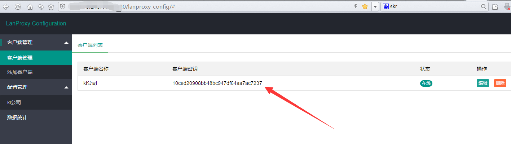
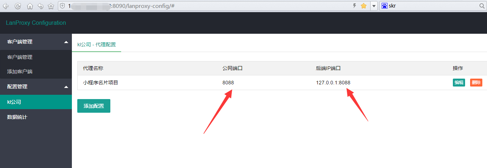

**前言碎语**

**lanproxy是什么？**

lanproxy是一个将局域网个人电脑、服务器代理到公网的内网穿透工具，，在github上面已经开源，目前已经收到2000多star。目前支持tcp流量转发，可支持任何tcp上层协议（访问内网网站、本地支付接口调试、ssh访问、远程桌面...）。目前市面上提供类似服务的有花生壳、TeamView、GoToMyCloud等等，但要使用第三方的公网服务器就必须为第三方付费，并且这些服务都有各种各样的限制，此外，由于数据包会流经第三方，因此对数据安全也是一大隐患。

github坐标 : https://github.com/ffay/lanproxy

**lanproxy原理？**

lanproxy是基于java通讯框架netty开发的，由服务端和客户端组成，服务端启动后，客户端会去连接服务端，然后和服务端建立tcp连接通道。服务端负责接收外部流量，然后根据配置的端口映射规则转发给客户端监听的端口服务（本地内网），从而达到内网穿透的目的。

**lanproxy下载地址？**

服务端：[proxy-server.zip](https://seafiled.io2c.com/files/98d54489-2dfc-46bb-b37b-e693468c2542/lanproxy-server-20171116.zip)

java客户端：[proxy-client.zip](https://seafiled.io2c.com/files/b47ca9c0-2639-4e32-a069-7af5054bf2e9/lanproxy-java-client-20171116.zip)，更多客户端类型，可访问：[https://seafile.io2c.com/d/3b1b44fee5f74992bb17](https://seafile.io2c.com/d/3b1b44fee5f74992bb17/?p=/lanproxy-client&mode=list)

**启动server端**

准备一台安装jdk的服务器（支持linux、Windows），需要有外网地址。下载server下来后，解压proxy-server.zip，进入到bin目录，执行startup.sh脚本就启动了，默认的访问端口是8090.用户名和密码是admin/admin。可以通过conf/config.properties修改。

访问http://ip:8090,就可以看到如下页面了

服务端启动后，需要添加客户端信息，客户端主要生成一个client.key，用来做连接的认证信息的。然后如下图，选择 一个客户端添加端口映射。

**客户端链接**

客户端下载下来后，先解压，目录结构和服务端一样，先去conf/config.properties中把server.host修改为你的服务端ip，服务端端口默认4900不用变。然后把第一步客户端生成的客户端密码配置给client.key。然后启动bin/startup.bat就可以了。如果连接服务器成功，管理控制台就会显示在线。然后就可以使用serverip:xxx来访问你的内网服务了
