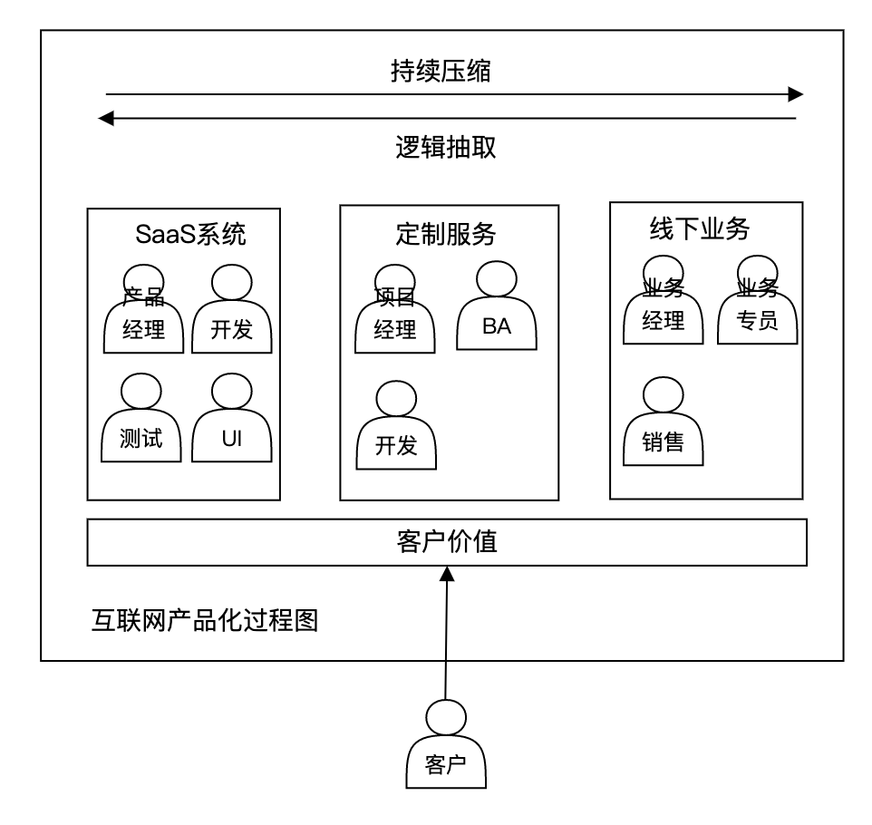
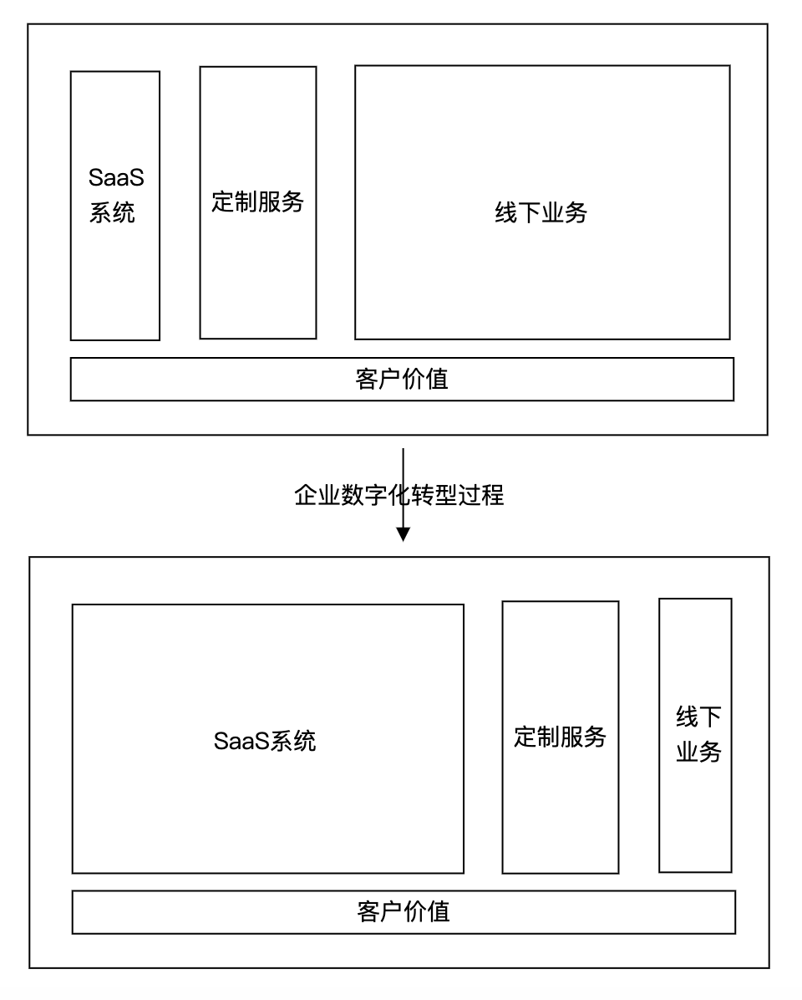
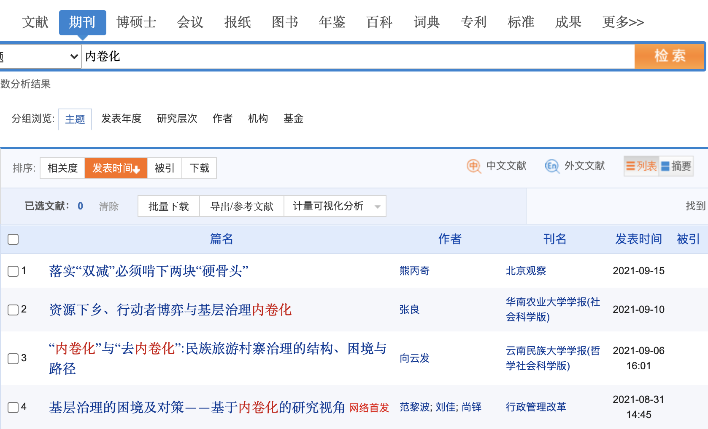

国内大多数在垂直领域的互联网公司基本符合这个模型，首先基于现有的线下业务市场做逻辑抽取，沉淀在 SaaS 系统中。并对不满足业务需求的特殊客户做定制开发。

产品经理的痛点往往在无法平衡定制服务和 SaaS 产品的诉求。

架构师的痛点在于，产品经理和业务分析师在对线下业务的抽取和分析的同时，可能加入了噪音，对架构的决策带来干扰。

对于传统公司来说，他们转型的难度来自内部和外部。

内部：原有的线下业务不可能放弃，利益冲突太大。

外部：具有互联网基因的创业公司的威胁。

新兴互联网公司的生门就在通过发挥计算机提高工作效率的本质（解放生产力）吃掉现有的线下业务（本质是零和博弈，甚至是负和博弈）。

用宏大叙事的风格来说：

农业的生产力被解放后，一部分农民变成工人，社会才能进行工业化。

工业的生产力被解放后；一部分工人变成信息工作者，社会才能进行信息化。

信息工作者就包括了产品经理、软件工程师、测试人员等从业者，加速了社会效率的提升。银行柜员、告诉收费站、餐厅服务员等传统的岗位被信息化设施用更低的成本取代。

效率提升，低层次的劳动力就会被淘汰，学历继而贬值，带来了这个时代独特的 “内卷”文化。

“内卷”本是一个学术名词，是一个哲学概念，更多的是使用 “内卷化” 这个词。在西方的哲学史材料中有时候会被提到，出自康德三大批判之一 《判断力批判》。

在文献库中可以搜索到大量的内容，大多用于描述社会基层和城乡环境相关的课题。

但是时代的趋势无法阻挡，正如工业产品是对小作坊的规模化和标准化一样，互联网产品也是对一些传统业务流程的规模化和标准化。在标准化服务成本快速降低的时候，个性化的服务的成本会上升。

互联网化会让社会生活变得愈发同质化。但历史是螺旋上升的，头部互联网公司又会把通用产品无法支持的个性化、垂直化市场空间留给小微企业和个人从业者。

