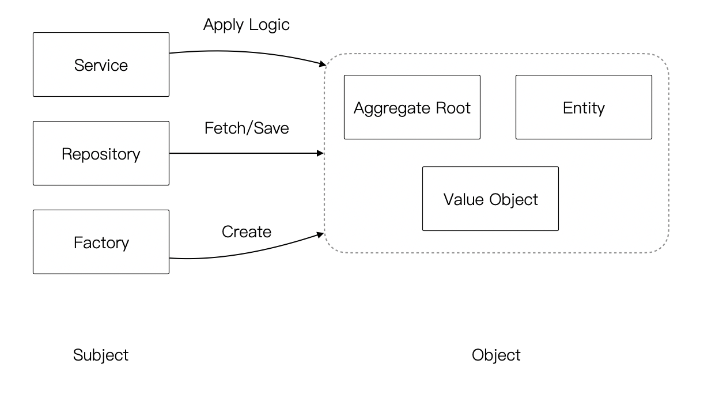
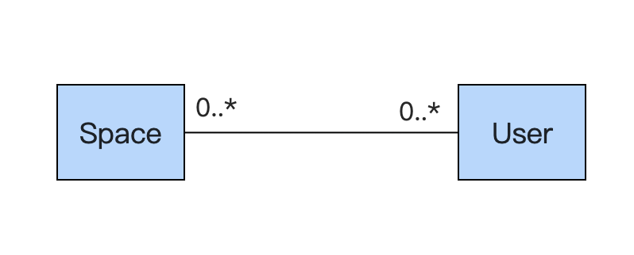
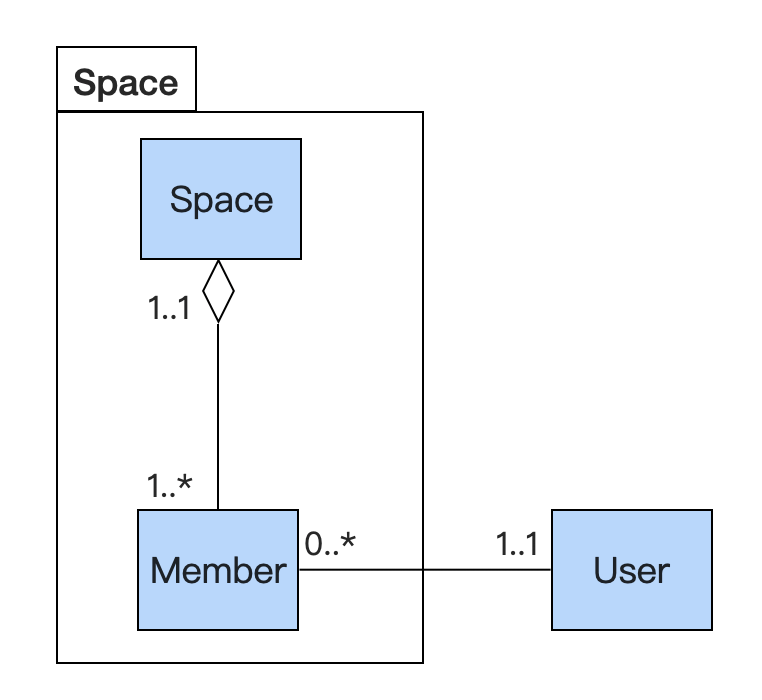
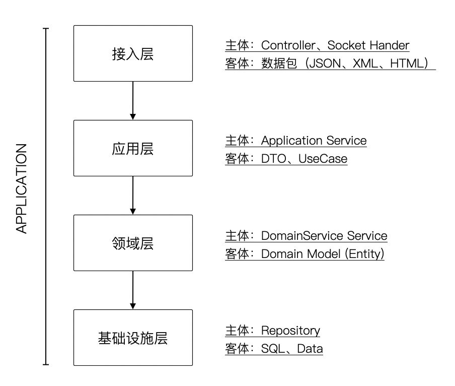

在现代软件开发中，基于面向对象的软件设计方法已经得到高度的发展。面向对象是一种基于对象对的编程范式，不同于过程式的编程范式，它可以让现实世界中的概念以对象的方式在软件中表达，极大的提高了软件工程师组织大规模软件源代码的能力。可以说面向对象是软件工程发展历史中的一个里程碑，加速了现代软件工程的发展。
但是，软件工程师以及其他软件工程从业者对面向对象的理解却不总是那么容易，理解和使用面向对象主要有两个难点：

1. 对面对对象背后的思想理解困难，面向对象本身的概念不容易理解。
2. 如何对需要分析的业务建立合适的模型，并良好的组织相关的对象。 

由于第一点在众多的书籍中有大量叙述，尤其是 UML 建模技术让面向对象的概念更加明确和形式化，相对容易解决。对于第二点，更多的是依靠软件工程师的经验和对相似案例的分析，缺少较容易操作的方法论，对初学者显得非常困难。

好在，计算机世界本身是为了解决现实中的问题，软件可以看做现实世界在计算机中的投影。本文将以哲学中的认识论为基础，为面向对象分析建立一个基本方法。认识论是认识现实世界复杂事物的好帮手，对现实世界认识越深刻，软件设计也越简单。

## 1 主体(subject)与客体(object)

在早期的哲学家眼里，把认识世界的方式分为了精神和实体，通过这种方式来认识精神对实体的作用，从而探究各种行为的发生。把那些不需要人类主动参与的运动，比如天体的运行，自然气象现象，都归结到一个全知全能的绝对精神，也就是我们常说的上帝。

其中一部分哲学家不承认上帝的存在，但相信宇宙有一个终极的规律，在推动事物运行，不受主观意识的影响，这是朴素的唯物主义者。后来的哲学家眼里把一件行为的发生一分为二来看待，把行为的施动者叫做主体，把行为的接受者这叫做客体，用更高的抽象方式描述世界，无论这个主体用什么方式描述。

主体大多数是人体，客体大多数是物。但是当某一个人是行为的接受者的时候，这个人也是客体，所以主体和客体不以时候是 "人" 来划分。在一次行为中某个人是施动者，所以作为主体。但在另外一个行为中，他是接受者所以是作为客体存在，所以主体和客体是相对的。

主体和客体的这种思维方式，已经深深的影响我们现实生活当中的方方面面，举一个例子，在法律的基本原理当中，大量的使用主体和科技的这种方式去描述责任的划分。但任何一个诉讼案件当中，都需要找到相关的当事人，对于分析一个违法行为时，需要便民这个行为的主体和课题。在法律当中主体和客体依然是相对的，主题也不一定是自然人，有可能是一个组织，或者群体。

在外语的翻译过程中，尤其是对英语的翻译研究，大量论文表示通过对主体和客体的分析，能够让英语的语义，更加具有逻辑和准确。在现代英语（古代英语除外）的主要语法是：主语 + 谓语 + 宾语 + 修饰语。想象一个你在一家餐厅吃饭，你点了一份三明治，用一般现在时就是：I order a large sandwich。在这套逻辑关系中，主体就是你自己，客体是三明治，行为是点餐，其他的内容都是修饰成分。

## 2 面向对象（OOP）中的主体和客体

软件是现实世界在计算机中的投影，那么主体和客体就可以指导基于面向对象的软件设计。

如果软件工程师需要编写一个软件用来处理订单，实现一个收银机功能。可能他会写一个 OrderService 来实现。伪代码如:


```java
class OrderService {
    public Order createOrder(User user, Product product) {
        Order order = new Order();
          ……
        return order;
    }
}
```
这段代码可能会被认为不符合面向对象，因为某些教科书中，Order 是需要自己来完成业务的，但是这样会带来各种各样的问题。实际上，在这段代码中，当我们认识到主客体关系时，一切豁然开朗。OrderService 是我们的业务主体，order、user、product 不过都是业务客体。和民事行为一样，业务逻辑也应该发生在业务主体中，这样就容易理解了。

除了 Service 之外，在服务编程中还有很多其他职责的类，比如：

- Controller - 负责处理 web 请求的类
- Repository - 负责持久化领域对象的类
- Factory - 负责创建或初始化对象的类

这些类就是主体，承担不同的职责，因此它们处理的客体也不一样。因此，通过主体和客体的建模方法的基本思想如下：

1. 将所有的类或者对象分为主体和客体两种。
2. 对主体确立它的责任边界和职责，对主体建立行为。
3. 对客体确立属性、关系，代表一个具体的领域概念。

因此，主体和客体是基于面向对象的软件设计中非常使用的一个方法。

## 3 主体和客体的具体应用

### 3.1 在代码结构和可读性上的应用

代码命名。



### 3.2 在模型分析上的应用

通过业务凭证法，对客体建模，分解多对多关系。






### 3.3 在分层架构上的应用
通过明确每层的主体和客体，定义分层。





### 3.4 在建模过程上的应用
通过主体和客体深刻认识到这点。

TODO 表格

### 3.5 在权限设计上的应用

所谓权限主体，就是可以拥有权限的概念，用户本身或者用户群体，如角色、岗位、部门等，都是对用户做群体划分；所为权限客体，就是可以被用来进行权限控制的概念，如：菜单、功能等。 

通过抽象权限主体和权限客体，就可以把复杂的权限模型简化成权限主体与权限客体之间的关系。有几个部分组成：

- 主体和主体提供者，由主体提供者提供主体身份，用户本身、用户的所属单位。
- 客体和客体提供者，由客体提供者提供客体对象，如菜单、功能。
- 权限控制器
- 检查规则


## 4 结语

## 参考

- 解析翻译中的主体与客体思维
- 主体与客体的辩证法略释_袁惠民

