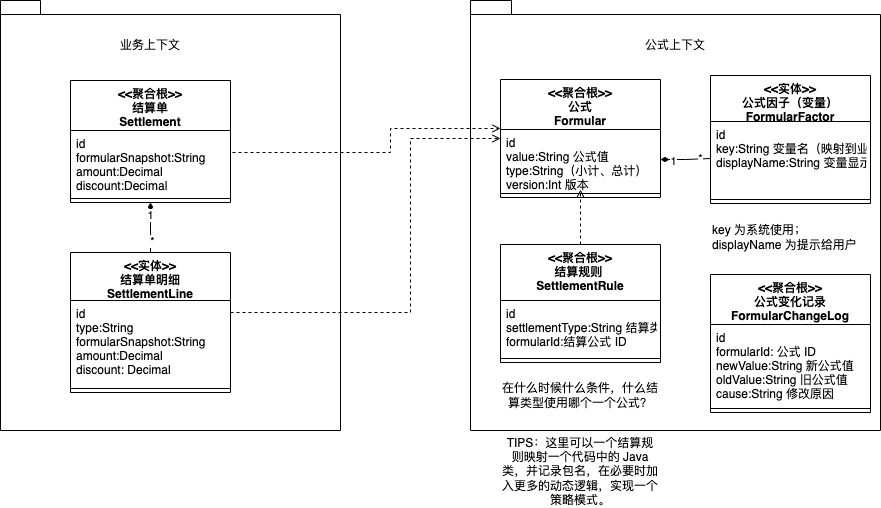

## 问题

假如一个保险、CRM 系统，财务结算模块的结算方式有如下特点：

1. 非常复杂
2. 类型非常多
3. 业务不希望把计算规则写到代码中
4. 当规则变化时不影响既往的业务单据
5. 业务希望看到每类单据的计算方式（计算透明化）
6. 希望规则能版本化，比如保险政策变化时候能够提示用户使用了新的计算规则

希望使用公式来解决，有一些特点：

1. 有一些常量、变量、计算量（子公式）
2. 小计（行公式）、总计（单头公式）、计算阶梯（规则）

使用公式涉及两个问题：

1. 模型如何设计？
2. 技术选型怎么做？

## 模型设计

## 技术方案选择

可以使用 Java 表达式引擎、规则引擎、JS 表达式引擎。

- Spring EL 表达式。Spring 项目自带，不怎么支持条件相关的内容。
- MVEL 表达式引擎。类似于 Spring EL 表达式引擎，需要自己引入，和 Java 代码风格接近。
- JS 引擎。可以使用 Java 自带的表达式引擎，可以使用 Js 脚本来写，更灵活没有类型。
- Easy Rule（规则引擎）。可以使用 MVEL、Spring EL、原生 Java，超越了表达式引擎的范畴。
- QL express。阿里开发的规则引擎。

优先推荐可以考虑 Spring EL，如果需要用户编写，可以考虑 JS 引擎，如果有非常多条件需求，可以考虑 Easy Rule。

## 模型

PS：图片可以使用 draw.io 打开并编辑。

## 录屏分享

链接: https://pan.baidu.com/s/14IRweo6pzT5ZJpT9wtTL0A?pwd=yc87 提取码: yc87

