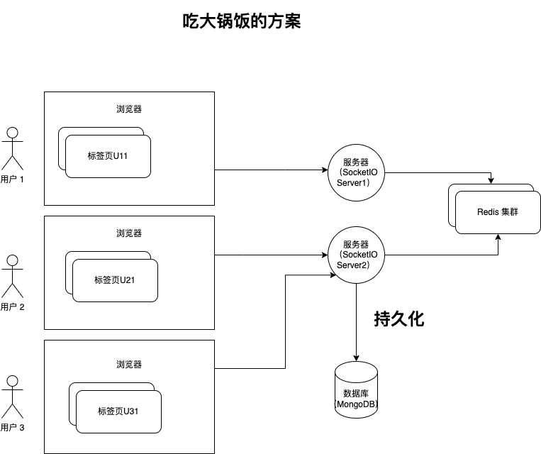

## 问题和场景

1. 在线点餐场景 
2. 在线绘图场景
3. 在线文档

## 技术方案

### Web 平台如何建立长连接？

- 定时重试，比如每隔 60s。（不常用）
- HTTP 长连接 COMET。前端发起一个 HTTP，后端挂起，在没有信息回填之前挂起请求，前端如果超时，自动重连（比如 1mins 会断，前端重连即可，看起来就是长连接）。在早期大量使用，低级浏览器和部分移动端浏览器。 
- WebSocket。通过 HTTP 握手，然后建立（Upgrade 过程）一个 TCP 连接，会有一套 TCP 层面的心跳机制。代表框架 SocketIO，可以支持使用 WebSocket 和 Comet 建立连接。Spring MVC 支持，可以使用 Starter，实际上用的 Server 容器的连接方式。
- MQTT JS，或者其他物联网推送的封装，提供一些持久化，QoS（根据服务质量，选择重传的策略） 的支持。其它的极光 PUSH API（XMPP 的协议）。

注意 MQTT 不是常规的长连接方案，有个特点，离线后再上线依然可以收到消息。MQTT 是个通信协议，背后不同消息中间件，kafka 需要增加 connector 支持这种协议。天然的选型有 EMQX、HiveMQ（Java 写的）。

补充：非 Web 技术的长连接如何建立？ 直接使用 TCP 套接字定义协议编程。UDP 也可以用的比较少。实现难度太高了，生产上问题非常多。

### 如何进行一致性处理？

点餐的场景下如何处理一致性？业务操作原子化+幂等，不让更新数量，而是修改为+-操作，最终一次性，可以其他人的操作。以服务器为中心返回最终计算后的结果。

在线绘图场景如何实现一致性？后端如何高速的合并数据？ 抽象图的结构，节点+边，以节点和边为原子单位，利用数据库的能力高速更新。（先到先做，后到先做的策）。

- 基于图数据库来原子更新。
- 基于文档数据库原子更新。

MySQL 的 Json 字段能做到，以字段粒度更新，但是有锁，性能差。MongoDB 可以做到以 Node 单位更新，性能好。图数据库也可以，比如 OrientDB、Neo4J 可以做到，性能未知。

文档场景如何实现一致性，比如在线文档、编程面试？OT 算法，CRDT 可以看做 OT 算法的拓展。

不管什么一致性策略，时间久了都会不一致，在游戏和一些协作算法会使用一个叫影子跟随的策略定期抹掉各个客户端的差异，并和服务器对齐，把服务器的最新版本往客户端拉取。

### 离线如何处理？

- 使用 MQTT 类似的方案把离线过程中的变化记录下，上线后发送到前端。（不推荐）会记录很多过时的操作数据，比如上周协作了一次，中间其他成员协作，今天线上会播放整周的数据，而且还会存在服务上。
- 离线后重新上线使用类似影子跟随的方式，获取服务器最新的版本。（服务器总是保存一份最新版本数据）。

### 同一用户多客户端（多标签页）？

在协作里面非常重要的概念，用户 != 会话，一个用户可能存在非常多的会话，所以协作的消息是通过会话发送的而不是通过用户标识发送的。

### 后端的数据如何流转，用户容量如何水平扩容？

假设，目前有 1 千万的用户，操作不同的协作画布，如何设计这个系统？

下图是 SocketIO 推荐的集群方案，Redis 集群可以被替换为其他的通信介质。

PS：图片可以使用 draw.io 打开并编辑。

另外一种方案（猜想，未验证）。

使用一种策略，将画布或者协作的对象映射到某个服务上，连接该画布的会话跟随这个服务器，并使用内存转发。

## 冲突解决算法

- 简单的先做、后做策略覆盖实现一致性（用的最多）
- OT 算法实现文档
- CRDT 算法实现一些操作和文档

## 框架

- Socket IO
- MQTT js
- EMQX
- Convergence.io 一套完整的实时协作框架，可以用于学习和二次开发，只不过数据库使用了 OrientDB，可靠性和可运维性不佳。

## 录屏分享

链接: https://pan.baidu.com/s/1Lz-TJ6aJSRR4pX8Dtr_9JQ?pwd=n9pi 提取码: n9pi 
