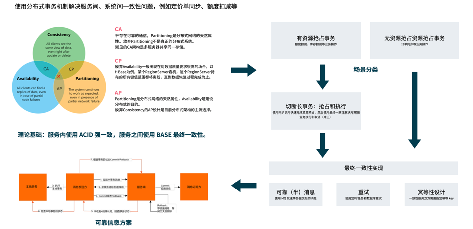

## 问题和场景

微服务拆分后，肯定有分布式事务问题，常见的分布式事务解决方案有哪些？

## 常见解决方案

原则：服务内强一致性（ACID），服务之间最终一致性（BASE），原因是基于 CAP 定理决定的。

跨数据库也能做到 ACID 事务，但是不推荐，这样必须使用中心化的数据库存储锁和 redo 操作，这样不是真的分布式系统了。

1. 冥等+定时任务
2. 基于 MQ 可靠信息实现
3. Seata 框架
   - XA\AT 方案
   - TCC
   - SAGA

假定：网上说的二阶段、三阶段就是指的 XA\AT 模式的原理而已。

## 概念的通俗化解释

1. XA： 利用数据库实现的集中短事务。基于数据库的 ACID 事务做全局事务和锁，需要事务协调器做中心化干预，两阶段提交都是说的这个模式，基于数据库事务管理 API 实现。本质上还是中心化的强一致性事务，有事务隔离性。Spring 对 XA 有支持。
2. AT：不太懂和 XA 更细节的区别。
3. TCC：全局长事务，将长事务拆分为两个短的事务。
   - prepare 行为做资源预占
   - commit 或 rollback 执行后续业务或者释放资源。
4. SAGA：全局长事务。
   - 只是一种设计思想，类似于以前红冲、冲正的概念。任意多阶段事务模式，其中一段失败，通知前面阶段，confirm 业务或者释放资源。
   - 编排模式（需要一个中心化的编排服务）、事件模式（每个事务节点丢事件即可）。

## 冥等+定时任务


```java
事务启动
本地业务
把要执行的远程任务写到数据库
事务提交
事务回滚

定时任务执行远程任务
```

普通冥等和定时任务实现最终一致性。冥等的实现需要两边有一个对等的对象，就可以。如果一对多就不行，两边的幂等 Key 是唯一对齐的，冥等的请求只要收到了成功就说明真的成功。

缺点：实时性太差。

## 基于 MQ 可靠信息实现

基于 MQ 的事务消息，把事务消息纳入本地事务，在提交后发出真的可靠消息。



原理：

```java
事务启动
发送半消息
事务提交
确认发送半消息
事务回滚
撤销半消息
```

## Seata 框架

https://seata.io/zh-cn/docs/overview/what-is-seata.html

## 设计误区

- IT 方，希望一套一劳永逸的 ACID 分布式事务方案，这个基本不可能，相当于用了 XA/AT。
- 拆了微服务就不要叫分布式事务，因为分布式下就没有技术上 ACID "事务"的概念，而是叫做最终一致性。在业务眼里还是一个事务。
- CAP 这不是一个技术问题，这一个逻辑问题。

## 思路总结

- 放弃一套一劳永逸的 ACID 分布式事务方案的幻想。
- 服务内强一致性（ACID），服务之间最终一致性（BASE），原因是基于 CAP 定理决定的，不使用中心化的 ACID 事务（XA/AT模式）。
- 区分业务为抢占性资源/非抢占型资源。
- 抢占性资源使用同步预占+异步取消/确认模式。
- 非抢占型资源异步的异步取消/确认模式。
- 异步取消/确认模式使用 MQ 或者定时任务在幂等的前提下实现最终一致性。
- 在遗留系统中无法实现上述逻辑，再考虑 SAGA 思维通过额外的工作量解决。
- 有些场景下直接在业务上体现抢占的思想。

## 其他问题和场景

- 最终一致性做到什么程度？多个服务之间存在多阶段编排，怎么保证最终全成功？服务重启，可能有些调用不会成功，是否需要补偿？举个例子，提交申请单后生成审批流；订单和库存服务，这种场景必然补偿使用最终一致性。
  - 尽量都做，涉及重要资产都做。
  - 如果没有做，人工实现
- 分布式的数据库可以考虑吗？
  - CouchDB：离线、多向同步，MVCC 算法。
  - TiDB
- 两地三中心、双活
  - 基础设施之间的问题，待专家分享
- 一个例子：订单中有爆品和非爆品之分，爆品短短之间锁定 SKU 的 quantity。

## 潜在话题

- 扣库存
- 离线对账

## 录屏

链接: https://pan.baidu.com/s/1fGAvQuTPWr04bkdqvFOMpA?pwd=b2nt 


