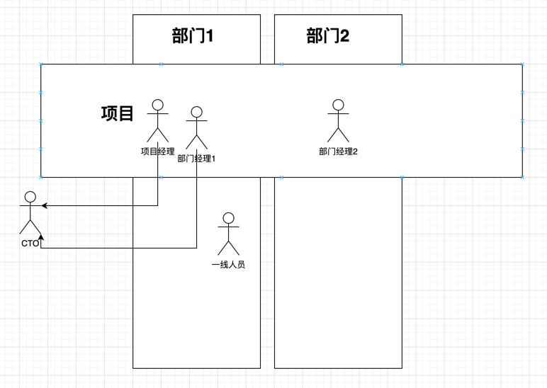
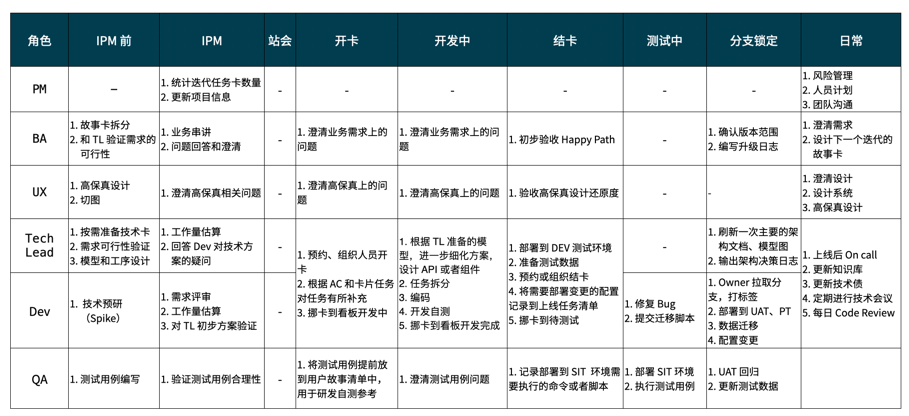

## 如何组织一个敏捷团队工作起来？

站在敏捷团队 TL 的视角看。

- 团队有哪些角色（主体）？
- 有哪些活动，在什么时候执行（行为）？
- 这些活动的结果是什么（客体）？
- 信息流动的方式是什么？

### 团队有哪些角色（主体）？

创业型公司（甲方）：

- PM。专门的 PM 或者 PMO 但是对项目的进展没有什么用，只是记录一些进度统计人天，和跨团队协调。某公司的实际领导为技术人员（架构师），但是请了外包作为 PM。权：基本没有权利；责：具有部分责任，比如延期，能否交付；利：几乎没有上升空间。PMO 更多的演变成敏捷教练，统一公司方法论，或者作为专项事务的牵头人，破除部门墙和削弱基层部门领导的影响力，这条线可以把更为真实的信息传递上去。
- 产品经理（Product Manager）。负责产品设计、特性排期。业务输入：线下业务流程，直接对接业务部门（B 端）或者产品运营部门（C 端），产品设计冲刺原型验证。工作产出是：产品规划方案（PPT）、PRD 文档（原型图、流程图、表格）、需求池。
- TL（Tech Lead）。负责方案设计、可行性验证、工时预估、团队建设、技术攻关、准备技术需求，详细设计由开发完成。工作输入：产品的经理的工作输出作为业务需求和上级技术领导的技术要求，比如性能和非功能性需求，工作产出是：技术文档（概要设计）、技术攻关的 Demo、绩效管理。大部分 TL 无需对接业务部门，前端 TL 更像一个副 TL，TL 需要参与开发，做 Code view。
- UX（用户体验设计师）。设计高保真、切图、体验设计、Style Guide、设计系统。输入：产品经理的草图、PRD 文档。输出：高保真。
- 开发（DEV）。输入是产品经理的业务需求，TL 的概要设计，做详细设计和代码实现。工作产出：详细设计、代码实现、研发自测（单元测试（类和方法）、API 测试）、Bug 修复、轮值 Oncall、技术白皮书（技术背景、关键方案、API 文档）、数据库设升级脚本、数据迁移脚本。
- 测试（QA）。保证软件质量，编写测试用例，执行测试用例、造测试数据。输入：产品经理的 PRD 需求。输出：测试用例、测试执行报告、E2E 自动化测试。额外人员会做性能测试、安全测试，一般都是专门的团队做。

关于 PM 职责的一个图例：

咨询型公司（乙方）差异的：

- PM。交付责任更强，且需要处理常规客户关系的问题，人天规模、进度、风险、工作方法（兼职了敏捷教练）、入场、退场、合同范畴（SOW）等等相关问题。商务相关一般 PM 不需要处理。权：人员评价，人事权（决定上项目）；责：项目的成功。利：明确的晋升路线，可以上去做大客户经理（也就是 PM Lead）。
- BA。一些公司特有的风格，做业务分析，一般是 TOB 才有 BA，因为有明确的业务对接部门，TOB 需要产品经理自己发挥一些内容。因为 TOB 是根据现有的业务线下流程设计的，而产品经理需要考虑 C 端用户习惯。甲方公司的产品经理往往有领域知识或者和特定行业相关。

### 敏捷团队有那些活动？

- 需求拆分：BA、产品提供需求
- IPM（迭代计划会议）：同步需求、估点
- Stand up（每日站会）
- Kick Off（开卡）
- Sign Off（结卡）
- Code Review
- 测试
- 分支锁定（UAT）
- ShowCase（UAT）
- 部署、上线
- On Call（轮流值守）
- Retro（回顾会议）

## 总结 

可以补充异常流程：

- 

## 录屏

有点敏感这期不放上来

