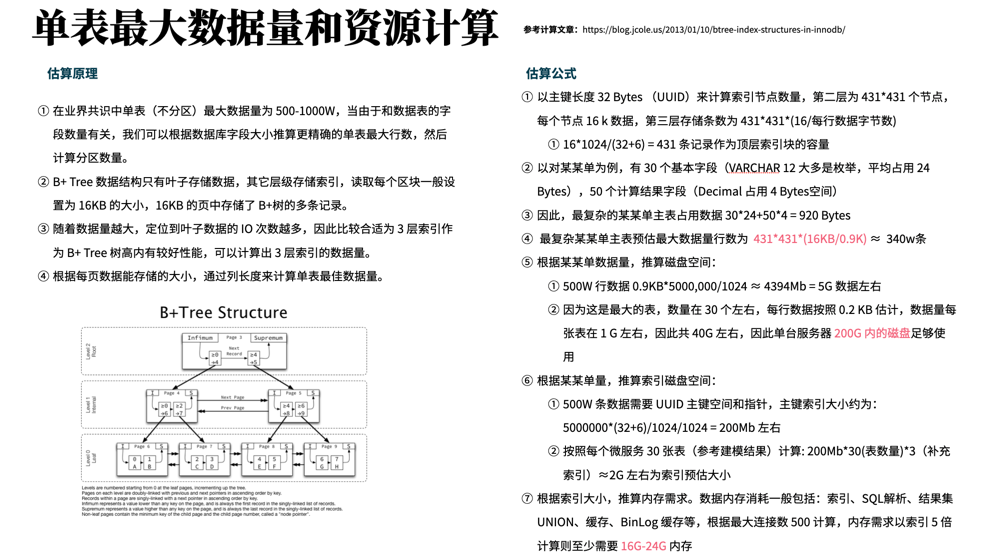

## 如何预估系统系统性能和容量估算？

- 无状态服务器资源和规格
- 数据库资源和规格
- Redis 资源
- 带宽
- 压测工具（AB、K6、Locust、jmeter）

## 预估无状态服务器资源和规格

计算参考指标：

- 日活：日活是登录过后的用户
- 在线用户数：最大并行用户数，不等于 QPS\TPS
- QPS：每秒的单次查询（查询 API）
- TPS：每秒的事务（更新、创建、删除 AP）
- 响应时间：一个 API 的响应时间
- QPS/TPS 高会导致响应时间增加
- 吞吐量：QPS/TPS 高吞吐量会升高，每秒钟输入输出的量
- 内存使用率：

- 什么是日活（UV）？日活是登录过后的用户，这个对算性能需求不高，估算容量可能有用。
- 在线用户数？怎么算在线？业务理解一直在用的用户，技术上怎么理解？同时操作这个概念怎么量化？一个在线用户会产生多高的 QPS？QPS/在线用户的比值，微服务拆分后比值可能会上升，一般会有 4-5 个 QPS。这个需要根据场景定，这个往往是估算关键系数。
- 峰值用户？根据访问情况可以统计，B 端业务系统，一般是 10-12 和 14-17 两个段。如果一些早晨打卡，峰值比例会不一样。简单的算法可以使用 2-8 原则。
- 算出 QPS/TPS、吞吐量。假如日均在线用户 1W，TPS 系数一般会是 1（抢票场景），QPS 系数 3，1W TPS，3W QPS；根据 2-8 原则计算出峰值需求，乘以 4 左右。上面系统的估算结果是 4W TPS、12W QPS。
- 算出 CPU、内存、网络带宽。网关转发：单个 K8s Pod（4C8G）4000-5000（Spring Boot），Vert.x 或者 Nodejs 会更高，4-5W 左右没问题。领域微服务性能：500-1000 左右。如果需要 2000 QPS，需要至少部署 4 个 pod 左右。

## 数据库资源和规格

## Redis 资源

- 什么时候用哨兵?什么时候用集群？
- 哨兵是高可用单机，集群是分片，C端项目上用集群，B端哨兵。

## 带宽

- 业务上有大文件传输，需要更多带宽。
- 例子：几万商户收银机，百兆网络（互联网出口）。

## 排查思路

- 应用服务 (APM)
  - API 响应时间
  - QPS/TPS
- JVM
  - 内存分布
  - 堆栈
  - 线程
- 中间件
  - 数据库慢查询
  - Redis 慢查询（大 Key、扫描 Key）
  - 死信队列
- 操作系统 (监控系统)容器
  - 内存
  - 磁盘
  - 链接符

## 参考资料

分享几篇参考文章：

1. Mysql 资源计算器 https://www.mysqlcalculator.com/
2. B+tree InnoDB 数据结构 https://blog.jcole.us/2013/01/10/btree-index-structures-in-innodb/
3. 一口气搞懂MySQL索引所有知识点 https://www.51cto.com/article/629382.html
4. 掌握MySQL的B＋Tree索引暨如何计算索引树高度 https://cloud.tencent.com/developer/news/373193
5. MySql分区、分表和分库 https://www.cnblogs.com/zwtblog/p/15332735.html#mysql%E5%88%86%E5%8C%BA%E7%B1%BB%E5%9E%8B
6. 每日一面 - 从 innodb 的索引结构分析，为什么索引的 key 长度不能太长？ https://cloud.tencent.com/developer/article/1811696
7. 一本书《Web容量规划的艺术》
