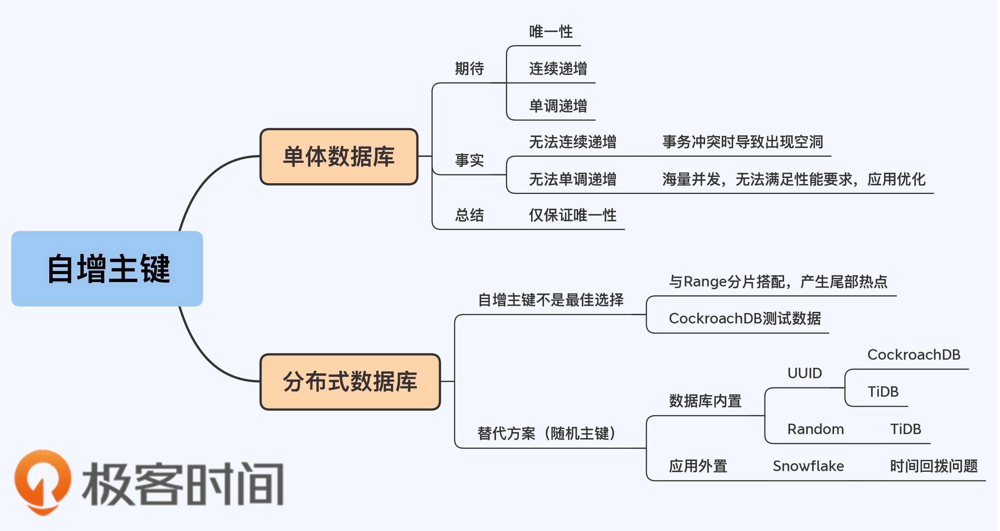

## ID 类型的选择和生成方式最佳方案是什么? 自增 ID 还是 UUID/ULID？

## 案例输入

王喜春：使用自增 ID，因为习惯使用数字的自增 ID，好沟通。使用 UUID 的缺点是 1.不好沟通 2.性能方面考虑不如数字。案例为京东，2B、2C 项目，选择上没有特别的原因，更多的是技术惯性，没有人特别关注和分析。

邓老师： UUID 的优点是不需要在数据层面创建并取回可以直接在对象构造时就能创建，不可被枚举和猜测。但是安全不应该建立在别人猜不出来上。案例为项目上使用自增 ID。

李本波：因为技术惯性使用了 UUID 作为 ID（32 位），项目背景为公司内部项目，没有分库分表需求，技术惯性造成的决策。

## 分类法和概念澄清

- 根据业务用途：数据库 ID（相当于小名）、业务编码（相当于大名）
- 根据实现方式：数据库自增集中实现（自增 ID）、内存算法实现（UUID等）

## 自增 ID 的坑？

- 数据迁移时，难以唯一标记数据。解决方案是生成一个额外的 UUID key，比如，省市数据，不依赖自增 ID 识别数据。 
- 需要先持久化才能从数据库拿到结果，在 ORM 使用上不方便。
- 如果有幂等性要求的时候处理不方便，UUID 可以更加方便，可以直接使用 UUID 作为目标业务的主键来实现幂等。

## UUID 的坑？

1. UUID 依赖时间、主机名作为因子，在配置不良的情况下可能存在重复，这个概率比较小。推荐使用雪花算法。
2. 需要解释和说服别人比较困难，特别是如果没有分库分表的需求。

## 问题

- 如果已经使用了自增 ID，如何做分库分表? 
  - 增加一个 UUID key 作为全局唯一的数据标识，并将其他关联的地方修改为 UUID，完成后可以移除掉 UUID。
  - 使用 Range 的方法，给每个分区分配一个自增的起始数字，例如 TiD 采用了这个方案，业界很少实现。 
- 外部系统怎么暴露 ID？自增ID？UUID？业务 ID？ 
  - 优先暴露业务编码，如果没有业务编码，生成一个 UUID 作为 key 来标识数据。外部系统不应自己的技术细节造成干扰，内部（一个产品，产品可以独立承接业务）系统（微服务、前后端）可以使用自增 ID。 
  - 如果业务编码能保证唯一且不变的前提下，就不再生成自增 ID，这样没有必要且容易产生迷惑。（软删除、草稿需求往往不能保证业务编码不重复，业务编码往往需要复用，所以还需要自增 ID）
- 新的系统如何选择？用 UUID 还是自增 ID？ 
  - 如果使用 NoSQL 默认就是 UUID。 
  - 看业务规模，如果业务规模不大（没有分库分表的需求时）使用自增 ID，如果活跃数据量达到上亿考虑分库分表。 
  - 如果业务规模和团队习惯已经使用了 UUID，在充分考虑的情况下，可以使用 UUID。 
  - 微服务的背景下为了服务之间的幂等、最终一致性等诉求，UUID 更加方便。 
- 表关联使用业务编码还是数据库 ID（假设这两个值不重合）？ 
  - 一般使用数据库 ID 关联，比如订单 ID 和订单号，优先使用订单 ID 关联，如果需要优化查询的场景，按需冗余业务编码（非必要不使用）。 
- URL 上使用业务编码还是数据库 ID？ 
  - 没有特殊要求的时候使用数据库 ID，有特殊要求（例如外部系统）的时候使用业务编码。 
- 为什么很多公司从自增 ID 换到了 UUID？ 
  - 为了实现在分布式场景下的规模下拓展，例如多个应用服务、跨数据库实例唯一性。 
  - 在经验里，创业公司一般使用自增 ID，互联网大厂都一般使用 UUID，由大厂的风气和影响造成的决策。 
  - 因为使用了 NoSQL，主流的 NoSQL 是分布式数据库（MongoBD 不是一致性优先，它是可用性和性能优先）

## ID 的常用注意事项

- 使用 UUID 需要去掉中横线（32 位），有中横线会无法排序等一些问题。 
- 在分布式的情况下 UUID 不一定就比自增 ID 的性能差，因为 UUID 生成不依赖数据库主节点。

## 参考资料

- 17 | 为什么不建议你使用自增主键？  https://time.geekbang.org/column/article/285819?utm_identify=geektime&utm_source=geektime-web&utm_medium=adzone&utm_campaign=qconp&gk_source=qconpgeektime-web&utm_term=0222&screen=full

- 
