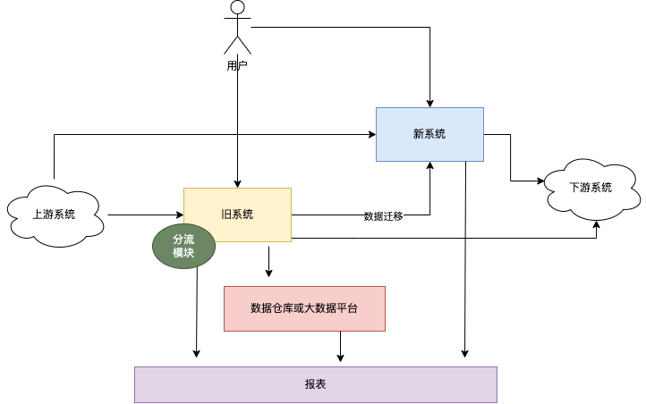
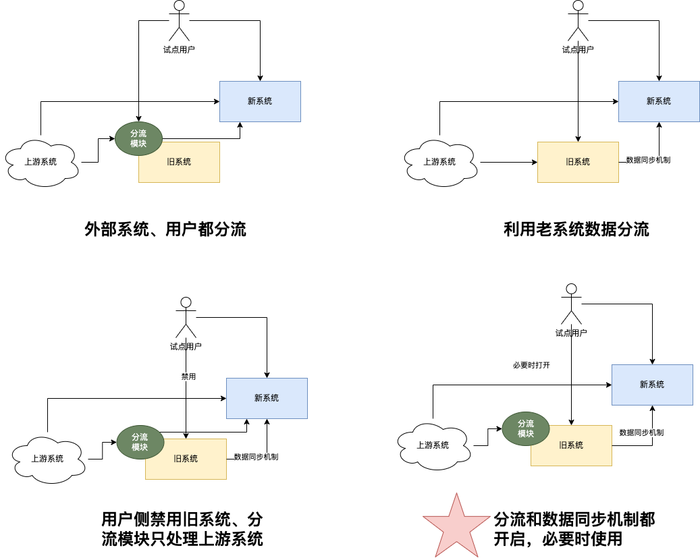
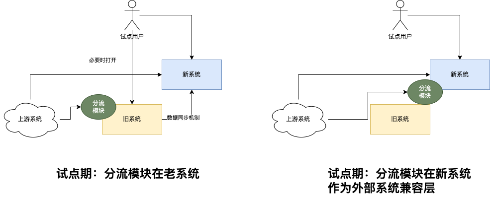

## 如何改造一个遗留系统，且安全切换？

考虑点:

- 切换规模
  - 模块级和特性级切换，可以使用同库双写策略
  - 系统级别的切换，可以使用不同库**单向**同步数据策略，下面的讨论都是系统级切换讨论
- 业务容忍度
  - 是否能停服，停服周期时长（一晚上到两天）
  - 如果不能停服，是否能暂停部分功能，比如微信头像数据迁移，三天内用户不可以换头像
  - 完全透明切换
- 切换点
  - 用户
  - 上游系统（数据流入，依赖 API 取数、暴露的 API）
  - 下游系统（数据流出，数据推送和回传）
  - 报表
  - 数仓（通用数据集市）或者 MDM（主数据管理，基本维度数据）
- 数据迁移
  - 把存量数据整合到新系统中
- 新老系统并行（一般默认新老系统说的是数据库都要切换）
  - 试点（两个系统同时运行）
    - 试点用户去新系统作业把老系统关闭
    - 试点用户可以同时新老系统作业，通过数据同步或者双写机制进入新系统
      - 老系统把试点用户流量分流然后调用新系统，避免数据双写
      - 老系统仅仅把暴露给外部系统的 API 分流（API 相对用户侧要少一些）
  - 数据同步
    - T+1 数据交换
    - 准实时数据推送（CDC 技术）
- API 兼容
  - 契约测试或者 API 测试
  - 切换到新系统需要做 OpenAPI 兼容层
- 回退策略和预案
  - 如果试点期间新系统不可用怎么回退
    - 因为新系统总归能修好，只需要保证老系统能重新开放作业，并把老系统的数据同步到新系统（手动、T+1 自动、准实时）
  - 退回后数据怎么处理，是否两个系统数据要打通或者双写
    - 作业数据单向从老系统到新系统
    - 统计数据，使用大数据平台，由第三方参与者 T+1 完成
- 切换时机选择
  - 根据某个颗粒度（比如组织、租户、机构）
  - 业务单据的生命周期完成情况，比如审批完成、单据完成
  - 窗口期选择
    - 停机迁移
    - 无感知迁移
- 其它问题
  - 流量需求，新系统开发过程中，老系统也有业务需求承接，需要经常加入到新系统中，尤其是新系统切换时间长

## 切换方案

### 切换示意图

### 切换策略

### 切换阶段

分流模块切换的前后概况：

为什么考虑分流模块只给外部系统用：

- 外部系统的 API 往往远远小于给用户的 API
- 虽然给外部系统 API 少，但是接入的系统多，而给前端的 API 只有一套
- 用户侧可以引导很快切换过去，当时外部系统的改造周期非常久，这样分流模块可以在新系统中作为兼容层继续存在
- 外部系统 API 团队难以干预，所以需要长期支持

切换的多个阶段（上多少次线）：

- 上线前准备
  - 编写完整的 API 测试或者契约测试
  - 编写数据同步脚本（全量同步老系统→新系统一次，后续同步使用增量，是否需要新系统同步到老系统基于业务要求即可）
  - 充分测试开关开启或关闭的两种情况
- 第一次上线：分流模块启动，不开启任何流量切换
- 第二次上线：分流模块灰度值更新，切换试点用户流量，或者关闭老系统给试点用户的访问权限
- 第三次上线：分流模块灰度值 100%
- 第四次上线：分流模块移动到新系统
- 第五次上线：老系统停服
- 后续上线，驱动外部系统使用新系统的 API，代替兼容层 API 

### 切换回退策略(通知用户后的回退，不是上线回退)

识别回退条件和标准：

- 通过产品运营指标项来进行监控，比如通过点击率、点击失败占比
- 分流模块功能开关，通过观察流量实现
- 1 天之内修复

回退老系统（尽可能不要做，尽量往前走及时修复新系统的 Bug）：

- 提前做好两边的所有的配置
- 新系统做单未完成，但是新系统无法工作了，新系统单据作废即可
- 新系统做单完成，后续业务无法进行
  - 数据暂时留在新系统
  - 手动去老系统用同样的数据做一笔单，利用数据同步机制流向新系统，以便新系统再次开启

## 录屏

链接: https://pan.baidu.com/s/1tq4HSli5YtCmnJfonMefpw?pwd=ia9a 提取码: ia9a 复制这段内容后打开百度网盘手机App，操作更方便哦

## 参考资料

- 《新旧系统转换策略》 https://blog.51cto.com/u_15072920/4172710
- 《聊聊遗留系统改造的“道”与“术”》https://cloud.tencent.com/developer/news/837125
