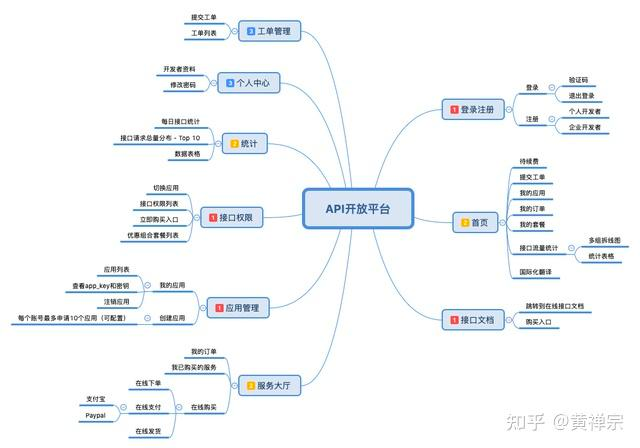

## 如何提供一套开放 API？

OpenAPI 不是 Swagger 的 OpenAPI 规范，而是一套开放的 API。

需求来源：

- 内部需求：提供内部的应用集成，往往方便一些系统的上下游集成，通过 API 市场承接关键的通用 API，并提供标准化的接入形式，比如通知服务、主数据服务等类似服务。通过注册、订阅的方式高效集成
  - 例子：
    - Thoughtworks DPS（Digital Platform Strategy） 中关于 API 的策略
    - Thoughtworks API as Product
  - 计费问题：如何评估内部 API 的价值
  - 耦合问题：服务被使用方依赖和耦合
- 外部需求：有生态需求的企业，开放部分能力，整合外部能力和资源
  - AWS API 市场

提供形式：

- 开放平台，作为生态核心存在，建立行业的上下游关系，平台拥有者也参与服务提供
  - 小米智能家具
  - 微信公众平台
  - 收银系统的开放平台
- API 市场，提供集成能力和标准，作为中间商的角色，撮合服务提供方和消费方，提供统一的鉴权等公共服务
  - AWS API 市场
  - 百度 API 市场

Ideas：

- 前后端分离利好开放平台
- EDI：电子化数据交换平台

SDK 分类：

- 三方包，外部包
- 二方包，服务之间自动生成 SDK 并发布
  - 通过 Feign 实现
  - 通过 RPC 的实现

## 方案枚举

考虑点:

- 在微服务语境下，OpenAPI 可以看做一种给外部系统使用的 Portal，可以直接调用后端领域服务。不能是简单的 Gateway：
  - 要处理特殊的鉴权（主体关系为 M2M，不是用户为主体）
  - 系统接入：发布、订阅使用
  - 用量管理
  - 流量控制
  - 安全规则
- API 鉴权和接入注册（通过开发者账号实现 M2M，机器对机器）
  - 自定义 AK/SK 模式，通过签名的方式实现鉴权，首先是检查来源是否可信，再解析用户上下文
    - HAMC、DES
    - 国内监管要求要使用国密
  - OAuth2 模式，如果需要共享用户
    - OAuth2 Server 模式
- 用量管理和计费
  - 控制特性、数据范围
  - 计算调用量，高性能实现 API 计数，怎么存储
    - NGINX Lua 脚本实现，解析 HTTP 的 Auth 来关联统计身份，累积到一定程度后发回应用服务。例如 OpenResty 有相关的实现
  - 计算用户流量
    - 应用层统计：通过 HTTP 包应用层上获取 Header 计算即可，因为如果调用者修改了 Header，第一个四层网关，NGINX 会被掉丢掉，也可以通过 Lua 实现流量统计
    - TCP 层流量费用：依赖软路由或者硬件实现
- 版本管理（开放 API 升级如何管理）
  - 语义化版本管理 Semver 版本化 
- 测试验证
  - 契约测试来做
  - 使用 Mock 实现
  - 使用影子流量
- API 市场
  - 内部，对内提供服务，提供一套内部集成方案
  - 外部，对外提供服务，有生态需求的企业都会
- 开源框架（没有特别成熟的平台）
  - 基于 Spring Cloud Gateway 包一个 UI、接入管理、鉴权【推荐】
  - 开源的 https://www.phalapi.net/
  - 商业的 Mule API 网关
  - 微软的 API management
  - Facebook Marketplace API
- 管理平台（给运维人员使用）
  - 接入管理
  - 应用管理

管理平台功能清单参考：

难度不在管理平台上，而是一个流量控制这部分。

参考架构组件：

- 基于 OpenRetry 的 Nginx 流量控制（Lua）和调用量统计、计费等
- 基于 Spring Cloud Gateway 的基本框架（响应式）
  - 整合 OAuth 鉴权系统
- 基于 Spring Boot 的管理平台
- 后面接入具体的领域微服务和业务系统

## 参考资料

- https://baijiahao.baidu.com/s?id=1760784996277240318&wfr=spider&for=pc
- https://baijiahao.baidu.com/s?id=1760964848703266584&wfr=spider&for=pc
- https://www.zhihu.com/question/21054511/answer/2567199711
- https://blog.51cto.com/u_14014612/5995533
