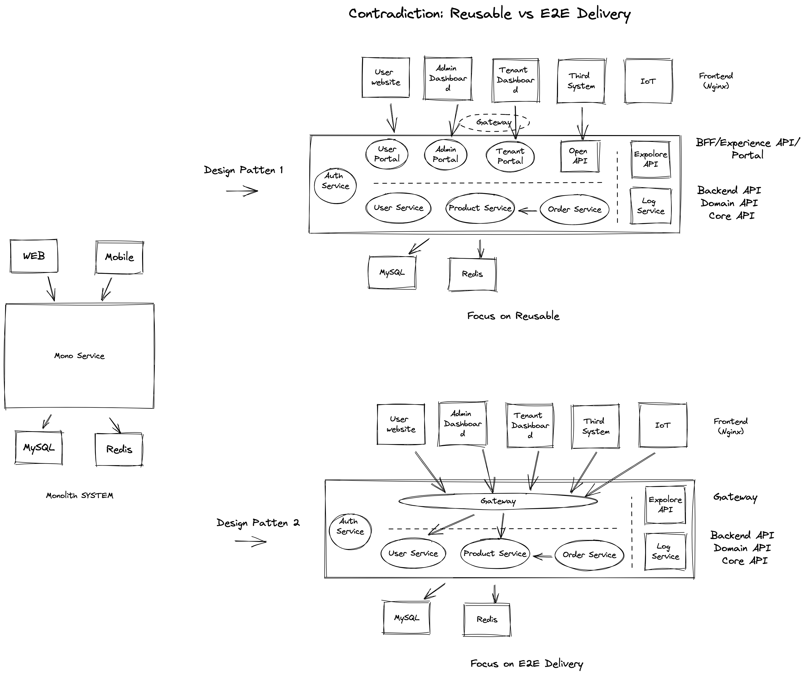

## 典型微服务的结构

水平分层：

- Gateway: 流量分发，更像是基础设施，可以做一些通用的能力，不解析业务数据个，不介入业务逻辑。
- Portal Service：编排业务逻辑、聚合的业务逻辑，和场景相关。
- Domain Service：通用业务逻辑，领域内的业务逻辑，和能力相关

垂直分层：

- Portal 根据业务应用（面）分层。
- Domain 根据领域能力划分。

Gateway 和 Portal Service 的区别关键是**是否侵入业务逻辑**

## 案例输入

TODO 

## 问题

**为什么需要做微服务？**

- 规模（程序、团队）太大，必须拆分
- 复用，将领域服务剥离，提供通用能力，避免重复代码
- 弹性能力不一样，比如定时任务、数据同步能明确的技术诉求，能进行拆分（不是一个必须的原因）
- 非技术因素（不讨论）

**认证检查放到哪里来做？**

auth client 的角色（解析 token 的相关职责），放到 Gateway、Portal Service？

- Gateway：比较简单的情况下对于 Portal、Domain Service 来说透明了，不关心认证，直接获取 UserContext 的身份。而且网关必须使用应用层网关，编程体验比较差。
- Portal Service：不使用 Gateway 来进行权限检查，可以在 Portal 

**应用 Gateway 和 Portal 如何选择？**

- 应用 Gateway 就是一个，做一个大的 Portal，代价是分布式单体，各个端不同的逻辑无法区分，场景逻辑可能会落入领域服务中，领域服务的复用性变差。 
- 使用 Portal 好处是每个端做了区分，可以把端的特定编排逻辑限定在 Portal 中，代价是服务会变多，失去端到端交付能力，但是获得了领域服务的复用。

推荐使用 Portal 模式。

## 一些共识

**网关**

分发流量的技术组件，和业务逻辑无关。

- 网络层网关：Ingress、Nginx、Kong、Traffic，根据 URL、IP 分发流量。
- 应用层网关：Spring Cloud Gateway、Zuul，根据业务规则、版本、用户群分发流量。

网络层的网关可以通过一些插件来变成应用层网关，比如通过 Lua 脚本编写插件。

**核心矛盾**

端到端开发的能力和领域能力复用的矛盾。

## Parking lot for next time 

- 数据权限和功能权限怎么区分
- 微服务中团队分工
- 认证和授权

