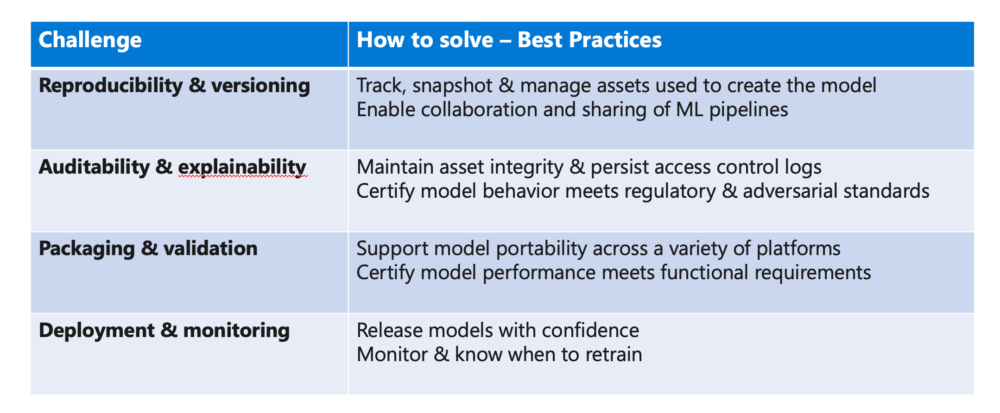
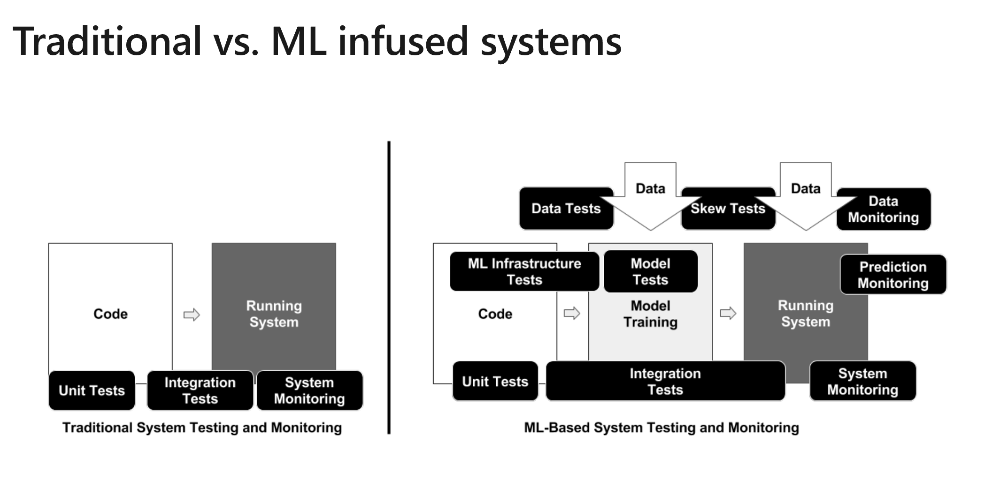
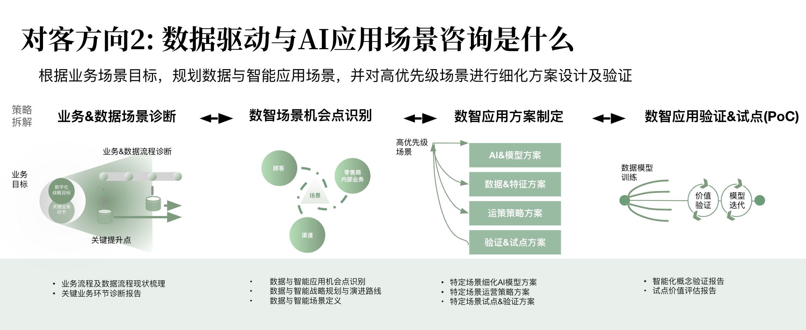

## 背景

越来越多的智能场景需要被架构。

## 智能应用系统的架构长什么样，应用、算法、数据如何被集成的？

智能应用系统的一般定义：从外部系统看起来像"人"一样完成某些特定任务，例如智能客服、智能识别。
智能应用系统的另外定义：强依赖于算法的结果，区分于交易系统。

### 应用业务系统在作业时高效的调用算法？

- 算法会被以什么形式部署？
  - 独立的系统，通过 API 调用
    - 特殊资源需求，例如 GPU，或者一些超算的应用、特殊时钟信号的
    - 资源需求量大的场景，CPU、内存
    - 机器学习的部署分为两个阶段：
      - 训练阶段： 一般使用 Python 实现
      - 预测阶段：会做一些 Native image 的工作
    - 产品化后的阶段，可以使用 Cython 将 Python 翻译为 C 
  - 服务器 SDK lib 嵌入到应用中
    - 小规模的算法，一般不是机器学习的算法，例如离线的 OCR
    - 图片处理的算法 OpenCV
    - 一般使用应用所使用的语言（Wrapper），调用 native 的程序，例如 C，即使使用 Python 的语言的算法，产品化后会使用 c/C++ 来承担
  - 客户端应用 SDK lib 【在架构上没有什么特别的】
- 模型管理
  - 模型和代码拆分, K8s 启动后将模型下载下来。
  - 模型的效果如何进行对比？
    - 通过线上指标验证，在上线前验证线下指标验证
    - 监控用户输入是否变化

### 应用系统、数据平台、算法系统的数据流如何打通？

- 数据分类
  - 离线：过去的用来做训练的数据集，实时性 T+3 或者 T+5，一般用于训练模型
  - 准实时数据：线上来不及实时处理的数据，允许延迟处理，例如用户的个性化推荐
  - 实时数据：实时处理用户输入，例如搜索的收录过程往往是实时的数据
- 数据流：
  - 离线数据：伴随模型和算法版本更新，手动完成的，借助数据湖、数仓完成。适合离线学习，严格将训练和预测分为两个阶段，例如 ChatGPT，其模型为今天模型。 整个过程包括应用数据抽取、入仓、数据编制、出仓作业、模型输出。
  - 准实时数据：一般用于在线学习，即模型的训练和预测发生同一个阶段，一般可以使用流式计算 Flink 框架。 
  - 实时数据：一般用于搜索收录。

## 业界有哪些智能应用？

常见的智能系统应用：

- 智能客服
- 智能识别 OCR
- 运力智能调度
- 垃圾邮件识别
- 风控
- 人脸、生物活体识别
- 用户产生内容生成违规识别

分类：

- 结构化数据
- 非结构化数据
  - 知识图谱
  - NLP
  - CV
  - AIGC
  - AGI

## 智能应用的主流技术选型（语言、框架、平台、工具）有哪些？

**语言：**

Python、Julia（内存加载上性能更高，未来的方向）

**框架：**

数据准备框架： 

- Pandas: 数据准备框架
- Numpy: 用来处理数据和科学计算的 Python 库

深度学习框架有： 

  - TensorFlow
  - Pytorch
  - PaddlePaddle 百度飞浆
  - Keras 低门槛的深度学习框架
  - Cuda 英伟达的深度学习框架

AI 模型的运行时：

- ONNX 协议：规定了深度学习的模型数据结构，用于跨框架迁移
- 运行时：TensorRT

常见的非深度学习的算法框架：

- OpenCV：视觉
- scikit-learn：结构化数据算法的实现，例如聚类
- 决策树：LightGBM、XGBoost

**平台：**

- JupyterLab: 交互式编程平台
- Databricks： 数据和智能平台
- AWS Sagemaker：AWS 智能平台
- PaddlePaddle 百度飞浆
- 企业内部 AI 中台：
  - 多模型集成平台：将多个模型或者 API 进行整合的平台
  - 模型训练平台

**工具:**

- Pycharm:  JetBrain 公司的 Python 开发 IDE。
- Jupyter Notebook： Jupyter 平台的开发工具。
- Conda/Anaconda：AI 运行环境管理。 
- HuggingFace： The AI community building the future，一个经常发布模型的工具和平台。

## 主流智能应用的团队组成和分工？

和 AI 相关的角色： 

- Data Engineer：数据工程师，ELT、数据平台搭建、环境准备，包括数据环境和硬件环境。
- Data Scientist：数据科学家，线性回归一般作为分界标志。
- Data Analyst： 数据分析师，特点不做算法，只做数据分析，用 R、Excel、SPSS。
- Algorithm Engineer：算法工程师
- Devops: 系统工程师，操作系统搭建、运维、性能调优
- 架构师：和其它项目类似
- BA：和其它项目类似
- 领域专家：和其它项目类似

团队设计：

- 端到端团队：全功能角色都在一个团队，优势是贴合业务、数据
- 分部门的团队：应用、数据、算法分组。【传统部门划分，算法组往往分开，AI 时代需要深入应用、领域，非常依靠数据的能力】

## 补充概念

- AIOps/MLOps： AI 工程化和运维
- AutoML： 根据挑选算法自动生成模型

## Q&A

笑小刀： 提一个可能比较泛的，如果想要训练一个垂直行业的AI模型，该怎么入手呢，或者说可以外包么，有风险么？

A：考虑算法、算力、数据。基于数据科学和业务目标对数据进行探查从而制定方案和策略，包括自己训练、购买成熟的模型。

antz-H：数据有效性怎么判定？

A: 数据的相关性，是否能直接产出和业务相关的关系，准备特征和标签数据，确认是否具有分布上的合理性。

## 录屏

链接: https://pan.baidu.com/s/1YFnKtqWFzUwvK4x8z-haCQ?pwd=4ah2 提取码: 4ah2 复制这段内容后打开百度网盘手机App，操作更方便哦

