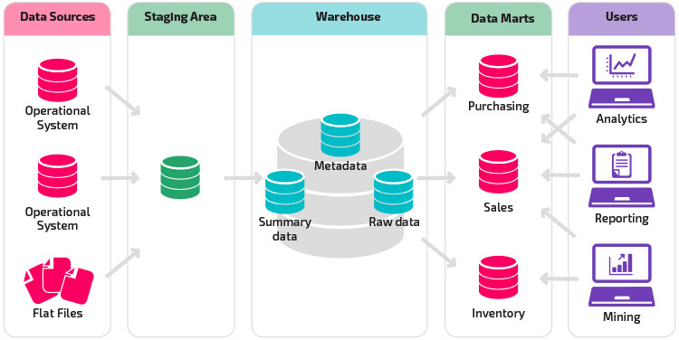

## 问题

### 实际案例 1

有A系统和B系统，A是一个transaction系统，B是一个算法和推荐系统。A提供一堆数给B使用，B基于主数据和业务数据，生成推荐给A系统接收的一个业务中间处理结果。

这个中间处理结果，数据量还挺大。 假设B读取的业务数据为3w条，这个结果可能有2w的数量量。

问题：

B系统要将业务结果给回A系统，A需获得并处理这些结果，以便于进行再往后的业务节点操作。

求：

A系统接收/获得B系统的结果有哪些个方式，分别有什么优缺点

### 实际案例 2

某企业新开发了一套保单系统，业务部门希望实现渐进上线，也就是新旧系统并存。如何应对这一挑战？同时，我们需要考虑如何迁移数据以及保持数据同步，同时满足以下约束条件：

- 外部系统对接：新旧系统都需要与外部系统进行集成。
- 定时任务：新旧系统都包含定时任务。
- 数据共享：新旧系统需要能够访问并共享彼此的数据。

### 实际案例 3

某企业有几十个系统，每个系统都需要获取一些基础数据，例如用户、机构、品类、机型等，如何使用可靠的策略将这些数据同步回待开发的系统？

潜在的解决方案：

- 主数据系统或者平台
- 数据仓库

### 实际案例 4

大量订单需要周期性财务结算的处理和对账，如何实现。

### 企业内部数据集成的方式有哪些？

基于上面的案例，需要实现企业内部的数据集成。

如何实现数据集成呢？

- API 实时调用
  - 优势：准确性高、管理边界清晰
  - 缺点：性能差、可靠性差
- 共享数据库
  - 优势：准确性高，性能好，可靠性好
  - 缺点：管理边界差（往往是致命的）
- 人工数据重新配置（例如 Excel 数据导入）
  - 优势：灵活
  - 缺点：工作量大、实时性几乎没有
- 使用 ETL 等数据同步平台（参考遗留系统迁移一期，很多开源工具推荐）
  - 优势：准确性高，性能好，可靠性好（已同步数据不受影响）
  - 缺点：成本高，需要搭建数据流
- MDM（主数据管理系统）
  - 类似于 ETL，但是提供了很多功能，例如不仅可以取数据、推送数据、手工维护数据、能看到数据血缘关系。和数仓的区别是没有加工能力，有点像数据市场。
- 数仓
  - 类似 MDM 的能力，但是可以完成比 MDM 更多功能。具有加工能力，例如使用数仓可以加工、提取维度数据、报表统计，一般是 T+1 的数据。
- MQ
  - 优势：异步处理
  - 缺点：调试处理困难、有可能丢数据、不稳定
- CDC 同步（基于 BinLog 对数据进行交换）
  - 优势：对应用无感，甚至不需要知道表结构和字段
  - 缺点：不适合不同应用之间的数据集成，需要表结构一致，适合迁移和纯数据同步

### 元数据、主数据、基础数据、业务数据、事实数据

元数据：表达数据结构本身的信息，例如对于数据属性的定义，产品这个表中有哪几个字段，可以参考元模型 https://metamodel.apache.org/。应用场景有自定义字段设计。

主数据/基础数据：企业内部的关键数据，一般都是跨应用共享的长期维护的稳定数据。例如，品牌、币种、机构、用户等。

业务数据/事实数据: 由企业业务活动产生，每日增长的数据。例如订单、保单等。

参考资料： https://www.stibosystems.com/blog/what-is-the-difference-between-master-data-and-metadata

### 什么是数仓？

企业级基础结构化数据集成、交换、治理的中心化数据平台或模式，区别于处理非结构化、半结构化的数据湖，也区别于非中心化的 DataMesh 数据集成模式。 

数仓的能力包括：加工、提取维度数据、报表统计，一般是 T+1 的数据。

### 数仓的价值

数据的准确性和权威性是数仓的最大价值，决定了它集中性质的模式，更主要是处理维度表和事实数据的统计。

### 什么场景的数据交换和集成适合使用数仓？

- 结构化数据，关系型数据和文档型数据，甚至文档数据
- 非实时数据，一般是 T+1
- 常见用途：基础数据或主数据的提取使用、统计、出入仓数据的同步、类似于 ETL 能力、数据溯源（血缘分析）、数据画像

### 数仓内部的典型架构是什么样子?

### 使用数仓有哪些反模式？

- 应用数据的迁移同步应该交给数仓做吗？或者从数仓走一圈吗？数仓是中心化、稳定的，应用之间的作业不应经过数仓。
- 流数据不应该走数仓
- 非结构化数据不应该走数仓

### 数仓和数据湖有什么区别？

参考网页：https://azure.microsoft.com/en-us/resources/cloud-computing-dictionary/what-is-a-data-lake/#data-lake-vs-data-warehouse

### 有哪些 SASS 产品或者开源平台可以实现？

- 数仓
  - AWS
  - Google Cloud
  - 阿里云
- 开源数据交换
  - DataX
  - Cana

### DataMesh 是什么现实中有项目在使用吗？

类似于去中心化的数据仓库，也是解决数据交换的问题，但是倡导数据主权自主，目前来说比较超前。

## 延伸话题

如何进行数据治理？

## 参考资料

## 录屏

链接: https://pan.baidu.com/s/171BqB2CXJUpmPE8WcegXkg?pwd=ddgn 提取码: ddgn 复制这段内容后打开百度网盘手机App，操作更方便哦
