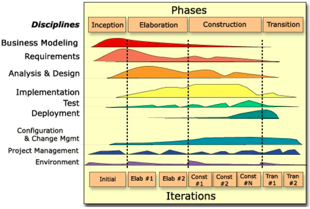

## 话题聚焦

模型设计相关内容。

## 问题

**什么是模型？**

维基百科的定义 "用一个简单的东西表达复杂的事物，这个简单的东西就叫模型。"

邓老师：模型是把业务串联起来的名词，属于业务上的名词，表达方式为卡片、图片等，不限形式，是一些概念。
林宁：这个概念需要加定语才能用，模型这个词太虚了，如果在软件中，可以分为（假如这样分）：商业模型、业务模型、交互模型、软件领域模型、数据库模型、流程模型、代码模型（Java 代码）。

商业模型：商业计划书，商业画布表达，企业怎么赚钱？
业务模型：怎么帮助老板赚钱的业务运转方式，与软件无关，比如店铺的模型是：进、销。
交互模型：软件做成什么样子。
软件领域模型：软件中有哪些承载系统状态的概念和关系，使用 UML 可以表达，包含名称、属性、关系。
数据库模型：在数据库中设计数据库表的 ER 图。
流程模型: 时序图等描述软件流程的图例。
代码模型：Java 代码，描述业务逻辑的计算机形式语言。

模型有两种：形式化的、非形式化的。（形式逻辑和辩证逻辑的关系）。Java 代码就是一种描述业务的形式语言，如果对业务人员要求形式化，就是在写 Java 代码。

勇智：领域的差别有：整体和部分，同类模型之间的关系，名称属性。《概念图》

桌子、金色的桌子、桌子腿、颜色

桌子、金色的桌子：继承、泛化。
桌子、桌子腿：组合或者聚合。
桌子、颜色：属性关系。

数学建模：数学模型，用一个数学公式表达现实问题，1+1=2 这是一个模型。

**领域模型一定是精确的**，虽然在和业务人员聊的时候可以不太精确，比如形成精确的概念和关系。

**领域模型是软件开发过程中第一次对业务的形式化。**

**如何设计模型？**

产出和交付物是什么？UML、PPT，需要表达：实体名称、关系、关键属性

表达空间结构：概念和关系
表达模型的流转和来源：事件风暴、四色建模、带模型的流程图或时序图

空间结构和流程在一张图上是无法表达和矛盾的。

常见建模的方法：

- 事件风暴
- 数据库反推
- 从原型图提取 （大部分人目前这么干的）
- 用例分析法、名词动词法

**领域模型做到什么精细程度？**

架构师和产品经理：实体、关键属性（大部分属性）、关系
程序员：补充更细的字段

那么模型在演进过程中怎么维护，内涵和外延可能发生变化了。

美团: 如果有个模型 GroupOrder
美团 → 生活服务（团购、外卖、打车）：Order 和订单类型

**怎么算落地？**

落地有两个层面：

- 方案层面：输出所有的 UML。
- 实现层面：一套 CRUD 模板或者打样，开发人员能照猫画虎。
- 怎么设计评价设计出来的东西收益和好处。

输出高质量、精确的 UML，模型代码按照 UML 写即可，架构师需要对常见模型的操作打样（一套无脑的 CRUD 模板）即可。 每个阶段的交付物就是落地，根据 UML 对应代码中的领域模型实现即可，把事情做好，别提 DDD 这个词了。

人们认为充血模型就是 DDD，但是这样写代码非常困难。 落地指南：业务写到服务，领域模型承载系统状态。

**DDD 很快会很快人人喊打。**

- ApplicationService 做场景
- DomainService 做领域复用逻辑

**模型的反模式和坏味道？**

邓老师：

- 当发现 RESTful（包括 BFF、领域模型）无法表达领域模型是一个反模式的信号。
- 需要小心的小心业务一致性的时候可能是坏味道。
- 当多个动作同时修改一个模型时可能存在问题。
- 当属性里有允许为空的字段。

SimonHan：

- 模型上体现数据库的内容，可能不是特别好，太多一对多的关系。

预测师：

- 模型不好起名的时候

李威：

- 不知道模型、代码放到哪里

林宁：

- 多个聚合共享一个实体，比如订单、用户都有地址，这俩不一样
- 多对多关系，比如班级和老师
- 生命周期不同的东西放到一起，比如店铺申请和店铺
- 模型具有二义性，比如订单中的地址、用户上的地址、地址库

**如何保障模型的可持续性？**

怎么保持设计和实现的一致性，这就是为什么自动化生成代码的工具没有成功的原因。

方式一，使用生成的代码，但是和需要改动的代码分开，这样就可以实现持续维护文档（设计）和落地的一致性。

- API 模型生成 Controller，Swagger 文件生成 Controller
- PlantUML 生成领域模型（贫血），比如使用 Mybatis 的生成器
- 自动生成 RPC 调用

方式二，使用管理的方式解决

迭代开始前，设计模型，迭代结束后，将实现回写（自动/手动）到设计文档中，并作为软件交付的包发布。

方式三，使用工具或者测试定期检查设计和实现的差异

**业务或者产品到什么阶段适合开始沉淀建模？**

邓老师：一开始就得开始建模，不建模需求都不知道怎么描述。

林宁：如果模型说的是广泛的概念的话，一开始就需要建立，比如商业模型、业务模型，最后才是领域模型。如果这里的模型是领域模型，那么这个模型需要在业务模型输出后产出。
补充问题：技术人员需要了解商业模型、业务模型吗？

在商业模型、业务模型阶段性定下来的时，非常有必要去了解。

补充一下，参考 RUP：

**前端(JS)适合建模吗？**

李威：建模和语言无关，不管是在哪里写代码。

邓老师：这里的前端是什么？模型是什么？

前端：Web 前端；模型：领域模型。问题就变成了，Web 前端需要关心领域模型吗，代码会有领域模型的类吗？

前端关心：Swagger 中的接口模型，不是**领域模型**，如果使用 TS 可以将 Swagger 的 API 生成一套模型，这里的模型是数据库的传输模型（DTO 的 Request、Response）。如果是富前端可能有领域模型，比如石墨文档、Google Doc。

Backbone 中就有模型的概念，MVC 框架。

**MVC 实现，领域模型放到哪里？**

MVC 实现，M 就是 Model。 实际上现在都是 MVC-S 这种架构，MVC 是一个古老沿用下来的概念。

**领域模型的重构和调整怎么处理**

如果领域模型发生变化怎么重构？ 举个例子： 领域模型的概念发生变化，比如内涵变小了，外延变大了。比如外卖订单被复用到了各种地方，增加了各种字段。

参考《数据库重构》。

经验：**说起来简单，改起来要命。** 

如果实在要重构，怎么做？

1. 增加监控，API 流量情况。
2. 评估影响，看是改核心的模型、核心模型字段、非核心的模型。
3. 如果是核心的模型，可以考虑添加一个新的模型，做替换；如果是核心模型字段，考虑兼容一下老的字段；如果是非核心的模型，可以直接替换。

重构过程中有什么注意事项没有？

- 保持干净，不用字段、模型一定要清理！！测试要能过才能清理，如果不敢删除可以在 API 上做版本管理，并收集旧版本还有没有人用。
- 重构几次后，没人能说清楚：**模型应该是什么样，现状是什么样。** 模型文档保持同步：设计后待实现、实现中发生修改、修改的内容同步回设计，可以通过将生成代码和手写的代码分开，让文档生成模型。
- 对于前端来说，模型上的字段严格按需取用，别全吐出去。API 必须定义清楚字段，强制要求不允许使用领域模型用于 API 输出。
