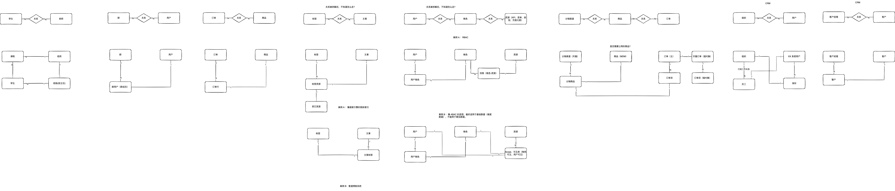

## 问题

常见多对多对关系的问题。

学校管理系统：老师和学生的关系，是否应该作为多对多关系建模？

答案 A：是。可能会出现一个问题影响后续业务，丢掉：班级（班主任只有一个）、选课、授课等关系。是否为班主任的信息存哪里？

答案 B：不是。

## 多对多关系案例

## 录屏

链接: https://pan.baidu.com/s/1qqhQDxSuzjGQvtmmnsU1VQ?pwd=jwyu 提取码: jwyu 
