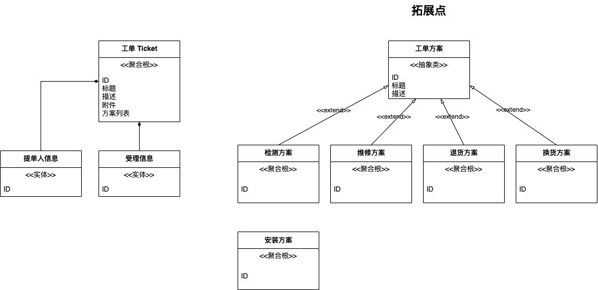

## 当模型需要为多个场景服务时如何拆解？

举例来说：

电子产品的工单系统，需要处理各种场景：咨询、维修、退换货、配件销售等场景，这些场景都有不同的字段，但是工单流转过程类似，如何设计模型？

财务结算系统，需要处理各种来源结算场景，以及折扣，如何使用结算单统一不同的场景，以及存储这些场景中的结算字段？

供应链场景中，交易订单需要处理非常多的场景以及额外字段。

外卖场景，不同品类（花卉、药品、商超、水果等）下面会有一些特殊的服务，举个例子，识别为花卉时，需要处理留言、贺卡等信息。

保险行业，保单上面对于不同的保险品种的字段差异巨大，寿险、财险、车险、符合保险、社会保险。

审批系统，审批服务如何支持很多场景？

## 案例分享 1 工单系统

## 案例分享 2 财务结算系统

## 补充点，如何识别不变点、拓展点

- 拓展点可以进行分级，例如系统级拓展、模块级拓展、类和组件级、领域模型级拓展点
  - 编译级别（dsl）（规则引擎 元编程） 
  - 模块级别（插拔架构） 
  - 模型级别（垂直表+策略map） 
  - 团队级别（中台）
- 相似性问题，相似度影响如何拓展和复用
- 需求的扰动产生拓展需求
- 坐标（元）问题：在同样的抽象程度上讨论拓展。
  - 对象是一种坐标，这个坐标有三个维度：关系、属性、行为
  - 关系理论：实体、关系
  - 流程图：主体元素、时序
- 使用坐标的思想，可以知道我们在拓展什么

## 录屏

链接: https://pan.baidu.com/s/1ClqgDL_yT3Udn3hAfTPthA?pwd=d2dg 提取码: d2dg 复制这段内容后打开百度网盘手机App，操作更方便哦

