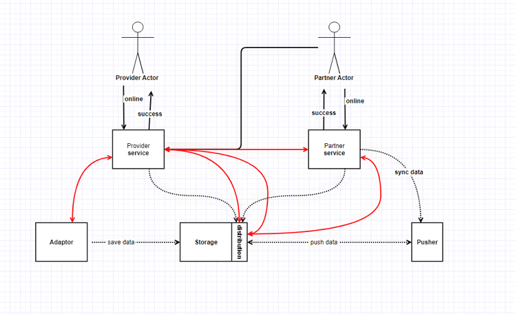

## 问题和背景

案例提供者 antz-H：在之前一个通用组件很容易推动，这一次有一个业务组件很难推动。业务背景为酒店对接，例如打通希尔顿和携程之间的系统，这是一种全球的惯例形态。 

该案例背景的系统主要对接大型酒店定制需求比较多，随着业务发展，公司战略希望往产品化方向转。

某些问题对于某个酒店对接的部门很有痛，但是对于其他部门来说没有问题。

主要问题是：

- 流程可见
- 流程管理

现在需要把技术问题给上层（业务方）讲清楚，然后去推动。

少个分号总结：听起来像是一个技术侧发现的问题，但是业务方并没有感觉到痛点，无法推动。

## 技术问题细节

作为产品的 Provider 和 Partner 互相依赖，有一些定制化流程需求，流程被碎片化的进入各个产品的逻辑，从成本和维护难度上很困难，为了拓展、可视化也很困难。

解决方案为：希望通过引入一套流程平台，但是还没有达成一致。
动机和诉求：统一整合流程可见和自动化，拓展性。
痛点是什么？：
- 技术痛点：维护很难，修改成本很高，从公司视角来看的痛点，且来自于未来不是当下。
- 业务痛点：10% 的业务痛点，在架构办的视角来看更痛。

干系人：

- 架构办部门
- 业务线的研发
- 业务线的产品方
- 业务运营

## 技术之外的考量

- 推动架构方案时：引入工具，而不是规范。通过工具提高效率，然后把规范集成到工具中。
- 权责利：
  - 如果产品团队接入了中间件，出问题了算谁的？
  - 我项目很紧急，这部分的成本谁来出？工作量怎么算？
  - 人员成本来自于业务还是技术。
- 矛盾：架构办的 KPI 和交付（产品团队）团队是不一致的。
- 咨询的经验：一切从痛点出发。
  - 矛盾：技术的矛盾一般来说业务方不关心。加班都做不完时，业务方才会考虑技术方的诉求。
- 认知：
  - 公司的利益的不是个体的利益，未来的利益不是当下的利益。
  - 个体不会考虑公司远期战略。
  - 顺着形势做事，顺势而为。
  - 拿出去包装的东西，和实际落地的东西不是一回事。用情怀发电的项目可能被拿来包装，但是对于实际项目来说，还是会从利益出发。
  - 很多人为情怀喝彩，不会为情怀买单，更多时候情怀会被当做一个旗帜（千金市马骨）。
  - 为情怀买单的概率很低，但是还是存在一些。
- 干系人地图
  - 把干系人影响力、痛点、利益诉求进行分析
- 考虑措施
  - 解决矛盾的可以先激化矛盾，找到真正的痛点，这样有人出成本（出钱出力）。
  - 如果架构办有自己的资源，先把工具做出来，有团队能用上，尝到甜头再推广。
  - 上升到领导高层，利用行政能力和公司战略推动。
  - 匹配公司的长期和总体战略，需要一个大旗来推动。
  - 如果有资源，使用外部力量推动，找咨询公司游说。

## 拓展问题

- 做技术评审谁来拍板？
  - 权责一致，决策者承担责任。
- 如何让需求方满意？如何和产品经理沟通？技术经理如何同产品经理打交道？
  - 避免技术思维，认识到技术为商业服务。你以为是个技术问题，其实是个利益问题或者商业问题，甚至政治问题。
  - 业务价值和成本平衡，业务价值优先（利益一致），如果业务价值高，即使破坏架构整洁性也需要做。
  - 平衡和博弈始终始终存在。
  - 比产品经理在逻辑上和业务上更能看到本质。

## 录屏链接

链接: https://pan.baidu.com/s/1qISGVH7N1cAhdHp1UONWaw?pwd=ptub 提取码: ptub 
