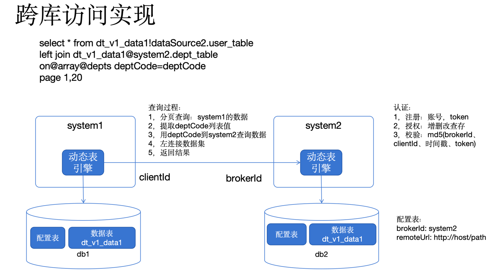
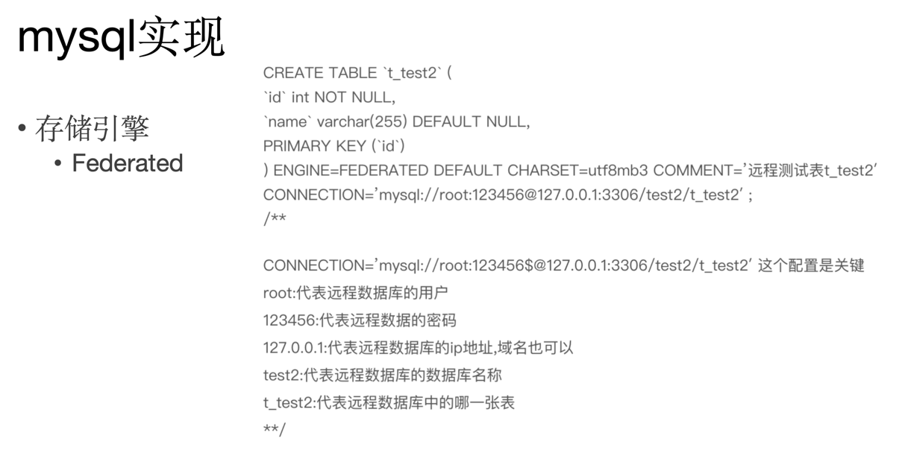

## 问题和背景

如果在微服务架构中，需要出现分页、搜索、排序的跨库查询怎么办？

例如中

1. 用户一般在用户服务或者基础服务，但是大部分服务都会用？
2. 组织等元数据，被一些服务使用，组织数据不会很多，比如 1w 条。
3. ERP 库存和价格在两个服务，如何实现？【最难】
4. 订单和商品场景。
5. 订单和物流场景。
6. 需要数据归集的场景，例如酒店订单、机票订单都在不同的服务中，那需要放到一个列表中查询。

需要考虑几个情况：

- 是否有跨库查询并分页？
- 是否在两个系统都需要搜索、排序，例如订单和商品？
- 是否能接受数据冗余？
- 数据更新频率怎么样？

## 一种自动查询 SQL 转换为 API 查询的实现方案

长友提供，一种自动根据 SQL 转换为 API 跨库查询。

解决问题 #1 场景。

## 解决方案

- 服务合并，重新划分和设计服务。
- 如果需要集成的数据量不大，比如组织，一般整体拉取过来。解决问题 #2 场景。
- 通过 ID 列表批量查询，把列表页中的关联数据（例如用户 ID）批量查询。
- 列表中如果需要搜索的字段，避免做模糊搜索，比如根据仓库名称查询订单，让用户先在控件上搜索仓库，然后拿到仓库 ID 再搜索订单。
- 使用冗余数据，通过建模避免查询，比如将用户信息、商品信息冗余到订单上。
- 使用全局表，用 ETL 给每个服务同步一份，比如用户。解决问题 #1。
- 把整个业务表同步过来，比如把价格表同步到库存库，取决于业务时效性要求。
- 在设计上把物流详情拆到详情页面，不在列表上显示和搜索。
- 在设计上将业务列表 + 报表列表拆开解决。
- 使用 ES，这种场景非常多。把数据收集到 ES 上成本非常高，有 1s 或以上的延迟，有些系统可能有 20s 的延迟。
- 应用层增加一张专门的索引表，把需要分页、排序、搜索的字段归到一张专门的表，优先查这张表，分页后通过 IDs 去各个服务中捞数据。可以解决跨库查询（垂直数据集）问题，也能解决分库分表下不命中分片健问题（水平数据集）。在业务列表中更适合，比 ES 更合适，但是依然维护成本高。

## 拓展问题：业务数据同步到 ES。

ES 更新问题：

- Binlog（CDC） 或者应用层发送事件到 MQ（RabbitMQ、Kafka），使用搜索（或者叫做 Report）服务由 ES 处理，也可以直接 ES 消费。
- CDS 基于应用事件发送，代替数据库 Binlog 事件。
  - 优点：数据权限、契约安全、低耦合。
  - 缺点：和应用绑定、侵入业务。
- Flink 也可以同步 ES，需要专门的团队才能维护得动。

## 注意事项

- 从微服务角度，尽可能从 API 集成保持服务内聚，如果从数据库上考虑问题，会带来一些副作用，比如逻辑丢失、数据安全、隐私等问题。

## 解决思路

优先从业务方案出发，在产品设计上想办法，再通过模型优化数据结构，再通过技术手段关联数据。

## 录屏

链接: https://pan.baidu.com/s/1g0XdJhwJQlCD-Cj82eZs0Q?pwd=9471 提取码: 9471 
