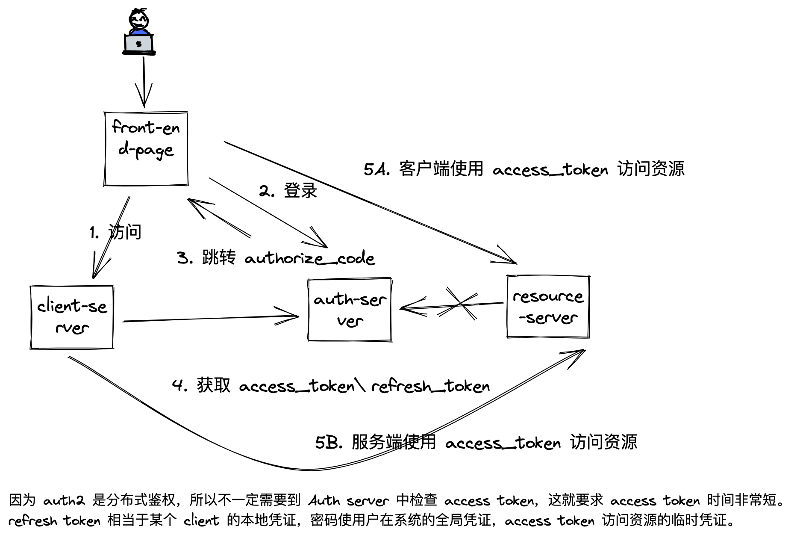

## 话题聚焦

在微服务架构中，Authentication 和 Authorization 一般怎么实现？用什么框架？

一般都会做一个单独的服务实现一个 IAM。 比如，如果我现在创建了一个项目，需要编写一个 AuthServer 如何实现？

## 案例输入

李威：API6 作为认证的 Client，在云原生微服务网关，API6 提供了相关的管理面板，用户体系还是自己实现。

林宁：

- 自己实现，使用 WebFilter 做 Auth 服务，全部自己写，比如使用 JWT。
- 使用 Spring Security，Spring Security Core 比较简单，可以使用这个代替 Spring Security。这里有个坑，很多 API 鉴权但是使用了 Spring Security Web，**这是一种误用**。
- 使用 Apache Shiro 非常简单，功能不多。
- 使用 Spring Security OAUth2 实现微服务的鉴权。
- 使用 Auth0、Okta、Forgrok 等第三方鉴权服务和体系（IDAAS）。

SimonHan：有的项目 SAML 用来做 SSO，spring-cloud-starter-oauth2。

邓老师：JWT + WebFilter 自己实现一套鉴权体系，没有使用 OAUth2 协议，也没有使用框架。

根据现状，用的比较多还是 OAUth2 体系。

## IAM 技术选型

微服务鉴权，按照选型优先级：

- jwt + WebFilter
- spring-security-core
- spring-security-web
- spring-security-oauth2 （19 号 补充：新版本 Server 拆分出去了）
- spring-cloud-starter-oauth2
- shiro-core

## 其他问题

**怎么理解常见的协议? **

**前端 token 存在哪里？Cookie 还是 LocalStorage、SessionStorage**

1. Cookie 需要设置为 HTTP only，防止 XSS 攻击，一般适用于简单的 JWT 或者引用 token，不适用 Auth2（access_token\refresh_token）因为可能域都不一样，在 spring security 中有一个 TokenExtractor 类，可以复写 token 存放机制。
2. SessionStorage 比 LocalStorage 多一个过期机制而已。
3. 把 access token、refresh token 放到 Session，本地起一个单独的会话使用 Cookie 鉴权，这样好处是既可以使用 IAM 的分布式授权，也可以使用 HTTP only 的能力，避免 XSS 攻击。

**功能权限和数据权限如何设计？**
 
TODO

**鉴权拦截在哪里做？**

TODO

**生产上 OAUth2 常见的参数配置，比如过期时间怎么设置？**

- 一般的用户会话过期时间（refresh_token）：24 小时、7 天左右、30 天
- Access Token 的过期时间：2H
- 密码修改时间：30 天
- 密码强度策略：长度、数字、字母，多租户系统需要可以选择和配置
- 重试次数：24 小时内，3-5 次，超过次数锁定
- 过期策略：如果用户一直在用，需要对会话续期，需要做一下漏斗。Auth2 的场景下实现比较困难。
- Access Token 刷新机制：
  - 使用定时任务刷新。
  - 发现 Access Token 过期后，重试一次，可以配合定时任务一起做。【推荐】
  - 验证 Access Token 前，如果邻近过期，触发一次刷新。
- 权限策略：
  - 是否在登录时候就把权限写入 token 或者用户上下文
  - 只记录权限和用户 ID，在接口中检查权限
- scope 到底包含什么信息？
  - 功能权限清单，不放进去，因为 Auth2 本来就有 Role 或者 Authority 这个概念，然后通过 Role 以及代码中的注解来实现功能权限的检查。
  - 数据权限清单。放关键或者高阶的权限维度信息，举个例子：分销商的 ID、多空间模型中的空间 ID，不会将更为细节的信息（比如订单列表）。
  - 如果什么都放，数据量会有点大，而且实时性不能保证（数据发生变化需要重新登录才生效），如果什么都不放，每次都查询性能开销就很大。

**JWT token 如何撤回？**

背景：使用 JWT 就不需要每次检查凭证库，这样可以节省性能，否则 Resource 会将每个请求都验证会话库，这不现实。 refresh_token 换取 access_token 需要查询凭证库，所以 refresh_token 是可以撤回的。

1. 不需要撤回，只做权限和有效期检查，Access Token 设置时间非常短即可。【推荐】
2. 使用黑名单机制，这个黑名单有一个过期时间即可。

推荐使用

**用户服务和 auth 服务拆开还是合并？**

定义一下用户概念：具有唯一标识，可以使用某种凭证登录系统（OTP、口令、OpenID等第三方凭证），一个用户可以使用多种凭证登录，用户和凭证无关。

方案 1：用户服务和 auth 服务合并。不用专门设计一个用户服务，IAM 服务中含有 User 模型。但是如果 User 在不同的场景下，有其他的身份，比如员工，不应该放入 IAM 中。比如在保险领域，我们一般会有一个 Customer Data 服务来做客户资料信息，使用三户模型（客户、用户、账户）做微服务拆分。
方案 2：用户服务和 auth 分开，做一个单独的 IAM。具有一定理想化的设计，原因是用户源有多种，比如内、数据库、单独的用户服务、LDAP。

一般推荐方案 1，一般不推荐使用方案 2，如果存在方案 2 考虑是不是不接入统一的 IAM 体系。

有一种场景：

1. 终端用户可以使用用户名密码、手机号和微信等地方系统登录。
2. 管理员可以使用内部员工账号，域账号（LDAP）。
3. 希望使用一套统一的鉴权。所以可能会产生一个 IAM 和 User 服务分开的情况。

**多租户怎么处理？**

1. 租户（Tenant）隔离。每个租户下单独登录（在子域名下登录），或登录后必须选择唯一的租户使用。比如 Skype for Business、lynda.com、飞书、Welink。
2. 多空间（Workspace）隔离。只有一个账号登录后，可以加入空间，可以管理多个空间下的资源，并展示到一起。比如，Ziplin、BeeArt。
3. 多租户 + 多空间。可以在某个租户下登录，然后也可以创建多个空间（Workspace），比如 Jira、Trello、公有云平台。

大部分使用 #1 方案。

来自李威的一个案例：系统中有多个游戏，一个游戏属于一个运营商，一个运营商可以运营多个游戏。需要将玩家在运营商下区分，有点像私服和官服的区别。这就是典型的多租户模型，一个运营商就是一个租户，用户由运营商+手机号码标识。由于这个系统是后期加上运营商功能，所以租户的概念不太明显。

**多空间好多租户下权限如何检查？**

1. 如果租户模型的检查，所有的资源中增加租户 ID 信息即可，可以实现一个通用的资源检查。使用 RBAC 模型可以很好的支持。
2. 多空间，在检查空间下的资源时，可能几级检查：用户系统角色和权限、特定空间下的角色和权限、具体资源权限。

邓老师补充了一个词叫做上下文权限（CBAC），可以完美的描述多空间的场景，或者叫做多层的 RBAC。RBAC 只能描述用户可以访问那个资源，但是无法描述访问那个上下文的资源。

出来 RBAC 还有更多的权限模型：ABAC、PBAC、ACL。

## 相关包框架的说明

**spring-security-oauth2 vs spring-cloud-starter-oauth2**

https://stackoverflow.com/questions/53500219/spring-security-oauth2-vs-spring-cloud-starter-oauth2

**spring-security-core vs spring-security-web**

网上很多的教程使用了 spring-security-web 改写为了 token 模式。

参考：https://stackoverflow.com/questions/54821191/differences-between-spring-security-lib

## 常见的 Auth 服务需要提供的功能

- CSRF token、XSS 过滤
- 两步认证，比如电话、邮箱
- 集成各种三方登录（实现 OAUth2/Saml 客户端）
- 设备绑定和绑定
- 给第三方提供登录，比如第三方 API，提供（OAuth2/Saml 服务）
- 重试限制
- 集成验证码平台，人机校验
- 活体校验
- 密码周期
- 密码强度

## 相关的分布式授权协议

**OAUth2**

主要用于分布式授权体系，外部系统的接入，下面这张图演示了最复杂的一种情况。

**SAML**

主要用于单点登录，第三方授权使用。

## 拓展话题

服务间的 Auth 怎么做？按照场景的情况排序如下：

1. 网络隔离，同子网可以互相调用，不用鉴权，不同的网络直接网络不同，相当于使用防火墙策略实现。
2. 如果是直接调用，可以使用一个服务间的 Token，或者一个 Service Account，通过服务名来验证时候调用的来源可靠。
3. JWT 的共享密匙，如果用户的 Token 能被解开，说明有密匙，可以信任。
4. 如果使用 API 市场，可以使用 AK/SK 机制。
5. 在 Auth2 和 SAML 之间的选择，如果只是做单点登录 SAML 更好，如果需要分布式授权体系，Auth2 更好。
6. 两步验证（OTP、Google 的离线验证 PIN）和 Auth2、SAML 都没关系，类似的还有人机校验、活体识别。

## 录屏分享

2022-11-06 授权和认证 part1.mp4

链接: https://pan.baidu.com/s/1QcT2dV5_JuPE6uEbjzWOGQ?pwd=mzh8 提取码: mzh8 复制这段内容后打开百度网盘手机App，操作更方便哦

2022.11.19 授权和认证 part2

https://docs.google.com/document/d/14VwZgqm_4lHjML2rT9zJv6IUlp81V9d--DPK9AkS6qQ/edit#
