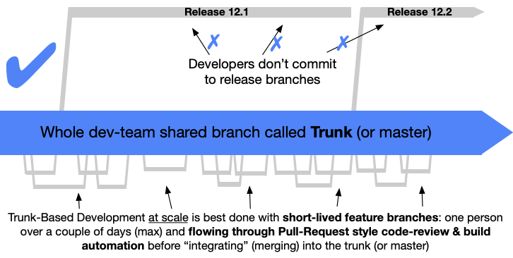
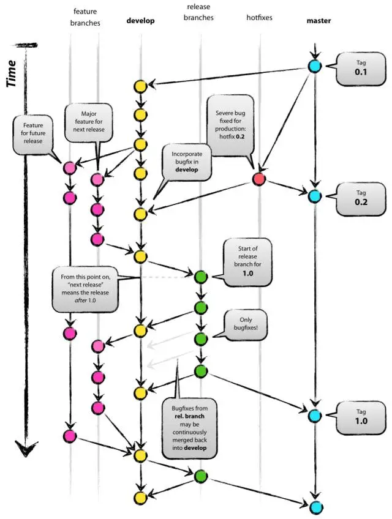
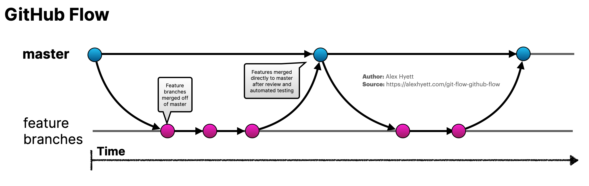
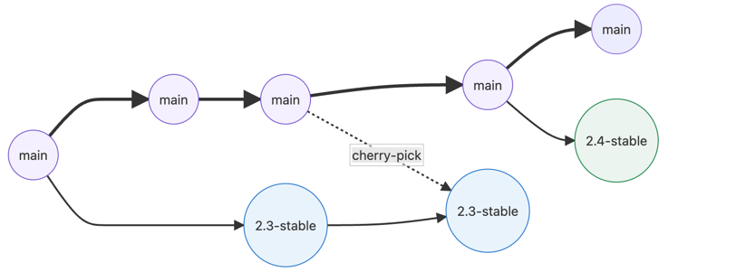
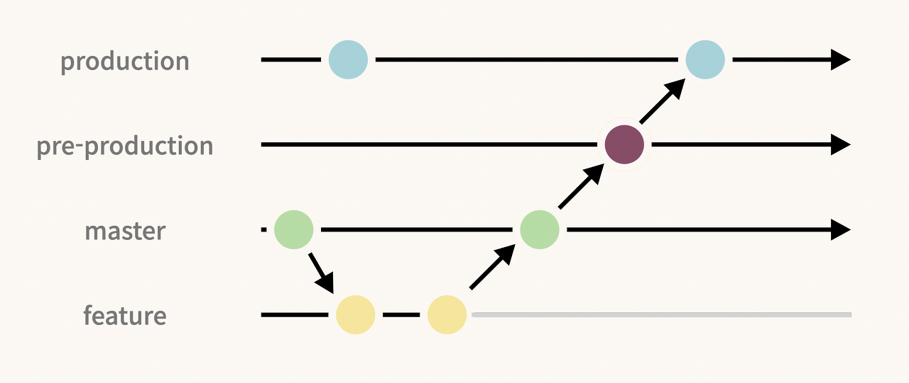
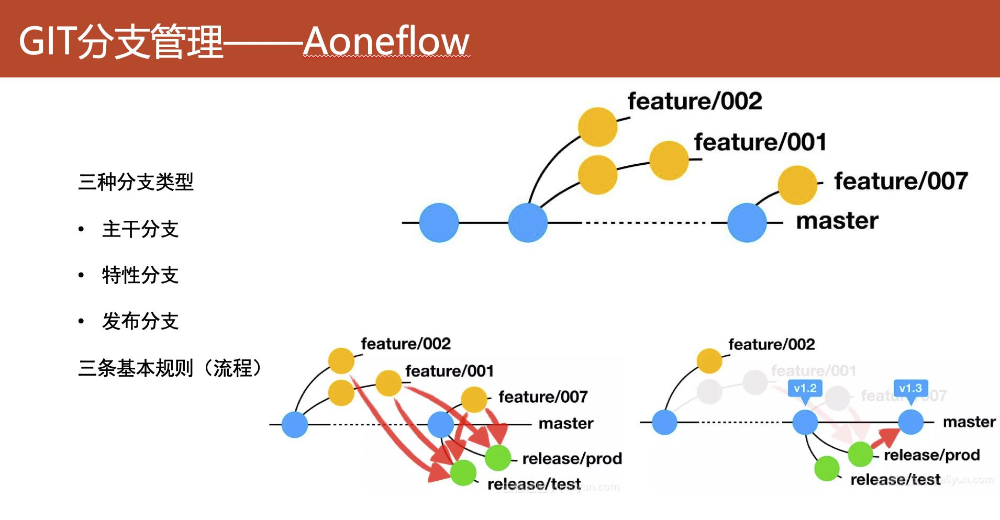

## 问题

- 各种分支模式在实际工作中有什么局限性（哪类团队适合哪类分支策略）？
- Rebase 和 Merge 的实践？
  - Rebase：适合主干开发模式，频繁合并
  - Merge：适合特性分支，适合长分支合并，不方便做 Code Review 污染提交记录
  - 原因是，Rebase 会对每一个 commit做diff，Merge 每一次合并产生一次合并节点
- 命令行还是 UI 工具实践问题
  - 建议用 UI 工具，Git 命令行比较浪费时间容易出错，命令行适合特殊场景
- 分支锁定问题，那些分支应该被锁定
  - 发布分支一定锁定，创建发布分支后必须通过 PR 过去
- 代码评审策略问题（PR 还是每天评审）
  - 策略1：
    - 创建发布分支前：每日检视，追求效率
    - 创建发布分支后：PR，追求分支稳定性，修改收敛，PR相对比较少
  - 策略2：
    - 创建发布分支前：根据特性 PR 
    - 创建发布分支后：直接少量提交，Fix 代码量不大
- 分支名和 Tag 策略问题
  - 发布分支和Tag和版本对齐，版本使用 sementic 版本 x.y.z
- Hotfix 策略
  - 策略1【推荐】：
    - 创建一个发布/代码修复分支，在发布分支上 Hotfix，然后cherry pick 回Master【容易忘记合并回去，导致下个版本又出 Bug】，或者上线后 Merge 回 Master，测试可以在 UAT 上验证，UAT 一般比较空闲
  - 策略2：
    - 现在 Master 修复，修复完成后 cherry pick 到指定的发布分支，不会忘，也可以先在 Dev 环境测试验证，缺点是修复基线变了，因为 Master 可能在开发或者被别人合并新的代码
- 不同环境分支问题（ST、UAT）
  - 不同的模式会有不同的做法，例如 Trunk base Master 到各个环境，PRO 卡一下 tag 
  - Github：和 Trunk 一样
  - Gitlab Master 分支会部署到 Dev、ST，UAT 留给 Release 分支
- 多分支流水线问题
  - 大家会用多分支流水线吗？自动为每个分支【需要关注的分支】构建一个流水线，跑测试，分支删除后流水线自动被删除。
  - 看团队 Devops 能力和成本，有一部分公司会用，aone 自带这种模式。

## 分支模式讨论

三个关键考察维度维度点：

- 在哪儿开发的问题，决定了冲突管理和开发舒适度 
- 在哪儿分布的问题，决定了质量控制
- 划分需求的颗粒度是以**版本**还是以**功能特性**的区别

### Trunk base Development (纯粹的主干开发)

特点：

- 仅有一个主干分支（通常为 main 或 master），所有代码都最终合并到这个分支。
  - 有若干个基于特性的短分支【可选】
  - 功能分支生命周期短，通常几天内完成开发并合并到主干。
  - 开发人员频繁地将功能分支合并回主干，以保持代码库的一致性和最新状态。
- 开发人员直接提交代码到 Main。
- 每次提交到主干都会触发自动化测试，确保每次合并后的代码都是稳定的。
- 主干分支始终处于可发布状态，可以随时部署到生产环境，实现快速发布。【这个特点真的好吗？】
  - **没有严肃的商业公司敢这么干**
- 由于频繁合并和短期分支，合并冲突较少且容易解决。
- 最后由发布分支来进行分布

要点：

- 即使主干开发模式，也需要特性分支（较短），通过 PR 合并 【可选，也可以直接在 Main 开发】
- 合如 Main 就是能上线的代码，强烈依赖自动化测试【真的能做到吗？】
- 测试团队上线流程，有一个合规和程序正义的过程
- **主打的就是一个快速发布**
- Release 的目的只是为了发布，Hotfix 在 Release 上处理，也可能不拉 Release 使用 Master 上的 Tag。
- **这个开发理念非常好，但是现实没有这么好的条件**

适合的团队：

- 小规模的团队，对团队成员非常**信任**，对生产破坏性不敏感的产品，不适合对生产质量敏感的，不适合多个团队对代码的维护，也不适合多个版本共存。
- 适合看板管理需求（流式需求，有些公司又叫做流量需求）

### Gitflow (分支开发\分支发布)

特点：

- 多个长期分支
  - 主分支（main 或 master）：用于存储正式发布的代码。 
  - 开发分支（develop）：用于集成所有开发人员的最新代码，包含下一个版本的最新开发内容。
- 短期功能分支：
  - 功能分支（feature branches）：从 develop 分支分出，用于开发新的功能，完成后合并回 develop。
- 预发布分支：
  - 发布分支（release branches）：从 develop 分支创建，用于准备新版本发布，进行最后的测试和修复，完成后合并到 main 和 develop 分支。
- 热修复分支（hotfix branches）：从 main 分支分出，用于修复生产环境中的紧急问题，完成后合并到 main 和 develop 分支。
- 通过使用不同类型的分支，清晰地管理不同阶段的代码，适用于有明确版本发布周期的项目。
- main 分支始终保持稳定，develop 分支包含所有最新的开发成果，确保开发和发布过程井然有序。

要点：

- 冲突处理延迟，需要经常合并代码，但合并代码和模块划分有关。
- 非常复杂。
- develop 分支是做版本规划，例如 1.2，1.3 是同时开发，测试环境使用的分支。
- 如果 1.2 1.3 是两个独立的项目，持续时间又非常长，就需要 dev 分支分别拉出两个长分支。

适合的团队：

- 比较多公司实际在使用相关变种，对开发人员或者团队非常不信任，即开发团队和代码管理团队甚至不是一伙人，对质量非常敏感，对开发人员体验，不敏感，可能会有多个版本共存。
- 适合大型开源项目，或者具有大量供应商和外包人员的项目，对质量管控非常严格。
- 最原生的 Git 用法，没有 PR 实践，通过人工（代码管理员）合并
- 合并操作由接收人操作

### Githubflow (分支开发\主干发布)

特点：

- 只有一个长期存在的主分支（main），该分支始终处于可部署状态。
- 功能分支（feature branches）：从 main 分支分出，每个新功能或修复都在自己的功能分支上开发，完成后合并回 main。
- 拉取请求（Pull Requests）：每个功能分支完成后，开发人员创建拉取请求（Pull Request），用于代码审查和讨论。
- 每个拉取请求都会触发自动化测试，确保代码在合并前通过所有测试。
- 代码一旦通过审查和测试，立即合并到 main 分支，并可以快速部署到生产环境。
- 由于 main 分支始终保持在可部署状态，随时可以发布新版本。
- 合并操作由 PR 发起人操作，冲突由提出人自己解决
- 可以理解为 Github flow 就是，短 Feature 分支 +  PR + Trunk base
- 没有 Release 分支，只有 Tag

适合的团队：

- 开源项目，人员比较自由，对质量管控不太敏感

### Gitlabflow (分支或主干开发/分支发布)

特点：

- **基于环境的分支管理**：支持多个环境分支，如 production、staging 和 development 分支，方便不同环境的代码管理和部署。这个是 Gitlab 的重要特点。
- 结合了 GitHub Flow 和 Gitflow 的优点，适应不同项目的需求。使用 main 分支进行生产发布，功能分支用于日常开发，也可在主干上开发。
- 功能分支（Feature Branches）：
  - 从主分支创建功能分支，完成后通过合并请求（Merge Request）合并回主分支。
- 使用合并请求进行代码审查和讨论，确保代码质量。
- Master 是最新的，但不是最稳定的，发布分支是稳定代码。

核心思想：**根据情况动态选择使用分支或主干开发，但一定要分支发布，满足测试和合规流程要求。**

适合团队：

- 有质量流程控制要求的团队，对生产质量敏感，采用了 Gitlab 作为代码管理平台的团队。
- 适合迭代适的敏捷项目。
- 如何要结合流量需求开发怎么办？
  - 方案1：在 Release 分支上改，改完合并回 Master，让迭代团队走发布
  - 方案2：把流量需求规划到迭代中

补充：两个迭代之间的重叠如何处理？发布前创建 Release 分支继续优化当前迭代的代码，并合并回Master，Master 分支为后续迭代持续开发的分支。

### Aone flow (均可

特点：

- 和 Gitlab 比较像
- 包含多个长期和短期分支，用于不同目的的开发、测试和发布。
- 主要分支包括：master（生产）、prepub（预发布）、daily（日常开发）等。
- 功能分支（Feature Branches）: 从 daily 分支创建功能分支，完成后合并回 daily。
- 合并策略：
  - 代码从功能分支合并到 daily 分支进行日常集成。 
  - 从 daily 分支合并到 prepub 分支进行预发布测试。 
  - 最后从 prepub 分支合并到 master 分支进行正式发布。
- 严格的代码审查
  - 使用代码审查工具进行严格的代码评审，确保代码质量。
  - 合并请求必须通过所有必要的审核和测试才能合并到目标分支。
- Release 分支本质是一个版本分支，这个版本分支会和 Master 保持基线关系，并且接收 特性分支的代码作为发布内容，有可能这个内容在 Master。

适合的团队：

- 产品 + 定制开发的团队。例如中台核心功能和各个渠道（行业）之间的冲突，Aoneflow 非常适合复用的产品迭代计划，但又有定制开发的个性需求团队。
- To C + 大 B 的公司非常需要。

### 作者提供的一种未归类的分支模式

## Rebase 和 Merge 而实践

- Merge: 形成 commit 节点，无需每个提交处理冲突
- Rebase：无 commit 节点，每个提交处理冲突

## 参考资料

- 特性分支是一种反模式 https://mp.weixin.qq.com/s/m4N8ugQEM-StNRHV2XJ8KA
- Gitflow有害论 | TW洞见 https://mp.weixin.qq.com/s?__biz=MjM5MjY3OTgwMA==&mid=403129803&idx=1&sn=3c3d330fedd0cfe8cd50baab82e11af5&scene=21#wechat_redirect
- Git代码工作流 https://zhuanlan.zhihu.com/p/456771717
- https://trunkbaseddevelopment.com/
- gitlab_flow https://docs.gitlab.co.jp/ee/topics/gitlab_flow.html

## 录屏

