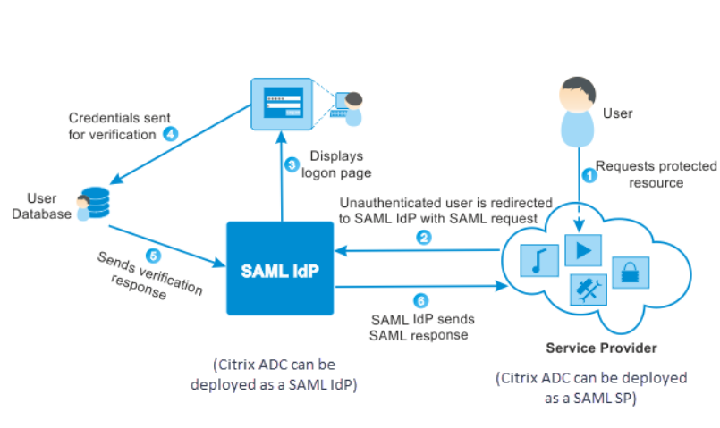
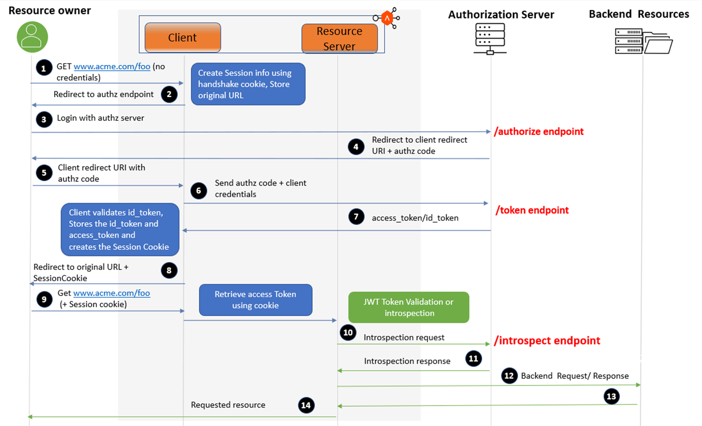

## 单点登录背景知识

### 单点登录 (SSO)

SSO 是一种身份验证过程，允许用户使用一组登录凭据（如用户名和密码）访问多个应用程序。

### 身份提供者 (IdP)

IdP 是一个创建、维护和管理身份信息并为依赖应用程序提供身份验证服务的系统或服务，有时候又被称为 IAM。

### 服务提供者 (SP)

SP 是依赖 IdP 进行用户身份验证的应用程序或系统，一般就是我们接入的应用系统。

### 身份验证机制

- 密码
- 生物识别验证
- 多因素认证（MFA），有时候和 2FA 容易混淆，是指认证完成后，依赖其它 OTP 机制再次验证，例如短信、邮箱、Google OAuthenticator

### SAML（安全断言标记语言）

一种用于在 IdP 和 SP 之间交换身份验证和授权数据的标准协议，基本上是现在的事实标准（但是在中国企业内部不流行）。

### OAuth 和 OpenID Connect (OIDC)

一种开放标准的访问委托协议，通常用于在不暴露密码的情况下授予网站或应用程序对用户信息的有限访问权限。OAuth 最新版本是 OAuth2 是一种通用**授权** 协议。OpenID Connect (OIDC) 是基于授权完成的情况下，通过授权拿到用户 ID 实现认证，这一点需要特别理解。

### 联合身份验证

联合身份验证是允许在多个安全域中共享身份信息的技术和标准。

### 全局会话和本地会话

全局Session： 全局Session是由身份提供者（IdP）维护的会话，表示用户在整个SSO系统中的登录状态。
本地Session： 本地Session是由服务提供者（SP）维护的会话，表示用户在特定应用中的登录状态。

几种处理全局会话和本地会话的策略：

1. SP 每次都请求 IDP 检查 会话。【基本不会采用这个策略】
2. 轮询: SP定期向IdP请求全局Session的状态.
3. 令牌: 在使用OAuth 2.0或OpenID Connect等协议时，IdP会颁发 access_token, 和 refresh_token， refresh_token 本质是全局 Token。
4. 子域：子域名能访问到根域名的 cookie，实现全局 session 验证。【以前用的多，现在用得少】
5. 服务之间事件通知机制：全局过期会话过期后，IDP 通知 所有 SP，反之无需处理，SP 会话过期可以重新发起认证就行。

OIDC 使用的令牌机制，而 SAML 没有规定全局会话策略，SP 可以配置一个轮询或者减少本地会话过期时间，来提高安全性。

### 单点注销（SLO）

SSO 本质是对于分布式认证，如果用户凭证丢失，例如密码被改了需要能在主动退出时，销毁所有 SP 本地会话。所以尽量要求所有 SP 都妥善实现 SLO 机制。

- 用户发起SLO请求：用户在IdP或任一SP上发起注销请求。
- IdP处理SLO请求：IdP接收到SLO请求后，向所有已认证的SP发送注销请求。
- SP处理SLO请求：SP接收到IdP的注销请求后，注销本地Session并返回响应。
- IdP确认注销完成：IdP在收到所有SP的响应后，确认用户已完成注销。

所以SAML处理全局Session过期的方式包括设置本地Session超时、定期重新认证和使用单点注销（SLO）机制。

### SAML 流程图

### OIDC 流程图

## SSO 产品功能和场景

下面整理了一些 SSO 产品的常见能力，用于技术选型。

- 用户身份验证
  - 多因素身份验证（MFA）
  - 单一登录凭证
- 身份管理
  - 用户目录集成：支持与LDAP、Active Directory等用户目录集成
  - 用户角色和权限管理
- 访问控制
  - 基于角色的访问控制（RBAC）
  - 策略管理
- 加密和保护
  - 数据加密，包括密码和个人信息
  - 单点注销（Single Logout），用户在一个应用中注销后，能够自动注销所有相关联的应用。
- 审计和监控
  - 日志记录和审计
  - 异常检测
- 协议支持
  - SAML、OAuth、OpenID Connect
  - API和SDK，用于后续拓展和开发
- 应用集成
  - 现有应用的快速集成
- 可操作性
  - 密码重置和账户恢复申请
  - 用户门户
  - 运维管理后台
- 插件能力
  - 例如自定义密码策略
  - 拓展用户身份验证方式
  - 用户导入
  - 用户信息推送

## 技术选型

### 开源方案

- Keycloak
- CAS (Central Authentication Service)
- OpenAM (ForgeRock)
- Apereo CAS
- SimpleSAMLphp

### 商业方案

- Okta
- Auth0
- Azure Active Directory (Azure AD)
- Google Cloud Identity
- OneLogin
- Ping Identity
- miniOrange

## 注意事项

SSO（单点登录）： 让用户只需一次登录，即可访问多个独立的应用系统，无需重复输入用户名和密码。适用于企业内部或跨企业的多个应用系统之间共享登录状态。
OAuth： 让第三方应用可以安全地访问用户在某一服务提供商上的资源，而无需共享用户的密码。授权第三方应用访问用户数据。例如，用户使用一个社交媒体账户登录到一个不同的网站，并允许该网站访问他们的社交媒体数据。

SSO 可以基于 OAuth 实现，但通常在应用内部来说通常 SSO 更常见。

## 参考资料

- https://datatracker.ietf.org/doc/html/rfc7522
- https://www.okta.com/sg/blog/2021/02/single-sign-on-sso/

## 分享录屏 (antz-H 大佬分享)

https://www.bilibili.com/video/BV1BEbueXE64/?vd_source=c7e3cdfa854db5e62b71fbb1a0bc251b

## 分享 PPT 

链接: https://pan.baidu.com/s/1l8wF1uNEpFmW_ZZzAbUA2w?pwd=3rid 提取码: 3rid 复制这段内容后打开百度网盘手机App，操作更方便哦