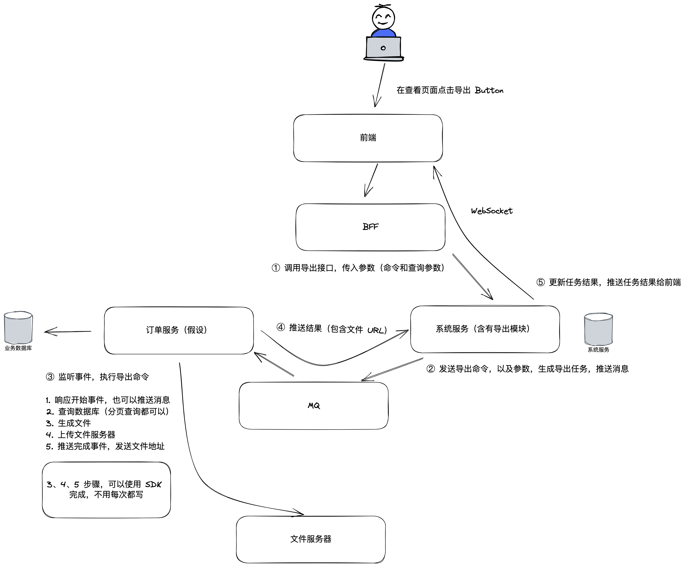

## 话题聚焦

在微服务下的导出最佳实践。

## 问题

1. 微服务下有哪些导出的方案？

- 前端导出，直接在前端导出所有的数据。
- 由业务微服务同步导出所有的数据。
- 由专门的导出服务来实现异步导出，并配合业务微服务完成导出。

2. 前端导出如何设计？

前端必须是现代浏览器，可以使用 Excel 生成的Lib 来实现，适合数据量不大的情况。

3. 由业务微服务同步导出所有的数据，如何设计？

后端实现然后生成 Excel 文件，方法是使用 POI 库生成 Excel 即可。

4. 由专门的导出服务来实现异步导出，并配合业务微服务完成导出，如何设计？

